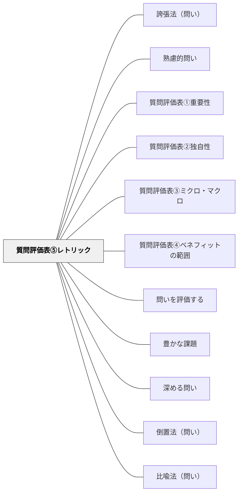

# 質問評価表⑤レトリック

> 問いの表現・修辞の力・印象の強さがあるかを評価する。

## 背景（Context）
同じ内容を問う問いでも、言葉の選び方・語順・リズムによって印象はまったく変わる。
質問評価表の第5軸「レトリック」は、問いの修辞的な力・引力・記憶への残り方を評価する。
良い問いは内容が優れているだけでなく、聞いた瞬間に心に刺さる表現力を持っている。
教育の場では、問いの言葉そのものが学習者の思考と感情を動かすトリガーになる。

## 問題（Problem）
内容的に重要で独自性があっても、表現が平板だと問いが人の心に響かない。
「〇〇とは何ですか？」という形式的な問いは安全だが、思考を刺激する力に欠ける。
レトリックを意識しないと、問いが「作業指示」に近い印象になってしまう。

## 力のかたち（Forces）
- レトリックが強すぎると、問いの内容よりも言葉の装飾が目立ちすぎる。
- シンプルな言葉でも、語順・リズム・意外な組み合わせで強い印象を生めることがある。
- 文化・言語・年齢によって、どんな表現が効果的かは異なる。
- 比喩・対照・疑問符の使い方など、修辞技法を意識的に活用することで問いが磨かれる。

## 解決（Solution）
設計した問いを声に出して読み、「聞いた瞬間に引き込まれるか？」を確認する。
問いを複数のバリエーションで書き換え、最も印象に残る表現を選ぶ。
比喩・倒置・対照などの修辞技法を意図的に試してみる。
「この問いを覚えているか？」と翌日に確認するテストも有効である。

## 結果（Consequences）
レトリックの力を持つ問いは、学習者の記憶に残り、探究の外でも思考を促し続ける。
問い自体が「言葉として美しい・面白い」と感じられると、問いへの取り組み意欲が高まる。
一方、レトリックへの過剰な注力が内容の精度を下げる本末転倒に注意が必要である。

## 関連パタン
- [[パタン/誇張法（問い）]] — レトリック技法の具体例
- [[パタン/熟慮的問い]] — 親パタン
- [[パタン/質問評価表①重要性]] — 問いの重要性を評価する軸
- [[パタン/質問評価表②独自性]] — 問いの独自性を評価する軸
- [[パタン/質問評価表③ミクロ・マクロ]] — 問いのスケールを評価する軸
- [[パタン/質問評価表④ベネフィットの範囲]] — 問いの利益の広がりを評価する軸
- [[パタン/問いを評価する]] — 質問評価表の上位パタン
- [[パタン/豊かな課題]] — 評価基準を満たす問いが豊かな課題の核心をつくる
- [[パタン/深める問い]] — 質の高い問いを育てる上位パタン
- [[パタン/倒置法（問い）]] — レトリックの具体的技法の一つ
- [[パタン/比喩法（問い）]] — レトリックの具体的技法の一つ

## クラスター図

## Actionable Insight

- 設計した問いを声に出して読み「聞いた瞬間に引き込まれるか？」を自問する——言葉の力は声に出してみないと評価できない
- 同じ問いを3パターンの表現で書き、最も印象に残るものを選ぶ——言い換えのプロセスが問いのレトリックを磨く
- 翌日「昨日の問いを覚えているか？」と確認する——記憶に残るかどうかが問いのレトリックの力の最もシンプルなテスト

## 出典
- [[文献/熟慮的問いのパターンリスト（動画記録）]]
