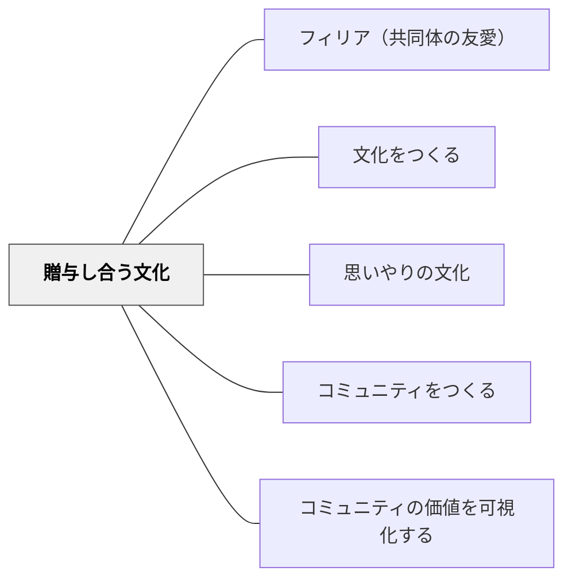

# 贈与し合う文化

> お金ではなく互いに与え合う。ペイフォワード的な増与のリズム。

## 背景（Context）

コミュニティの経済には二種類ある。一つは交換経済（私があなたに与えたら、あなたは私に返す）、もう一つは贈与経済（私がAに与えたら、Aはまた別のBに与える）。学習コミュニティでは、贈与経済が学びを循環させる。

## 問題（Problem）

交換経済的な発想（「教えたら自分が損をする」「ノートを見せたら真似される」）が広がると、知識やアイデアの共有が止まり、コミュニティ全体の学びが貧しくなる。

## 力のかたち（Forces）

- 知識は物と違い、与えても失われない（非競合財）
- 「もらう立場」と「与える立場」は教え合いの中で交互に訪れる
- 一方が常に与え続ける関係は持続しない

## 解決（Solution）

**「与えること」を称え、「もらったら次の誰かに与える（ペイフォワード）」という規範をコミュニティに育てる。**

実践例：
- 「誰かに助けてもらったエピソード」を毎週共有する
- 「教えた人」を可視化・賞賛するシステムをつくる
- 「この知識は自分が得たものではなく、前の人からもらったものだ」という語りを続ける
- 困っている人に自分から声をかけることを「勇気ある行為」として定義する

## 結果（Consequences）

- 学習者が「助けを求めること」と「助けを提供すること」の両方に慣れる
- コミュニティに蓄積する知識の量が増える（個人の頭の外へ）
- 一人では届かない問いに集合知で迫れるようになる

## 関連パタン
- [[パタン/フィリア（共同体の友愛）]]
- [[学級経営/学級経営で使えるパタン]]

- [[パタン/文化をつくる]] — 親パタン
- [[パタン/思いやりの文化]] — 贈与を支える相互ケア
- [[パタン/コミュニティをつくる]] — 贈与の循環を支える関係性
- [[パタン/コミュニティの価値を可視化する]] — 贈与の価値を見えるようにする

## クラスター図

## Actionable Insight

- 「誰かに助けてもらったエピソード」を週1回クラスで共有する時間をつくる——与えることへの感謝を可視化することがペイフォワードの文化を育てる
- 「教えた人」や「助けた人」を称える仕組みを教室に組み込む——与えることが評価される文化が贈与の循環を生む
- 「この知識は自分が作ったのでなく、前の人からもらったものだ」という語りを機会があるたびに続ける——知識の贈与という物語が学習コミュニティのアイデンティティを形成する

## 出典

- 動画記録：[[文献/コミュニティオブプラクティスと文化をつくるパタン（動画記録）]]
