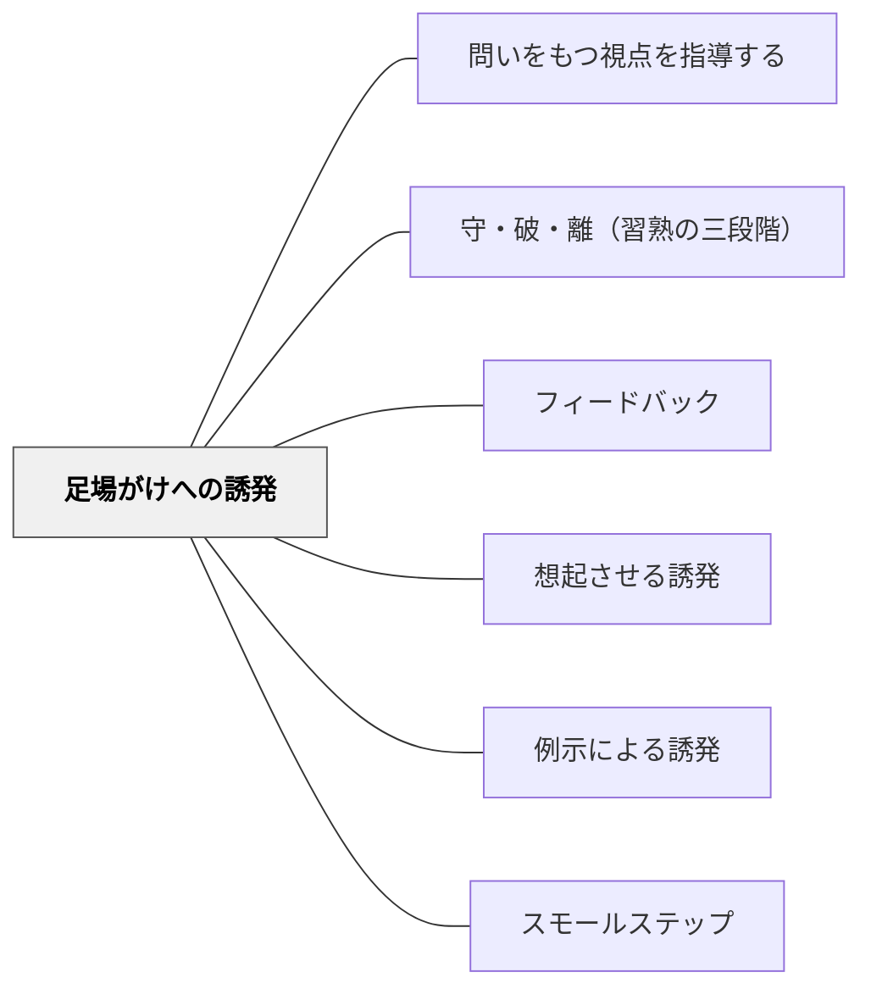

# 足場がけへの誘発

> 答えを与えるのではなく、「ヒントカードを見てみて」「この資料を参考にして」と解決の道具を示す。学習者が自分で登るための足場を指し示す。

## 背景（Context）

学習者が問題に詰まったとき、教師のとりうる最も一般的な応答は「答えを教える」か「自分で考えなさい」のどちらかに偏りがちである。しかしこの二極の間に、「解決に必要な道具・資料・支援を示す」という第三の道がある。

足場がけへの誘発（Scaffolded Cue）は、学習者を直接答えへ導くのではなく、「答えに至るための道具や支援」へ誘導するフィードバックである。ヒントカード・参考資料・例の提示・関連する操作物など、学習者が自分の力で問題を解決するための足場となるものを示す。

## 問題（Problem）

「自分で考えなさい」だけでは行き詰まりを解消できず、学習者はただ時間を過ごす。「答えを教える」では思考が省略される。行き詰まりを「どのリソースを使えば解けるか」という形に変換することで、学習者の思考を維持しながら前進させることができる。

ただし足場を示しすぎると、学習者が常に足場を頼りにするようになり、自力での問題解決能力が育たない。足場の提供と撤収（fading）の設計が重要である。

## 力のかたち（Forces）

- 行き詰まりを解消する道具を示すことで、学習者が思考を継続しながら前進できる
- 足場に過度に依存させると自律的問題解決能力が育たない
- 学習者が「どんなリソースが使えるか」を知り判断できるようになることが最終目標

## 解決（Solution）

学習者が詰まったとき、まず「今の問題を解くのに役立つものはどこにある？」と問い、学習者自身に資源を探すよう促す。それでも見つからない場合に、「この教科書の○○ページに似た例がある」「ヒントカードの3番を見てみて」「モデル解答と見比べてみて」という形で足場を具体的に示す。

[[パタン/想起させる誘発]]が記憶にアクセスする誘発であるのに対し、足場がけへの誘発は外部リソースへのアクセスを誘発する。ヒントカード・フローチャート・参照シート・例題など、授業の中にあらかじめ足場となる資源を配置しておくことが前提となる。[[パタン/スモールステップ]]と組み合わせることで、足場の難易度を段階的に管理できる。

## 結果（Consequences）

- 学習者が詰まったままにならず、リソースを活用しながら前進できる
- 自分でリソースを探す習慣が育ち、自律的学習の基盤が形成される
- 足場の提供と撤収のバランスを設計しないと、永続的な依存が生まれるリスクがある

## このパタンが働く実践

| 実践 | どのように足場がけへの誘発が働くか |
|------|------------------------------------|
| [[実践/ローベルみたいな物語を書こう]] | 物語作りを助ける質問を用意し、構想に詰まった子どもが考えるための道具へ戻れるようにする |
| [[実践/俳句と短歌を楽しもう]] | モデル提示と全員での本歌取を通して、一人で作る前の足場をつくる |

## このパタンが働く教材

| 教材 | どのように足場がけへの誘発が働くか |
|------|------------------------------------|
| [[教材/読書反応の書き出しの手引き]] | 読書反応の書き出しを選べるようにし、「何を書けばよいか分からない」状態から自分の考えを書き始められるようにする |

## 関連パタン
- [[パタン/問いをもつ視点を指導する]]
- [[パタン/守・破・離（習熟の三段階）]]

- [[パタン/フィードバック]] — 親パタン
- [[パタン/想起させる誘発]] — 内部記憶へのアクセスを促す誘発
- [[パタン/例示による誘発]] — 具体例を見せることで解決へ誘導する誘発
- [[パタン/スモールステップ]] — 足場の難易度を段階的に管理する

## クラスター図

## Actionable Insight

- 詰まっている学習者に「今の問題を解くのに役立つものはどこにある？」と先に自分で探させる——自らリソースを探す経験が自律的問題解決の習慣の出発点になる
- 授業にヒントカード・フローチャート・参照シートをあらかじめ配置しておく——足場となるリソースが教室にあることで「詰まったら誰かを待つ」から「道具を使う」へ変わる
- 習熟が進んだら足場を少しずつ減らしていく——足場の提供と撤収を意識することで依存ではなく自律を育てる

## 出典

Wood, D., Bruner, J. S., & Ross, G. (1976). The Role of Tutoring in Problem Solving. *Journal of Child Psychology and Psychiatry*, 17(2), 89–100.
