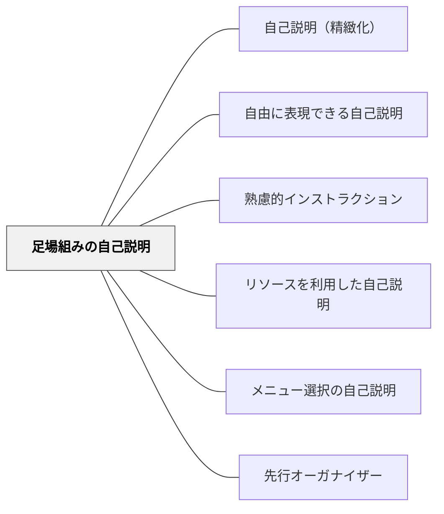

# 足場組みの自己説明

> 一部を与えることで、白紙の恐怖を取り除き、説明への取り組みを促す。

## 背景（Context）
学習者に自己説明を求めるとき、全くの白紙状態から説明を構成することは認知的負担が大きい。特に理解が不十分な段階では、何から手をつければよいか分からず、思考が止まってしまうことがある。山本弘樹の自己説明5形態の第3形態として位置づけられる。

## 問題（Problem）
完全な自己説明を求めると、特に学力が低い学習者や内容に不慣れな学習者が取り組めなくなる。空白のままにしてしまったり、表面的な言葉の写し作業に陥ったりしやすい。足場なしの説明要求は、意図した思考活動を引き出せないことがある。

## 力のかたち（Forces）
- 認知的負担を下げると取り組みやすくなるが、与えすぎると考える余地がなくなる
- 穴埋め形式は既存知識との接続を促すが、形式的に埋めるだけになる危険もある
- 適切な足場は学習者の能力と内容の難易度のバランスによって変わる
- 足場は最終的に外していく必要がある

## 解決（Solution）
**説明の一部（骨格・キーワード・文の冒頭など）をあらかじめ与え、残りを学習者自身に埋めさせる。**

ワークシートに「○○は△△であり、それによって＿＿＿になる」という形の不完全な説明を用意し、学習者が空欄を自分の言葉で埋める。穴埋めテストの形式や、授業のまとめシートに部分的な説明文を入れておく形でも実践できる。埋める部分の量や難易度を調整することで、学習者の習熟度に合わせた足場がけが可能になる。

## 結果（Consequences）
- 認知的負担が適度に下がり、より多くの学習者が説明活動に参加できる
- 与えられた枠組みによって、説明の質や方向が誘導される
- 足場に頼りすぎると、独力で説明する力が育ちにくくなる可能性がある

## クラスター図

## Actionable Insight

- ワークシートに「○○は△△であり、それによって＿＿になる」という不完全な説明文を用意し、空欄を自分の言葉で埋めさせる——白紙の恐怖を取り除くだけで多くの学習者が説明活動に参加できる
- 空欄の数・位置・ヒントの量を習熟度に応じて調整する——足場の細かさが学習者一人ひとりに合ったちょうどいい認知的負荷を実現する
- 足場を段階的に外し最終的には白紙から書ける自立的説明力へ移行させる計画を立てる——足場は最終形ではなく手放すためのものと位置づけることが重要

## 出典

- 一つの教育のパタン・ランゲージ（岩井輝久）

## 関連パタン
- [[パタン/自己説明（精緻化）]]
- [[パタン/自由に表現できる自己説明]]
- [[パタン/熟慮的インストラクション]] — 親パタン
- [[パタン/リソースを利用した自己説明]] — 別の足場がけ形式
- [[パタン/メニュー選択の自己説明]] — 選択肢による足場がけ
- [[パタン/先行オーガナイザー]] — 事前に枠組みを与える関連技法
- [[メタパタン/足場は消えるために組む（フェードアウト）]] — プロンプトは自発的な自己説明に置き換えられて完成する
