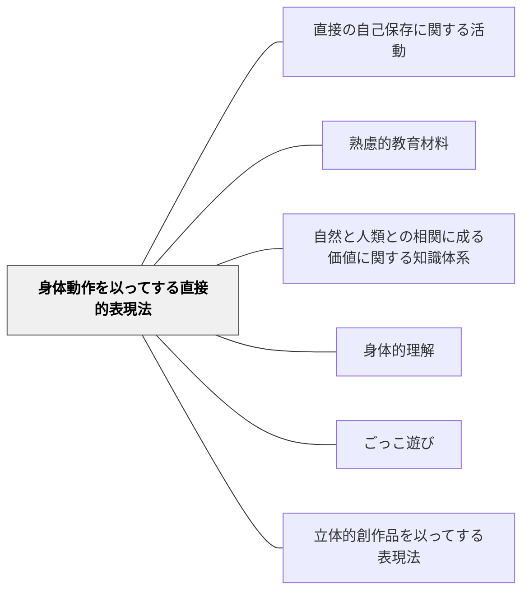

# 身体動作を以ってする直接的表現法

> 遊び・体操・ダンス——身体を動かすことそのものが表現であり学びである。

## 背景（Context）

牧口常三郎の表現法分類の第一項目。身体的な動き・動作によって価値を表現する活動。体育・ダンス・遊び・演劇・パフォーマンスなどがここに含まれる。身体的理解（イーガン）とも深く関連し、最初の学びが身体から始まるという原則を体現する。

## 問題（Problem）

学校教育が言語・記号中心になると、身体による表現・学習が軽視される。

## 力のかたち（Forces）

- 身体表現は言語化できない理解を体現する
- 遊び・ゲームは動機付けに自然につながる
- 評価が難しい

## 解決（Solution）

**体育・遊び・ダンス・演劇などの身体的活動を教育材料として設計し、身体を通じた表現と理解を重視する。**

## 結果（Consequences）

- 身体的知性と表現力が育つ
- 身体感覚と概念の統合が深まる

## 関連パタン
- [[パタン/直接の自己保存に関する活動]]

- [[パタン/熟慮的教材教具]] — 親パタン
- [[パタン/自然と人類との相関に成る価値に関する知識体系]] — 上位分類
- [[パタン/身体的理解]] — 身体から始まる理解
- [[パタン/ごっこ遊び]] — 遊びを通じた表現
- [[パタン/立体的創作品を以ってする表現法]] — 牧口の表現法分類の第二項目（並列パタン）

## クラスター図

## Actionable Insight

- 概念を学んだ後に「体で表してみよう」という活動を1分取り入れる（例：円運動→全身で円を描く）——身体化された理解は言語的理解より長く記憶に残る
- 歴史上の人物や科学現象を「なりきり演技」で表現させる——身体を使った演劇的表現が抽象概念を具体的な体験として定着させる
- 「説明したいことをジェスチャーだけで伝え合う」活動を取り入れる——言語を使わない表現制約が身体的理解の深さを浮き彫りにし、言語化への動機も生む

## 出典

- 牧口常三郎（1972）『牧口常三郎全集第4巻 創価教育学体系 上』聖教新聞社
