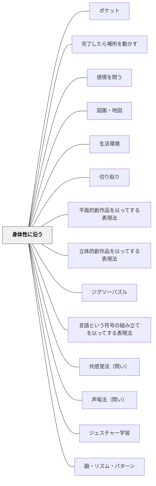

# 身体性に沿う

## 背景（Context）

学校現場では、教材や活動が「言語的・抽象的」なものに偏りがちである。しかし、子どもたちの学びや理解は、しばしば身体的な経験や運動感覚に支えられている。特に発達段階の早い子どもたちにとっては、身体と結びついた活動が理解や記憶を促進する鍵となる。

認知科学の「エンボディド・コグニション（身体化された認知）」とも整合する視点であり、特別支援だけでなくすべての子どもに有効なユニバーサル・デザインの観点である。

## 問題（Problem）

身体感覚や動きと切り離された学習活動は、子どもにとって「わかりにくく」「意味を持ちにくい」ものになりやすい。座ったままの受動的な学習が続くと、集中力や意欲の低下にもつながる。

## 力のかたち（Forces）

- 子どもは身体を通して世界と関わり、意味を形成している
- 学びは「頭だけ」ではなく「身体ごと」の経験によって深まる
- 身体的な動きと概念の結びつきが、理解の足場となることがある
- 特別支援の文脈では、身体表現を通した理解がとくに有効な場合が多い

## 解決（Solution）

学習活動や教材の設計において、**子どもの身体性に沿う工夫**を意識的に取り入れる。身体の動きを伴う操作・空間的配置・触れる・並べる・動かすといった身体的インタラクションを通して、理解や表現を促す。

**具体例：**
- 数直線を床に貼り、ジャンプして「+3」「-2」などを体験する
- 算数の問題を積み木やマグネットで再現しながら考える
- 文章の場面をジェスチャーや演技で表現する
- 書き順や漢字を空中でなぞって覚える「空書き」活動
- 音読にあわせてリズムをとる・体を揺らすといった感覚統合的アプローチ
- 体の動きで図形の性質を表す（「体で正三角形を作ろう」など）
- 「運筆」前の肩回し・指ほぐし・空書き活動

## 結果（Consequences）

身体を使った学びにより、子どもの関心や集中が高まり、理解が深まる。活動が「感じられる」「やってみたくなる」ものになり、主体性や記憶の定着につながる。身体が意味づけの回路になることで、「できた！」という感覚が生まれる。

「身体性に沿う」は、子どもの「わかりたい・伝えたい」という衝動を、身体の動きを通して引き出すための足場でもある。

## 関連パタン
- [[パタン/ポケット]]
- [[パタン/完了したら場所を動かす]]
- [[パタン/感情を問う]]
- [[パタン/図画・地図]]
- [[パタン/生活環境]]
- [[パタン/切り貼り]]
- [[パタン/平面的創作品を以ってする表現法]]
- [[パタン/立体的創作品を以ってする表現法]]
- [[パタン/ジグソーパズル]]
- [[パタン/言語という符号の組み立てを以ってする表現法]]
- [[パタン/共感覚法（問い）]]
- [[パタン/声喩法（問い）]]
- [[特別支援/太田ステージ]]
- [[教科/算数]]
- [[実践/個別教材の設計]]
- [[パタン/ジェスチャー学習]]
- [[パタン/韻・リズム・パターン]]
- [[パタン/運動]]
- [[パタン/形あるものから無形へ]]
- [[パタン/熟慮的教材教具]]
- [[パタン/熟慮的教材教具]]
- [[パタン/身体的理解]]
- [[パタン/体験への接続]]
- [[パタン/比喩]]
- [[パタン/操作物による概念形成]] — 触れて動かせる具体物で抽象概念を理解する下位パタン
- [[パタン/精緻化]] — 身体的体験との接続が精緻化の具体的土台をつくる

### 下位パタン

### 関連
- [[パタン/余白をつくる]] — 身体が動く余白を授業に設ける
- [[パタン/シグニファイアアフォーダンス]] — 身体の動きを誘導するシグニファイア設計
- [[特別支援/身体と学習]] — 毎日の運動ルーティン・身体性に沿う指導

## クラスター図

## Actionable Insight

- 数の概念を教えるとき「床の数直線を歩く・跳ぶ」を1回試す——身体で動くことで抽象的な概念が感覚的に定着する
- 書き順・漢字の学習前に「空書き（空中でなぞる）」を1分取り入れる——手の動きと記憶が結びつき定着率が上がる
- 長い着座活動の後に「立って隣の人と話す」「体を動かして考える」場面を1つ設ける——身体の動きが再び注意と意欲を引き出す

## 出典

- パタン集/身体性に沿う.md
- エンボディド・コグニション（認知科学）
