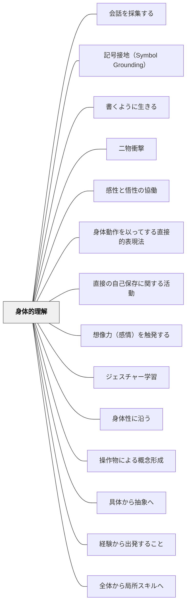

# 身体的理解

> 学習は身体的理解から始まり、抽象を経て、また身体的理解へと戻ってくる

## [Pattern Connection]

### ベルクソン（1934）思考と動き 統合（2026-06-02）：朗読術・直観が分析に先行する

ベルクソンは「形而上学入門」で直観と分析の非対称性を論じた：

> 「直観とは、対象の内部に身を置き、その対象がもつ唯一なものと一致する共感のことである。分析は、対象を既知の要素で表現し、対象の外から巡る」——ベルクソン（1934/2013）

そして決定的な非対称性：**「直観から分析へは移行できるが、分析から直観へは移行できない」**。

これは本パタンに深い含意を持つ。イーガンが「身体的理解→抽象→身体的理解」という循環を示したとすれば、ベルクソンはその**第一歩（身体的・直観的把握）が論理的に先行しなければならない**ことを哲学的に説明する。

**朗読術（講読術）という具体的な教育実践**：ベルクソンは文学を理解する方法として、知的分析の前に**朗読する**ことを高く評価した。音読の中で、声・リズム・呼吸を通じて文の構造と運動への知覚が身体的に生まれる——知的分析（修辞技法・文の構造・意図の解析）の前に、身体的・感覚的な把握がある。

> 「知的理解の前に構造と運動への知覚がある」——ベルクソンの講読論（序論）

- **既存パタンとの関連**：イーガンの「身体的理解」が学習プロセスの位相として身体的理解の重要性を示すならば、ベルクソンはその理由——直観が分析より認識論的に先行する——を提供する。「直観なしに分析だけでは元に戻れない」という不可逆性が、本パタンの「身体的理解を起点にせよ」という処方の根拠になる。
- **補強された点**：「まず身体的体験、次に分析」という順序が、単に「動機付けが上がる」「具体が先」という実用論を超えて、**認識論的必然性**として理解できるようになる。
- **教育実践への示唆**：国語の音読・朗読は、教材を「分析するための下準備」ではなく、**それ自体が最初の理解行為**として位置づけられる。算数の具体操作も、抽象の足場ではなく、「直観が育つ場」として設計する。
- **他のパタンへの波及**：[[パタン/全体から局所スキルへ]] — 全体的・直観的把握が局所スキルの練習に先行する；[[パタン/朗読術]] — 音読が直観的理解の実践形態

[[文献/思考と動き（ベルクソン）]]

---

### ベルクソン（1919）精神のエネルギー 統合（2026-06-02）：脳はパントマイムの器官——身体的理解の神経哲学的根拠

ベルクソンは『精神のエネルギー』第II章「心と体」において、脳と思考の関係を革命的な比喩で示した：

> 「脳はパントマイムの器官である。」——ベルクソン（1919/2012）

脳は思考を**創り出すのではなく、演じる（パントマイムする）**。釘が衣服を支えても衣服は釘から生まれないように、脳が思考を支えても思考は脳から生まれない。

この視点から導かれる教育的含意：

**思考は分割できない一つの動き**：文の意味を理解するとき、思考は語彙ごとに断片的に積み上がるのではなく、全体として一つの流れをなす。言葉のリズム・文章の構造は思考のリズムをパントマイムする。

**音読・朗読は理解の前段階でなく、理解そのものの最初の形式**：声に出して読む行為は、思考を身体でパントマイムすることである。「音読してから意味を考える」のではなく、音読が意味の形成と不可分に結びつく。

**「脳は生活への注意の器官」**：脳は現実の行動に向けて意識を集中させる。身体的な文脈（具体物・操作）の中で学習するとき、脳は現実の行動と意識を接続しやすくなる。

- **既存パタンとの関連**：思考と動き（既統合）が「直観が分析に先行する」という認識論的非対称性を示したとすれば、精神のエネルギーはその**身体的根拠**——思考は本来パントマイム（身体的演技）の形を持つ——を加える。身体的理解は思考の「準備」ではなく「思考の形式そのもの」。
- **補強された点**：「身体的理解から始まり、抽象を経て、また身体的理解へと戻る」というイーガンの循環モデルに、ベルクソンは「なぜ身体が先なのか」の哲学的説明を提供する——思考がパントマイム（身体的演技）の形を持つからこそ、身体的体験が理解の起点になる。
- **他のパタンへの波及**：[[パタン/ミメーシス（模倣による学び）]] — パントマイム器官としての脳は模倣学習の神経哲学的根拠；[[パタン/身体動作を以ってする直接的表現法]] — 思考のパントマイムとしての身体表現

[[文献/精神のエネルギー（ベルクソン）]]

---

### 北大路翼（2019）生き抜くための俳句塾 統合（2026-06-02）：手でちぎる・耳で聞く——身体的作法が思考モードを変える

北大路翼が主宰する「尻派」句会には、二つの身体的作法がある。

**手でちぎる短冊——句モードのスイッチ：**
句会では短冊を「手でちぎる」。ハサミや定規を使わない。この「手でちぎる」という身体的動作が、日常モードから俳句モードへの移行のスイッチになる。思考のモードを切り替える身体的な合図——「用意ができた」という宣言を言語ではなく身体的動作で行う。

**耳で俳句を聞く——書くことを捨てる：**
句会では発表された句をまず「耳で聞く」。書き取ることを一旦捨て、音として全体を身体で受け取る。「俳句は音楽だ」という北大路翼の言葉は、俳句を視覚的な文字として読む前に、音響的・身体的な全体として把握することの優先を示す。

> 「俳句は音楽だ。」——北大路翼（2019）第三講

これはベルクソンの「音読（朗読）は知的分析の前段階でなく、理解の最初の形式そのもの」という主張（既統合）と同じ原理が、俳句の実践形式として具体化されたものである。「脳はパントマイムの器官」（精神のエネルギー既統合）——耳で俳句を聞くとき、身体が句をパントマイムしている。

**「すべての発想の起点はモノ」——身体的把握が観念に先行する：**
北大路翼の第二講「俳句的脳内回路」の核心。手元の蜜柑を五感（視覚・聴覚・触覚・味覚・嗅覚）で把握してから連想を始める。観念・感情から書き始めない。身体感覚が発想の起点——ベルクソンの「直観は対象の内部に身を置くこと」（思考と動き）の実践的版。

- **既存パタンとの関連**：ベルクソンが「直観から分析への移行は可能だが逆は不可能」「音読が理解の最初の形式」と言うことを、北大路翼は「手でちぎる・耳で聞く・モノから発想する」という具体的な俳句句会の作法として体現した
- **補強された点**：「身体的作法がモードを切り替える」という具体例が加わる。算数の授業でも特定の身体的動作（具体物を手に取る・図を描く）が思考モードのスイッチとして機能する可能性
- **他のパタンへの波及**：[[パタン/作家のクラフト]] — モノから発想・五感把握は感覚的イメージの起点；[[文献/生き抜くための俳句塾（北大路翼）]] — 本統合の出典

[[文献/生き抜くための俳句塾（北大路翼）]]

---

## 背景（Context）

人間の認識は身体から出発する。幼児は触れる・動く・感じることで世界を理解し始める。学校教育では次第に抽象的・言語的な学習が中心となるが、イーガンは学習が最終的に「身体的理解に戻ってくる」ことの重要性を指摘する。

## 問題（Problem）

抽象的な概念学習を身体的な次元から切り離すと、学習者は知識を「頭の中だけのもの」として処理する。理解が表面的になり、実際の行為・感覚・生活との結びつきが失われる。

## 力のかたち（Forces）

- 身体は思考と切り離せない。「わかる」という感覚は、しばしば身体的な「腑に落ちる」感覚とともにある
- 抽象的な概念も、最終的には身体的・感覚的な次元で確認されるとき、真に理解されたといえる
- 身体的活動は、学習への参与と集中を高める
- しかし身体的体験だけでは抽象的・概念的な理解に至れない場合もある

## 解決（Solution）

学習の導入段階と統合段階に身体的活動を意図的に組み込む。算数であれば、まず具体的な物の操作（身体的理解）から始め、抽象的な記号操作を経て、最終的に現実の文脈で使う身体的体験で締めくくる。

「この抽象概念を、体を使ってどう表現するか」という問いや活動（ジェスチャー学習・ロールプレイ・実験・フィールドワーク等）を通じて、概念と身体感覚をつなぐ。

## 結果（Consequences）

学習者の理解が深まり、知識の長期的定着が改善される。学習への参与・没入が高まる。身体的学習は多様な学習スタイルをもつ学習者を包摂する効果もある。ただし、活動が目的化し「楽しかったが何を学んだかわからない」状態にならないよう、抽象的理解との接続を丁寧に設計する必要がある。

## 関連パタン
- [[パタン/会話を採集する]]
- [[パタン/記号接地（Symbol Grounding）]]
- [[パタン/書くように生きる]]
- [[パタン/二物衝撃]]
- [[パタン/感性と悟性の協働]]
- [[パタン/身体動作を以ってする直接的表現法]] — 牧口の表現法四分類における対応パタン
- [[パタン/直接の自己保存に関する活動]]

- [[パタン/想像力（感情）を触発する]]
- [[パタン/ジェスチャー学習]]
- [[パタン/身体性に沿う]]
- [[パタン/操作物による概念形成]]
- [[パタン/具体から抽象へ]]
- [[パタン/経験から出発すること]]
- [[パタン/全体から局所スキルへ]] — 全体的・直観的把握が局所スキルの練習に先行する（ベルクソン接続）
- [[文献/精神のエネルギー（ベルクソン）]] — 脳はパントマイムの器官・思考は分割できない一つの動き（1919）
- [[文献/生き抜くための俳句塾（北大路翼）]] — 手でちぎる短冊・耳で俳句を聞く・モノから発想——身体的作法が思考モードを変える（北大路翼, 2019）

## クラスター図

## Actionable Insight

- 抽象的な概念を学んだ後、「この概念を体を使って表現するとしたらどうするか」を問う——身体的表現への問いが概念と感覚をつなぐ
- 算数・理科で「まず具体的な物の操作から始め、最後に現実の文脈で使う」という展開を設計する——身体的理解が導入と統合の両方で機能する
- ジェスチャー・ロールプレイ・フィールドワークを単元に一度組み込む——多様な学習スタイルをもつ学習者が概念に手応えをつかめる機会を作る

## 出典

Egan, K. (2005). *An Imaginative Approach to Teaching*. Jossey-Bass.（邦訳（2010）『想像力を触発する教育――認知的道具を活かした授業づくり』北大路書房）

ベルクソン，A.（原章二訳）（2013）『思考と動き』平凡社ライブラリー784 → [[文献/思考と動き（ベルクソン）]]
