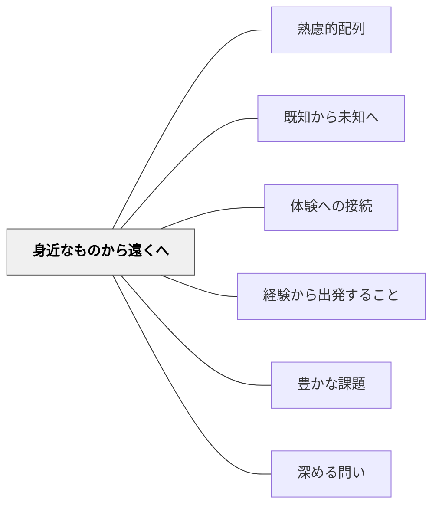

# 身近なものから遠くへ

> 自分の足元から世界への通路を開く。

## 背景（Context）

[[パタン/熟慮的配列]] の空間的次元。学習者は自分の生活環境・地域・文化の中に生きており、そこに直接の経験が根ざしている。社会科・地理・文化・歴史・理科など、空間的・社会的スケールを扱う教科で特に重要な原則。

## 問題（Problem）

遠い地域・異文化・抽象的な社会概念を、学習者の生活と無関係に提示すると、それらは「暗記する対象」にはなっても「理解し共感する対象」にはならない。学習者は自分とその内容との距離を縮められない。

## 力のかたち（Forces）

- 身近な経験は具体的で動機づけが高い
- 「身近」に留まり続けると視野が狭くなる
- 地域差・個人差により「身近」の内容は一様でない
- 遠くの現実を身近として扱うと、誤った先入観を強化することがある

## 解決（Solution）

**学習者の生活圏・経験圏から出発し、同心円状に理解の射程を広げていく。**

実践例：
- 生活科「まちたんけん」→ 社会科「市の様子」→「都道府県」→「日本」という段階
- 自分の家の食事の食材産地を調べてから、食料自給率の問題へ
- クラスの意思決定（学級会）を経験させてから、民主主義の仕組みを学ぶ
- 目の前の川の水質問題から、流域全体の環境問題へ

**漢字学習での実践（白川静の字典を活用）：**  
最も身近なものは「自分自身」。自分の名前に使われている漢字を白川静の漢字字典で調べ、その由来をクラスで共有するところから始める。次にクラスメートの名前の漢字、さらに家族の名前の漢字へと関心を広げる。「漢字って面白い」という感覚が身近な自分の名前から育つ。

「身近なもの」は物理的近さだけでなく、心理的・文化的近さでもよい。

## 結果（Consequences）

- 遠い対象への共感と関心が育つ（「あそこにも自分と同じような人がいる」）
- 抽象的な概念が具体的な参照点を持つ
- 世界市民教育・多文化理解への基盤が形成される

## クラスター図

## Actionable Insight

- 単元の導入で「自分の生活圏」に関わる具体的な問い・体験から始める——身近な出発点が学習内容との「距離」を縮める
- 遠い地域・文化を学ぶ前に「自分の地域では同じ問題がどう現れるか」を問う——類比的な思考が共感と理解の橋をかける
- 自分の名前の漢字の由来を調べる活動から始め、その後クラスメートの名前へ広げる——最も身近な「自分」から始まる探求が学習意欲と連続性を生む

## 出典

- 一つの教育のパタン・ランゲージ（岩井輝久）

## 関連パタン

- [[パタン/熟慮的配列]] — 上位パタン
- [[パタン/既知から未知へ]] — 身近は認識論的「既知」でもある
- [[パタン/体験への接続]] — 生活経験を出発点にする
- [[概念/世界市民教育とパタン・ランゲージ]] — 近から遠への拡張の教育的意義
- [[パタン/経験から出発すること]] — 身近な体験を学びの起点にする
- [[パタン/豊かな課題]] — 身近から遠くへの問いが豊かな課題の構造をつくる
- [[パタン/深める問い]] — 身近→遠への思考の旅が問いを深める
