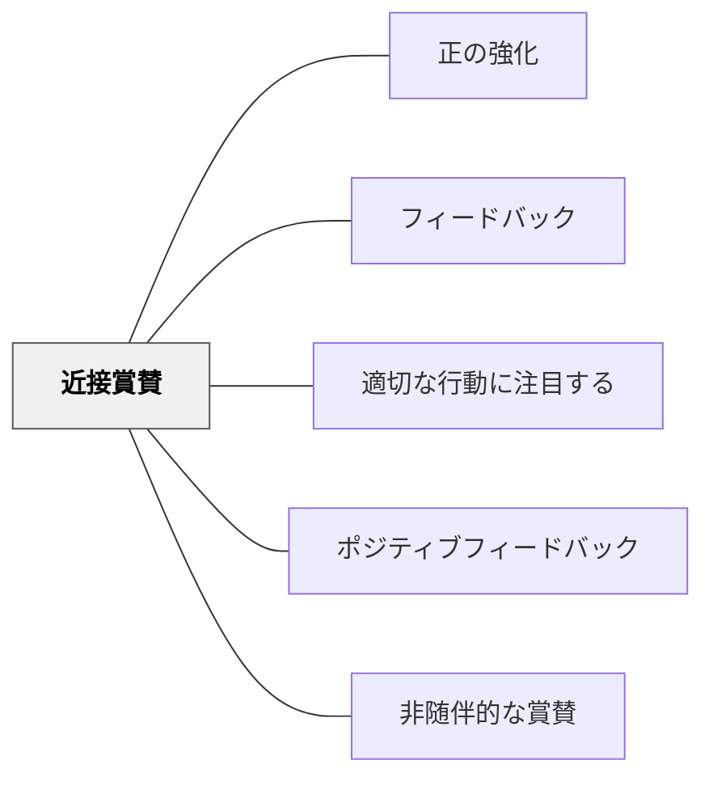

# 近接賞賛

> 目的の行動をしていない学習者を直接注意するのではなく、隣でその行動をしている学習者を褒めることで、間接的に行動変容を促す。

## 背景（Context）

授業中、特定の学習者が望ましい行動をしていない場面は頻繁に起こる。直接注意することはときに有効だが、注意を受けた学習者が恥をかく、教師との関係が緊張する、他の学習者の学びが中断されるなどのコストがある。

近接賞賛（Proximity Praise）は、行動管理の技術の一つとして教師教育の文脈で使われてきた。ターゲットの学習者のすぐ近くにいる、目的の行動をしている別の学習者を公に褒めることで、ターゲット学習者がモデルを見て自らの行動を修正することを促す間接的な手法である。

## 問題（Problem）

望ましくない行動をしている学習者を直接指名して注意することは、その学習者を傷つけ、関係性を損なうリスクがある。また、注意を求める行動に対して注意という形の「注目」を与えることが、その行動を強化してしまうこともある。

一方で、問題行動を見過ごすことも授業の流れを乱し、他の学習者への不公平感を生む。直接的介入と放置のあいだに、低コストで効果的な第三の手段が必要である。

## 力のかたち（Forces）

- 直接注意は関係性や自尊心を傷つけるリスクがあり、問題行動を強化することもある
- 近くで望ましい行動をしているモデルを褒めることは、学習者に「自分もそうしよう」という気づきを与える
- この手法は「注目欲求」に応えず行動修正を促すため、強化の循環を断ち切れる

## 解決（Solution）

ターゲットの学習者の近くに自然な形で移動し（近接性）、その近くで課題に取り組んでいる学習者を名前と具体的な行動を挙げて褒める。「○○さんはもうノートを開いて書き始めていますね」「△△さんのように集中して取り組んでいる人が増えてきました」という形が典型的である。

ターゲットに直接言及しないことが重要である。近接賞賛はあくまでモデルを示す手段であり、気づきを学習者自身に委ねる。行動が改善されたら、タイミングよくそのターゲット学習者自身も賞賛する。[[パタン/適切な行動に注目する]]と組み合わせることで、正の行動の文化を育てることができる。

## 結果（Consequences）

- 直接的な対立を避けながら行動修正を促せる
- 公の場での恥や傷つきが減り、関係性が保たれる
- 過度に使うと、他の学習者が「褒められ役」として使われると感じる場合がある

## 関連パタン
- [[パタン/正の強化]]

- [[パタン/フィードバック]] — 親パタン
- [[パタン/適切な行動に注目する]] — 望ましい行動を強化する関連戦略
- [[パタン/ポジティブフィードバック]] — 近接賞賛に使われるポジティブな応答
- [[パタン/非随伴的な賞賛]] — 行動と関係ない賞賛との対比

## クラスター図

## Actionable Insight

- 授業中に特定の学習者の行動が気になったとき、その学習者の近くにいる別の学習者の良い行動を具体的に褒める——直接注意するより低コストで行動修正を促す間接的な誘導
- 「○○さんはもうノートを開いて書き始めていますね」という形で名前と行動を一緒に述べる——具体的な行動の言及がモデルとして機能する
- 行動が改善されたら、そのタイミングでターゲットの学習者自身も褒める——修正した行動を強化することが次の場面での行動変容を定着させる

## 出典

Canter, L. & Canter, M. (1992). *Assertive Discipline*. Solution Tree.
