# 返したことと届いたことを分ける（返却の五段）

> 返した ≠ 届いた ≠ 受け取った ≠ 応えた ≠ 使った。返却のあとに受け手の側で起きたことを、五つの別々のこととして分けて見る。

## [Pattern Connection]

本パタンは岩井（2026）第2巻の教室語版であり、**理論の正は書籍にある**（定義・記号はこの Wiki に置かない）。ここで渡すのは、教師が実際に点検できる粒度に割り直した見取りの手つきだけである。

接続の要はサドラーである。Sadler（1989）は、情報がただ記録されるだけ、変える力も知識も持たない第三者に渡されるだけ、あるいは深く符号化されすぎていて適切な行動につながらないなら、制御ループは閉じない、と書いた。そこにあるのは**宙ぶらりんのデータ（dangling data）**にすぎない、と（[[文献/Formative Assessment and the Design of Instructional Systems（Sadler）]]）。フィードバックとは、ギャップを変えるために**使われたとき**にだけフィードバックである——これがサドラーの定義である。

本パタンは、その「使われた」までの道のりを五段に分解したものである。サドラーが一息で言ったことを、教師が月曜日に点検できる粒度へ割った、と位置づけられる。サドラーの側は「ループが閉じたか、閉じなかったか」の二択で語ったが、教室でつまずくのはたいてい、その二択のあいだのどこかである。五段に分けると、どこで止まっているのかを名指しできる。

既存のパタンとの関係で言えば、[[パタン/フィードバック]] は「何を返すか」を、[[パタン/記述式フィードバック]] は「どう書くか」を扱ってきた。本パタンは「返したあとに何を見るか」を扱う。返し方の改善では届かない領域——読まれていない、読まれたが別の意味で受け取られた、受け取られたが使う機会が時間割にない——を、返し方の問題から切り離す。

## 背景（Context）

教師の一日は、返すことでできている。作文にコメントを書く。算数の机間指導でノートをのぞき込んで一言添える。テストに赤を入れて返す。学期末に所見を書く。

返すところまでは、教師の手の中にある。教師は、自分が何を返したかを知っている。だから、返却は「終わった仕事」として数えられやすい。コメントを三十人分書き終えた夜、仕事は完了したように感じられる。

しかし返却は、渡した瞬間にすべてが起きたことにはならない。返した一言のあとに、その子の側でいくつものことが起こりうるし、何も起こらないこともある。返却物が机の中に入ったまま開かれないこともある。読まれたが、こちらの意図とは違う意味で受け取られることもある。「わかりました」と返事があっても、それが解釈の一致を意味しているとは限らない。そして——ここがいちばん見落とされる——読まれ、うなずかれ、それでも次の作品でその中身が一度も使われないことがある。

見取りをふりかえるとき、教師は「効いた」「効かなかった」の二つの箱に分けたくなる。箱が二つしかないと、返却が届かなかった子と、届いたが使う機会がなかった子と、届いて使ったが自分の考えでやり方を変えた子が、同じ箱に入る。

## 問題（Problem）

**返却の後を「効いた／効かなかった」の一括判定で読むと、手立てを打つべき場所が見えなくなる。**

読まれていない子に、もっと丁寧なコメントを書いても届かない。読んだが解釈がずれている子に、同じ言い方を繰り返しても同じずれが起きる。解釈は合っているが使う機会がない子には、コメントではなく時間割が要る。三つは別の問題であり、別の手立てを要求する。しかし一括判定は、三つを「効かなかった」の一語に潰す。

もう一つ、逆向きの取り違えがある。返却のあとの子どもの姿は一様ではない。教師と一緒に直す子、一人でやり直す子、別の問題で同じやり方を使う子、課題に応じて使い分ける子、自分で気づいて自分で直す子、そして「その言い方は納得できない」と理由をつけて異議を述べる子。これらを見ていると、自然に順序をつけたくなる。「自分で気づいて直せるのが上」「まだ一緒でないと直せない」「異議を述べるのは反抗」——この序列づけが、いちばん静かに入り込む誤りである。

そして三つ目。返却の記録をいつ閉じてよいのかが分からない。閉じなければ事務が回らないが、閉じてしまうと、その子の学びまで終わったことにしてしまう感覚がある。

## 力のかたち（Forces）

- **分けて見る手間 vs 一括で済ませる誘惑**——五段に分けて見取るのは手間である。三十人×五段は、そのまま数えれば百五十の点検になる。「効いた／効かなかった」の二択なら三十で済む。しかし二択で済ませた見取りは、翌週の手立てを何も指定しない
- **「使った」を見るには、使う機会が要る**——五段目は、教師の見取りの精度の問題ではなく、時間割の構造の問題である。作文を返した翌週に書き直す時間がなければ、「使った」は構造的に起こりようがない。返し方をどれだけ磨いても届かない（[[パタン/再提出を許す（リトライ・サイクル）]]）
- **観察できる範囲の限界 vs 見えたものだけで判断したくなる誘惑**——教師が見ていられる時間は、一日のうちのごく一部である。「応答が見られなかった」は「応答がなかった」ではない
- **異議を「反抗」と読む構え vs 異議を一つの応答と数える構え**——理由をつけた不採用は、教師にとっていちばん受け取りにくい形をしている。しかし不採用は無応答ではない。むしろ、届いて、解釈されて、検討された証拠でありうる
- **記録を閉じないと事務が回らない vs 閉じると終わった気になる**——学期は終わる。所見は締切がある。閉じる必要は現実にある
- **受け手ごとに分ける精度 vs 学級全体への一括指導の効率**——同じ一言を全員に返したほうが速い。しかし同じ一言でも、D児には届き、E児には届いていない

## 解決（Solution）

**返却したあとに受け手の側で起きたことを、五つの別々のこととして分けて見る。そして、受け手ごとに分けて見る。**

五段は次のとおりである。

1. **渡った**——その子が触れられる場所に置かれた。返却物が机の上にある。コメントが読める状態にある。連絡帳に挟まっている。ここまでは教師の側の作業で完結する
2. **届いた**——その子の注意・知覚・活動に入った。実際に読んだ。実際に聞いた。渡っていても届いていないことは、教室では珍しくない
3. **受け取られた**——ある意味として解釈された。**ただし、その解釈が教師の意図どおりとは限らない。** 誤解も、別の受け取り方も、批判的な読みも、すべて「解釈が起きた」ことの現れである。意図どおりに受け取られることだけを解釈と数えない
4. **応えた**——観察できる範囲で何らかの応答があった。採用、部分的な採用、形を変えての採用、問い返し、助けを求めること、「あとで考えます」という明示的な保留、不採用、異議。**不採用は無応答ではない**
5. **使った**——返却の中身が、その後の行為の中で実際に操作され、参照され、変形された。ここが、サドラーの言う「ギャップを変えるために使われた」に対応する段である

五段のあいだに、自動の矢はない。渡ったからといって届いたとは限らない。届いたからといって解釈されたとは限らない。解釈されたからといって応えたとは限らない。応えたからといって使ったとは限らない。**一つ手前が確認できたことは、次の一つを保証しない。**

そのうえで、三つの原則を添える。

**受け手ごとに分けて見る。** 同じ返却でも、D児には届き、E児には届いていないことがある。同じ一言について、子どもごとに別々に見取る。学級全体への一括の返却であっても、見取りは一括にしない。

**現れ方に順序を置かない。** 返却のあとの姿——教師と一緒に直す／一人でやり直す／別の問題で同じやり方を使う／課題に応じて使い分ける／自分で気づいて自分で直す／理由をつけて異議を述べる——これらに発達段階の順序をつけない。「自分で気づいて直す」が「一緒に直す」より進んでいるわけではない。自己点検の型が違うだけである。理由をつけた異議・不採用も、一つの正当な現れ方であって、不理解でも反抗でもない。

**閉じるのは記録であって、経験ではない。** ある時点で「ここまでが確認できた」と記録を閉じることはできるし、閉じてよい。事務はそれで回る。しかし、その子の中で起きていることまで閉じたわけではない。**記録を閉じることと、学びが終わることは別である。**

---

### 具体例1：作文にコメントを返した翌週

四年生の作文。教師は返却時に「読んだ人が同じ場面を思い浮かべられるか、もう一度見てみよう」と一人ずつコメントを書いた。三十人分、二時間かかった。

翌週、清書の時間に見て回ると、三通りの姿があった。

一人目のD児は、コメントの横に赤で線を引き、場面の描写を三行足していた。渡った・届いた・受け取られた・応えた・使った——五段すべてに、教師が実際に見た手がかりがある。

二人目のE児のノートには、コメントの上に何も書かれていない。声をかけると「読みました」と言う。しかし何を書かれていたかを聞くと、「もっと長く書けって」と答えた。渡った・届いた・受け取られた——ここまでは起きている。しかし解釈は教師の意図と違う。「読んだ人が思い浮かべられるか」が「長く書け」に変わっている。ここで打つべき手は、コメントを丁寧にすることではなく、**「思い浮かべられる」がどういうことかを一つの実例で見せること**である（[[パタン/評価的専門性を渡す（ギルド知識のダウンロード）]]）。

三人目のC児は、原稿がまだ机の中にあった。返却袋から出していない。渡ってはいるが、届いていない。ここで必要なのは、コメントの改善でも実例でもなく、**開く時間を五分取ること**である。

三人に同じ「効かなかった」を貼れば、来週も同じことが起きる。三人を三つの段で分けると、来週の手立てが三つとも違う形で出てくる。

---

### 具体例2：机間指導の一言

算数、繰り上がりのある足し算。教師TはD児のノートをのぞき込み、こう言った。「動かした1と残った7が、式のどこにあるか確かめよう。ブロックと式を並べてもいいよ」。

数十秒の一言である。この一言のあと、Dは自分の式を書き直した。教師はそれを見て、「効いた」と思う。

ここで五段に分けると、確認できているのは、渡った・届いた・受け取られた・応えた、そして書き直しという形での使った、までである。それは事実として言える。**言えないのは、その先である。** Dが来週の別の問題でも同じ見方を使うかどうかは、この一件からは何も言えない。書き直しが、Dの判断によるものか、指示に従っただけかも、この一件だけでは分けられない。

「効いた」と思った瞬間に、教師の頭の中では、確認できたことより一段も二段も先まで進んでいる。五段は、その進みすぎを、進みすぎと分かるようにする（続きは [[パタン/一回できたことと続いていることを分ける（記録の列）]] が引き受ける）。

---

### 具体例3：「わかりました」と言ったが、解釈が違っていた

六年生の算数の説明の記述問題。教師が「どうしてその式になるかが書いてないと、読んだ人は同じ手順にたどり着けないよ」と返した。子どもは「わかりました」と答えた。

翌日の答案では、式の下に「わり算だから」と一行だけ足されていた。

「わかりました」は応答である。四段目までは起きている。しかし三段目——どう受け取られたか——が、教師の意図とずれている。「理由を書く」が「言葉を一つ足す」として受け取られた。

このとき、教師が「わかったって言ったのに」と読むのがいちばん惜しい。実際には、届いて、解釈されて、応答があった。ずれているのは解釈の中身だけである。だから次の手は、叱ることでも言い直すことでもなく、**「読んだ人が同じ手順にたどり着ける説明」と「たどり着けない説明」を二つ並べて見せること**になる。

---

### 具体例4：理由をつけて異議を述べた子

同じ場面で、別の子はこう言った。「その式だけだと分かりにくいと思う。先に 8 を 1 と 7 に分けたところを書きたい」。

これは、教師の返却を採用しなかったということである。しかし無応答ではない。届いて、解釈されて、検討されて、理由つきで別の道が選ばれた。五段でいえば、四段目に「理由づけられた不採用」として立つ。

ここで「素直じゃない」「反抗的」と読むと、この子が二度と異議を述べなくなる。実際には、この応答は教師のコメントよりも情報量が多い。この子が何を「分かりにくい」と考えているかが、そこに出ている。異議は、教師の物差しを点検する機会でもある（[[パタン/達成規準の共同構築]]）。

異議が妥当かどうかは、また別の判断である。異議が述べられたことと、異議が正しいことは分けて扱う。「不採用は無応答ではない」は、「不採用はいつも正しい」ではない。

---

### 具体例5：通知表の所見

学期末の所見は、渡ってはいる。保護者を経由して家庭に届いている。

しかし、五段のどこまで確認できているかを正直に数えると、たいていは一段目で止まる。所見が子ども本人に読まれたかどうかを、教師は知らない。読まれたとして、どう受け取られたかも知らない。応答があったかどうかも、次の学期に何かが使われたかどうかも、観察の外にある。

サドラーの言う「深く符号化されすぎた情報」に、所見と評定はいちばん近い。これは所見を書くなという話ではない。書かねばならないものは書く。ただ、**所見は五段の一段目までしか確認できていない返却である**と知っておくことである。知っていれば、所見に書いたことと同じ中身を、始業式のあとに一度、口頭で本人へ返すという手が浮かぶ。所見を厚く書くより、そちらのほうが二段目に届く（[[パタン/評定（成績評価）]]）。

---

### 具体例6：「応答が見られなかった」と「応答がなかった」

C児は、返却のあと何も言わず、ノートにも何も足さなかった。記録には「反応なし」と書きたくなる。

しかし、そのとき教師は他の子のところにいた。C児が返却を読んでいた三分間を、誰も見ていない。C児が休み時間にひとりで消しゴムを使っていたかどうかも、記録にない。

**「応答が見られなかった」は「応答がなかった」ではない。** 見ていなかっただけかもしれない。この区別を落とすと、記録の薄さがそのまま子どもの薄さとして読まれる。C児について書けることは、「この観察の範囲では応答が確認できなかった」までである（→ [[概念/証拠不足と不成立の区別]]）。

積極的に「応答がなかった」と言いたければ、条件が要る。届いたことが確認できていること、応答する機会があったこと、その時間を実際に見ていたこと。三つが揃って初めて、沈黙が「応答がなかった」の手がかりになる。揃わないなら、書けるのは観察の側についてのことである。

---

### 自己教育での適用例：自分が受け取った指摘を、五段で見る

数学の自己学習で、解説書や解答を読むのも一つの返却である。返す側が本になっているだけで、構造は同じである。

ノートの端に「ここは定義に戻れ」と書き写した。渡った。読み返した。届いた。「定義を確認しろということだな」と受け取った。三段目。うなずいた。四段目。

しかし、翌週の別の問題で、実際に定義へ戻ったか。**五段目だけが、独学ではいちばん抜けやすい。** 独学には、使う機会を用意してくれる人がいないからである。教師が時間割で「使う場面」を作るのと同じことを、自分で作らなければ、指摘は宙ぶらりんのまま溜まっていく。

具体的には、指摘を写した日付とは別に、「その指摘を実際に使った日」の欄を作る。二週間空欄のままの指摘は、届いてはいるが使われていない指摘である。それは自分の読み方の問題ではなく、**使う場面を作っていない**という構造の問題として読む。

## 結果（Consequences）

**利点**

- **手立ての打ちどころが名指しできる**——「効かなかった」が、「開く時間がない」「解釈がずれている」「使う機会がない」の三つに分かれる。三つは別の手立てを要求するので、来週やることが具体的に決まる
- **返し方の改善に過剰投資しなくなる**——二段目・五段目で止まっている子に、コメントを丁寧にしても届かない。コメントを書く時間を、開く時間や書き直す時間に振り替える判断ができるようになる
- **異議・不採用が拾えるようになる**——不採用を無応答から分けると、いちばん情報量の多い応答が記録に残る。この子が何を分かりにくいと考えているかが見える
- **序列づけが止まる**——現れ方に順序を置かないと決めておくと、「まだ一緒でないと直せない」という見方が入りにくくなる。自己点検の型の違いとして読める
- **記録を閉じることに罪悪感がなくなる**——閉じるのは記録であって経験ではない、と分けておけば、締切に合わせて記録を閉じることと、その子を見限ることは別だと言える
- **観察の薄さが自分の側の問題として見える**——「応答が見られなかった」が観察についての記述になるので、次に見取る窓を作る動機が生まれる

**注意点・リスク**

- **五段を評価の物差しにしない**——五段目まで行った子が「よい子」ではない。五段は返却の見取りの枠であって、子どもを並べる尺度ではない。所見や評定にそのまま持ち込まない
- **点検が重くなりすぎる**——三十人×五段を毎回やるのは無理である。実際には、一回の返却について気になる三、四人だけを五段で見る。全員を毎回見ようとして続かないほうが害が大きい
- **「使った」を急がせない**——五段目を早く見たくて「今のコメント、さっそく使ってみて」と促すと、指示に従っただけの使用が増える。使用の記録は増えるが、中身は薄くなる
- **解釈のずれを誤りとして扱わない**——三段目で意図とずれていることは、失敗ではない。むしろ、そこがいちばん学びの起きる場所である（[[パタン/理解のしるしを読む（fit と match）]]）
- **記録の薄い子を「反応の薄い子」と読まない**——記録の薄さは、まず観察体制について語っている。子どもの属性として書くと、その読みが次年度まで引き継がれる
- **五段を確認したことは、力がついたことではない**——五段目まで見えても、それは一件の返却が使われたということである。「できるようになった」までは、まだ何段もある（→ [[パタン/一回できたことと続いていることを分ける（記録の列）]]）

## 関連パタン

- [[パタン/一回できたことと続いていることを分ける（記録の列）]] — 対になるパタン。本パタンが一件の返却の「あと」を見るのに対し、あちらは一件が複数になったとき何が言えるかを扱う。時間の幅が数日から数週間へ広がる
- [[パタン/フィードバック]] — 上位のハブ。あちらが「何を返すか」を扱い、本パタンが「返したあとに何を見るか」を扱う
- [[パタン/記述式フィードバック]] — 返し方そのものの改善。本パタンは、返し方の改善では届かない段（開かれない・使う機会がない）を切り分ける
- [[パタン/形成的評価]] — 上位の枠組み。返却が学習を育てるために使われたかどうかを、五段の粒度で点検する
- [[パタン/再提出を許す（リトライ・サイクル）]] — 五段目「使った」が起こるための構造的条件。使う機会が時間割にないと、五段目は原理的に起こらない
- [[パタン/自己内フィードバック]] — 返却が外から来なくなったあとの姿。五段の構造は、自分で自分に返す場面でもそのまま働く
- [[概念/証拠不足と不成立の区別]] — 「応答が見られなかった」と「応答がなかった」を分ける手つきの、一般形。同じ理論の第1巻側の教室語版
- [[パタン/つまずきを構造で記録する（診断の粒度設計）]] — 記録の粒度が手立ての精度を決めるという同じ主張を、返却ではなく誤答の側で扱う
- [[パタン/評価的専門性を渡す（ギルド知識のダウンロード）]] — 三段目「受け取られた」でずれが起きる根本原因への手立て。質の概念が渡っていないと、同じ言葉が別の意味で受け取られる
- [[パタン/評定（成績評価）]] — 評定と所見は、五段の一段目までしか確認できていない返却の典型である
- [[パタン/理解のしるしを読む（fit と match）]] — 教師の意図と子どもの受け取りのずれを、ずれとして読む構え
- [[パタン/達成規準の共同構築]] — 理由をつけた異議は、物差しの側を点検する機会になる
- [[パタン/聴き方を変える（評価的・解釈的・解釈学的）]] — 不採用や異議を「反抗」ではなく一つの応答として聴くための構え
- [[文献/圏論的教育記述の公理化ノート 第2巻（岩井）]] — 本パタンの出典。理論の正はこちらにある（第I部）
- [[文献/Formative Assessment and the Design of Instructional Systems（Sadler）]] — 「宙ぶらりんのデータ」の出典。本パタンは、サドラーの「使われたときにだけフィードバックである」を五段へ分解したもの
- [[パタン/学級の文化と書く前に三つを揃える]] — さらに時間の幅を広げたときの姿。一人の返却から、学級全体について何が言えるかへ
- [[パタン/フィードバック文化]] — 一件一件の返却が使われる状態が積み重なった先にある土壌
- [[文献/続・教育の見方が変わる十一の問い（岩井）]] — 本パタンの数式ゼロ版。第1章「返した一言は、届いたのか」・第2章「『効いた』と言ってよいのは、いつか」がここに当たる
- [[パタン/検査質問を一つだけ持って教室に入る]] — 手が止まった瞬間に一つだけ出す道具。ノート返却の場面では続編①を持っていく
- [[パタン/沈黙に値をつけているのは誰か]] — 「応答が見られなかった」の中身を、見たうえで無かったのか見ていないのかで分ける
- [[パタン/声を聞く仕組みを四段で確かめる（欄・行使・考慮・反映）]] — 返却に異議を返せる欄があること・行使されること・読まれること・記録が動くことは別
- [[パタン/誰が書けるかを明文と実効で読む]] — その返却を誰が書けるのか、そして受け手が訂正を申し立てられるのかという一段手前の問い

## クラスター図

```mermaid
flowchart LR
    ne8bf94e38197e3819fe38193e381a8e381a8e5b18ae38184e3819fe38193e381a8e38292e58886e38191e3828befbc88e8bf94e58db4e381aee4ba94e6aeb5efbc89["返したことと届いたことを分ける（返却の五段）"]
    ne4b880e59b9ee381a7e3818de3819fe38193e381a8e381a8e7b69ae38184e381a6e38184e3828be38193e381a8e38292e58886e38191e3828befbc88e8a898e98cb2e381aee58897efbc89["一回できたことと続いていることを分ける（記録の列）"]
    ne38395e382a3e383bce38389e38390e38383e382af["フィードバック"]
    ne8a898e8bfb0e5bc8fe38395e382a3e383bce38389e38390e38383e382af["記述式フィードバック"]
    ne5bda2e68890e79a84e8a995e4bea1["形成的評価"]
    ne5868de68f90e587bae38292e8a8b1e38199efbc88e383aae38388e383a9e382a4e383bbe382b5e382a4e382afe383abefbc89["再提出を許す（リトライ・サイクル）"]
    ne887aae5b7b1e58685e38395e382a3e383bce38389e38390e38383e382af["自己内フィードバック"]
    ne381a4e381bee3819ae3818de38292e6a78be980a0e381a7e8a898e98cb2e38199e3828befbc88e8a8bae696ade381aee7b292e5baa6e8a8ade8a888efbc89["つまずきを構造で記録する（診断の粒度設計）"]
    ne8a995e4bea1e79a84e5b082e99680e680a7e38292e6b8a1e38199efbc88e382aee383abe38389e79fa5e8ad98e381aee38380e382a6e383b3e383ade383bce38389efbc89["評価的専門性を渡す（ギルド知識のダウンロード）"]
    ne8a995e5ae9aefbc88e68890e7b8bee8a995e4bea1efbc89["評定（成績評価）"]
    ne79086e8a7a3e381aee38197e3828be38197e38292e8aaade38280efbc8866697420e381a8206d61746368efbc89["理解のしるしを読む（fit と match）"]
    ne98194e68890e8a68fe6ba96e381aee585b1e5908ce6a78be7af89["達成規準の共同構築"]
    ne881b4e3818de696b9e38292e5a489e38188e3828befbc88e8a995e4bea1e79a84e383bbe8a7a3e98788e79a84e383bbe8a7a3e98788e5ada6e79a84efbc89["聴き方を変える（評価的・解釈的・解釈学的）"]
    ne5ada6e7b49ae381aee69687e58c96e381a8e69bb8e3818fe5898de381abe4b889e381a4e38292e68f83e38188e3828b["学級の文化と書く前に三つを揃える"]
    ne38395e382a3e383bce38389e38390e38383e382afe69687e58c96["フィードバック文化"]

    ne8bf94e38197e3819fe38193e381a8e381a8e5b18ae38184e3819fe38193e381a8e38292e58886e38191e3828befbc88e8bf94e58db4e381aee4ba94e6aeb5efbc89 --- ne4b880e59b9ee381a7e3818de3819fe38193e381a8e381a8e7b69ae38184e381a6e38184e3828be38193e381a8e38292e58886e38191e3828befbc88e8a898e98cb2e381aee58897efbc89
    ne8bf94e38197e3819fe38193e381a8e381a8e5b18ae38184e3819fe38193e381a8e38292e58886e38191e3828befbc88e8bf94e58db4e381aee4ba94e6aeb5efbc89 --- ne38395e382a3e383bce38389e38390e38383e382af
    ne8bf94e38197e3819fe38193e381a8e381a8e5b18ae38184e3819fe38193e381a8e38292e58886e38191e3828befbc88e8bf94e58db4e381aee4ba94e6aeb5efbc89 --- ne8a898e8bfb0e5bc8fe38395e382a3e383bce38389e38390e38383e382af
    ne8bf94e38197e3819fe38193e381a8e381a8e5b18ae38184e3819fe38193e381a8e38292e58886e38191e3828befbc88e8bf94e58db4e381aee4ba94e6aeb5efbc89 --- ne5bda2e68890e79a84e8a995e4bea1
    ne8bf94e38197e3819fe38193e381a8e381a8e5b18ae38184e3819fe38193e381a8e38292e58886e38191e3828befbc88e8bf94e58db4e381aee4ba94e6aeb5efbc89 --- ne5868de68f90e587bae38292e8a8b1e38199efbc88e383aae38388e383a9e382a4e383bbe382b5e382a4e382afe383abefbc89
    ne8bf94e38197e3819fe38193e381a8e381a8e5b18ae38184e3819fe38193e381a8e38292e58886e38191e3828befbc88e8bf94e58db4e381aee4ba94e6aeb5efbc89 --- ne887aae5b7b1e58685e38395e382a3e383bce38389e38390e38383e382af
    ne8bf94e38197e3819fe38193e381a8e381a8e5b18ae38184e3819fe38193e381a8e38292e58886e38191e3828befbc88e8bf94e58db4e381aee4ba94e6aeb5efbc89 --- ne381a4e381bee3819ae3818de38292e6a78be980a0e381a7e8a898e98cb2e38199e3828befbc88e8a8bae696ade381aee7b292e5baa6e8a8ade8a888efbc89
    ne8bf94e38197e3819fe38193e381a8e381a8e5b18ae38184e3819fe38193e381a8e38292e58886e38191e3828befbc88e8bf94e58db4e381aee4ba94e6aeb5efbc89 --- ne8a995e4bea1e79a84e5b082e99680e680a7e38292e6b8a1e38199efbc88e382aee383abe38389e79fa5e8ad98e381aee38380e382a6e383b3e383ade383bce38389efbc89
    ne8bf94e38197e3819fe38193e381a8e381a8e5b18ae38184e3819fe38193e381a8e38292e58886e38191e3828befbc88e8bf94e58db4e381aee4ba94e6aeb5efbc89 --- ne8a995e5ae9aefbc88e68890e7b8bee8a995e4bea1efbc89
    ne8bf94e38197e3819fe38193e381a8e381a8e5b18ae38184e3819fe38193e381a8e38292e58886e38191e3828befbc88e8bf94e58db4e381aee4ba94e6aeb5efbc89 --- ne79086e8a7a3e381aee38197e3828be38197e38292e8aaade38280efbc8866697420e381a8206d61746368efbc89
    ne8bf94e38197e3819fe38193e381a8e381a8e5b18ae38184e3819fe38193e381a8e38292e58886e38191e3828befbc88e8bf94e58db4e381aee4ba94e6aeb5efbc89 --- ne98194e68890e8a68fe6ba96e381aee585b1e5908ce6a78be7af89
    ne8bf94e38197e3819fe38193e381a8e381a8e5b18ae38184e3819fe38193e381a8e38292e58886e38191e3828befbc88e8bf94e58db4e381aee4ba94e6aeb5efbc89 --- ne881b4e3818de696b9e38292e5a489e38188e3828befbc88e8a995e4bea1e79a84e383bbe8a7a3e98788e79a84e383bbe8a7a3e98788e5ada6e79a84efbc89
    ne8bf94e38197e3819fe38193e381a8e381a8e5b18ae38184e3819fe38193e381a8e38292e58886e38191e3828befbc88e8bf94e58db4e381aee4ba94e6aeb5efbc89 --- ne5ada6e7b49ae381aee69687e58c96e381a8e69bb8e3818fe5898de381abe4b889e381a4e38292e68f83e38188e3828b
    ne8bf94e38197e3819fe38193e381a8e381a8e5b18ae38184e3819fe38193e381a8e38292e58886e38191e3828befbc88e8bf94e58db4e381aee4ba94e6aeb5efbc89 --- ne38395e382a3e383bce38389e38390e38383e382afe69687e58c96

    classDef hub fill:#f0f0f0,stroke:#555,color:#000,font-weight:bold
    class ne8bf94e38197e3819fe38193e381a8e381a8e5b18ae38184e3819fe38193e381a8e38292e58886e38191e3828befbc88e8bf94e58db4e381aee4ba94e6aeb5efbc89 hub
```

## Actionable Insight

- **次に返すコメントについて、気になる三人だけを五段で見る**——全員はやらない。三人分だけ、「渡った／届いた／受け取られた／応えた／使った」の五つに丸をつける。丸が止まった段が、その子への次の手立ての場所である
- **「読みました」と言った子に、何が書いてあったかを言わせる**——三段目の点検はこれだけでできる。返ってきた言葉が自分の意図と違っていたら、それは誤りではなく、次の一手の情報である
- **返却の翌週に、返却の中身を使う場面を五分だけ時間割に置く**——書き直す時間、同じ型の問題を一問だけ解く時間。五段目は、この五分がないと構造的に起こらない
- **「反応なし」と書きそうになったら、その時間に自分がどこにいたかを思い出す**——見ていなかったなら、書くのは「この範囲では確認できなかった」である。そのうえで、次に見取る窓を一つ決める
- **異議を述べた子の言葉を、そのまま記録に残す**——「その言い方は納得できない」と言われたら、要約せずに言葉のまま書き留める。これは学級でいちばん情報量の多い応答である
- **所見を書いたら、始業式のあとに同じ中身を本人へ一度口頭で返す**——所見だけでは一段目で止まる。三十秒の口頭が、二段目へ運ぶ
- **自分の学習でも、指摘を写した日と「その指摘を実際に使った日」を別の欄にする**——二週間空欄の指摘は、届いているが使われていない。読み方の問題ではなく、使う場面を作っていない構造の問題として読む

## 出典

- 岩井輝久（2026）『圏論的教育記述の公理化ノート 第2巻——返却・持続・文化に、異なる住所を与える』第I部（返却のあと）。返却が受け手にとって何になったかを、利用可能・到達・解釈・応答・利用の五つに分ける枠組み、受け手ごとに記録を分ける原則、現れ方に順序を置かないという裁定、および「閉じるのは記録であって、経験でも学びでもない」。 [[文献/圏論的教育記述の公理化ノート 第2巻（岩井）]]

- Sadler, D. R. (1989). Formative assessment and the design of instructional systems. *Instructional Science, 18*(2), 119–144.

> If the information is simply recorded, passed to a third party who lacks either the knowledge or the power to change the outcome, or is too deeply coded (for example, as a summary grade given by the teacher) to lead to appropriate action, the control loop cannot be closed and 'dangling data' substitute for effective feedback. （p.121）
> — 情報がただ記録されるだけであったり、結果を変える知識も力も持たない第三者に渡されたり、あるいは（たとえば教師のつけた総括的な成績のように）深く符号化されすぎていて適切な行動につながらなかったりするなら、制御ループは閉じることができず、有効なフィードバックの代わりに「宙ぶらりんのデータ」が置かれることになる。

- Ramaprasad, A. (1983). On the definition of feedback. *Behavioral Science, 28*, 4–13.（Sadler, 1989 が採るフィードバックの定義の出典——ギャップを変えるために使われたときにだけフィードバックである）

- 岩井輝久（2026）『圏論的教育記述の公理化ノート 第1巻——経験・働きかけ・評価・共同形成に、異なる住所を与える』（証拠の不在と不成立を分ける手つきの出典） [[文献/圏論的教育記述の公理化ノート 第1巻（岩井）]]
