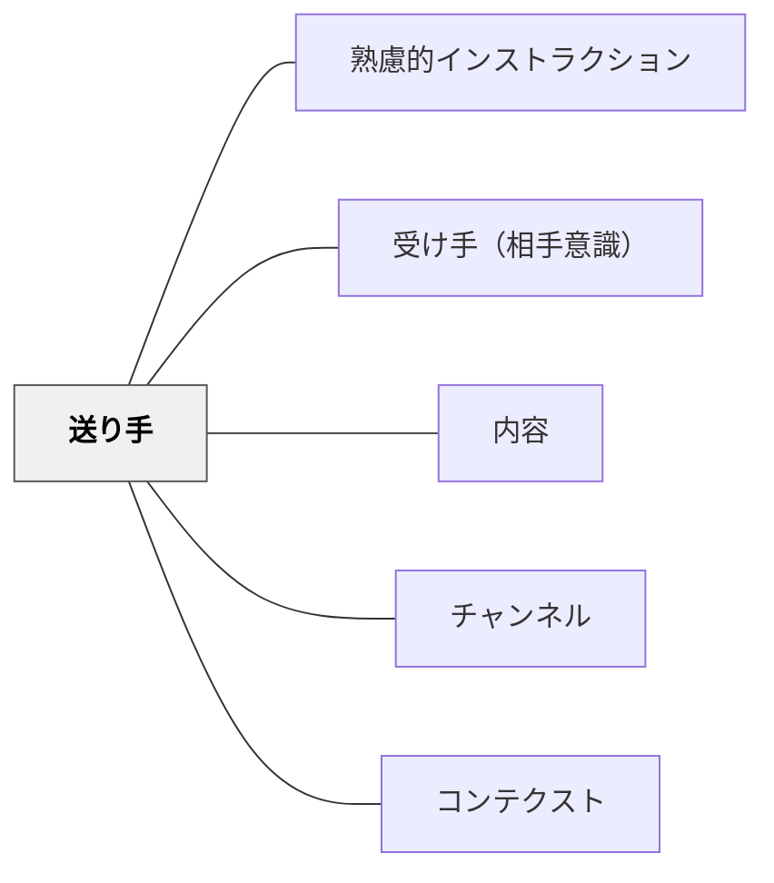

# 送り手

> インストラクションを設計する者が、システム全体の起点である。

## 背景（Context）
インストラクションは送り手・受け手・内容・チャンネル・コンテクストの5要素からなるシステムとして機能する。そのシステムの出発点に立つのが送り手である。教師・指導者・設計者など、誰かに何かをしてもらいたいと意図する人物がこの役割を担う。

## 問題（Problem）
インストラクションがうまく届かないとき、受け手や内容のせいにされがちだが、根本には送り手の設計の問題があることが多い。送り手が自分の役割を意識せずに「伝えた」だけで済ませると、受け手・内容・チャンネル・コンテクストのすべてがぎこちなくなる。

## 力のかたち（Forces）
- 送り手は意図を持って設計することができるが、意図なく発することもできる
- 受け手・内容・チャンネル・コンテクストの選択はすべて送り手の判断に委ねられている
- 一つの選択が次のステップに連鎖的に影響を与える
- 送り手自身が受け手の立場になって考える機会は少ない

## 解決（Solution）
**送り手は「伝える人」ではなく「インストラクション・システムの設計者」として自覚し、受け手・内容・チャンネル・コンテクストの四要素を意識的に選択する。**

インストラクションを発する前に、「誰に届けるのか」「何を伝えるのか」「どの手段で届けるのか」「どのような場面で届くのか」を一度立ち止まって考える。伝えた後に受け手が動けなかったとき、まず送り手自身の設計を問い直す習慣を持つ。

## 結果（Consequences）
- インストラクションの失敗が「受け手の問題」ではなく「設計の問題」として捉え直される
- 送り手の設計意識が高まることで、他の4要素（受け手・内容・チャンネル・コンテクスト）の質が向上する
- 継続的な改善サイクルが生まれる

## クラスター図

## Actionable Insight

- インストラクションを発する前に「誰に・何を・どの手段で・どの場面で」を30秒確認する——この習慣が受け手の視点から設計するマインドシフトを生む
- 「伝えたのに動けなかった」場面では受け手を問う前にまず自分の設計を問い直す——インストラクションの失敗を設計の問題として捉えることが継続的改善の出発点
- 授業後に「今日の指示で最も効果が低かったものはどれか・なぜか？」を30秒振り返る——送り手としての自己評価習慣がインストラクション設計力を着実に高める

## 出典

- 一つの教育のパタン・ランゲージ（岩井輝久）

## 関連パタン
- [[パタン/熟慮的インストラクション]] — 親パタン
- [[パタン/受け手（相手意識）]] — 送り手と対になる要素
- [[パタン/内容]] — 送り手が設計する中心要素
- [[パタン/チャンネル]] — 送り手が選択する伝達手段
- [[パタン/コンテクスト]] — 送り手が意識すべき場面・背景
