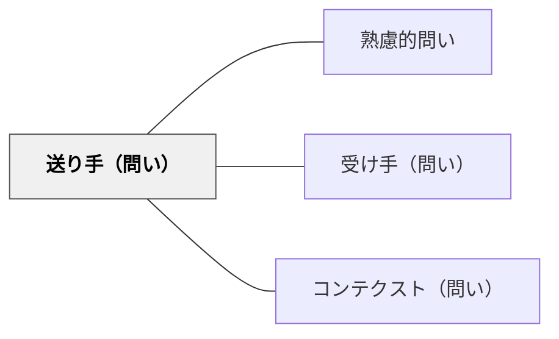

# 送り手（問い）

> 問いを設計するとき、まず「誰が、なぜ、何を意図して問うのか」を自覚せよ。

## 背景（Context）

授業や学習場面で教師・学習者は問いを発する。しかし問いを発する人が自分の立場・目的・意図を曖昧にしたまま問うと、受け手にとって意味のない、あるいは方向を見失った問いになりがちである。問いを設計する主体の自覚が、問いの質を根本から左右する。

## 問題（Problem）

問いを発する人（送り手）が自分の意図・目的・立場を十分に意識していないと、問いは漠然とし、受け手にとっても自分にとっても有益な学びにつながらない。「なんとなく聞く」問いは、探究の火を灯すどころか消してしまう。

## 力のかたち（Forces）

- 教師は授業の流れを優先するあまり、自分が「何のために問うのか」を問い直す余裕を失いがちである。
- 学習者が問いを作る場面では、「良い問いとは何か」の規範がなく、形式的な問いに終わりやすい。
- 問いの意図が明確なほど、受け手の思考は深まりやすい。

## 解決（Solution）

問いを設計する前に、送り手としての自分を問い直す。「私はなぜこれを問うのか」「この問いによって相手にどう考えてほしいのか」「この問いは自分の誠実な疑問から来ているか」を確認してから問いの言葉を選ぶ。意図を言語化した問いは、受け手の思考を引き出す力を持つ。

## 結果（Consequences）

送り手の意図が明確になると、問いの言葉が研ぎ澄まされ、受け手の探究を真に促す問いになる。ただし、意図を強くしすぎると誘導的な問いになる危険もあるため、開かれた問いの形式と組み合わせることが重要である。

## 関連パタン
- [[パタン/熟慮的問い]] — 親パタン
- [[パタン/受け手（問い）]] — 対になるパタン
- [[パタン/コンテクスト（問い）]] — 問う状況・目的の整理

## クラスター図

## Actionable Insight

- 問いを発する前に「私はなぜこの問いを立てるか？」を心の中で1文言語化する——意図が明確になった問いは受け手の思考を深く引き出す力を持つ
- 「この問いを聞いた学習者はどう考えるか？」を想像してから問いの言葉を選ぶ——受け手の視点からの逆算が誘導的でない開かれた問いを生む
- 自分の授業記録を振り返り「意図なく問いかけた場面」を1つ探して言語化する——無意識の問いかけパターンの自覚が問いの設計力の向上につながる

## 出典
- [[文献/熟慮的問いのパターンリスト（動画記録）]]
