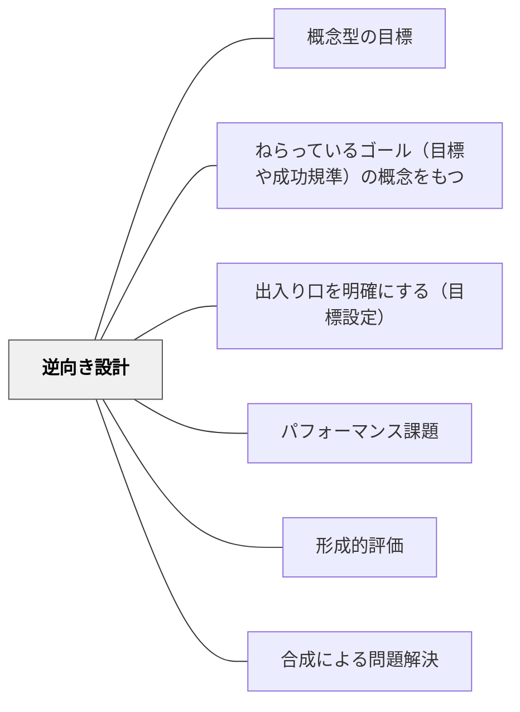

# 逆向き設計

> 「先に『何を』達成したいかを宣言し、そこから評価・活動・教材を逆算して単元を組み立てる。」

## Pattern Connection

### Milewski（2023）——Category Theory for Programmers Ch.11: Declarative Programming

Milewskiは圏論が「宣言的（declarative）アプローチを促進する」と論じる。宣言的とは「初期状態と最終状態を宣言し、その間の経路は自然に決まる」という思考様式。対照的に命令的（imperative）とは「手順をステップで指定する」やり方だ。

> 「圏論はプログラムについて宣言的なレベルで推論するためのメタ言語を提供する。また問題仕様を検討してからコードにすることを促す」——Milewski, Ch.11

フェルマーの最小時間の原理（光は最短経路をとる）が典型例だ。光は「どの経路を進むか」を命令的に計算しない——「この媒質ではこの時間で到達する」という性質を満たす経路が自然に生まれる。

逆向き設計はこの宣言的アプローチの教育版である。「単元の終わりに見たい姿（最終状態）」を先に宣言することで、そこへ向かう活動・評価・教材が逆算的に決まる。

- **既存パタンとの関連**：[[パタン/概念型の目標]] の「概念的理解を中心に置く」は逆向き設計の「宣言」の内容を豊かにする。[[パタン/パフォーマンス課題]] は「最終状態を証明する証拠」として機能する。
- **補強された点**：Milewskiにより、逆向き設計の「ゴール先行」という直感に、宣言的vs命令的という哲学的対比が与えられた。「活動から設計する」ことの何が問題かが明確になる。
- **他のパタンへの波及**：[[パタン/合成による問題解決]] の「射の逆算設計」と構造的に同型——逆向き設計は圏論的合成の教育実践版。

---

## 背景（Context）

単元や授業を作るとき、教材や活動から出発すると「何をしたか」は豊かになる一方で、「何ができるようになったか」が曖昧になりやすい。

教師が「あの教材が面白い」「この活動を子どもたちはきっと喜ぶ」から出発して設計を始めると、活動は充実するがゴールへの到達が不確かになる。これは命令的アプローチの典型——手順から始め、目的地は後で確認するやり方だ。

Wiggins & McTighe（2005）は「Understanding by Design」でこの問題を指摘し、ゴール（望ましい結果）→証拠（評価の証拠）→体験（学習活動）の3段階設計を提案した。

## 問題（Problem）

楽しい活動を並べても、最後に見取りたい理解・技能・価値がはっきりしていないと、評価と活動がずれる。子どもも「どこに向かっているのか」が見えにくい。「活動の達成（やりきった）」と「学習の達成（理解した・できた）」が混同される。

## 力のかたち（Forces）

- ゴールが曖昧なまま活動を設計すると、活動が目的に変わり、評価が後づけになる
- 「最後に見たい姿」を先に書くことは認知的に難しい——慣れていないと実感がわかない
- 宣言的設計（ゴール先行）は、設計の段階で「何を評価するか」が決まるため、評価の負担が下がる
- 逆算の途中で「この活動は本当に必要か」という問いが生まれ、活動の精選が促される
- 宣言したゴールが高すぎると途中の射（活動）を設計できない（ZPD・合成の型不一致）

## 解決（Solution）

**単元の終わりに見たい姿・評価の証拠・成功規準を先に置き、そこから必要な活動・問い・教材を逆算して並べる。**

設計の3段階（Wiggins & McTighe の3段階設計を圏論的に再記述）：

**段階1：望ましい最終状態の宣言（ゴール）**
「単元の最後に、子どもはどんな問いに答えられるか・何を作れるか・何を判断できるか」を一文で書く。これが合成の終点（C）であり、逆向き設計の出発点。

**段階2：評価の証拠の設計（ゴールを証明する射の終点を確認）**
最終状態を「証明」する成果物・発言・パフォーマンスを決める。パフォーマンス課題・振り返り・質問への応答など。「この証拠があれば最終状態に到達したと言える」という基準を明確にする。

**段階3：学習活動の逆算設計（射の連鎖の構築）**
段階2の証拠を生み出すために必要な活動・問い・教材を逆算で設計する。各活動の「出口（到達状態）」が次の活動の「入口（前提）」と噛み合うように合成する（[[パタン/合成による問題解決]]）。

---

**実践例1：算数・分数の単元**

- 段階1: 「分数は『量の等分』と『数直線上の位置』の両方で説明できる」ことを子どもが示せる
- 段階2: 「1/3ってどういう意味？」という問いに図と言葉で答えさせる課題
- 段階3: 折り紙で等分→色テープで測定→数直線に位置を置く（逆算で設計した活動の連鎖）

---

**実践例2：国語・説明文の単元**

- 段階1: 「文章の構造（問い-答え-例）を指摘し、それを自分の文章作成に活かせる」
- 段階2: 説明文を読んで構造を図解し、自分で説明文を一段落書く
- 段階3: 逆算して「文章を読みながら構造を書き込む読み方」「例の役割を議論する活動」を設計

## 結果（Consequences）

- 活動と評価のずれが減る——ゴールが先に決まっているため、評価は後づけにならない
- 学習者にゴールと成功規準を示しやすくなる——「なぜこの活動をするのか」が説明できる
- 授業後の改善が「活動の好み」ではなく「到達した姿」から検討できる
- 「この活動は本当に必要か」という問いが自然に生まれ、授業が精選される
- 逆算の過程でZPDの見積もり（段階の適切さ）が浮き彫りになる

## 関連パタン

- [[パタン/概念型の目標]] — 段階1の「宣言」を豊かにする。何を理解したと言えるかの基準
- [[パタン/ねらっているゴール（目標や成功規準）の概念をもつ]] — 成功規準の内面化
- [[パタン/出入り口を明確にする（目標設定）]] — 単元だけでなく毎授業への逆向き設計の適用
- [[パタン/パフォーマンス課題]] — 段階2の評価証拠として機能するパタン
- [[パタン/形成的評価]] — 逆向き設計の中に組み込む中間チェック
- [[パタン/合成による問題解決]] — 逆向き設計の「逆算による射の連鎖設計」を構造化する
- [[概念/圏論と教育]] — 宣言的アプローチの数学的基盤
- [[文献/Category Theory for Programmers（Milewski）]] — 宣言的vs命令的の哲学的背景

## クラスター図

## Actionable Insight

- 単元を作る前に「最後に子どもが何を説明・作成・判断できればよいか」を一文で書く——これが段階1の宣言
- その一文を証明する成果物や発言を決めてから、授業の活動を選ぶ——命令的に活動から始めない
- 設計済みの単元を見直して「この活動は最終状態に向かう射として機能しているか」を確認する
- 「なぜこの活動をするのか」を子どもに説明できるか試す——説明できないなら設計を見直す合図

## 出典

Wiggins, G., & McTighe, J. (2005). *Understanding by Design* (2nd ed.). ASCD.

Milewski, B. (2023). *Category Theory for Programmers* (I. Tabachnik, Ed.). CC BY-SA 4.0. (Ch. 11: Declarative Programming)

[[文献/Category Theory for Programmers（Milewski）]]
