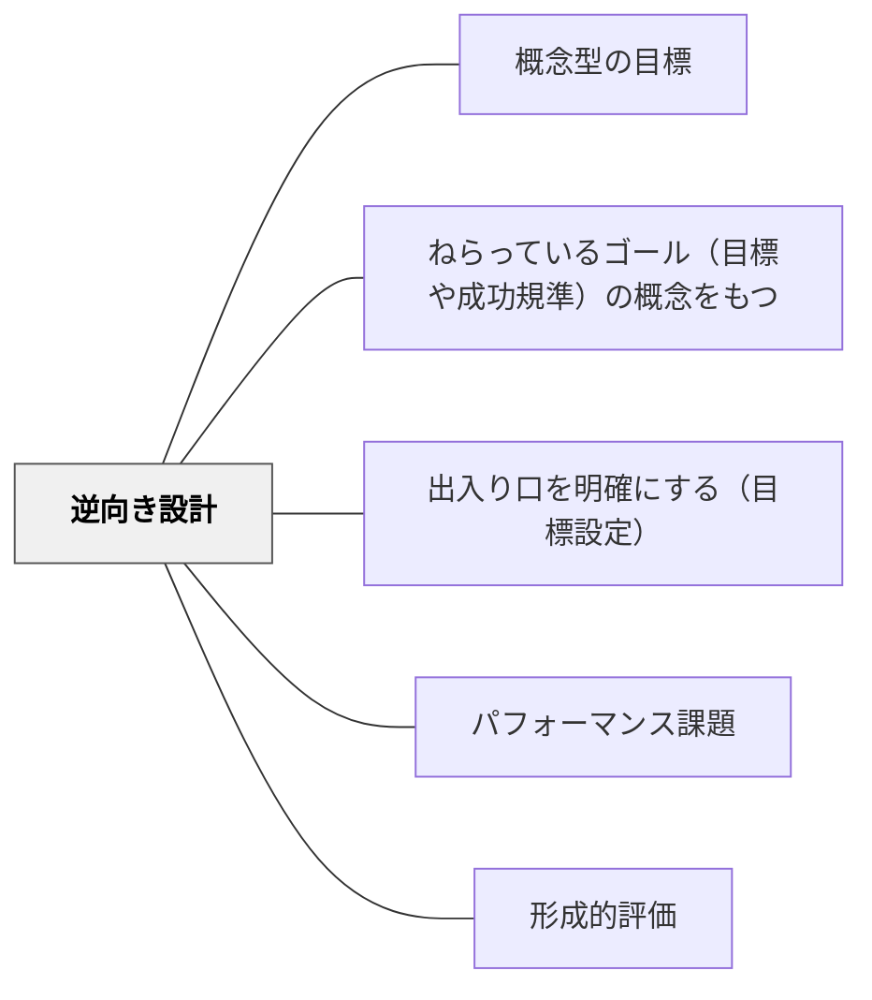

# 逆向き設計

> 先に「何ができればよいか」を決め、そこから評価・活動・教材を逆算して単元を組み立てる。

## 背景（Context）

単元や授業を作るとき、教材や活動から出発すると「何をしたか」は豊かになる一方で、「何ができるようになったか」が曖昧になりやすい。

## 問題（Problem）

楽しい活動を並べても、最後に見取りたい理解・技能・価値がはっきりしていないと、評価と活動がずれる。子どもも「どこに向かっているのか」が見えにくい。

## 解決（Solution）

**単元の終わりに見たい姿・評価の証拠・成功規準を先に置き、そこから必要な活動・問い・教材を逆算して並べる。**

## 結果（Consequences）

- 活動と評価のずれが減る
- 学習者にゴールと成功規準を示しやすくなる
- 授業後の改善が「活動の好み」ではなく「到達した姿」から検討できる

## クラスター図

## Actionable Insight

- 単元を作る前に「最後に子どもが何を説明・作成・判断できればよいか」を一文で書く
- その一文を証明する成果物や発言を決めてから、授業の活動を選ぶ

## 関連パタン

- [[パタン/概念型の目標]]
- [[パタン/ねらっているゴール（目標や成功規準）の概念をもつ]]
- [[パタン/出入り口を明確にする（目標設定）]]
- [[パタン/パフォーマンス課題]]
- [[パタン/形成的評価]]
