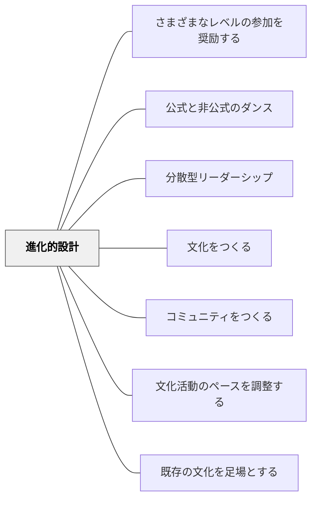

# 進化的設計

> 実践コミュニティは有機的だ。設計することは、コミュニティを無から作り上げるというよりは、むしろ発展を導くことの方に近い。— ウェンガー（p.95）

## 背景（Context）

学校文化を変えようとするとき、「完璧なシステムを設計してから実施する」という誘惑がある。しかし実践コミュニティは生き物であり、設計通りには動かない。むしろ、小さく始めて反応を見ながら育てていく有機的なアプローチが有効である。

## 問題（Problem）

過剰に詳細な計画は、実際の反応（学習者・教員・保護者）を無視したまま進むリスクがある。計画が精緻になるほど、修正が難しくなる。

## 力のかたち（Forces）

- コミュニティは設計できないが、その発展を促す触媒は設計できる
- 「設計が少ない」ほど、参加者が主体的に関与しやすくなる
- 早すぎる複雑化（ウェブサイト・議事録・組織図）は形式が先行し内容が空洞化する

## 解決（Solution）

**「設計は少なく、実行は十分に」。最小の構造から始め、有機体のように反応を観察しながら段階的に育てる。**

ウェンガーの指針：
- 最初はシンプルに（例：週1回の定例会合。ウェブサイトも議録も最初はなし）
- 複数のアプローチを試し、うまくいったものを育てる
- 設計要素はコミュニティの自然な発展を促す**触媒**でなければならない
- 参加者の反応を観察し、介入のタイミングを見極める

学校での実践例：係活動の自然発生的な組織化、クラス会議の段階的な導入

## 結果（Consequences）

- コミュニティが外から押し付けられたものでなく「私たちが育てたもの」になる
- 参加者の主体的な関与が増し、持続性が高まる
- 「うまくいかなかった」試みが、次の設計のための情報になる

## 関連パタン
- [[パタン/さまざまなレベルの参加を奨励する]]
- [[パタン/公式と非公式のダンス]]
- [[パタン/分散型リーダーシップ]]

- [[パタン/文化をつくる]] — 親パタン
- [[パタン/コミュニティをつくる]] — 有機的に育てるコミュニティ
- [[パタン/文化活動のペースを調整する]] — 変化には時間がかかるという前提
- [[パタン/既存の文化を足場とする]] — 既存の構造を触媒として使う

## クラスター図

## Actionable Insight

- 新しい取り組みを「まず1回試す・反応を見る・調整する」の順で進める——詳細な計画より早い実験サイクルがコミュニティを育てる
- 最初は「週1回の定例会合だけ」から始める——ウェブサイトも議録も最初はいらない。シンプルに始めることが有機的な発展の第一歩
- 「うまくいかなかった試み」を問題にせず記録する——失敗が次の設計への情報になる

## 出典

- エティエンヌ・ウェンガー他（2002）『コミュニティ・オブ・プラクティス』翔泳社、第3章
- 動画記録：[[文献/コミュニティオブプラクティスと文化をつくるパタン（動画記録）]]
