# 進歩の傾きを見る（水準ではなく変化率）

> 点数は「今どこにいるか」しか教えない。同じ物差しの短い課題を繰り返し、伸びの角度を見る。平均点でも角度の寝ている子がいて、低得点でも角度の立っている子がいる。

## [Pattern Connection]

このWikiの評価パタンは、これまでほぼ**一時点の情報**を扱ってきた。[[パタン/形成的評価]] は「授業の途中で見取る」ことを言い、[[パタン/到達レベルの自己評価]] は「今どの水準にいるか」を問い、[[パタン/最適なギャップ（願望水準の交渉）]] は「目標と現在地の距離」を扱う。どれも**距離**の話であって、**速度**の話ではない。

本パタンが持ち込むのは、その微分にあたる量である。カリキュラム基盤測定（CBM）の中心的主張は、**学習成功の勾配（gradient）が鍵となる指標である**（p.44）というものだった。Shinn & Hubbard（1992）の対比表はこれを評価パラダイムの違いとして定式化している——現行のパラダイムは「生徒のパフォーマンスの**水準（level）**」を問うが、問題解決パラダイムは「**水準と進歩の傾き（slope）**」を問う（p.60）。

接続の要点は三つ。

第一に、**既存の [[パタン/自己記録]] とは主体も目的も違う**。この区別を曖昧にすると、本パタンは「グラフをつけさせるパタン」に潰れてしまう。詳しくは背景で述べるが、要点だけ先に置く——[[パタン/自己記録]] は**学習者が、自分の動機を維持するために**記録するもの。本パタンは**教師が、指導の意思決定のために**変化率を追うものである。可視化の相手も目的も異なり、両者を同じグラフで兼ねようとしたときに最大の失敗が起きる。

第二に、[[パタン/見取ったあとの手を決めておく（データ利用のルール化）]] と対をなす。Fuchs & Fuchs（1986）の同じメタ分析から取り出された二つの変数——**グラフ化した研究は0.70、しなかった研究は0.26**。「何を見るか」（本パタン）と「見たあと何をするか」（対のパタン）が揃って初めて効果が最大になる。片方だけでは、きれいなグラフか、根拠のないルールのどちらかになる。

第三に、Shinn & Hubbard の対比表がもたらすのは**問題の所在の移動**である。現行パラダイムは「病因に寄与する**生徒の特性**」を同定するが、問題解決パラダイムは「解決に寄与する**カリキュラム・指導・文脈**の要因」を同定する。角度が寝ていることは、その子の特性の記述ではなく、**いま与えている手立ての効き方の記述**である。この読み替えが、本パタンを [[パタン/帰属志向性]] や [[パタン/成長マインドセット]] と接続させる。

## 背景（Context）

日本の小学校の教師が持っている記録は、ほとんどが**水準の記録**である。単元テストの点数。漢字50問テストの点数。通知表の観点別評価。どれも「その時点でどこにいるか」を表す。

この記録の使い方も決まっている。学期末に平均を出し、順位のようなものが暗黙に見え、低い子には補充を、高い子には発展を用意する。判断は毎回「今の点数」に対して下される。

ところが単元テストの点数は、単元ごとに内容も難度も違う。「割合」の85点と「図形」の60点を並べても、伸びたのか落ちたのかは言えない。**物差しが毎回変わっているから、変化を読めない**。だから教師は、変化ではなく水準だけを見ることになる。

CBM（curriculum-based measurement, カリキュラム基盤測定）が行ったのは、この物差しを固定することだった。同じ形式・同じ難度の**短い課題を頻繁に繰り返す**。一回の得点の精度は落ちるが、点が並べば線が引ける。線が引ければ角度が読める。

Black & Wiliam（1998）はその中心的特徴をこう記述している——評価を頻繁に行って学習の軌跡を追跡できるようにすることであり、「**学習成功の勾配が鍵となる指標**」とされる（p.44）。

### [[パタン/自己記録]] との違い

このWikiにはすでに [[パタン/自己記録]] がある。両者は「記録してグラフにする」という外形が同じなので、意図的に線を引いておく。

| | [[パタン/自己記録]] | 本パタン |
|---|---|---|
| 記録する主体 | **学習者** | **教師** |
| 目的 | **動機の維持**——進歩の実感 | **意思決定**——手立てを変えるかの判断 |
| 見るもの | 積み上がった量（読んだ冊数・練習時間） | 同じ物差しの上での**変化率** |
| 物差し | 続けやすさが優先。形式は自由 | **同型・同難度でなければ意味がない** |
| 見せる相手 | 本人（見えることが効果の中心） | 教師（本人に見せるかは別途の判断） |
| 失敗モード | 記録が煩雑で続かない | グラフが見世物になり自我関与を招く |

同じ紙で両方をやろうとしたときに、最大の失敗が起きる。教師が意思決定のために描いたグラフを教室に掲示した瞬間、それは順位表になる。逆に、動機づけのために子どもが自由な形式でつけた記録は、物差しが揃っていないので傾きを読めない。**目的が違うので、紙も分ける。**

## 問題（Problem）

**点数（水準）だけを見ていると、二種類の子どもを取り違える。**

一人目は、**平均点だが伸びていない子**である。毎回70点前後を取る。学級の真ん中にいる。誰も心配しない。しかし三か月前も70点だった。この子には手が入らない。点数が平均だからである。

二人目は、**低得点だが伸びている子**である。40点だったのが45点になり、50点になった。それでもクラスで下から数えたほうが早い。だから「まだできていない」と判断され、いま効いている手立てが**取り上げられて別のものに差し替えられる**。角度が立っていることは、点数を見ている限り見えない。

この二つの取り違えは、どちらも同じ原因から出ている。**一時点の情報からは、いま与えている手立てが効いているかどうかが原理的に読めない**からである。効き方は変化率に現れるのであって、水準には現れない。

Shinn & Hubbard（1992）の対比表（p.60）は、これを評価パラダイムの問題として整理する。とくに三点が重い。

- **問題の所在**——現行パラダイムは「病因に寄与する**生徒の特性**」を同定する。問題解決パラダイムは「解決に寄与する**カリキュラム・指導・文脈**の要因」を同定する
- **焦点**——「問題を正確に同定するか」から「**解決を正確に同定するか**」へ
- **信頼性**——「得点は安定しているか」から「**パフォーマンスの変動を説明する要因は何か**」へ

三つ目が実務的にいちばん効く。同じ子の得点が回ごとに揺れるとき、水準のパラダイムはそれを**測定誤差**として処理する。傾きのパラダイムはそれを**情報**として読む——どの回で落ちたか、その週に何があったか。**変動は消すものではなく、読むものになる。**

さらに目標の側にも問題がある。Fuchs（1993）によれば、目標は**野心的であるほど**生徒はより高い水準に達する。そして測定された進捗に照らして**上方修正される動的目標**は、固定した静的目標よりよい達成につながる。年度当初に決めて動かさない目標は、それ自体が伸びを抑えている。

## 力のかたち（Forces）

- **物差しの固定 vs カリキュラムの進行**：傾きを読むには同型の課題が要る。しかし授業は毎週違う内容を扱う。**測る対象を、進度と独立な基礎スキルに限定する**しかない
- **測定の頻度 vs 授業時間**：頻繁に測るほど線は信頼できるが、測るたびに授業が削られる。**2分**という上限が現実的な妥協点になる
- **一回の精度 vs 系列の精度**：短い課題の一回の得点は誤差が大きい。しかし点が10個並べば線は安定する。**一点を正確に測るより、粗い点をたくさん並べるほうが判断に使える**
- **可視化の力 vs 可視化の危険**：グラフは効果量を0.26から0.70へ上げる。同じグラフが、掲示された瞬間に順位表になる
- **測れるものの偏り**：音読の速さ、漢字の想起、計算の流暢性は測りやすい。読解の深さ、考えの筋道、表現の質は同じ形では測れない。測るものが自動的に**重視されるもの**になる圧力が働く
- **目標の固定 vs 上方修正**：固定した目標は運用が楽で、説明もしやすい。しかし達成に照らして上げないと、伸びを抑える。上げれば「達成できない目標」を掲げることになる
- **教師の記録負担**：一人ひとりのグラフを維持することは、学級規模ではそれ自体が仕事になる。全員分は続かない

## 解決（Solution）

**同じ物差しの短い課題を、決まった間隔で繰り返す。点数そのものではなく、点を並べた線の角度を見る。角度が寝ている子には手立てを変え、角度が立っている子には今の手立てを続ける。目標は固定せず、達成に照らして上方修正する。**

実装の要点は四つ。

1. **物差しを固定する**——毎回、形式も難度も同型の課題にする。内容は単元と独立に。日本の実務では**音読・漢字・計算**がこれに当たる
2. **短く、頻繁に**——1回**2分**、**週1回**。長くすると続かない。1回の精度は捨てる
3. **点を並べて線を見る**——4〜6点たまったところで角度を読む。1点や2点では判断しない
4. **目標を上方修正する**——決めた目標に到達したら、その時点で線を引き直して上へ伸ばす（Fuchs, 1993）

そして最も重要なこと——**このグラフは教師の意思決定のための道具であり、既定では子どもに見せない**。見せる場合は、後述の条件を満たしてからにする。

---

### 具体例1：計算の流暢性——週1回・2分・同じ形式

三年生。金曜日の朝の2分間、同じ形式の計算問題を20問並べたプリントをやる。内容は固定する（かけ算九九の混合）。単元が何であっても変えない。採点は「解けた数」だけ。誤答の分析はしない（それは別の時間の仕事である）。

教師の手元に、児童名と週番号のマス目の表を一枚置く。数字を書き込むだけ。グラフは月に一度、教師がまとめて折れ線に起こす。

6週たまったところで見る。読むのは三つだけ。

- **角度が立っている**（右上がり）→ 今の手立てを続ける。触らない
- **角度が寝ている**（横ばい）→ 手立てを変える。ここで [[パタン/見取ったあとの手を決めておく（データ利用のルール化）]] の手立ての欄が効く
- **角度が下がっている** → 内容ではなく別の要因を疑う（疲労・座席・体調・家庭の変化）。数字ではなく本人を見る

このとき見落としてはならないのが、**平均点で横ばいの子**である。20問中12問を6週間ずっと続けている子は、点数の一覧では真ん中にいて目立たない。線にすると一目でわかる。

---

### 具体例2：音読——秒数ではなく、同じ文章を月に一度

音読は日本の小学校で最もよく行われている家庭学習だが、傾きの記録にはほとんど使われていない。理由は単純で、**毎回違う文章を読んでいる**からである。教材が変われば物差しが変わる。

そこで、教材とは別に**「定点の文章」を一つ決める**。学年に対して少しやさしめの、単元と関係のない300字程度の文章。これを**月に一度だけ**読ませ、1分間で読めた文字数を記録する。教材の音読は従来どおり続ける。

年に9回の点が並ぶ。ここで読むのは速さそのものではない。**上がり方**である。上がっている子は、読みの自動化が進んでいる。横ばいの子は、教材の音読を毎日やっていても自動化が進んでいない可能性がある——このとき疑うべきは練習量ではなく、**そもそも読めていない文字がある**ことである。

---

### 具体例3：特別支援学級——傾きは、水準では見えないものを見せる

特別支援学級の実務で、水準の記録は往々にして残酷である。学年の基準に照らせば、記録はいつも「達していない」を繰り返す。個別の指導計画に書かれた目標は、学期末に「一部達成」と書かれ続ける。

傾きの記録はここで別の像を出す。**A児**——ひらがなの正しく書ける文字数を、隔週で同じ50字の表から測る。第1回は12字、第3回は14字、第5回は15字、第7回は19字。学年の基準では依然として大きく下にある。しかし**線は明確に立っている**。この線が示すのは「A児は遅れている」ではなく「**いま行っている手立ては効いている**」である。

判断が変わる。水準だけを見ていれば「別の方法を試すべきだ」となる場面で、傾きを見れば「続ける」になる。逆に、水準は学年相応でも三か月横ばいなら、学年相応であること自体が手を打たない理由にはならなくなる。

これは Shinn & Hubbard の言う**問題の所在の移動**そのものである。記録が語るのは子どもの特性ではなく、手立ての効き方である。

---

### 具体例4：目標を上方修正する

年度当初、B児の目標を「2分間で計算15問」と置いた。11月に15問に届いた。ここで多くの場合、目標は達成済みとして据え置かれる。

Fuchs（1993）の知見はこの据え置きを否定する。**達成に照らして上方修正される動的目標は、固定した静的目標よりよい結果につながる。** 15問に届いた時点で、線を18問へ引き直す。そして「もう届いたから」ではなく「**ここまで来たから、次はここ**」と本人に伝える。

野心的な目標のほうが高い水準に達するという知見も同じ方向を指す。ただし [[パタン/最適なギャップ（願望水準の交渉）]] の警告が同時に効く——期待の上昇速度が改善の速度を上回り続けると、達成感が得られずギャップが自己強化的に広がる。**上方修正は、達成が観測されたときにだけ行う**。予定として先に引かない。

---

### 具体例5：自己教育での適用——独学こそ傾きが読める

大人が独学するとき、評点をつける他者はいない。しかし独学者は自分に対して「今日は解けた／解けなかった」という評点をつけている。この自己採点は水準の記録であり、日ごとに揺れるので、続けているのに伸びていないように感じられる原因になる。

傾きの記録は独学でこそ実行しやすい。物差しを自分で固定できるからである。数学の学習であれば、**月に一度、同じ性質の問題を10問だけ、時間を測って解く**。内容は進んだ範囲に依存しない基礎的なもの（因数分解、微分の基本形など）に限る。日々の学習記録とは別のノートに、点だけを並べる。

ここでも自己記録との区別は保つ。日々の「今日は何をやったか」の記録は動機の維持のためのもの。月一度の定点測定は、**学習の進め方そのものを変えるかどうかの判断材料**である。後者が横ばいなら、量を増やすのではなく、やり方を変える信号になる。

## 結果（Consequences）

**利点**

- **効果量が0.26から0.70へ**——Fuchs & Fuchs（1986）で、個々の子どもの進捗のグラフを行動の指針として作成した研究は0.70、しなかった研究は0.26だった。測定を増やすことではなく、**軌跡を描くこと**が効いている
- **平均点の子の停滞が見える**——水準の記録では最も見落とされる層である。線にすると一目でわかる
- **効いている手立てを取り上げなくなる**——低得点でも角度が立っている子に対して、「まだできていないから別の方法を」という判断が起きなくなる
- **問題の所在が子どもから手立てへ移る**——記録が語るのは特性ではなく効き方である。これは [[パタン/帰属志向性]]（内的・不安定・特定的な要因への帰属）を、教師の側の見立てにも適用することにあたる
- **特別支援で、達成の像が変わる**——学年の基準に照らして「達していない」を繰り返す記録に代わって、「動いている」を示せる記録が持てる
- **変動が情報になる**——得点の揺れを測定誤差として捨てず、「その週に何があったか」を問う材料にできる

**注意点・リスク**

- **グラフが子どもへの見世物になり、自我関与を招く**——これが最大のリスクである。教室に掲示した瞬間、折れ線は順位表になる。角度の寝ている子は、自分の停滞を毎日全員の前で見ることになる。**掲示しない。競争にしない**（competition にしない）。本人に見せる場合も、**他者の線と並べない**——見せるのは自分の線一本だけであり、比較の対象は過去の自分だけである。この条件を守れないなら、グラフは教師の手元に留める
- **測れるものだけが重視されるようになる**——音読の速さ・漢字の想起・計算の流暢性は測りやすい。読解の深さ、考えの筋道、話し合いへの参加の質は、同じ形では測れない。傾きの記録を始めると、**測れるものが指導の中心にせり出してくる圧力**が必ずかかる。対抗策は、記録の対象を意図的に**基礎スキルだけに限定し、それが学習の全体ではないと明示しておく**ことである
- **基礎スキル以外への一般化の限界**——CBM が扱ってきたのは読みの流暢性・計算の流暢性といった、自動化が学習の内実である領域である。概念の理解や表現の質は、同型の短い課題を繰り返しても軌跡にならない。**この領域には [[パタン/理解のしるしを読む（fit と match）]] のような別の見取りが要る**。傾きの記録を万能の見取りとして扱わない
- **物差しが揃っていなければ何も読めない**——毎回違う難度の課題を並べたグラフは、傾きではなく難度の変動を表示している。同型でない記録は、無いほうがましである
- **記録の負担で続かない**——全員分のグラフを毎週手で描くと続かない。数字はマス目の表に書き込むだけにし、**折れ線に起こすのは月一度・気になる子だけ**でよい
- **傾きだけを見ると水準を見落とす**——Shinn & Hubbard の対比表は「水準ではなく傾き」ではなく「**水準と傾き**」を問うと書いている。角度が立っていても、卒業までに必要な水準に届かない見込みなら、それも判断材料である。両方見る
- **上方修正が圧力に変わる**——目標を上げ続けることは、[[パタン/最適なギャップ（願望水準の交渉）]] の言う自己強化的なギャップ拡大を招きうる。**達成が観測されたときにだけ上げる**という規律で運用する

## 関連パタン

- [[パタン/自己記録]] — **最も紛らわしい隣人。区別を明記する**。あちらは学習者が自分の動機を維持するために記録するもの。本パタンは教師が意思決定のために変化率を追うもの。主体・目的・物差しの要件・見せる相手のすべてが異なり、同じ紙で兼ねようとしたときに失敗する
- [[パタン/見取ったあとの手を決めておく（データ利用のルール化）]] — 対のパタン。同じメタ分析から取り出された二変数で、「何を見るか」と「見たあと何をするか」が揃って効果が最大になる
- [[パタン/形成的評価]] — 上位。本パタンは形成的評価の見取りを、一時点の水準から時系列の変化率へ拡張したもの
- [[パタン/目標設定]] — 動的目標との接続。達成に照らして上方修正される目標は、固定した目標よりよい結果につながる（Fuchs, 1993）
- [[パタン/最適なギャップ（願望水準の交渉）]] — 上方修正の歯止め。期待の上昇が改善の速度を上回ると、ギャップは自己強化的に広がる
- [[パタン/テストを繰り返す]] — 頻繁な短い測定という実装を共有する。ただしあちらは想起練習による学習効果を、本パタンは軌跡の描出を目的とする
- [[パタン/自己テスト]] — 学習者自身が定点測定を行う形。自己教育での適用はこの形をとる
- [[パタン/帰属志向性]] — 傾きの記録は、停滞を「能力」ではなく「いまの手立て」に帰属させる材料になる
- [[パタン/成長マインドセット]] — 変化率を主役に据えることは、能力を固定的でなく漸増的に見る立場を記録の形式で実装したものにあたる
- [[パタン/理解のしるしを読む（fit と match）]] — 補完関係。基礎スキル以外の領域では傾きは描けず、こちらの質的な見取りが要る
- [[パタン/評点なしで返す（コメントだけの一巡）]] — 評点を外した後に教師が何を見るかの受け皿。本人に数字を渡す必要がある場合も、学級内の位置ではなく自分の変化を表す数字にする
- [[パタン/省察的評価]] — 描いた線を読んで指導を振り返る工程
- [[パタン/学習計画の自己設定]] — 傾きを学習者自身が読めるようになったときの発展形。自分の線を見て次の計画を立てる
- [[パタン/段階的手放し]] — 物差しの管理を教師から学習者へ移す道筋
- [[概念/自我関与と課題関与（フィードバックが向ける先）]] — 掲示の危険を説明する枠組み。グラフを並べた瞬間、注意は課題から「自分は何番目か」へ移る
- [[文献/Assessment and Classroom Learning（Black & Wiliam）]] — CBM の勾配指標と Shinn & Hubbard の対比表を含む出典レビュー

- [[パタン/学習のための評価（A4L）]] — A4L の「今どこにいるか」を、点ではなく軌跡として与える

- [[パタン/到達レベルの自己評価]] — 「今どの水準か」を子どもが判定する営みに、「どの角度で動いているか」を重ねる
## クラスター図

```mermaid
flowchart LR
    ne980b2e6ada9e381aee582bee3818de38292e8a68be3828befbc88e6b0b4e6ba96e381a7e381afe381aae3818fe5a489e58c96e78e87efbc89["進歩の傾きを見る（水準ではなく変化率）"]
    ne887aae5b7b1e8a898e98cb2["自己記録"]
    ne8a68be58f96e381a3e3819fe38182e381a8e381aee6898be38292e6b1bae38281e381a6e3818ae3818fefbc88e38387e383bce382bfe588a9e794a8e381aee383abe383bce383abe58c96efbc89["見取ったあとの手を決めておく（データ利用のルール化）"]
    ne5bda2e68890e79a84e8a995e4bea1["形成的評価"]
    ne79baee6a899e8a8ade5ae9a["目標設定"]
    ne69c80e981a9e381aae382aee383a3e38383e38397efbc88e9a198e69c9be6b0b4e6ba96e381aee4baa4e6b889efbc89["最適なギャップ（願望水準の交渉）"]
    ne38386e382b9e38388e38292e7b9b0e3828ae8bf94e38199["テストを繰り返す"]
    ne887aae5b7b1e38386e382b9e38388["自己テスト"]
    ne5b8b0e5b19ee5bf97e59091e680a7["帰属志向性"]
    ne68890e995b7e3839ee382a4e383b3e38389e382bbe38383e38388["成長マインドセット"]
    ne79086e8a7a3e381aee38197e3828be38197e38292e8aaade38280efbc8866697420e381a8206d61746368efbc89["理解のしるしを読む（fit と match）"]
    ne8a995e782b9e381aae38197e381a7e8bf94e38199efbc88e382b3e383a1e383b3e38388e381a0e38191e381aee4b880e5b7a1efbc89["評点なしで返す（コメントだけの一巡）"]
    ne79c81e5af9fe79a84e8a995e4bea1["省察的評価"]
    ne5ada6e7bf92e8a888e794bbe381aee887aae5b7b1e8a8ade5ae9a["学習計画の自己設定"]
    ne6aeb5e99a8ee79a84e6898be694bee38197["段階的手放し"]

    ne980b2e6ada9e381aee582bee3818de38292e8a68be3828befbc88e6b0b4e6ba96e381a7e381afe381aae3818fe5a489e58c96e78e87efbc89 --- ne887aae5b7b1e8a898e98cb2
    ne980b2e6ada9e381aee582bee3818de38292e8a68be3828befbc88e6b0b4e6ba96e381a7e381afe381aae3818fe5a489e58c96e78e87efbc89 --- ne8a68be58f96e381a3e3819fe38182e381a8e381aee6898be38292e6b1bae38281e381a6e3818ae3818fefbc88e38387e383bce382bfe588a9e794a8e381aee383abe383bce383abe58c96efbc89
    ne980b2e6ada9e381aee582bee3818de38292e8a68be3828befbc88e6b0b4e6ba96e381a7e381afe381aae3818fe5a489e58c96e78e87efbc89 --- ne5bda2e68890e79a84e8a995e4bea1
    ne980b2e6ada9e381aee582bee3818de38292e8a68be3828befbc88e6b0b4e6ba96e381a7e381afe381aae3818fe5a489e58c96e78e87efbc89 --- ne79baee6a899e8a8ade5ae9a
    ne980b2e6ada9e381aee582bee3818de38292e8a68be3828befbc88e6b0b4e6ba96e381a7e381afe381aae3818fe5a489e58c96e78e87efbc89 --- ne69c80e981a9e381aae382aee383a3e38383e38397efbc88e9a198e69c9be6b0b4e6ba96e381aee4baa4e6b889efbc89
    ne980b2e6ada9e381aee582bee3818de38292e8a68be3828befbc88e6b0b4e6ba96e381a7e381afe381aae3818fe5a489e58c96e78e87efbc89 --- ne38386e382b9e38388e38292e7b9b0e3828ae8bf94e38199
    ne980b2e6ada9e381aee582bee3818de38292e8a68be3828befbc88e6b0b4e6ba96e381a7e381afe381aae3818fe5a489e58c96e78e87efbc89 --- ne887aae5b7b1e38386e382b9e38388
    ne980b2e6ada9e381aee582bee3818de38292e8a68be3828befbc88e6b0b4e6ba96e381a7e381afe381aae3818fe5a489e58c96e78e87efbc89 --- ne5b8b0e5b19ee5bf97e59091e680a7
    ne980b2e6ada9e381aee582bee3818de38292e8a68be3828befbc88e6b0b4e6ba96e381a7e381afe381aae3818fe5a489e58c96e78e87efbc89 --- ne68890e995b7e3839ee382a4e383b3e38389e382bbe38383e38388
    ne980b2e6ada9e381aee582bee3818de38292e8a68be3828befbc88e6b0b4e6ba96e381a7e381afe381aae3818fe5a489e58c96e78e87efbc89 --- ne79086e8a7a3e381aee38197e3828be38197e38292e8aaade38280efbc8866697420e381a8206d61746368efbc89
    ne980b2e6ada9e381aee582bee3818de38292e8a68be3828befbc88e6b0b4e6ba96e381a7e381afe381aae3818fe5a489e58c96e78e87efbc89 --- ne8a995e782b9e381aae38197e381a7e8bf94e38199efbc88e382b3e383a1e383b3e38388e381a0e38191e381aee4b880e5b7a1efbc89
    ne980b2e6ada9e381aee582bee3818de38292e8a68be3828befbc88e6b0b4e6ba96e381a7e381afe381aae3818fe5a489e58c96e78e87efbc89 --- ne79c81e5af9fe79a84e8a995e4bea1
    ne980b2e6ada9e381aee582bee3818de38292e8a68be3828befbc88e6b0b4e6ba96e381a7e381afe381aae3818fe5a489e58c96e78e87efbc89 --- ne5ada6e7bf92e8a888e794bbe381aee887aae5b7b1e8a8ade5ae9a
    ne980b2e6ada9e381aee582bee3818de38292e8a68be3828befbc88e6b0b4e6ba96e381a7e381afe381aae3818fe5a489e58c96e78e87efbc89 --- ne6aeb5e99a8ee79a84e6898be694bee38197

    classDef hub fill:#f0f0f0,stroke:#555,color:#000,font-weight:bold
    class ne980b2e6ada9e381aee582bee3818de38292e8a68be3828befbc88e6b0b4e6ba96e381a7e381afe381aae3818fe5a489e58c96e78e87efbc89 hub
```

## Actionable Insight

- **来週から、金曜の朝に2分の定点課題を入れる**——形式も難度も毎回同じにする。計算20問でも、漢字20字でもよい。内容は単元と独立させる。採点は「解けた数」だけ。誤答分析はしない
- **児童名×週番号のマス目の表を一枚だけ作る**——数字を書き込むだけにして、折れ線に起こすのは月一度、気になる子だけにする。全員分を毎週描こうとすると続かない
- **6週たまったところで、平均点の子の線だけを先に見る**——最も見落とされる層である。横ばいの子を三人書き出し、その子の手立てを何に変えるかを決める
- **音読の「定点の文章」を一つ決める**——教材とは別の、単元と関係のない300字。月に一度だけ1分読ませて文字数を記録する。教材の音読は従来どおり続ける
- **目標に届いた子の目標を、その場で引き上げる**——「もう達成したから終わり」ではなく「ここまで来たから、次はここ」。ただし予定として先に引かず、達成が観測された時点でだけ上げる
- **グラフを教室に掲示しない**——本人に見せる場合も、他の子の線と並べない。見せるのは自分の線一本だけにする。比較の対象は過去の自分だけだと、言葉でも伝える
- **記録の対象を基礎スキルに限定すると宣言しておく**——自分にも子どもにも、「これは学習の全部ではなく、自動化が進んでいるかだけを見ている」と明示する。測れるものが指導の中心にせり出す圧力への歯止めになる

## 出典

Black, P., & Wiliam, D. (1998). Assessment and classroom learning. *Assessment in Education: Principles, Policy & Practice, 5*(1), 7–74.

> カリキュラム基盤評価の中心的特徴の一つは、評価を頻繁に行って学習の軌跡を追跡できるようにすることであり、学習成功の勾配（gradient）が鍵となる指標とされる。（p.44）

> 現行の評価パラダイムが「生徒のパフォーマンスの水準（level）」を問うのに対し、問題解決パラダイムは「水準と進歩の傾き（slope）」を問う。（p.60・Shinn & Hubbard, 1992 の対比表）

Fuchs, L. S., & Fuchs, D. (1986). Effects of systematic formative evaluation: A meta-analysis. *Exceptional Children, 53*, 199–208.（個々の子どもの進捗のグラフを行動の指針として作成した研究の平均効果量は0.70、しなかった研究は0.26）

Shinn, M. R., & Hubbard, D. D. (1992). Curriculum-based measurement and problem-solving assessment. *Focus on Exceptional Children, 24*(5), 1–20.（11次元の対比表。問題の所在を「生徒の特性」から「カリキュラム・指導・文脈の要因」へ移す）

Fuchs, L. S. (1993). Enhancing instructional programming and student achievement with curriculum-based measurement. In J. Kramer (Ed.), *Curriculum-based measurement*. Buros Institute of Mental Measurements.（目標が野心的であるほど高い水準に達し、達成に照らして上方修正される動的目標は固定した静的目標よりよい結果につながる）
