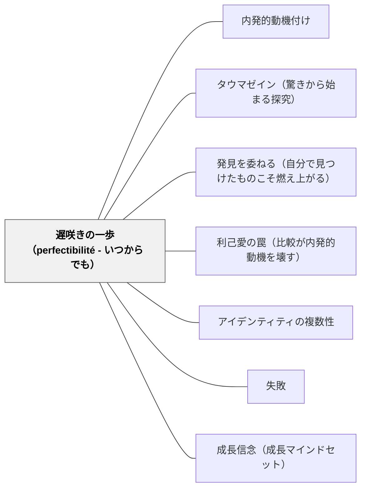

# 遅咲きの一歩（perfectibilité - いつからでも）

> 「いつ始めても遅すぎることはない——人間には、状況に応じていつでも変化できる能力（perfectibilité）が備わっている。65歳で映画を学ぶうみ子が体現したように、最初の一歩はいつ踏み出しても本物だ。」

## [Pattern Connection]

### たらちねジョン（2021）海が走るエンドロール——65歳からの創造

65歳で夫と死別し、映画館で衝撃を受けたうみ子が「映画が撮りたい側」の人間であることに気づき、美大に入学する物語は、ルソーの perfectibilité（可完成性）の最も純粋な物語的体現である。

- **「老後の趣味」という縮小から「撮りたい側」という覚醒へ**：うみ子の変化は、他者視点からの自己ラベリング（amour propre）を、内側からの動機（amour de soi）が突き破る瞬間として読める。
- **「若いとか関係ない」という言葉の逆転力**：年齢による制約という思い込みを、若者の言葉が解体する。外から与えられた可能性の制限が、同じ外からの言葉によって取り除かれる。
- **「取り返せないものがあることを知っている」**：後悔の経験が動機の深さを作る。未完の対話への後悔が、対話としての映画創造へと転化する。この転化は、perfectibilité の最も豊かな形——「過去の経験を未来の変容の燃料にする」こと。

### ルソー（1755）人間不平等起源論——perfectibilité の哲学的根拠

ルソーは人間と動物の本質的差異として「可完成性（perfectibilité）」を挙げた：

> 「可完成性とは、状況の助けを借りて、徐々に他のすべての能力を発展させる能力のことである」——第一部

この能力は「よい意味での変化可能性」である——人間は生涯にわたって変化し、成長し、新たな自分になれる。ルソーはこれを「人間の最も特徴的な性質」とした。

**教育への含意**：perfectibilité を信じることが教育の根拠である。子どもも大人も「今の状態が最終状態ではない」——これは特別支援教育における「どの子も変わりうる」という信頼と直結する。

- **既存パタンとの関連**：[[パタン/内発的動機付け]]（amour de soi から来る変化の動機）・[[パタン/タウマゼイン（驚きから始まる探究）]]（うみ子の映画館での衝撃がタウマゼインとして機能）
- **補強された点**：perfectibilité は「いつから始めてもよい」という時間的寛容さを含む——これは「今からでも間に合う」という感覚に教育実践的な哲学的根拠を与える
- **他のパタンへの波及**：[[パタン/利己愛の罠（比較が内発的動機を壊す）]]（「老後の趣味」ラベルがamour propre的縮小として機能する構造）；[[パタン/アイデンティティの複数性]]（「観る人」→「作る人」へのアイデンティティ転換）

---

## 背景（Context）

学校では「この年齢では難しい」「今さら始めても」という年齢・段階論的な判断が暗黙に働く。「〇年生だから」「〇歳だから」という基準が、学習者の可能性を事前に制限してしまうことがある。

大人においてはより強く——「これは若者のためのものだ」「私には無理だ」という思い込みが、本来の動機（amour de soi）をamour propre（他者視点からの自己評価）で塗り替える。

特別支援の文脈では、「この子には難しすぎる」「発達段階的に無理だ」という判断が、まだ起きていない変化の可能性を閉じてしまうリスクがある。

## 問題（Problem）

年齢・状態・過去の経験による「もう無理」「今さら遅い」という思い込みが、本人の変化可能性（perfectibilité）への信頼を奪う。

- 学習者本人が「自分には無理」と内面化してしまう
- 教師・支援者が「この子はここまで」と上限を設定してしまう
- 「老後の趣味」「練習問題だから」という縮小ラベルが動機を矮小化する
- 年齢・立場による「誰が教えるか」の固定化（大人が子どもに、先生が生徒に、という一方向）

## 力のかたち（Forces）

- 変化は「適切な時期」を待たない——衝撃的な出会い（タウマゼイン）はいつでも起きうる
- perfectibilité は人間の本質的な能力であり、年齢・障害の有無で消えない
- 「始めた遅さ」より「始めたこと」が変化の質を決める
- 後悔の経験は、動機の深さになりうる——取り返せないものへの後悔が、今できることへの切実さを生む
- 「老後の趣味」「練習」という縮小ラベルは、amour propre（他者の目）から来ることが多い
- 逆転学習（若者・子どもから大人が学ぶ）が思い込みを解体するときがある

## 解決（Solution）

**「今始める」という決断を、年齢・状態・過去の経験で制限せず、内側から来る動機（amour de soi）を正面から受け止める。そして学習者（子どもも大人も）の perfectibilité を前提として、変化の可能性に開かれた設計をする。**

---

### うみ子の一歩——物語的体現

65歳のうみ子が映画館で海（うみ）の映画を観たとき、うみ子の内側で起きたことは：

1. **タウマゼイン**——「大きい空間で聞く大きい音って、すごい」という衝撃体験
2. **自己発見**——「自分は映画が撮りたい側の人間なのだ」という認識の転換
3. **行動**——「こんなおばさんがいるだけで違和感よ」と感じながらもオープンキャンパスへ行く
4. **ラベルの解体**——「若いとか関係ない」という言葉による思い込みの解放
5. **覚悟**——「取り返せないものがあることを知っている」という後悔が動機の深さを作る

この5つのステップは、perfectibilité が「始まる」プロセスの構造的記述である。

---

### 教室での「遅咲きの一歩」設計

**1. 「まだわからない」を可能性として扱う**

「今できないこと」を「まだできていないこと」（Not Yet）として扱う。Carol Dweck の Growth Mindset に通じるが、perfectibilité はそれの哲学的根拠——「変化は人間の本質的能力だから」という根拠。

**2. 自分の「映画が撮りたい側」を見つける問いを設計する**

「あなたが作る側に立ちたいと思ったことはあるか」「誰かがやっているのを見て、自分もやりたいと思った体験は？」——タウマゼインと自己発見を引き出す問い。

**3. 「老後の趣味」ラベルを解体する**

学習者が「どうせ練習問題だし」「算数は苦手だから」と言うとき、そのラベルが外から（amour propre）来ているか内から（amour de soi）来ているかを問い直す。「本当にそう思う？」という問いが、縮小ラベルを解体する。

**4. 逆転学習の機会を設計する**

年齢・立場に関わらず、誰もが誰かの先生になれる場面を作る。「若いとか関係ない」という言葉のような逆転は、設計によって起きる——低学年が高学年に教える、子どもが大人に新しい発見を報告する。

**5. 特別支援における perfectibilité の信頼**

「この子はここまで」という上限を設定しないこと。「今はここにいる」と「ここから変わりうる」は同時に言える——今の状態への共感と、変化への信頼は矛盾しない。

---

### 自己教育への適用（岩井の実践）

> ✏️ *AI支援で整理した考察（そら子）：* うみ子が「映画が撮りたい側」に気づいたように、教師自身もまだ気づいていない「自分がやりたい側」があるかもしれない。数学デイリー・漫画の統合・Wikiの構築——これらは「老後の趣味」でも「義務」でもなく、岩井さんが「この側にいたい」と感じているamour de soi の表れである。perfectibilité は子どもだけのものではなく、教師が自分自身の学習者として実験し続けるための哲学的根拠でもある。

---

## 結果（Consequences）

- 「まだ間に合う」という感覚が学習への動機の深さを作る
- 年齢・状態による思い込みが解体されたとき、学習の質が変わる
- 後悔の経験（取り返せないもの）が動機の切実さに変わる
- 特別支援において、perfectibilité の信頼が子どもとの関係を開く
- ただし、「いつでも始められる」という思い込みが「今始めなくてもいい」という先延ばしに転化するリスクもある——「今この瞬間」への集中と perfectibilité の信頼は両立させる必要がある

## 関連パタン

- [[パタン/内発的動機付け]] — perfectibilité が動くとき、その動機はamour de soi（内側からの動機）から来る
- [[パタン/タウマゼイン（驚きから始まる探究）]] — 変化の最初の一歩はタウマゼイン（衝撃・驚き）から始まる
- [[パタン/発見を委ねる（自分で見つけたものこそ燃え上がる）]] — 「映画が撮りたい側」は自分で発見するものであり、渡されるものではない
- [[パタン/利己愛の罠（比較が内発的動機を壊す）]] — 「老後の趣味」ラベルはamour propre的縮小——その解体がperfectibilitéの発動条件
- [[パタン/アイデンティティの複数性]] — 「観る人」から「作る人」への転換はアイデンティティの複数性の体験
- [[パタン/失敗（インストラクション）]] — perfectibilité は「失敗しても変わりうる」という信頼と表裏一体
- [[パタン/成長信念（成長マインドセット）]] — perfectibilité の哲学的根拠が Growth Mindset の実践的補強になる
- [[文献/海が走るエンドロール 1（たらちねジョン）]] — 本パタンの物語的出典
- [[文献/人間不平等起源論（ルソー）]] — perfectibilité の哲学的出典（1755）

## クラスター図

## Actionable Insight

- **「まだ始めていない何か」を問う**：今週の授業で「あなたがやってみたいけどまだやっていないことは？」を1分間書く時間を作る——学習者の perfectibilité への意識が開く入口になる。
- **「老後の趣味」ラベルを解体する問い**：子どもが「どうせ練習だし」と言ったとき「本当にそう？」と返してみる——縮小ラベルが内からか外からかを本人が問い直す機会になる。
- **逆転学習を一回設計する**：子どもが教師に何かを教える場面を意図的に作る（デジタルツール・地域の知識・遊びのルール）——「若いとか関係ない」の逆転が設計から生まれる。
- **特別支援での「今はここ」と「変わりうる」の両立**：「A児は今ここにいる」と「A児はここから変わりうる」を同時に声に出してみる——perfectibilité への信頼を言語化することで、教師自身の上限設定が解体されやすくなる。
- **教師自身の perfectibilité を確認する**：今自分が「遅い」「もう無理」と思っていることを一つ挙げて、「うみ子だったら何と言うか」を問い直す——自己教育と子どもの教育を入れ子で考える実践。

## 出典

たらちねジョン（2021）『海が走るエンドロール』第1巻. 秋田書店

ルソー, J. J.（1755/2008）.『人間不平等起源論』中山元訳. 光文社古典新訳文庫.

> 「夫と死別し、数十年ぶりに映画館を訪れたうみ子。そこには、人生を変える衝撃的な出来事が待っていた。海という映像専攻の美大生に出会い、うみ子は気づく。自分は「映画が撮りたい側」の人間なのだと！ 心を掻き立てる波に誘われ、65歳、映画の海へとダイブする」——たらちねジョン（2021）作品紹介文

> 「可完成性とは、状況の助けを借りて、徐々に他のすべての能力を発展させる能力のことである」——ルソー（1755）第一部
