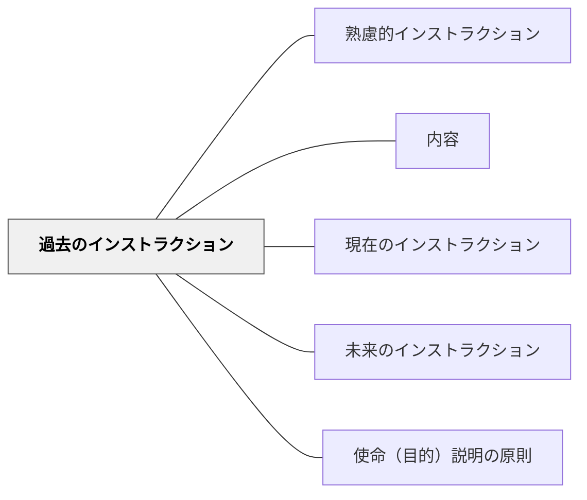

# 過去のインストラクション

> 過去についての知識・情報を伝えるインストラクションは、即座の行動を求めない。

## 背景（Context）
ワーマンはインストラクションを時間軸で3種類に分類した。そのうち「過去のインストラクション」は、歴史・生物・数学などの知識・情報の移動を目的とする。学校教育の多くの場面がこれに当たる。

## 問題（Problem）
過去のインストラクション（知識伝達）を、現在のインストラクション（即座の行動要求）と同じように設計すると、受け手に不必要な緊張や混乱を生じさせる。「今すぐやれ」という圧力のない情報伝達は、受け身の処理でよい場合が多いのに、それが見えていないと指示が重くなりすぎる。

## 力のかたち（Forces）
- 知識・情報の伝達は即時行動を求めないため、処理の余裕が生まれる
- しかし「知識を知っているだけ」では使える力にならない
- 過去のインストラクションは記憶・理解のステップが中心になる
- 使命と最終イメージを示すことで、知識の意味が明確になる

## 解決（Solution）
**過去のインストラクション（知識・情報伝達）では、即座の行動は求めず、受け手が情報を理解・記憶・整理できるよう設計する。**

「今すぐ動いてほしい」のではなく「この知識を理解してほしい」という目的を明示する。学習する知識が「何のために必要か（使命）」と「最終的に何ができるようになるのか（最終イメージ）」を示すことで、受け手が意味を持って受け取れるようにする。

## 結果（Consequences）
- 知識・情報の目的が明確になり、受け手の処理効率が上がる
- 「知っているだけ」から「使うために知る」への転換が起きやすくなる
- 3種類のインストラクションを区別することで、設計の適切さが増す

## クラスター図

## Actionable Insight

- 知識を伝える前に「今から覚えてほしい情報ではなく、理解してほしいことを話します」と一言添える——即時行動を求めないことを明示するだけで受け手の緊張が解ける
- 知識を伝える際に「この知識は○○のときに役立ちます（使命）」と目的を先に示す——意味を持って受け取れるようになり記憶への定着が高まる
- 説明後に「最終的に何ができるようになるか（最終イメージ）」を一文で示す——学習者が知識を「使うために知る」というモードに切り替えられる

## 出典

- 一つの教育のパタン・ランゲージ（岩井輝久）

## 関連パタン
- [[パタン/熟慮的インストラクション]] — 親パタン
- [[パタン/内容]] — インストラクションの内容の種類
- [[パタン/現在のインストラクション]] — 対比となる種類
- [[パタン/未来のインストラクション]] — 対比となる種類
- [[パタン/使命（目的）説明の原則]] — 知識の意味を明示する
