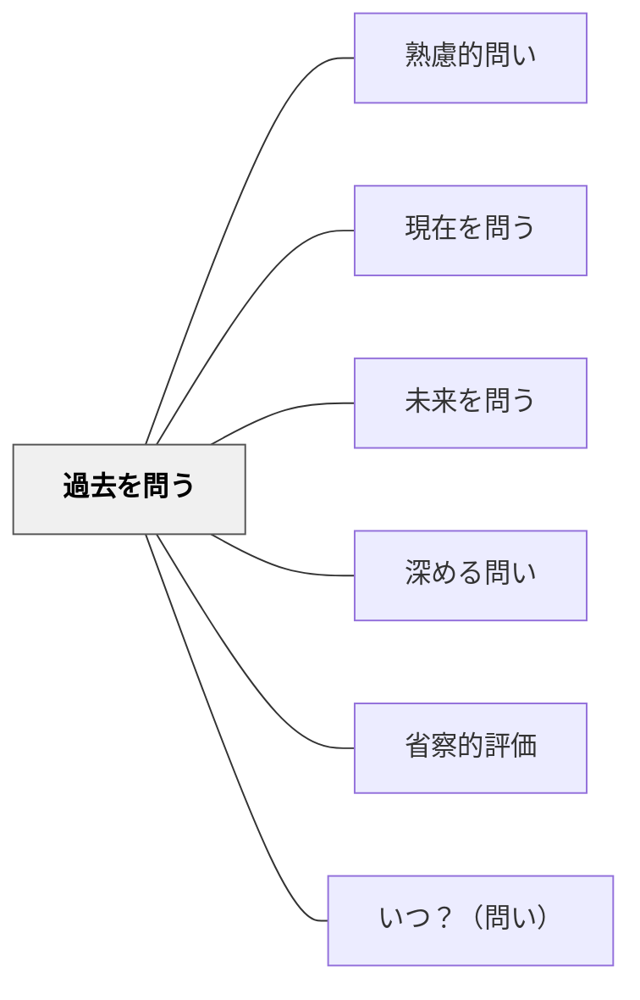

# 過去を問う

> 「これはどこから来たのか」と起源・歴史・変化を問うことで、学びに文脈と深みが生まれる。

## 背景（Context）
教科書に書かれている知識や概念は、多くの場合その成り立ちや変遷が省かれて提示される。漢字がなぜこの形なのか、ある法律がなぜ制定されたのか、数学の記号がなぜこう書くのか——これらには豊かな歴史的背景がある。過去を問う問いは、知識をただの「事実」から「人間の営みの産物」へと変える。

## 問題（Problem）
起源や変化を問われない学習者は、知識を静的・固定的なものとして受け取る。「なぜこうなっているのか」という問いを立てる習慣がないため、物事の本質的な理解が浅くなりがちである。また、歴史的文脈を欠くと、現在の状況を当然視する思考パターンが強化される。

## 力のかたち（Forces）
- 知識には必ず起源・変遷があり、それを知ることで理解が深まる
- 「現在の姿」だけを学ぶと、別の可能性があることに気づきにくい
- 歴史的問いは、批判的思考・文化理解・教科横断的学習と結びつく
- 過去を問うことで、未来を問う問いの土台ができる

## 解決（Solution）
授業の中で「この言葉はもともとどういう意味だったのだろう？」「昔はどうだったのだろう？」「なぜこの形になったのか？」と問いかける。例えば、漢字の学習で「この字はもともと何を描いた文字か？」と問い、象形文字の成り立ちを探らせる。歴史の授業では「この制度は何をきっかけに生まれたのか？」と問い、当時の社会状況と結びつけて考えさせる。

## 結果（Consequences）
- 知識を「完成された答え」ではなく「進行中のプロセス」として見られるようになる
- 物事が変化しうるという認識が育まれ、柔軟な思考が促進される
- 教科の内容に人間的・文化的な奥行きが加わり、学びへの興味が深まる

## 関連パタン
- [[パタン/熟慮的問い]] — 親パタン
- [[パタン/現在を問う]] — 過去と現在を対比させることで変化が浮かび上がる
- [[パタン/未来を問う]] — 過去・現在・未来の三点で時間軸を問う

- [[パタン/深める問い]] — 過去への問いが現在の理解を深める
- [[パタン/省察的評価]] — 過去を問うことが省察的評価の起点になる
- [[パタン/いつ？（問い）]] — 時間軸で問いを構造化する兄弟パタン

## クラスター図

## Actionable Insight

- 「この言葉はもともとどういう意味だったのだろう？」と問いかける——知識をただの事実から人間の営みの産物へと変える
- 漢字の学習で「この字はもともと何を描いた文字か？」と問い、象形文字の成り立ちを探らせる——歴史的背景が知識への興味を深める
- 「この制度は何をきっかけに生まれたのか？」と問い当時の社会状況と結びつけて考えさせる——知識が「完成された答え」ではなく「進行中のプロセス」として見えるようになる

## 出典
- [[文献/熟慮的問いのパターンリスト（動画記録）]]
