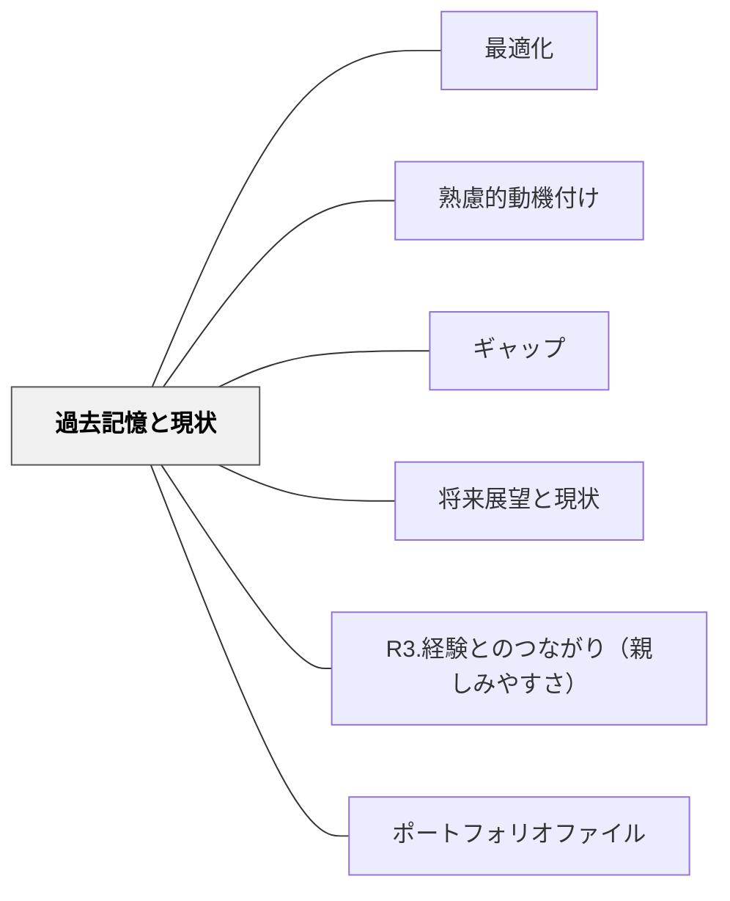

# 過去記憶と現状

> 「以前はできなかったことが今はできる」という気づきが、成長の実感と継続意欲を生む。過去の自分との比較が、最良のフィードバックになる。

## 背景（Context）
学習者は他者と比較して自分の位置を測ることが多いが、過去の自分と現在の自分を比較する「自己内比較」もまた強力な動機の源泉になる。成長の可視化は、ギャップを埋めてきた軌跡を実感させ、今後の学習への意欲につながる。

## 問題（Problem）
日々の学習の中で成長は少しずつ起こるため、学習者は自分が進歩していることに気づきにくい。「全然成長していない」という誤った認識が、継続意欲を損なうことがある。

## 力のかたち（Forces）
- 成長は線形ではなく、気づかないうちに蓄積されていることが多い
- 過去の記録（ポートフォリオ・日記・作品など）がなければ、比較の素材がない
- 成長の実感は達成感・自己効力感と密接に関連する
- 過去の自分と比較することは、他者比較より健全な自己評価につながりやすい

## 解決（Solution）
**学習者が過去の自分の状態・作品・思考を記録として保存し、それを現在と比較できる機会を設けることで、成長の実感と継続意欲を生み出す。**

ポートフォリオや学習日記の記録、単元の始めと終わりに同じ課題や問いに向き合う比較活動、「以前の自分が知らなかったことを書き出す」振り返り活動などが有効である。

## 結果（Consequences）
- 学習者が「自分は成長している」という実感を持ち、継続意欲が高まる
- 自己評価能力が育ち、自律的な学習につながる
- 教師も学習者の成長を具体的に捉え、フィードバックの質が向上する

## クラスター図

## Actionable Insight

- 単元の最初に「今の自分がわかっていないこと・できないこと」を1文書かせ、単元後に同じ問いに答えさせる——成長の可視化が継続意欲を生み出す
- 学習者の初期作品・最初の記述を保存しておき、単元末に「最初と今を比べてみよう」と並べて示す——以前の自分との対比が達成感と自己効力感を強化する
- 週1回「1か月前には知らなかったことを1つ書いてみよう」という振り返りを設ける——自己内比較の習慣が自律的な学習を促進する

## 出典

- 一つの教育のパタン・ランゲージ（岩井輝久）

## 関連パタン
- [[パタン/最適化]]
- [[パタン/熟慮的動機付け]] — 親パタン
- [[パタン/ギャップ]] — 関連パタン
- [[パタン/将来展望と現状]] — 関連パタン
- [[パタン/R3.経験とのつながり（親しみやすさ）]] — 関連パタン（ARCSとの接点）
- [[パタン/ポートフォリオファイル]] — 関連パタン
