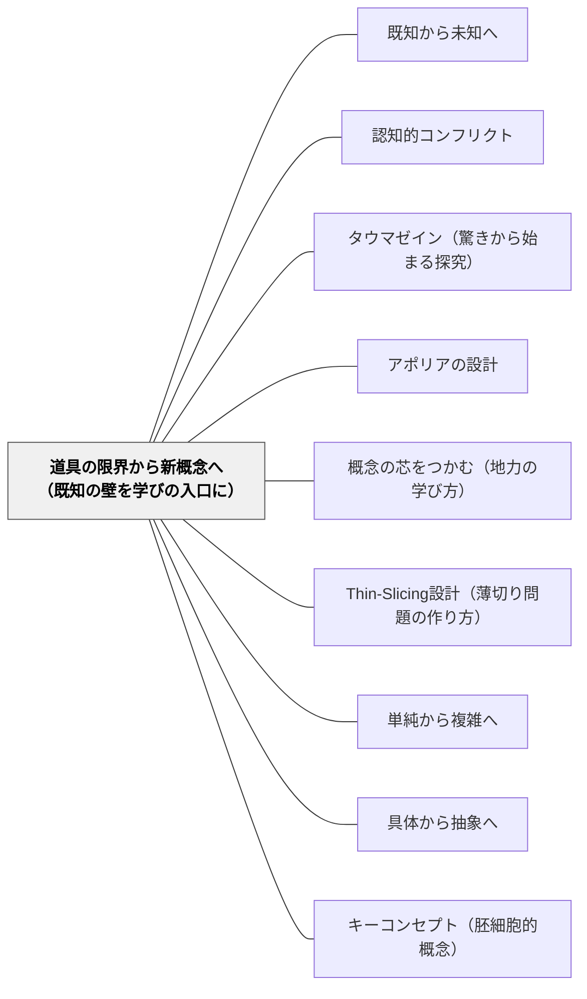

# 道具の限界から新概念へ（既知の壁を学びの入口に）

> 「さっきの方法では解けない——その壁が、新しい概念を呼んでいる」

---

## [Pattern Connection]

**堀江真文（2019）——等速から非等速へ：「はじきが使えない」壁の設計**

堀江は、微分の必要性を「等速の場合はうまくいくが、非等速の場合は従来の公式（はじき）が使えなくなる」という流れで体感させる。この設計が、微分の「なぜ必要か」を学習者に腑落ちさせる核心である。

**授業の流れ（堀江版）：**

| フェーズ | 内容 | 学習者の状態 |
|---|---|---|
| 道具が使える場面 | 等速でエリさんが歩く → はじき（速度×時間＝距離）で解ける | 「わかった！」 |
| 道具が使えない場面 | 速度が変化する場面 → 「等速でないから、さっきの計算方法は使えない」 | 「え、どうするの？」 |
| 新概念の登場 | 2点を取って傾きを求める → 2点を近づける → lim → 微分 | 「そこで微分の登場！」 |

> 「等速ではないから、さきほどの計算方法は使えないのでは……?」（エリさんの発言）  
> 「そこで、いよいよ微分の登場というわけです！」（たくみ先生）——堀江（2019）

「はじきが使えない」という経験は、「なぜ微分が必要か」の答えそのものである。

**積分でも同じ構造：**
- 等速のとき：距離＝速度×時間＝長方形の面積 → 使える
- 非等速のとき：形が長方形でなくなる → 細かく分けて足す → 積分が必要

**このパタンが示す原理：**
既存の「道具（知識・方法）」が機能する場面Aと機能しない場面Bを意図的に並べることで、学習者は自分で「なぜ新しい方法が必要か」を感得する。新概念の「必要性」は、外から説明するより、壁にぶつかることで内側から生まれる。

- **既存パタンとの関連**：[[パタン/既知から未知へ]] が「知っていることを橋にして未知へ進む」という方向を示すのに対し、本パタンはその瞬間を設計的に引き起こす技法——「既知が壁にぶつかる瞬間」を意図的に作る
- **補強された点**：[[パタン/認知的コンフリクト]] が「矛盾・違和感を設計する」という方向性を示すのに対し、本パタンは「既存の道具の完全な限界」を体感させるという具体的な方法論を提供する
- **他のパタンへの波及**：[[パタン/タウマゼイン（驚きから始まる探究）]]（壁にぶつかる瞬間がタウマゼインを生む）；[[パタン/概念の芯をつかむ（地力の学び方）]]（地力 = 壁を超えて自力再構成できる力）；[[文献/難しい数式はまったくわかりませんが微分積分を教えてください（堀江真文）]]

---

### 伊藤由佳理（2020）美しい数学入門——学校数学の壁が現代数学への入口になる

伊藤は、数学の学習段階を「球技」に喩えて示す。

**学習段階の球技比喩：**

| 段階 | 球技の比喩 | 数学の内容 |
|---|---|---|
| 算数（小中） | 準備体操・ストレッチ | 計算・図形・測定 |
| 中高数学 | 基礎練習・ドリル | 代数・微積分・確率 |
| 大学数学 | 試合 | 集合論・群論・解析 |
| 大学院数学 | オリジナルプレーの研究 | 未解決問題への挑戦 |

学校数学（中世から積み上げてきた内容）と現代数学（18世紀以降に急発展した内容）の間には大きなギャップがある。大学で初めて現代数学に触れた学生が「高校数学は好きだったのに大学数学が全然わからない」と感じるのは、「球技の種目が変わった」ようなものだというのが伊藤の洞察である。

> 「学校数学が好きか嫌いかは、現代数学が得意か不得意かを表すわけではない」——伊藤（2020）

この洞察は「道具の限界から新概念へ」のパタンの**巨大スケール版**である。算数から現代数学への移行は、単に難しくなるのではなく、「そこまでの道具（計算・代数）では解けない問い」が現れることで、新たな数学的概念（集合・群・トポロジー）の必要性が生まれる。

**このパタンとの接続：**

「学校数学→現代数学」のギャップは、堀江のミクロな設計（60分の授業内の「等速→非等速」の壁）と同型の構造を持つ。「今まで使えた道具が使えなくなる場面」を意図的に設計することで、新概念の必要性が体感される——この構造は1時間の授業から数学史の発展まで、スケールを超えて繰り返す。

- **補強された点**：堀江のミクロな設計（授業内の壁）に加え、伊藤の視点が「数学教育全体の段階設計」というマクロな同型性を示す。「道具の限界→新概念」という構造は、算数の1問から数学史の発展まで、スケールを超えて同じパターンをとる。
- **他のパタンへの波及**：[[パタン/専門以前の人間形成]]（学校数学が現代数学の準備体操であるという位置づけ）；[[文献/美しい数学入門（伊藤由佳理）]]

---

## 背景（Context）

算数・数学の授業では、新しい概念を「先に定義してから使い方を学ぶ」順序が多い。しかしこの順序では、学習者は「なぜこれを学ぶのか」が見えないまま計算を覚えることになる。

対照的に、既存の方法が完全に機能する場面を経験した学習者は、その方法が使えなくなる場面に出会ったとき、自然に「どうすればよいか」という問いを持つ。この問いが「新概念を受け取る準備」になる。

## 問題（Problem）

「なぜこの概念が必要なのか」が見えないまま新概念を教えると、学習者は「難しくなった」「ついていけない」と感じ、意味を理解する前に手順の暗記に逃げてしまう。壁にぶつかる前に答えを渡すと、問いが生まれない。

## 力のかたち（Forces）

- 新概念は、それが必要な文脈の中でしか意味をもたない
- 既存の方法が「完全に機能する」経験があってこそ、「使えない場面」が際立つ
- 壁は「超えられない」と感じると学習者を閉じさせるが、「通過できる」と感じると動機になる
- 「なぜ新しい方法が必要か」を体感した学習者は、その概念の意味を自分のものにする

## 解決（Solution）

**新概念を導入する前に、学習者が「既存の道具では解けない」という壁にぶつかる場面を意図的に設計する。その壁を認識した瞬間に新概念を導入することで、「なぜ必要か」と「何をするか」が同時に理解される。**

---

### 設計の手順

1. **道具が完全に機能するCase Aを先に確実に扱う**  
   学習者が「これは解ける」という感覚を持てるまで丁寧に。

2. **Case Aの条件が成り立たなくなるCase Bを提示する**  
   条件の変化は「一つだけ」にする（例：等速→非等速）。変化が多いと壁の正体が見えない。

3. **「さっきの方法では解けない」と学習者に確認させる**  
   教師が「使えない」と言うのではなく、学習者が「あ、使えない」と気づく問いを出す。

4. **「では、どうすれば解けるか」という問いを立ててから新概念を導入する**  
   答えを出す前に問いを立てる時間が大切。問いが先にあると、概念が「答え」として機能する。

---

### 算数での具体例

| 場面 | 道具が使える（Case A） | 使えない（Case B） | 必要になる新概念 |
|---|---|---|---|
| 掛け算の必要性 | 「2＋2＋2」は簡単に計算できる | 「2を100回足せ」 | 掛け算（繰り返し加算の省略） |
| 分数の必要性 | 「10を2人で分ける」は整数で解ける | 「3を4人で分ける」 | 分数（割り切れない分割） |
| 小数の必要性 | 「1m と 2m」は整数で表せる | 「1mと50cmを足す」 | 小数・分数（中間の長さ） |
| 微分の必要性 | 等速のとき速度＝距離÷時間（はじき）で解ける | 速度が変化する場合（はじきが使えない） | 微分（瞬間の変化率） |
| 積分の必要性 | 長方形の面積は縦×横で求められる | 曲線で囲まれた図形の面積 | 積分（細かく分けて積み上げる） |
| 負の数の必要性 | 「5から3を引く」は計算できる | 「3から5を引く」 | 負の数 |

---

### 壁を「入口」に変える問いの例

- 「今の方法は、こういう場合はうまくいくね。では、こういう場合はどうだろう？」
- 「さっきと何が違う？さっきの方法がそのまま使えるかな？」
- 「使えないとしたら、どこが問題？その部分だけ解決できたら、後は同じ方法でいけそう？」

---

## 結果（Consequences）

- 新概念を「なぜ必要か」から理解した学習者は、その概念を「道具」として使いこなせる
- 壁を超えた経験が「また壁が来ても超えられる」という自信になる
- ただし、Case Bを提示するタイミングが早すぎる（Case Aの理解が不十分な段階）と、壁が「入口」でなく「障壁」になる
- Case Aの条件を一つだけ変えた丁寧な設計が、この動きを成立させる

## 関連パタン

- [[パタン/既知から未知へ]] — 既知を橋にする（本パタンは「橋の手前に壁を作る設計」）
- [[パタン/認知的コンフリクト]] — 既存理解との矛盾を設計する
- [[パタン/タウマゼイン（驚きから始まる探究）]] — 壁にぶつかる瞬間のタウマゼイン
- [[パタン/アポリアの設計]] — 知的困惑を学びの動力に変える
- [[パタン/概念の芯をつかむ（地力の学び方）]] — 「なぜ」から理解する地力
- [[パタン/Thin-Slicing設計（薄切り問題の作り方）]] — 一要素だけ変えて段階的に深める
- [[パタン/単純から複雑へ]] — 段階的な難化の設計
- [[パタン/具体から抽象へ]] — 具体的な壁の経験が抽象概念の必要性を生む
- [[パタン/キーコンセプト（胚細胞的概念）]] — 壁を超えた先に現れる概念の核
- [[メタパタン/経験から出発する]] — 壁の経験そのものが出発点

---

## クラスター図

## Actionable Insight

- **「この方法はいつ使えなくなるか」を授業設計で考える**：新しい概念を導入する前に「今学んだ方法はどんな条件で使えるか」を確認し、「その条件が崩れると？」という問いを用意しておく。
- **「等速から始める」設計**：算数で速さを扱うとき、最初は「ずっと同じ速さ」の問題から。距離÷時間で解けることを確認してから「途中で速度が変わったら？」へ。この移行の瞬間が、変化率への感覚を育てる。
- **「これは何ができなくなると困るか」を単元の最初に問う**：「掛け算がないとどう大変か」「分数がないとどう困るか」を最初に想像させる。概念の必要性を先に体感してから定義へ進む。

---

## 出典

堀江真文（たくみ）（2019）『難しい数式はまったくわかりませんが、微分積分を教えてください！』

> 「等速ではないから、さきほどの計算方法は使えないのでは……?」「そこで、いよいよ微分の登場というわけです！」——堀江（2019）
