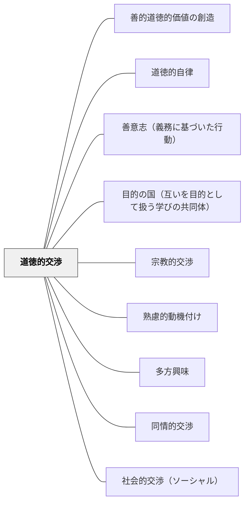

# 道徳的交渉

> 「これは正しいのか」という問いが、学びへの真剣な関与を生む。

---

## [Pattern Connection]

**カント（1785）道徳形而上学の基礎づけ統合：**

- **哲学的構造の提供**：「これは正しいのか」という道徳的交渉の問いには、カントの定言命法（特に普遍化の定式）がその哲学的構造を与える。「もし全員がこのように行動したらどうなるか」（普遍化テスト）は、道徳的交渉を深める最も具体的な問いの形式
- **補強する観点**：[[パタン/道徳的自律]] との接続を深化。「これは正しいか」と問えるのは、人間に道徳法則を内側から立法する理性（善意志）が備わっているから。道徳的交渉はその理性を公的に使う場
- **人格の定式の接続**：「この行為は他者を手段として扱っていないか」という人格の定式（[[パタン/目的の国（互いを目的として扱う学びの共同体）]]）は、道徳的交渉のもう一つの問いの形式。普遍化定式と人格の定式を組み合わせると道徳的問いが多角的になる
- **波及するパタン**：[[パタン/善意志（義務に基づいた行動）]] — 道徳的交渉は傾向性（損得・感情）からではなく、義務への問いとして行うとき最も深くなる

---

## 背景（Context）
ヘルバルトの多方興味論および牧口常三郎の教育理論における「道徳的交渉」。道徳的価値・善悪・正義・公正への関心から生まれる動機を指す。「これは正しいのか」「こうあるべきではないか」という道徳的な問いが、学習内容への深い関与と動機をもたらす。

## 問題（Problem）
学習内容が道徳的・倫理的な問いと切り離されていると、学習者は「知識を得ること」以上の意味を感じにくい。特に社会科・歴史・生命科学などでは、道徳的な問いを排除すると学習が表面的になりやすい。

## 力のかたち（Forces）
- 道徳的な問いは学習者の「正義感・価値観」に触れるため深い関与を生む
- 答えが一つでない道徳的問いが深い思考を促す
- 価値観の多様性を尊重しながら対話する場の設計が必要
- 偽善・規則への服従にならない本物の道徳的探究が重要

## 解決（Solution）
**学習内容に含まれる道徳的・倫理的な問いを顕在化させ、学習者が自分の価値観を問い直し対話できる場を作る。**

「この歴史的な判断は正しかったのか」「科学技術の発展はどこまで許されるのか」など、答えのない道徳的問いを学習の中心に据える。価値観の違いを前提とした対話を大切にし、一方的な価値の押し付けを避ける。

## 結果（Consequences）
- 学習内容への深い関与と批判的思考が育まれる
- 学習者が自分の価値観を言語化・相対化できるようになる
- 倫理的感受性が高まり、市民としての主体性が育つ

## クラスター図

## Actionable Insight

- 「この歴史的判断は正しかったのか？」「科学技術はどこまで許されるか？」のような答えのない道徳的問いを学習の中心に据える——倫理的な問いが学習者の正義感と価値観に触れ深い関与を生む
- 価値観の違いを前提とした対話の場を作り、一方的な価値の押し付けを避ける——多様な視点の対話が批判的思考と市民的主体性の両方を育てる
- 毎授業の最後に学習内容に関連する倫理的問い（1文）を投げかけ、ひとりで考える1分を設ける——定期的な道徳的問いへの接触が倫理的感受性を継続的に育てる
- 道徳的問いを「完全義務か不完全義務か」で区別して問う——**完全義務**（絶対してはならない/必ずしなければならない。例：嘘をつく・約束を破る）は状況によらず禁止・義務づけられる。**不完全義務**（できる限りすべき。例：人を助ける・自分の才能を伸ばす）は程度と方法に裁量がある。「これはどちらの問いか」と分類することで、道徳的議論の射程が明確になる
- 「もし全員がこの行動をしたらどうなるか（普遍化テスト）」を合言葉にする——カントの定言命法の最も使いやすい形式。道徳的交渉の最中に行き詰まったとき、この問いに立ち戻ることで議論が動く

## 出典

- 一つの教育のパタン・ランゲージ（岩井輝久）

## 関連パタン
- [[パタン/善的道徳的価値の創造]]
- [[パタン/道徳的自律]] — 道徳的交渉の哲学的基盤
- [[パタン/善意志（義務に基づいた行動）]] — 道徳的交渉を義務への問いとして深める
- [[パタン/目的の国（互いを目的として扱う学びの共同体）]] — 人格の定式による道徳的問いの多角化
- [[パタン/宗教的交渉]]
- [[パタン/熟慮的動機付け]] — 親パタン
- [[パタン/多方興味]] — 上位パタン
- [[パタン/同情的交渉]] — 他者への共感と連動する
- [[パタン/社会的交渉（ソーシャル）]] — 社会への関わりと連動する
