# 道徳的自律

> 「わが上なる星空と、わが内なる道徳法則」——カント  
> 欲望は外から押し込まれるが、道徳法則は内から立ち上がる。人間が「正しいから行う」と決断するとき、自然界の因果律から自由になる。

---

## [Pattern Connection]

**道徳形而上学の基礎づけ（1785）統合：**

- **哲学的起源の追加**：本パタンは主に『実践理性批判』（1788）を出典としてきたが、道徳的自律の中核概念（善意志・義務に基づいた行為・定言命法・自律の原理）はすべて3年前の『道徳形而上学の基礎づけ』（1785）で初めて提示された。本文献は道徳的自律の真の源泉である
- **善意志との接続**：「道徳的自律 = 正しいから行う」の内実は、カントが1785年に特定した「善意志（guter Wille）」である。善意志は才能・幸運・感情の条件に依存しない唯一の無条件的な善——義務そのものを動機とする意志。[[パタン/善意志（義務に基づいた行動）]] がこの側面を深掘りする
- **自律の原理の起源**：「自律（Autonomie）= 意志が自分自身に法則を与えること」という定義が1785年に確立された。他律（他のものに法則を求めること）との対比が道徳的自律の意味を明確にする——幸福・神の意志・本性・完全性に法則を求める限り他律であり、自律にならない
- **定言命法の論理構造**：道徳的自律を「欲望でなく理性による自己立法」として理解するとき、その論理形式が定言命法の三定式——①普遍化の定式（全員がやったらどうなるか）②人格の定式（他者を目的として扱っているか）③目的の国の定式（自律的立法者の共同体の成員として）
- **波及するパタン**：[[パタン/目的の国（互いを目的として扱う学びの共同体）]] — 道徳的自律を持つ者たちが共同で立法する場として目的の国の概念が位置づく

**カント（1788）統合：**

- **補強する既存パタン**：[[パタン/道徳的交渉]] — Herbart/牧口の「道徳的交渉」（道徳的問いが深い学習関与を生む）の哲学的基盤を、カントの自律概念が提供する。「これは正しいか」という問いが機能するのは、人間に道徳法則を内側から立法する力（理性）が備わっているから。
- **深化する既存パタン**：[[パタン/内発的動機付け]] — SDT の「自律性（Autonomy）」概念は、カントの道徳的自律の現代心理学的な反映である。Deci & Ryan が「外から押しつけられた行動より自ら選んだ行動の方が質が高い」と実証したことを、カントは「欲望に従う受動性より理性による自己立法の方が人間的自由に近い」と哲学的に先取りしていた。
- **新次元を加えるパタン**：[[パタン/切実性（必要感）]] — 「自分に必要だ」という切実性には二層ある。欲望レベルの切実性（お腹が空いた、褒められたい）と、道徳的レベルの切実性（これは正しい・これが自分の使命だ）。後者はより根本的で長期的な動機の燃料になる。
- **波及するパタン**：[[パタン/省察]] — カント倫理の探求は自己の行動を問い直す「省察」の最も深い形。[[パタン/成長マインドセット]] — 「能力は変えられる」という信念の根底には、自然因果律から自由な意志主体（カント的自律）があることを示唆する。

**純粋理性批判（1781/1787）補足統合：**

- **理論哲学と実践哲学の接続**：『純粋理性批判』（理論理性批判）は「人間は何を認識できるか」を問い、現象の世界（自然の因果連鎖）の認識の限界を示す。『実践理性批判』（本パタンの主出典）は「人間は何をすべきか」を問い、現象の因果連鎖を超えた自由の世界（道徳）を開く。二つは表裏一体——認識の限界が自由の領域を確保する構造になっている。
- **感性と悟性の協働との接続**：[[パタン/感性と悟性の協働]] が「認識における感性と悟性の協働」を示すなら、道徳的自律は「実践における欲望（感性的傾向性）と理性（道徳法則）の関係」を扱う。認識論と倫理学でカントは同じ構造（受動的素材 vs 能動的形式）を繰り返している。

**啓蒙とは何か（1784）統合：**

- **啓蒙と道徳的自律の関係**：道徳的自律は「正しいから行う」（実践的自律）であるが、その前提として「自分の理性で考える」という啓蒙的自律（Sapere aude）が必要。啓蒙は道徳的自律の**認識論的条件**である。未成年状態（他者の指導なしに理性を使えない状態）を克服しないと、道徳的判断も外から与えられた基準を受け入れるだけになる
- **理性の公的利用との接続**：道徳的自律の実践には「自分の道徳的判断を公的に語る勇気」が必要。カントが「論ずることは自由に、ただし服従せよ」と言うとき、学者として道徳的問いを公に語る（公的利用）と、職務として服従する（私的利用）を区別した。教室での道徳的議論はこの公的利用の練習にほかならない
- **波及するパタン**：[[パタン/啓蒙（自分の理性を使う勇気）]] — 道徳的自律の前段階としての啓蒙。「考える習慣」が「正しいから行う」の基礎になる

---

## 背景（Context）

イマヌエル・カント（1788）は『実践理性批判』の末尾で、人間が真の意味で敬意を感じる二つのものを挙げた——「わが上なる星空」と「わが内なる道徳法則」。

「欲望」——お腹が空いた、怖い、褒められたい——はすべて肉体や環境という外部の条件に縛られた**受動的なもの**である。これは動物も持つ。人間も欲望を持つが、それだけであれば自然の因果連鎖の一部に過ぎない。

人間を動物と区別するのは、「どんなに状況が厳しくとも、これが正しいから私は行う」と**理性を発動する力**である。これをカントは**自律（Autonomie）**と呼んだ。自律とは自分で自分に法則を与えること（自己立法）——欲望に押し流されることの反対。

## 問題（Problem）

学習のほとんどが「欲望の構造」で設計されている：テストで良い点を取りたい（褒賞欲求）、叱られたくない（回避欲求）、みんなと同じでいたい（帰属欲求）。

これらは短期的に機能するが、欲望が満たされれば消える動機である。学校を出た後も学び続ける人間、正しいと信じることを圧力の中でもやり遂げる人間は、欲望の設計では育たない。

## 力のかたち（Forces）

- 欲望は環境・報酬・罰に縛られた受動的動機——外部条件が変われば消える
- 道徳的自律は外部条件に依存しない能動的動機——理性が内から立法する
- しかし道徳法則は押しつけられるものでなく、問い直しと選び直しを経て内側から引き受けるもの
- 既成の規範（超自我）を批判・吟味することなく受け入れるだけでは「自律」でなく「服従」になる
- 全否定の破壊（ニヒリズム）だけでも「自律」にならない——問い直しの後に「より高い次元で引き受ける」統合が必要
- この統合には時間がかかる——数年ではなく数十年の射程での成長

## 解決（Solution）

**学習者が「誰かに言われたから」でなく「自分がそれを正しいと判断するから行う」という体験を設計する。そのためには、規則・価値観・知識を問い直す機会と、問い直した上で自ら引き受ける機会を、両方意図的に作る。**

---

### 授業での実装

**問い返す機会をつくる**

「先生・教科書がそう言うから」でなく「自分はこれをどう判断するか」を問う瞬間を設ける。答えが決まっている確認問題ではなく、複数の立場が成り立つ道徳的問い（[[パタン/道徳的交渉]]）が入口になる。

**圧力の中で正しいことをやり遂げる体験をつくる**

誰も見ていなくても正しく行動できるか、仲間が違う選択をしてもブレずにいられるか——そのような「道徳的筋肉」を鍛える小さな体験の場を授業設計に組み込む。

**「引き受ける」ことと「服従する」ことを区別する**

ルールや価値観を問い直した上で「やはりこれが正しい」と自ら結論することと、疑わず従うことは、外から見ると同じに見えても内側がまったく違う。前者が自律であり、後者は服従。この区別を学習者と一緒に考える。

**長い時間軸で見る**

中学生の「切実な必要感」、大学での病的なまでの没頭、既存規範の全否定、そして20年かけた統合——これが道徳的自律の典型的な育ち方である。短期の効果を求めず、種を蒔くことに徹する。

## 結果（Consequences）

- 外部の報酬・評価がなくなっても学び続ける習慣が育つ
- 社会的圧力に流されず、自分の判断を持てる市民が育つ
- 既成の権威・規範を問い直せる批判的思考と、問い直した上で価値を引き受ける統合的思考の両方が育つ
- ただし、道徳的自律を強制することは矛盾——「自律しなさい」という命令は自律を破壊する。種を蒔き、時間を待つしかない

## 関連パタン
- [[パタン/善的道徳的価値の創造]]
- [[パタン/非社交的社交性（学びを駆動する創造的摩擦）]]
- [[パタン/パタンは、フッサールの言う本質と言えるのだろうか。]]
- [[パタン/コペルニクス的転回（認識論）]]
- [[パタン/啓蒙（自分の理性を使う勇気）]] — 道徳的自律の認識論的前段階。理性を使う習慣なしに道徳的自律は育たない
- [[パタン/善意志（義務に基づいた行動）]] — 道徳的自律の動機的側面。義務に基づいた行動が道徳的自律の外的表現
- [[パタン/目的の国（互いを目的として扱う学びの共同体）]] — 道徳的自律を持つ者たちが共同立法する場の設計
- [[パタン/道徳的交渉]] — 道徳的問いを学習の中心に据える実践的パタン。道徳的自律はその哲学的基盤
- [[パタン/内発的動機付け]] — SDT の「自律性」はカント的自律の現代心理学的反映
- [[パタン/切実性（必要感）]] — 道徳的切実性（「これが正しい・これが使命だ」）は欲望的切実性より根本的
- [[パタン/省察]] — 自分の行動・価値観を問い直す省察がカント的自律の実践的形態
- [[パタン/熟慮的問い]] — 授業全体を動かす本質的な問いは道徳的自律を育てる入口になる
- [[パタン/成長マインドセット]] — 「変えられる」という信念は、自然の因果律から自由な意志主体の存在を前提とする
- [[パタン/多方興味]] — 道徳的興味は多方興味の一つ（Herbart/牧口）
- [[パタン/守・破・離（習熟の三段階）]] — 既成規範の習得（守）・批判的解体（破）・より高い次元での統合（離）は道徳的自律の発達モデルと重なる

---

## クラスター図

```mermaid
flowchart LR
    ne98193e5beb3e79a84e887aae5be8b["道徳的自律"]
    ne59684e79a84e98193e5beb3e79a84e4bea1e580a4e381aee589b5e980a0["善的道徳的価値の創造"]
    ne99d9ee7a4bee4baa4e79a84e7a4bee4baa4e680a7efbc88e5ada6e381b3e38292e9a786e58b95e38199e3828be589b5e980a0e79a84e691a9e693a6efbc89["非社交的社交性（学びを駆動する創造的摩擦）"]
    ne38391e382bfe383b3e381afe38081e38395e38383e382b5e383bce383abe381aee8a880e38186e69cace8b3aae381a8e8a880e38188e3828be381aee381a0e3828de38186e3818be38082["パタンは、フッサールの言う本質と言えるのだろうか。"]
    ne382b3e3839ae383abe3838be382afe382b9e79a84e8bba2e59b9eefbc88e8aa8de8ad98e8ab96efbc89["コペルニクス的転回（認識論）"]
    ne59593e89299efbc88e887aae58886e381aee79086e680a7e38292e4bdbfe38186e58b87e6b097efbc89["啓蒙（自分の理性を使う勇気）"]
    ne59684e6848fe5bf97efbc88e7bea9e58b99e381abe59fbae381a5e38184e3819fe8a18ce58b95efbc89["善意志（義務に基づいた行動）"]
    ne79baee79a84e381aee59bbdefbc88e4ba92e38184e38292e79baee79a84e381a8e38197e381a6e689b1e38186e5ada6e381b3e381aee585b1e5908ce4bd93efbc89["目的の国（互いを目的として扱う学びの共同体）"]
    ne98193e5beb3e79a84e4baa4e6b889["道徳的交渉"]
    ne58685e799bae79a84e58b95e6a99fe4bb98e38191["内発的動機付け"]
    ne58887e5ae9fe680a7efbc88e5bf85e8a681e6849fefbc89["切実性（必要感）"]
    ne79c81e5af9f["省察"]
    ne7869fe685aee79a84e5958fe38184["熟慮的問い"]
    ne68890e995b7e3839ee382a4e383b3e38389e382bbe38383e38388["成長マインドセット"]
    ne5a49ae696b9e88888e591b3["多方興味"]

    ne98193e5beb3e79a84e887aae5be8b --- ne59684e79a84e98193e5beb3e79a84e4bea1e580a4e381aee589b5e980a0
    ne98193e5beb3e79a84e887aae5be8b --- ne99d9ee7a4bee4baa4e79a84e7a4bee4baa4e680a7efbc88e5ada6e381b3e38292e9a786e58b95e38199e3828be589b5e980a0e79a84e691a9e693a6efbc89
    ne98193e5beb3e79a84e887aae5be8b --- ne38391e382bfe383b3e381afe38081e38395e38383e382b5e383bce383abe381aee8a880e38186e69cace8b3aae381a8e8a880e38188e3828be381aee381a0e3828de38186e3818be38082
    ne98193e5beb3e79a84e887aae5be8b --- ne382b3e3839ae383abe3838be382afe382b9e79a84e8bba2e59b9eefbc88e8aa8de8ad98e8ab96efbc89
    ne98193e5beb3e79a84e887aae5be8b --- ne59593e89299efbc88e887aae58886e381aee79086e680a7e38292e4bdbfe38186e58b87e6b097efbc89
    ne98193e5beb3e79a84e887aae5be8b --- ne59684e6848fe5bf97efbc88e7bea9e58b99e381abe59fbae381a5e38184e3819fe8a18ce58b95efbc89
    ne98193e5beb3e79a84e887aae5be8b --- ne79baee79a84e381aee59bbdefbc88e4ba92e38184e38292e79baee79a84e381a8e38197e381a6e689b1e38186e5ada6e381b3e381aee585b1e5908ce4bd93efbc89
    ne98193e5beb3e79a84e887aae5be8b --- ne98193e5beb3e79a84e4baa4e6b889
    ne98193e5beb3e79a84e887aae5be8b --- ne58685e799bae79a84e58b95e6a99fe4bb98e38191
    ne98193e5beb3e79a84e887aae5be8b --- ne58887e5ae9fe680a7efbc88e5bf85e8a681e6849fefbc89
    ne98193e5beb3e79a84e887aae5be8b --- ne79c81e5af9f
    ne98193e5beb3e79a84e887aae5be8b --- ne7869fe685aee79a84e5958fe38184
    ne98193e5beb3e79a84e887aae5be8b --- ne68890e995b7e3839ee382a4e383b3e38389e382bbe38383e38388
    ne98193e5beb3e79a84e887aae5be8b --- ne5a49ae696b9e88888e591b3

    classDef hub fill:#f0f0f0,stroke:#555,color:#000,font-weight:bold
    class ne98193e5beb3e79a84e887aae5be8b hub
```

## Actionable Insight

- 「誰かに言われたからではなく、自分が正しいと思うから」という理由で何かをやり遂げる体験を月1回でも設ける——「正しいから行う」という感覚の積み重ねが道徳的自律の筋肉になる
- 学習内容に「これは正しいのか、あなたはどう判断するか？」という問いを1つ添える——答えのない問いへの接触が道徳的思考力を育てる
- 「先生がそう言うから」に対して「でも自分はどう思う？」を返す習慣を教師自身が持つ——権威への服従でなく自律的な判断を育てる最初の一手
- ルールを破った子を叱る前に「なぜそのルールがあるか、自分ならどうするか」を問う——罰による服従でなく、道徳的思考を育てる機会として使う
- 教師自身が「これが正しい・これが自分の使命だ」という道徳的切実性を持っているかを問い直す——教師の道徳的自律が子どもの道徳的自律の最大のモデルになる

---

## 出典

Kant, I. (1785). *Grundlegung zur Metaphysik der Sitten* [道徳形而上学の基礎づけ].
邦訳: カント著, 中山元訳（2012）『道徳形而上学の基礎づけ』光文社古典新訳文庫.

Kant, I. (1788). *Kritik der praktischen Vernunft* [実践理性批判]. 
邦訳: カント著, 波多野精一・宮本和吉・篠田英雄訳（1979）『実践理性批判』岩波書店.

→ カント vs ラカンの統合的考察は [[文献/義務と欲望の倫理学：カント vs ラカン]] を参照。道徳法則（カント）と根源的欲望のエンジン（ラカン）をアウフヘーベンする視点が道徳的自律の実践をより立体的にする。

→ 認識論的基盤：[[文献/純粋理性批判 1（カント、中山元訳）]] — 理論哲学（認識）と実践哲学（道徳）がどのように一体をなすかの出発点。

> 「わが上なる星空と、わが内なる道徳法則——この二つのものは、思いをはせるほどに、また長く考えるほどに、ますます新たに高まる驚嘆と畏敬の念で心を満たす」——カント『実践理性批判』終結部
