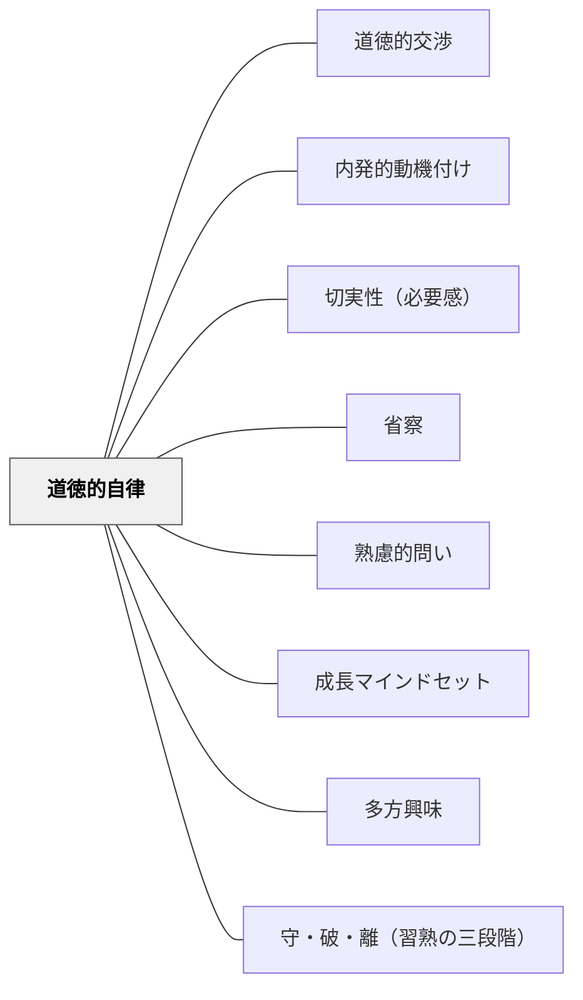

# 道徳的自律

> 「わが上なる星空と、わが内なる道徳法則」——カント  
> 欲望は外から押し込まれるが、道徳法則は内から立ち上がる。人間が「正しいから行う」と決断するとき、自然界の因果律から自由になる。

---

## [Pattern Connection]

**カント（1788）統合：**

- **補強する既存パタン**：[[パタン/道徳的交渉]] — Herbart/牧口の「道徳的交渉」（道徳的問いが深い学習関与を生む）の哲学的基盤を、カントの自律概念が提供する。「これは正しいか」という問いが機能するのは、人間に道徳法則を内側から立法する力（理性）が備わっているから。
- **深化する既存パタン**：[[パタン/内発的動機付け]] — SDT の「自律性（Autonomy）」概念は、カントの道徳的自律の現代心理学的な反映である。Deci & Ryan が「外から押しつけられた行動より自ら選んだ行動の方が質が高い」と実証したことを、カントは「欲望に従う受動性より理性による自己立法の方が人間的自由に近い」と哲学的に先取りしていた。
- **新次元を加えるパタン**：[[パタン/切実性（必要感）]] — 「自分に必要だ」という切実性には二層ある。欲望レベルの切実性（お腹が空いた、褒められたい）と、道徳的レベルの切実性（これは正しい・これが自分の使命だ）。後者はより根本的で長期的な動機の燃料になる。
- **波及するパタン**：[[パタン/省察]] — カント倫理の探求は自己の行動を問い直す「省察」の最も深い形。[[パタン/成長マインドセット]] — 「能力は変えられる」という信念の根底には、自然因果律から自由な意志主体（カント的自律）があることを示唆する。

---

## 背景（Context）

イマヌエル・カント（1788）は『実践理性批判』の末尾で、人間が真の意味で敬意を感じる二つのものを挙げた——「わが上なる星空」と「わが内なる道徳法則」。

「欲望」——お腹が空いた、怖い、褒められたい——はすべて肉体や環境という外部の条件に縛られた**受動的なもの**である。これは動物も持つ。人間も欲望を持つが、それだけであれば自然の因果連鎖の一部に過ぎない。

人間を動物と区別するのは、「どんなに状況が厳しくとも、これが正しいから私は行う」と**理性を発動する力**である。これをカントは**自律（Autonomie）**と呼んだ。自律とは自分で自分に法則を与えること（自己立法）——欲望に押し流されることの反対。

## 問題（Problem）

学習のほとんどが「欲望の構造」で設計されている：テストで良い点を取りたい（褒賞欲求）、叱られたくない（回避欲求）、みんなと同じでいたい（帰属欲求）。

これらは短期的に機能するが、欲望が満たされれば消える動機である。学校を出た後も学び続ける人間、正しいと信じることを圧力の中でもやり遂げる人間は、欲望の設計では育たない。

## 力のかたち（Forces）

- 欲望は環境・報酬・罰に縛られた受動的動機——外部条件が変われば消える
- 道徳的自律は外部条件に依存しない能動的動機——理性が内から立法する
- しかし道徳法則は押しつけられるものでなく、問い直しと選び直しを経て内側から引き受けるもの
- 既成の規範（超自我）を批判・吟味することなく受け入れるだけでは「自律」でなく「服従」になる
- 全否定の破壊（ニヒリズム）だけでも「自律」にならない——問い直しの後に「より高い次元で引き受ける」統合が必要
- この統合には時間がかかる——数年ではなく数十年の射程での成長

## 解決（Solution）

**学習者が「誰かに言われたから」でなく「自分がそれを正しいと判断するから行う」という体験を設計する。そのためには、規則・価値観・知識を問い直す機会と、問い直した上で自ら引き受ける機会を、両方意図的に作る。**

---

### 授業での実装

**問い返す機会をつくる**

「先生・教科書がそう言うから」でなく「自分はこれをどう判断するか」を問う瞬間を設ける。答えが決まっている確認問題ではなく、複数の立場が成り立つ道徳的問い（[[パタン/道徳的交渉]]）が入口になる。

**圧力の中で正しいことをやり遂げる体験をつくる**

誰も見ていなくても正しく行動できるか、仲間が違う選択をしてもブレずにいられるか——そのような「道徳的筋肉」を鍛える小さな体験の場を授業設計に組み込む。

**「引き受ける」ことと「服従する」ことを区別する**

ルールや価値観を問い直した上で「やはりこれが正しい」と自ら結論することと、疑わず従うことは、外から見ると同じに見えても内側がまったく違う。前者が自律であり、後者は服従。この区別を学習者と一緒に考える。

**長い時間軸で見る**

中学生の「切実な必要感」、大学での病的なまでの没頭、既存規範の全否定、そして20年かけた統合——これが道徳的自律の典型的な育ち方である。短期の効果を求めず、種を蒔くことに徹する。

## 結果（Consequences）

- 外部の報酬・評価がなくなっても学び続ける習慣が育つ
- 社会的圧力に流されず、自分の判断を持てる市民が育つ
- 既成の権威・規範を問い直せる批判的思考と、問い直した上で価値を引き受ける統合的思考の両方が育つ
- ただし、道徳的自律を強制することは矛盾——「自律しなさい」という命令は自律を破壊する。種を蒔き、時間を待つしかない

## 関連パタン

- [[パタン/道徳的交渉]] — 道徳的問いを学習の中心に据える実践的パタン。道徳的自律はその哲学的基盤
- [[パタン/内発的動機付け]] — SDT の「自律性」はカント的自律の現代心理学的反映
- [[パタン/切実性（必要感）]] — 道徳的切実性（「これが正しい・これが使命だ」）は欲望的切実性より根本的
- [[パタン/省察]] — 自分の行動・価値観を問い直す省察がカント的自律の実践的形態
- [[パタン/熟慮的問い]] — 授業全体を動かす本質的な問いは道徳的自律を育てる入口になる
- [[パタン/成長マインドセット]] — 「変えられる」という信念は、自然の因果律から自由な意志主体の存在を前提とする
- [[パタン/多方興味]] — 道徳的興味は多方興味の一つ（Herbart/牧口）
- [[パタン/守・破・離（習熟の三段階）]] — 既成規範の習得（守）・批判的解体（破）・より高い次元での統合（離）は道徳的自律の発達モデルと重なる

---

## クラスター図

## Actionable Insight

- 「誰かに言われたからではなく、自分が正しいと思うから」という理由で何かをやり遂げる体験を月1回でも設ける——「正しいから行う」という感覚の積み重ねが道徳的自律の筋肉になる
- 学習内容に「これは正しいのか、あなたはどう判断するか？」という問いを1つ添える——答えのない問いへの接触が道徳的思考力を育てる
- 「先生がそう言うから」に対して「でも自分はどう思う？」を返す習慣を教師自身が持つ——権威への服従でなく自律的な判断を育てる最初の一手
- ルールを破った子を叱る前に「なぜそのルールがあるか、自分ならどうするか」を問う——罰による服従でなく、道徳的思考を育てる機会として使う
- 教師自身が「これが正しい・これが自分の使命だ」という道徳的切実性を持っているかを問い直す——教師の道徳的自律が子どもの道徳的自律の最大のモデルになる

---

## 出典

Kant, I. (1788). *Kritik der praktischen Vernunft* [実践理性批判]. 
邦訳: カント著, 波多野精一・宮本和吉・篠田英雄訳（1979）『実践理性批判』岩波書店.

→ カント vs ラカンの統合的考察は [[文献/義務と欲望の倫理学：カント vs ラカン]] を参照。道徳法則（カント）と根源的欲望のエンジン（ラカン）をアウフヘーベンする視点が道徳的自律の実践をより立体的にする。

> 「わが上なる星空と、わが内なる道徳法則——この二つのものは、思いをはせるほどに、また長く考えるほどに、ますます新たに高まる驚嘆と畏敬の念で心を満たす」——カント『実践理性批判』終結部
