# 道徳的自律

> 「わが上なる星空と、わが内なる道徳法則」——カント  
> 欲望は外から押し込まれるが、道徳法則は内から立ち上がる。人間が「正しいから行う」と決断するとき、自然界の因果律から自由になる。

---

## [Pattern Connection]

**道徳形而上学の基礎づけ（1785）統合：**

- **哲学的起源の追加**：本パタンは主に『実践理性批判』（1788）を出典としてきたが、道徳的自律の中核概念（善意志・義務に基づいた行為・定言命法・自律の原理）はすべて3年前の『道徳形而上学の基礎づけ』（1785）で初めて提示された。本文献は道徳的自律の真の源泉である
- **善意志との接続**：「道徳的自律 = 正しいから行う」の内実は、カントが1785年に特定した「善意志（guter Wille）」である。善意志は才能・幸運・感情の条件に依存しない唯一の無条件的な善——義務そのものを動機とする意志。[[パタン/善意志（義務に基づいた行動）]] がこの側面を深掘りする
- **自律の原理の起源**：「自律（Autonomie）= 意志が自分自身に法則を与えること」という定義が1785年に確立された。他律（他のものに法則を求めること）との対比が道徳的自律の意味を明確にする——幸福・神の意志・本性・完全性に法則を求める限り他律であり、自律にならない
- **定言命法の論理構造**：道徳的自律を「欲望でなく理性による自己立法」として理解するとき、その論理形式が定言命法の三定式——①普遍化の定式（全員がやったらどうなるか）②人格の定式（他者を目的として扱っているか）③目的の国の定式（自律的立法者の共同体の成員として）
- **波及するパタン**：[[パタン/目的の国（互いを目的として扱う学びの共同体）]] — 道徳的自律を持つ者たちが共同で立法する場として目的の国の概念が位置づく

**カント（1788）統合：**

- **補強する既存パタン**：[[パタン/道徳的交渉]] — Herbart/牧口の「道徳的交渉」（道徳的問いが深い学習関与を生む）の哲学的基盤を、カントの自律概念が提供する。「これは正しいか」という問いが機能するのは、人間に道徳法則を内側から立法する力（理性）が備わっているから。
- **深化する既存パタン**：[[パタン/内発的動機づけ]] — SDT の「自律性（Autonomy）」概念は、カントの道徳的自律の現代心理学的な反映である。Deci & Ryan が「外から押しつけられた行動より自ら選んだ行動の方が質が高い」と実証したことを、カントは「欲望に従う受動性より理性による自己立法の方が人間的自由に近い」と哲学的に先取りしていた。
- **新次元を加えるパタン**：[[パタン/切実性（必要感）]] — 「自分に必要だ」という切実性には二層ある。欲望レベルの切実性（お腹が空いた、褒められたい）と、道徳的レベルの切実性（これは正しい・これが自分の使命だ）。後者はより根本的で長期的な動機の燃料になる。
- **波及するパタン**：[[パタン/省察]] — カント倫理の探求は自己の行動を問い直す「省察」の最も深い形。[[パタン/成長マインドセット]] — 「能力は変えられる」という信念の根底には、自然因果律から自由な意志主体（カント的自律）があることを示唆する。

**純粋理性批判（1781/1787）補足統合：**

- **理論哲学と実践哲学の接続**：『純粋理性批判』（理論理性批判）は「人間は何を認識できるか」を問い、現象の世界（自然の因果連鎖）の認識の限界を示す。『実践理性批判』（本パタンの主出典）は「人間は何をすべきか」を問い、現象の因果連鎖を超えた自由の世界（道徳）を開く。二つは表裏一体——認識の限界が自由の領域を確保する構造になっている。
- **感性と悟性の協働との接続**：[[パタン/感性と悟性の協働]] が「認識における感性と悟性の協働」を示すなら、道徳的自律は「実践における欲望（感性的傾向性）と理性（道徳法則）の関係」を扱う。認識論と倫理学でカントは同じ構造（受動的素材 vs 能動的形式）を繰り返している。

**プラトン『プロタゴラス』（前387年頃）統合——プロメテウス神話と普遍的道徳的素地：**

- **「全員にアイドースとディケーを」——道徳的自律の普遍的根拠**：プロタゴラスが語るプロメテウス神話（322c〜d）でゼウスはアイドース（恥・自制）とディケー（正義）を「すべての人間に」与えた——例外なく。これはカントの「理性を持つ者は誰でも道徳法則を自己立法できる」という普遍的自律論の神話的先行形態として読める。道徳的自律の根拠は「一部の優れた人だけ」にあるのでなく、人間であることに内在する。
- **計量術（メトレーティケー）とアクラシアの再定義（357e）**：「快楽に征服される（アクラシア）」を「性格の弱さ」でなく「誤った計量——時間的バイアスによる近い快楽の過大評価——という無知（アグノイア）」として定義し直した。これは道徳的自律の問題を「意志力の問題」ではなく「知識・技術の問題」として扱い直す転換を与える。カントの道徳的自律が「理性による自己立法」を強調するとすれば、プロタゴラスの計量術はその理性的操作の具体的な手続きを与える。
- **立場の逆転エピローグ（361a〜362a）——道徳的自律の最深のアポリア**：対話の結末でソクラテスとプロタゴラスの立場が逆転する（ソクラテスが「徳は知識だから教えられる」、プロタゴラスが「徳は知識ではないかもしれない」）。これは「道徳的自律を強制することは矛盾」（本パタンの結果欄）の哲学的実演——対話そのものが教えることのパラドクスを体現する。
- **波及するパタン**：[[パタン/計量術（メトレーティケー）]] — アクラシアを無知として扱い、計量技術の教育へ；[[文献/プロタゴラス（プラトン）]] — 本統合の出典

**プラトン『メノン』（前387年頃）統合——「徳は教えられるか」という根本問題：**

- **道徳的自律の根本問いとしての「徳（アレテー）は教えられるか」**：プラトン『メノン』（70a〜71e）の出発問題は「徳は教えられるか・訓練で身につくか・生まれつきか」——これはカントの道徳的自律（「外から押し込まれるのでなく内から立法する」）の哲学的先駆けとして読める。「教えられた徳」はカントの意味では他律（他者が与えた法則）であり、真の徳（道徳的自律）は「自分が正しいと判断するから行う」内的自由を要する
- **フロネーシス（実践的知恵）と「譲渡不能の徳」**：『メノン』の暫定結論（99e〜100a）は「徳は神的な運命（テイア・モイラ）によって備わる」——これは「徳そのものが知識として教えられない」ことの表現。フロネーシス（実践的知恵）はその人の経験・判断力・実践と一体化しており、情報として伝達できない。カントの「道徳法則は理性の事実として自己証明する」（実践理性批判）と同じ構造——道徳的自律の根拠は外から証明されるのでなく内から確かめられる
- **エレンコス（論駁）と道徳的問い直し**：ソクラテスのエレンコス（アリステイデスやペリクレスの息子たちが父の徳を受け継げなかった、89e〜96e）は、「道徳的徳は親から子へ伝達できない」ことの現実的証拠として機能する。これは「道徳的自律を強制することは矛盾」（本パタンの結果欄）の古典的実例
- **補強するパタン**：[[パタン/アポリアの設計]] — 道徳的問い直しの場面設計；[[パタン/エピステーメーとドクサ（知識と正しい考え）]] — 道徳的知識もドクサ（暗記した規範）からエピステーメー（自律的に引き受けた価値）へと深化する必要がある
- **波及するパタン**：[[文献/メノン（プラトン）]] — 本統合の出典

**啓蒙とは何か（1784）統合：**

- **啓蒙と道徳的自律の関係**：道徳的自律は「正しいから行う」（実践的自律）であるが、その前提として「自分の理性で考える」という啓蒙的自律（Sapere aude）が必要。啓蒙は道徳的自律の**認識論的条件**である。未成年状態（他者の指導なしに理性を使えない状態）を克服しないと、道徳的判断も外から与えられた基準を受け入れるだけになる
- **理性の公的利用との接続**：道徳的自律の実践には「自分の道徳的判断を公的に語る勇気」が必要。カントが「論ずることは自由に、ただし服従せよ」と言うとき、学者として道徳的問いを公に語る（公的利用）と、職務として服従する（私的利用）を区別した。教室での道徳的議論はこの公的利用の練習にほかならない
- **波及するパタン**：[[パタン/啓蒙（自分の理性を使う勇気）]] — 道徳的自律の前段階としての啓蒙。「考える習慣」が「正しいから行う」の基礎になる

**プラトン『ゴルギアス』（前380年頃）統合——節度（ソーフロシュネー）と宇宙的調和：道徳的自律の古代的根拠：**

- **節度（ソーフロシュネー）としての魂の秩序（506e〜507a）**：カリクレスとの対話でソクラテスは「徳はなにか秩序の力によって秩序づけられ、調和づけられたもの」と定義する。「調和した魂は節度ある魂であり、節度ある魂がよい魂だ」——道徳的自律の本質が「内なる秩序と調和」として表現される。カントの「内なる道徳法則」の古代ギリシア版として読める
- **宇宙的調和としての道徳（508a）**：「天も地も、神々も人々も、すべてを一つに結びつけているのは協同であり、友愛であり、調和であり、節度であり、正義なのだ」——道徳的自律は単なる個人の選択でなく、宇宙的秩序（コスモス）への参与として位置づけられる。カントの道徳法則が「自然の因果連鎖から自由な理性の領域」を示すのに対し、プラトンは道徳を宇宙の秩序そのものと接続する
- **カリクレスの強者的快楽主義への論駁（481b〜506d）**：カリクレスは「自然の正義」として「強者が多くを持ち、欲望を最大限に満たすことが善だ」と主張する。ソクラテスはこれを内的矛盾として論駁する：快楽と善は同一ではない——快苦は同時に並行して存在するが、善と悪は相互排他的であるから。これは「欲望に従う生（他律）」と「理性による自己立法（自律）」の対比としてカント的に解釈できる
- **罰は治療——道徳的矯正の論理（476a〜480e）**：「不正をして罰せられることは、魂の病を治療されること」——これは「道徳的自律を強制することは矛盾」という本パタンの結果欄の命題を補完する。強制された規則への服従（他律）ではなく、罰という治療のプロセスを通じて、魂が内側から秩序を取り戻す（自律への移行）という論理構造がある
- **波及するパタン**：[[パタン/コラケイア（おべっか）]] — 快楽（コラケイア）vs善（テクネー）の区別は道徳的自律の実践的判断基準；[[文献/ゴルギアス（プラトン）]] — 本統合の出典

**プラトン『饗宴』（前380年頃）統合——エロスの究極目標としての徳：道徳的自律の根底的動機（206a–212a）：**

- **エロスの究極目標は「よいものを永遠に自分のものにすること」（206a）**：ディオティマはエロスの目的を「美しいものを手に入れること」ではなく「よいもの（善）を永遠に自分のものにすること」と定義する。これは道徳的自律の動機論として読める——道徳法則に従うのは「それが善いから」であり、外から課された規則への服従（他律）とは根本的に異なる
- **心の妊娠——徳を魂に宿す者の使命（207d–209e）**：ディオティマは「徳を心に宿す者」が「美しい心の持ち主に徳の話を語りかけ、教え導く」と言う。これは道徳的自律の「伝達できなさ」の哲学的基盤——「徳とは心に宿すもの」であり、外から植えつけられるものではない。カントの「道徳法則は内から立ち上がる」と同じ構造を、エロスの神話的言語で表現している
- **美の梯子の最終目標は「真実の徳（アレテー）」（212a）**：ディオティマの美の梯子は「美のイデアを見る」ことで終わらない。最終的に「真実の徳を生み出して育む」ことで神に愛される者になると言う——知的上昇（ドクサからエピステーメーへ）と道徳的完成（徳の産出）は同一の上昇プロセスの二側面である
- **エロスはダイモン：道徳的自律の媒介者（202d–203a）**：エロスが「神と人間の間を媒介するダイモン」であるように、道徳法則は「自然因果律の世界（現象）と自由の世界（本体）の間を媒介する」——どちらも「二つの次元の間」を生きる存在・原理として定義される
- **補強点**：道徳的自律の「内から立ち上がる」という性質が、エロス（欠如から生まれる欲求）というプラトン的概念によって動機論的に補強される。「なぜ人間は道徳的自律を求めるのか」——エロスという根底的な欲求（よいものを永遠に自分のものにしたい）がその動力であるという見方
- **波及するパタン**：[[パタン/美の梯子（エロスの道）]] — 美の梯子の上昇が道徳的自律の段階的実現過程；[[文献/饗宴（プラトン）]] — 本統合の出典

**プラトン『パイドン』（前380年頃）統合——魂の配慮（epimeleia psyches）：道徳的自律の究極目標（107c–d, 115e, 118a）：**

- **「教育と養育だけが死後にも伴う」（107c–d）**：ソクラテスは「魂は死後も、この人生で得た教育と養育だけを伴って冥府に赴く」と言う。これは道徳的自律の教育的根拠の最深部——技術・スキル・評判・財産はすべて肉体的条件に属し、「魂の内側に刻まれた徳」だけが残る。カントの「義務から行動する」という道徳的自律と、「魂に徳を宿す」というプラトンのエピメレイア・プシューケースは、同一の教育目標の二つの表現である
- **「語り方が魂に悪を作り込む」（115e）**：「立派でない仕方で語ることは、なんらかの悪を魂のうちに作り込む」——道徳的自律の観点から、教師の言葉・語り方・問いの立て方は単なる伝達手段でなく、学習者の魂の質（道徳的素地）に直接作用する。これはカントの「定言命法的な問い」が学習者の道徳的思考の型を形成するのと同じ構造
- **ソクラテスの最後の言葉「配慮を怠らないでくれ」（118a）**：「クリトンよ、ぼくたちはアスクレピオスの神様に雄鶏をお供えする借りがある。君たちはお返しをして、配慮（epimeleia）を怠らないでくれ。」——「哲学すること＝魂の配慮」の連鎖を弟子たちに委ねる遺言。道徳的自律の究極の目的は「魂の配慮の連鎖」であり、それは人から人へと受け継がれる
- **「哲学は死の練習」と道徳的自律（67e）**：「哲学者は死にゆくことを練習している」——感覚的快楽・評判・財産という欲望（他律的動機）を手放し、理性と魂の自律的活動だけを残す練習。「死の練習」は「道徳的自律の練習」の哲学的表現として読める
- **補強点**：道徳的自律の「内から立ち上がる」という性質が、「魂の配慮（epimeleia psyches）」という終生の実践として定式化される。「教えること」の究極目的は魂の質の向上——これが道徳的自律の教育哲学的根拠としてソクラテスの最後の言葉に集約される
- **波及するパタン**：[[パタン/アナムネーシス（想起としての学び）]] — 魂の配慮の内実はアナムネーシス（魂の内なる知識の目覚め）；[[パタン/ミソロゴス（言論嫌い）]] — 魂の配慮（探究の継続）はミソロゴス（探究の放棄）への対抗力；[[文献/パイドン（プラトン）]] — 本統合の出典

**プラトン『ソクラテスの弁明』（前399年・執筆前390年代）統合——「吟味されない生」と魂の配慮：道徳的自律の実践宣言（38a, 29d–30b）：**

- **「吟味されない生は人間として生きるに値しない」（38a）**：ソクラテスの弁明の最重要教育哲学的命題。自分の信念・行動・価値観を常に問い直す実践なしに「人間として生きること」にならない——道徳的自律の日常的な実践形態の宣言。カントの「理性による自己立法」の具体的な日々の姿がここにある
- **魂への配慮（エピメレイア・プシューケース、29d–30b）の公的宣言**：「金銭や評判より魂を善くすることに配慮せよ」という勧告を、ソクラテスは死刑のリスクを前にして公の場で語った。これは道徳的自律の「外から押し込まれた」規範でなく「内から立ち上がった命令」の最も劇的な例——死刑を宣告されても「哲学することをやめない」という自律的意志の最大の証明
- **神霊（ダイモーン）の声（31c–d）**：ソクラテスは「神霊の徴（ダイモニオン）」と呼ばれる内なる声に従って行動した。これはカントの「内なる道徳法則」の神話的・個人的な形態として読める——外の権威でなく内なる声に従うという自律の姿
- **「善き人には生きていても死んでしまっても、悪しきことは何一つない」（41d）**——道徳的自律を貫いた者への哲学的保証。カントの「道徳的な人間には倫理的な尊厳がある」と同じ構造
- **補強点**：道徳的自律の「内から立ち上がる」という性質が、「魂の配慮（epimeleia psyches）」という終生の実践として、かつ社会的・公的な宣言として表現された。ソクラテスの弁明はカントの道徳哲学の最も強烈な前例であり、同時に「なぜ道徳的自律を公的に表明しなければならないか」という実践的次元を加える
- **波及するパタン**：[[パタン/パレーシア（真実を語る勇気）]] — 道徳的自律を公的に表明することがパレーシア；[[パタン/産婆役としての教師]] — 「魂の配慮」は産婆役の最終目的；[[文献/ソクラテスの弁明（プラトン）]] — 本統合の出典

**J.S. ミル（1867）大学教育について——独断なき倫理教育：**

- **「倫理体系の比較」が道徳的自律を育てる**：ミルは道徳哲学の講義について、「一つの体系の側に立って他の体系すべてを攻撃することではなく、アリストテレス学派・エピクロス学派・ストア学派・キリスト教などすべての体系を人類にとってより有益な行為規則の確立に役立てる努力をすること」であるべきと述べた。これは道徳的自律の育成として読める——一つの権威的な答えに服従するのではなく、複数の立場を比較することで学習者が自分の判断を形成する。
- **「授業は探究の精神で」——カントの啓蒙と重なる**：ミルの「授業は独断的な態度ではなく、探究の精神をもって行われるべきです」という原則は、カントの「自分の理性を使う勇気（Sapere aude）」と同じ構造を持つ。独断的な道徳教育は「他律」であり、比較と問い直しのプロセスが「自律」への道。
- **「学生の判断を助長し陶冶することが教師の重要な任務」**：ミルは「特にこの道徳の問題に関しては、自らの判断を学生に押しつけることなく、むしろ学生の判断を助長し陶冶することが教師の重要な任務となります」と述べた。これは道徳的自律の育成の具体的な教師論であり、「自律しなさいという命令は自律を破壊する」という本パタンの結果欄の命題を、教師の実践的指針として具体化している。
- **補強するパタン**：[[パタン/道徳的交渉]] — 複数の倫理的立場を比較する授業設計；[[パタン/啓蒙（自分の理性を使う勇気）]] — 独断なき探究の精神；[[パタン/専門以前の人間形成]] — 人格形成としての道徳教育
- **波及するパタン**：[[文献/大学教育について（J.S.ミル）]] — 本統合の出典

**実践理性批判１（中山元訳）統合：**

- **自由と道徳法則の相互依存**：実践理性批判の序文でカントが示す最重要の関係構造——「道徳法則は自由の認識根拠（ratio cognoscendi）」「自由は道徳法則の存在根拠（ratio essendi）」。「すべき（Sollen）」という声が聞こえるとき、「できる（Können）」という自由が証明される。道徳的自律の「なぜ人間に自律できる自由があるのか」という問いへの直接の答え
- **理性の事実（Faktum der Vernunft）**：道徳法則は証明によって確立されるのでなく、純粋理性の事実として自己証明する。「道徳法則は意識のうちで疑いを持ちえない事実として示される——その証明は道徳法則自身である」。これは道徳的自律の出発点が「外から証明される」のでなく「内から確かめられる」ことを意味する
- **なすべきだからなしうる（Sollen→Können）**：「死刑の威嚇下でも偽証を拒否できるか」という思考実験——「できるかどうか分からないが、すべきだとは分かる」という応答が自由の証明になる。「義務がある」と感じることは「その義務を果たす自由がある」ことの証明。困難に見える課題や不正義に直面したとき、「すべきだ」という感覚が「できる」の根拠になる
- **波及するパタン**：[[パタン/省察]] — 「自分の行動原理（Maxime）は普遍的法則として妥当しうるか」という問いが省察の最も深い形式。[[文献/実践理性批判１（カント、中山元訳）]] — 本統合の主出典

---

**プラトン『国家』（前380年頃）——ギュゲスの指輪・魂の三区分：道徳的自律の古代的問いと構造論：**

- **ギュゲスの指輪（第2巻）——道徳的自律の根本問い**：グラウコンは透明になれる指輪の思考実験で「かりにこのような指輪が二つあったとして……正義のうちにとどまって……鋼鉄のように志操堅固な者など、ひとりもいまいと思われましょう」と挑戦する。これは道徳的自律の根本問い——「見られていなくても正しく行動できるか」——の古代哲学版。カントの道徳的自律（「正しいから行う」）はこの問いへの最も明確な答えである：道徳法則は外部の眼差し（見られていること）に依存しない内的命令である
- **魂の三区分（第4巻）——道徳的自律の構造論**：プラトンは魂を理知的部分（logistikon）・気概の部分（thymoeides）・欲望的部分（epithymētikon）の三区分とした。道徳的自律とはこの文脈では「理知的部分が気概を同盟者として欲望的部分を統治している状態」——カントの「理性による欲望への克服」の三元論的精緻化として読める。気概（thymoeides）が「欲望に打ち勝とうとする意志」として独立して機能する点は、カントには明示的でない要素を加える。→[[概念/魂の三区分]]
- **正義 = 魂の調和（第4巻）——道徳的自律の古代的定義**：「三つの部分を、いわばちょうど音階の調和をかたちづくる高音・低音・中音の三つの音のように調和させ」ること——これがプラトンの「魂の正義（内的秩序）」である。カントが「道徳的自律 = 内なる道徳法則への従属」と定義するのに対し、プラトンは「道徳的自律 = 魂の三部分の調和」として構造化する。外部の力でなく内的な秩序として生きること、という点で両者は一致する
- **ゴルギアスの節度（ソーフロシュネー）との連続性**：ゴルギアスの「節度ある魂 = 秩序づけられた魂」（506e–507a）が国家の「正義ある魂 = 三部分の調和」に発展する。両者でプラトンは一貫して「道徳は外から強制されるのでなく内的秩序から生まれる」と論じる
- **補強する点**：ギュゲスの指輪は現代のSNS・匿名環境・監視社会での道徳的自律問題と直結する授業素材になる。→[[パタン/アポリアの設計]]：思考実験としてのアポリアを引き起こす設計の古代的モデル
- **波及するパタン**：[[概念/魂の三区分]] — 三区分の詳細な構造論；[[文献/国家（プラトン）]] — 本統合の出典

**ルソー（1762）社会契約論——道徳的自由：自律の近代的再定式化：**

- **道徳的自由＝自分が定めた法への服従（第一篇第八章）**：ルソーは社会契約による自由の変容を三段階で記述する——自然的自由（欲望のままに動く自由）→ 市民的自由（一般意志の範囲内での自由）→ 道徳的自由（自分が定めた法への服従）。この「道徳的自由」は、カントが3年後（1785年）に「自律（Autonomie）＝意志が自分自身に法則を与えること」として定式化したものの哲学的先駆けとして読める。ルソーはカント的自律の概念を、政治哲学の文脈で先行して記述していた。
- **「欲望だけに動かされるのは奴隷の状態」**：ルソーの「欲望だけに動かされることは奴隷の状態であり、自分に定めた法への服従こそが自由である」（第一篇第八章）は、カントの「自然の因果連鎖への受動的服従（欲望に従う）」と「理性による自己立法（自律）」という対比と同型。ルソーは政治的文脈で、カントは道徳的文脈で同じ区別を立てた。
- **三種の自由の教育的階梯**：ルソーの三段階（自然的自由→市民的自由→道徳的自由）は、学習者の成長段階として読める——欲求のままに動く段階から、クラスのルール（市民的自由）を経て、自分で設定した目標に自律的に従う段階（道徳的自由）へ。道徳的自律の「育ち方」を段階モデルとして描き出す。
- **「自由であるよう強制される」（第一篇第七章）**：一般意志への服従を強制されることは自由の実現である、というルソーの命題は、「道徳的自律を強制することは矛盾」（本パタンの結果欄）の命題と鋭く対話する。ルソーの逆説が成り立つのは、自由が「気ままな欲望の充足」でなく「道徳的自律」を意味するときだけ——カントの自律概念との完全な接続。
- **補強点**：カントの自律概念の「先行形態」としてルソーを位置づけることで、道徳的自律が啓蒙思想という広い文脈の中から生まれた概念であることが見えてくる。ルソーは「政治的合意」の文脈で、カントは「個人の理性」の文脈で、同じ「自己立法」という構造に辿り着いた。
- **波及するパタン**：[[パタン/社会契約（合意による共同体）]] — 道徳的自由の政治的実現形態；[[パタン/一般意志（共通善への問い）]] — 一般意志への自律的服従が道徳的自由の社会的表現；[[文献/社会契約論／ジュネーヴ草稿（ルソー）]] — 本統合の出典

---

**ウィトゲンシュタイン（1921）論理哲学論考——倫理の超越論性：道徳的自律の言語哲学的根拠：**

- **「倫理は超越論的である」（6.421）——カントとの深い共鳴**：ウィトゲンシュタインは命題6.421で「倫理は語られえない。倫理は超越論的である。（倫理と美はひとつである。）」と言う。これはカントの「道徳法則は自然の因果連鎖の外にある」という命題の言語哲学的対応物として読める。カントが「現象界の因果連鎖を超えた自由の領域」に道徳法則を置いたように、ウィトゲンシュタインは「事実の世界（語れるもの）の外」に倫理を置く。道徳法則は事実ではない——それは語られえない超越論的なものである。

- **「善き意志は世界の限界を変える」（6.43）——道徳的自律の存在論的変化**：命題6.43は道徳的自律の哲学的核心を存在論的言語で記述する。
  > 「善き意志、あるいは悪しき意志が世界を変化させるとき、変えうるのはただ世界の限界であり、事実ではない。」（6.43）
  これはカントの「Sollen → Können（すべきだ → できる）」構造の ウィトゲンシュタイン的翻訳である。道徳的自律は単なる行動変容ではなく「世界の限界（その人が住む世界の構造）を変える」変化である——「幸せな人の世界は不幸な人の世界と異なる」（6.43）。

- **語れない倫理が「示される（Zeigen）」しかない**：倫理が「語られえない超越論的なもの」（6.421）であるとすれば、倫理教育は「語る（Sagen）」によっては機能しない。「正直であれ」という命題を語るだけでは誠実さは育たない——誠実さは誠実な人の存在を通じてのみ「示される」。これは「道徳的自律を強制することは矛盾」（本パタンの結果欄）のウィトゲンシュタイン的補強である。

- **「世界の意義は世界の外にある」（6.41）——教育目的の問い**：倫理の超越論性は、教育の目的そのものが「世界の外」から来ることを示唆する。「なぜ学ぶのか」「何のために教育するのか」——その答えは事実の並び替えからは導き出せない。道徳的自律を育てる教育の目的は、常に「世界の意義」を問う超越論的な問いに向かって開かれている必要がある。

- **補強点**：カントの道徳的自律（「理性による自己立法」）が実践哲学の立場から道徳を位置づけるとすれば、ウィトゲンシュタインは言語哲学の立場から同じ構造に辿り着く——どちらも「倫理は事実の世界の外にある」という命題で合流する。「語れない倫理は示されるしかない」という洞察が、「道徳的自律を強制することは矛盾」という本パタンの結果欄に哲学的な説明を加える。

- **波及するパタン**：[[パタン/語ることと示すこと（言語の限界）]] — 倫理は語れず示されるのみ——道徳教育の設計原理；[[パタン/タウマゼイン（驚きから始まる探究）]] — Das Mystische（「世界があること」の神秘）が道徳的驚きの根底にある；[[文献/論理哲学論考（ウィトゲンシュタイン）]] — 本統合の出典

---

**スピノザ（1677）Spinoza on Free Will（Kisner, 2026）統合——自己決定としての自律：**

- **スピノザの自由の定義（1DEF7）とカントの自律の比較**：カントの「自律（Autonomie）＝意志が自分自身に法則を与えること」（1785）に対し、スピノザは「自由＝それ自身の必然性のみによって行動すること」（1DEF7）と定義する。どちらも「外部から決定されるのでなく、自己の内から行動が生まれること」を自律の核心に置く。スピノザはそれをさらに「コナトゥス（自己の本質的な力）から行動すること」として身体的・感情的次元にまで拡張する。→[[パタン/コナトゥス（自己保存と自己拡張の力）]]
- **両立論（Compatibilism）と道徳的自律**：スピノザは「因果決定論と自由は両立する」という両立論を主張する。自由を脅かすのは「決定されること」ではなく「外部から決定されること」。カントが「自然の因果連鎖から自由な意志」として道徳的自律を位置づけるのに対し、スピノザは「外部の強制からの自由」として自律を定義する——形而上学の違いはあるが、「外部への服従が自律を破壊する」という実践的結論は一致する。
- **前向き責任と道徳的自律の補完**：道徳的自律を「強制することは矛盾」（本パタンの結果欄）というテーゼをスピノザ的に補強する。スピノザにとって、応報的罰（復讐・報復）は悲しみ（コナトゥスの減少）から生まれる道徳的に誤った実践——「道徳的自律を育てるためにも、罰でなく前向き責任の設計が必要」という実践的示唆を加える。→[[パタン/前向き責任（罰でなく未来のために）]]
- **適切な観念と道徳的自律**：スピノザの「適切な観念（adequate idea）」——自分の本性だけから生まれる自己完結した理解——は、カントの道徳的自律（「内から立ち上がる道徳法則」）の認識論的対応物として読める。丸暗記した道徳規則（不適切な観念）でなく、自分で問い直して引き受けた価値（適切な観念）こそが道徳的自律の基盤。
- **波及するパタン**：[[パタン/自己決定としての学び（外からではなく内から）]] — スピノザ的自律の学習設計への具体化；[[文献/Spinoza on Free Will（Kisner）]] — 本統合の出典

---

## 背景（Context）

イマヌエル・カント（1788）は『実践理性批判』の末尾で、人間が真の意味で敬意を感じる二つのものを挙げた——「わが上なる星空」と「わが内なる道徳法則」。

「欲望」——お腹が空いた、怖い、褒められたい——はすべて肉体や環境という外部の条件に縛られた**受動的なもの**である。これは動物も持つ。人間も欲望を持つが、それだけであれば自然の因果連鎖の一部に過ぎない。

人間を動物と区別するのは、「どんなに状況が厳しくとも、これが正しいから私は行う」と**理性を発動する力**である。これをカントは**自律（Autonomie）**と呼んだ。自律とは自分で自分に法則を与えること（自己立法）——欲望に押し流されることの反対。

## 問題（Problem）

学習のほとんどが「欲望の構造」で設計されている：テストで良い点を取りたい（褒賞欲求）、叱られたくない（回避欲求）、みんなと同じでいたい（帰属欲求）。

これらは短期的に機能するが、欲望が満たされれば消える動機である。学校を出た後も学び続ける人間、正しいと信じることを圧力の中でもやり遂げる人間は、欲望の設計では育たない。

## 力のかたち（Forces）

- 欲望は環境・報酬・罰に縛られた受動的動機——外部条件が変われば消える
- 道徳的自律は外部条件に依存しない能動的動機——理性が内から立法する
- しかし道徳法則は押しつけられるものでなく、問い直しと選び直しを経て内側から引き受けるもの
- 既成の規範（超自我）を批判・吟味することなく受け入れるだけでは「自律」でなく「服従」になる
- 全否定の破壊（ニヒリズム）だけでも「自律」にならない——問い直しの後に「より高い次元で引き受ける」統合が必要
- この統合には時間がかかる——数年ではなく数十年の射程での成長

## 解決（Solution）

**学習者が「誰かに言われたから」でなく「自分がそれを正しいと判断するから行う」という体験を設計する。そのためには、規則・価値観・知識を問い直す機会と、問い直した上で自ら引き受ける機会を、両方意図的に作る。**

---

### 授業での実装

**問い返す機会をつくる**

「先生・教科書がそう言うから」でなく「自分はこれをどう判断するか」を問う瞬間を設ける。答えが決まっている確認問題ではなく、複数の立場が成り立つ道徳的問い（[[パタン/道徳的交渉]]）が入口になる。

**圧力の中で正しいことをやり遂げる体験をつくる**

誰も見ていなくても正しく行動できるか、仲間が違う選択をしてもブレずにいられるか——そのような「道徳的筋肉」を鍛える小さな体験の場を授業設計に組み込む。

**「引き受ける」ことと「服従する」ことを区別する**

ルールや価値観を問い直した上で「やはりこれが正しい」と自ら結論することと、疑わず従うことは、外から見ると同じに見えても内側がまったく違う。前者が自律であり、後者は服従。この区別を学習者と一緒に考える。

**長い時間軸で見る**

中学生の「切実な必要感」、大学での病的なまでの没頭、既存規範の全否定、そして20年かけた統合——これが道徳的自律の典型的な育ち方である。短期の効果を求めず、種を蒔くことに徹する。

## 結果（Consequences）

- 外部の報酬・評価がなくなっても学び続ける習慣が育つ
- 社会的圧力に流されず、自分の判断を持てる市民が育つ
- 既成の権威・規範を問い直せる批判的思考と、問い直した上で価値を引き受ける統合的思考の両方が育つ
- ただし、道徳的自律を強制することは矛盾——「自律しなさい」という命令は自律を破壊する。種を蒔き、時間を待つしかない

## 関連パタン
- [[パタン/暫定的道徳（行動しながら考える）]]
- [[パタン/必然性の洞察（怒りと自己批判を手放す）]]
- [[パタン/欲望の倫理]]
- [[パタン/エソスと習慣形成]]
- [[パタン/計量術（メトレーティケー）]]
- [[パタン/崇高なもの（感性を超える教育体験）]]
- [[パタン/どうすべきか？（当為）]]
- [[パタン/善的道徳的価値の創造]]
- [[パタン/非社交的社交性（学びを駆動する創造的摩擦）]]
- [[パタン/パタンは、フッサールの言う本質と言えるのだろうか。]]
- [[パタン/コペルニクス的転回（認識論）]]
- [[パタン/啓蒙（自分の理性を使う勇気）]] — 道徳的自律の認識論的前段階。理性を使う習慣なしに道徳的自律は育たない
- [[パタン/善意志（義務に基づいた行動）]] — 道徳的自律の動機的側面。義務に基づいた行動が道徳的自律の外的表現
- [[パタン/目的の国（互いを目的として扱う学びの共同体）]] — 道徳的自律を持つ者たちが共同立法する場の設計
- [[パタン/道徳的交渉]] — 道徳的問いを学習の中心に据える実践的パタン。道徳的自律はその哲学的基盤
- [[パタン/内発的動機づけ]] — SDT の「自律性」はカント的自律の現代心理学的反映
- [[パタン/切実性（必要感）]] — 道徳的切実性（「これが正しい・これが使命だ」）は欲望的切実性より根本的
- [[パタン/省察]] — 自分の行動・価値観を問い直す省察がカント的自律の実践的形態
- [[パタン/熟慮的問い]] — 授業全体を動かす本質的な問いは道徳的自律を育てる入口になる
- [[パタン/成長マインドセット]] — 「変えられる」という信念は、自然の因果律から自由な意志主体の存在を前提とする
- [[パタン/多方興味]] — 道徳的興味は多方興味の一つ（Herbart/牧口）
- [[パタン/守・破・離（習熟の三段階）]] — 既成規範の習得（守）・批判的解体（破）・より高い次元での統合（離）は道徳的自律の発達モデルと重なる
- [[パタン/コラケイア（おべっか）]] — 快楽（コラケイア）vs善（テクネー）の区別は道徳的自律の実践的判断基準（ゴルギアス）
- [[パタン/美の梯子（エロスの道）]] — 美の梯子の最終目標は「真実の徳を生み出すこと」（饗宴212a）；道徳的自律の段階的実現
- [[パタン/パレーシア（真実を語る勇気）]] — 道徳的自律を公的に表明する行為はパレーシア；ソクラテスの弁明はその最高の実践例
- [[パタン/専門以前の人間形成]] — 人間形成の核心として道徳的自律を位置づける——ミル（1867）の教養教育論
- [[文献/ソクラテスの弁明（プラトン）]] — 「吟味されない生」（38a）・魂への配慮（29d–30b）の出典
- [[文献/大学教育について（J.S.ミル）]] — 独断なき倫理教育・比較による自律的判断形成
- [[概念/魂の三区分]] — 道徳的自律の構造論；理知的部分が気概を同盟者として欲望的部分を統治する状態
- [[文献/国家（プラトン）]] — ギュゲスの指輪・魂の三区分・正義＝魂の調和の出典
- [[パタン/社会契約（合意による共同体）]] — 道徳的自由（ルソー）の政治的実現形態；合意から生まれる共同体への自律的参加
- [[パタン/一般意志（共通善への問い）]] — 一般意志に自ら従うことが道徳的自由→道徳的自律へと深化する
- [[文献/社会契約論／ジュネーヴ草稿（ルソー）]] — 道徳的自由・三種の自由・「自由であるよう強制される」の出典（ルソー, 1762）
- [[パタン/語ることと示すこと（言語の限界）]] — 倫理は語れず示されるのみ——Sagen/Zeigenの区別が道徳教育の設計原理を与える
- [[文献/論理哲学論考（ウィトゲンシュタイン）]] — 倫理の超越論性（6.421）・善き意志は世界の限界を変える（6.43）の出典
- [[パタン/コナトゥス（自己保存と自己拡張の力）]] — スピノザ的自己決定の動機的基盤；コナトゥスから行動することが自律の身体的・感情的次元
- [[パタン/自己決定としての学び（外からではなく内から）]] — 1DEF7の教育的実装；自律を「自己の本性から行動すること」として設計する
- [[パタン/前向き責任（罰でなく未来のために）]] — 道徳的自律を強制することが矛盾なら、罰でなく前向き責任の実践が必要になる（スピノザ）
- [[文献/Spinoza on Free Will（Kisner）]] — 自由＝自己決定・両立論・前向き責任論・コナトゥスの出典（Kisner, 2026）

---

## クラスター図

```mermaid
flowchart LR
    ne98193e5beb3e79a84e887aae5be8b["道徳的自律"]
    ne69aabe5ae9ae79a84e98193e5beb3efbc88e8a18ce58b95e38197e381aae3818ce38289e88083e38188e3828befbc89["暫定的道徳（行動しながら考える）"]
    ne5bf85e784b6e680a7e381aee6b49ee5af9fefbc88e68092e3828ae381a8e887aae5b7b1e689b9e588a4e38292e6898be694bee38199efbc89["必然性の洞察（怒りと自己批判を手放す）"]
    ne6acb2e69c9be381aee580abe79086["欲望の倫理"]
    ne382a8e382bde382b9e381a8e7bf92e685a3e5bda2e68890["エソスと習慣形成"]
    ne8a888e9878fe8a193efbc88e383a1e38388e383ace383bce38386e382a3e382b1e383bcefbc89["計量術（メトレーティケー）"]
    ne5b487e9ab98e381aae38282e381aeefbc88e6849fe680a7e38292e8b685e38188e3828be69599e882b2e4bd93e9a893efbc89["崇高なもの（感性を超える教育体験）"]
    ne381a9e38186e38199e381b9e3818de3818befbc9fefbc88e5bd93e782baefbc89["どうすべきか？（当為）"]
    ne59684e79a84e98193e5beb3e79a84e4bea1e580a4e381aee589b5e980a0["善的道徳的価値の創造"]
    ne99d9ee7a4bee4baa4e79a84e7a4bee4baa4e680a7efbc88e5ada6e381b3e38292e9a786e58b95e38199e3828be589b5e980a0e79a84e691a9e693a6efbc89["非社交的社交性（学びを駆動する創造的摩擦）"]
    ne38391e382bfe383b3e381afe38081e38395e38383e382b5e383bce383abe381aee8a880e38186e69cace8b3aae381a8e8a880e38188e3828be381aee381a0e3828de38186e3818be38082["パタンは、フッサールの言う本質と言えるのだろうか。"]
    ne382b3e3839ae383abe3838be382afe382b9e79a84e8bba2e59b9eefbc88e8aa8de8ad98e8ab96efbc89["コペルニクス的転回（認識論）"]
    ne59593e89299efbc88e887aae58886e381aee79086e680a7e38292e4bdbfe38186e58b87e6b097efbc89["啓蒙（自分の理性を使う勇気）"]
    ne59684e6848fe5bf97efbc88e7bea9e58b99e381abe59fbae381a5e38184e3819fe8a18ce58b95efbc89["善意志（義務に基づいた行動）"]
    ne79baee79a84e381aee59bbdefbc88e4ba92e38184e38292e79baee79a84e381a8e38197e381a6e689b1e38186e5ada6e381b3e381aee585b1e5908ce4bd93efbc89["目的の国（互いを目的として扱う学びの共同体）"]

    ne98193e5beb3e79a84e887aae5be8b --- ne69aabe5ae9ae79a84e98193e5beb3efbc88e8a18ce58b95e38197e381aae3818ce38289e88083e38188e3828befbc89
    ne98193e5beb3e79a84e887aae5be8b --- ne5bf85e784b6e680a7e381aee6b49ee5af9fefbc88e68092e3828ae381a8e887aae5b7b1e689b9e588a4e38292e6898be694bee38199efbc89
    ne98193e5beb3e79a84e887aae5be8b --- ne6acb2e69c9be381aee580abe79086
    ne98193e5beb3e79a84e887aae5be8b --- ne382a8e382bde382b9e381a8e7bf92e685a3e5bda2e68890
    ne98193e5beb3e79a84e887aae5be8b --- ne8a888e9878fe8a193efbc88e383a1e38388e383ace383bce38386e382a3e382b1e383bcefbc89
    ne98193e5beb3e79a84e887aae5be8b --- ne5b487e9ab98e381aae38282e381aeefbc88e6849fe680a7e38292e8b685e38188e3828be69599e882b2e4bd93e9a893efbc89
    ne98193e5beb3e79a84e887aae5be8b --- ne381a9e38186e38199e381b9e3818de3818befbc9fefbc88e5bd93e782baefbc89
    ne98193e5beb3e79a84e887aae5be8b --- ne59684e79a84e98193e5beb3e79a84e4bea1e580a4e381aee589b5e980a0
    ne98193e5beb3e79a84e887aae5be8b --- ne99d9ee7a4bee4baa4e79a84e7a4bee4baa4e680a7efbc88e5ada6e381b3e38292e9a786e58b95e38199e3828be589b5e980a0e79a84e691a9e693a6efbc89
    ne98193e5beb3e79a84e887aae5be8b --- ne38391e382bfe383b3e381afe38081e38395e38383e382b5e383bce383abe381aee8a880e38186e69cace8b3aae381a8e8a880e38188e3828be381aee381a0e3828de38186e3818be38082
    ne98193e5beb3e79a84e887aae5be8b --- ne382b3e3839ae383abe3838be382afe382b9e79a84e8bba2e59b9eefbc88e8aa8de8ad98e8ab96efbc89
    ne98193e5beb3e79a84e887aae5be8b --- ne59593e89299efbc88e887aae58886e381aee79086e680a7e38292e4bdbfe38186e58b87e6b097efbc89
    ne98193e5beb3e79a84e887aae5be8b --- ne59684e6848fe5bf97efbc88e7bea9e58b99e381abe59fbae381a5e38184e3819fe8a18ce58b95efbc89
    ne98193e5beb3e79a84e887aae5be8b --- ne79baee79a84e381aee59bbdefbc88e4ba92e38184e38292e79baee79a84e381a8e38197e381a6e689b1e38186e5ada6e381b3e381aee585b1e5908ce4bd93efbc89

    classDef hub fill:#f0f0f0,stroke:#555,color:#000,font-weight:bold
    class ne98193e5beb3e79a84e887aae5be8b hub
```

## Actionable Insight

- 「誰かに言われたからではなく、自分が正しいと思うから」という理由で何かをやり遂げる体験を月1回でも設ける——「正しいから行う」という感覚の積み重ねが道徳的自律の筋肉になる
- 学習内容に「これは正しいのか、あなたはどう判断するか？」という問いを1つ添える——答えのない問いへの接触が道徳的思考力を育てる
- 「先生がそう言うから」に対して「でも自分はどう思う？」を返す習慣を教師自身が持つ——権威への服従でなく自律的な判断を育てる最初の一手
- ルールを破った子を叱る前に「なぜそのルールがあるか、自分ならどうするか」を問う——罰による服従でなく、道徳的思考を育てる機会として使う
- 教師自身が「これが正しい・これが自分の使命だ」という道徳的切実性を持っているかを問い直す——教師の道徳的自律が子どもの道徳的自律の最大のモデルになる

---

## 出典

Kant, I. (1785). *Grundlegung zur Metaphysik der Sitten* [道徳形而上学の基礎づけ].
邦訳: カント著, 中山元訳（2012）『道徳形而上学の基礎づけ』光文社古典新訳文庫.

Kant, I. (1788). *Kritik der praktischen Vernunft* [実践理性批判]. 
邦訳: カント著, 中山元訳（2013）『実践理性批判 1』光文社古典新訳文庫.
→ [[文献/実践理性批判１（カント、中山元訳）]]

→ カント vs ラカンの統合的考察は [[文献/義務と欲望の倫理学：カント vs ラカン]] を参照。道徳法則（カント）と根源的欲望のエンジン（ラカン）をアウフヘーベンする視点が道徳的自律の実践をより立体的にする。
→ 古典的起源：[[文献/メノン（プラトン）]] — 「徳（アレテー）は教えられるか」という問いとフロネーシスの譲渡不能性は、カントの道徳的自律論の2000年前の哲学的先行問題。

→ 認識論的基盤：[[文献/純粋理性批判 1（カント、中山元訳）]] — 理論哲学（認識）と実践哲学（道徳）がどのように一体をなすかの出発点。

プラトン（中澤務訳）（2022）『ゴルギアス』光文社古典新訳文庫（K-Bフ 2-7）, pp.506e–508a.
→ 古典的源泉：[[文献/ゴルギアス（プラトン）]] — 節度（ソーフロシュネー）と宇宙的調和（508a）、カリクレスの快楽主義論駁（481b-506d）

> 「天も地も、神々も人々も、すべてを一つに結びつけているのは協同であり、友愛であり、調和であり、節度であり、正義なのだ。」——プラトン『ゴルギアス』508a

> 「わが上なる星空と、わが内なる道徳法則——この二つのものは、思いをはせるほどに、また長く考えるほどに、ますます新たに高まる驚嘆と畏敬の念で心を満たす」——カント『実践理性批判』終結部

プラトン（中澤務訳）（2013）『饗宴』光文社古典新訳文庫（Bフ 2-4）, pp.206a–212a. → [[文献/饗宴（プラトン）]]
