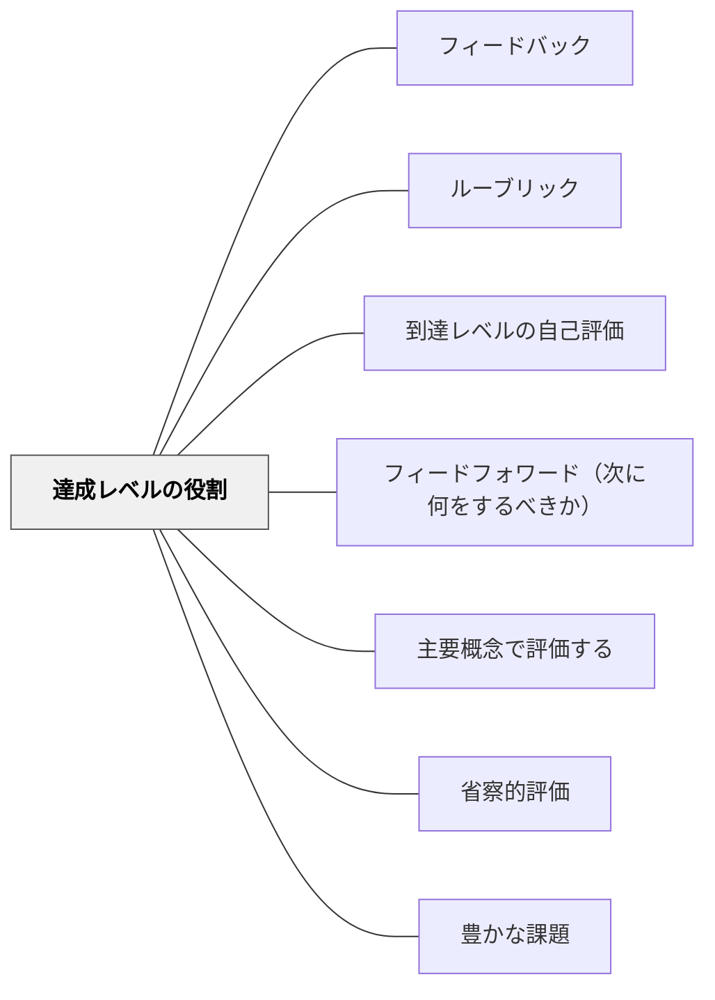

# 達成レベルの役割

> 「今の自分はどこにいるか」がわかれば、「次にどこへ向かうか」が見える。

## 背景（Context）

学習者が自分の現在地を把握し、次のステップへ向かうためには、達成の段階が明確に示されている必要がある。ルーブリックやレベル記述は、単なる評価ツールではなく、学習者が自分の状態を把握し、目指す方向を理解するための地図でもある。

特に自己調整学習の観点からは、学習者が「現在のレベル」と「目標レベル」の差を認識することが、学習意欲と学習行動の駆動力になる。

## 問題（Problem）

達成レベルの記述が評価者だけに使われ、学習者自身に内面化されていない場合、学習者は評価を「外から下される判定」として受け取り、自分の学習改善に活用できない。

また、レベルの記述が抽象的すぎると、学習者は「自分はどのレベルにいるか」を正確に把握できず、自己評価が機能しない。自分の現在地がわからなければ、改善の方向性も見えてこない。

## 力のかたち（Forces）

- レベル記述は詳細すぎると複雑になり、シンプルすぎると意味をなさない
- 学習者が達成レベルを理解するには、抽象的な記述だけでなく具体的な作品例との照合が必要
- 評価のためのレベルと、学習目標としてのレベルは異なる機能をもつが、共存させることができる

## 解決（Solution）

達成レベルを学習者と共に構築するか、少なくとも明示的に紹介・解説する時間を設ける。「今あなたはレベル2にいる、レベル3はこういう状態だ」と具体的な作品例や行動記述とともに示すことで、学習者は自分の現在地と目標の差（ギャップ）を認識できる。

特に効果的なのは、各レベルの作品例をコレクションとして見せることだ。「レベル3はこういうことが書けている文章だ」というモデルが目の前にあると、学習者は自分の作品と照らし合わせて評価できる。また、「今は2、次は3を目指す」という目標設定が具体的になり、自己調整学習が促進される。

## 結果（Consequences）

- 学習者が達成レベルを内面化し、自己評価と自己調整が可能になる
- フィードバックを受けたときに、それが自分のどのレベルへの言及なのかを理解できる
- 教師と学習者が共通のレベル言語をもつことで、フィードバックの対話が深まる

## 関連パタン

- [[パタン/フィードバック]] — 親パタン
- [[パタン/ルーブリック]] — 達成レベルを構造化したツール
- [[パタン/到達レベルの自己評価]] — 達成レベルの理解が自己評価の精度を高める
- [[パタン/フィードフォワード（次に何をするべきか）]] — 現在レベルと目標レベルの差を行動に転換する

- [[パタン/主要概念で評価する]] — 主要概念が達成レベルの中核をつくる
- [[パタン/省察的評価]] — 達成レベルの自己評価が省察的学習を深める
- [[パタン/豊かな課題]] — 達成レベルが豊かな課題のゴール設計になる

## クラスター図

## Actionable Insight

- 各レベルの作品例（良い例・普通の例）をセットで見せてから「今の自分はどのレベルか」を書かせる——具体例との照合が自己評価の精度を高める
- ルーブリックに「レベル3はこういうことができている状態」という記述を作品例とともに掲示する——目に見えるゴールが学習者の自己調整を促す
- 「今は2、次は3を目指す」という一文を目標として書かせる——具体的な現在地と次のステップが自己調整学習を始動させる

## 出典

Hattie, J. (2009). *Visible Learning*. Routledge.
Clarke, S. (2014). *Outstanding Formative Assessment*. Hodder Education.
