# 達成規準の共同構築

> 達成規準（成功規準）は、教育者と被教育者が一緒に作ることが望ましい。

## 背景（Context）

達成規準（何ができれば「達成」とみなすか）は、一般的に教師が事前に作って提示する。しかしそれを「外から与えられたもの」として受け取る学習者は、規準を内面化しにくい。共同構築することで、規準が自分ごとになる。

## 問題（Problem）

教師だけが決めた規準は、学習者にとって意味が不明確になりやすい。「こうしなさい」という基準は覚えられても、「なぜそれが良いか」が体感的にわからないため、応用が効かない。

## 力のかたち（Forces）

- 共同構築には時間がかかる
- 実例を見る・分析するプロセスが共同構築を支える
- 学習者が構築した規準は、その後の自己評価・ピアフィードバックにも活用できる

## 解決（Solution）

**実例の分析・比較・振り返りを通じて、学習者と教師が一緒に「何ができれば良いか」を言語化する。**

共同構築の方法：
- 実例を比べて分析する（→[[パタン/実例を比べて分析する]]）
- 悪い例・良い例を見て、違いを言語化する
- 実際の学習後に、「よかったものの特徴」を振り返りで言語化する
- 学習者が作った規準をクラスで共有し精緻化する

## 結果（Consequences）

- 学習者が達成規準を「自分たちのもの」として内面化する
- 自己評価・ピアフィードバックの精度が上がる
- 規準を意識した学習行動が増える

## 関連パタン
- [[パタン/ゴールと実際のパフォーマンスレベルを比べる]]
- [[パタン/ジグソーパズル]]
- [[パタン/ねらっているゴール（目標や成功規準）の概念をもつ]]
- [[パタン/悪い実例を示す]]
- [[パタン/間違いがある達成規準を示す]]
- [[パタン/間違ったやり方をする]]
- [[パタン/技術やスキルの実演を分析する]]
- [[パタン/自己調整]]
- [[パタン/多様に想定される学習のねらい]]
- [[パタン/脱文脈化された達成規準]]

- [[パタン/フィードバック]] — 親パタン
- [[パタン/ギャップ]] — 共同構築した規準がギャップの基準になる
- [[パタン/実例を比べて分析する]] — 共同構築のための実践
- [[パタン/振り返りでのねらいの共同構築]] — 事後の共同構築
- [[パタン/ルーブリック]] — 共同構築した規準の可視化ツール

## クラスター図

```mermaid
flowchart LR
    ne98194e68890e8a68fe6ba96e381aee585b1e5908ce6a78be7af89["達成規準の共同構築"]
    ne382b4e383bce383abe381a8e5ae9fe99a9be381aee38391e38395e382a9e383bce3839ee383b3e382b9e383ace38399e383abe38292e6af94e381b9e3828b["ゴールと実際のパフォーマンスレベルを比べる"]
    ne382b8e382b0e382bde383bce38391e382bae383ab["ジグソーパズル"]
    ne381ade38289e381a3e381a6e38184e3828be382b4e383bce383abefbc88e79baee6a899e38284e68890e58a9fe8a68fe6ba96efbc89e381aee6a682e5bfb5e38292e38282e381a4["ねらっているゴール（目標や成功規準）の概念をもつ"]
    ne682aae38184e5ae9fe4be8be38292e7a4bae38199["悪い実例を示す"]
    ne99693e98195e38184e3818ce38182e3828be98194e68890e8a68fe6ba96e38292e7a4bae38199["間違いがある達成規準を示す"]
    ne99693e98195e381a3e3819fe38284e3828ae696b9e38292e38199e3828b["間違ったやり方をする"]
    ne68a80e8a193e38284e382b9e382ade383abe381aee5ae9fe6bc94e38292e58886e69e90e38199e3828b["技術やスキルの実演を分析する"]
    ne887aae5b7b1e8aabfe695b4["自己調整"]
    ne5a49ae6a798e381abe683b3e5ae9ae38195e3828ce3828be5ada6e7bf92e381aee381ade38289e38184["多様に想定される学習のねらい"]
    ne884b1e69687e88488e58c96e38195e3828ce3819fe98194e68890e8a68fe6ba96["脱文脈化された達成規準"]
    ne38395e382a3e383bce38389e38390e38383e382af["フィードバック"]
    ne382aee383a3e38383e38397["ギャップ"]
    ne5ae9fe4be8be38292e6af94e381b9e381a6e58886e69e90e38199e3828b["実例を比べて分析する"]
    ne68cafe3828ae8bf94e3828ae381a7e381aee381ade38289e38184e381aee585b1e5908ce6a78be7af89["振り返りでのねらいの共同構築"]

    ne98194e68890e8a68fe6ba96e381aee585b1e5908ce6a78be7af89 --- ne382b4e383bce383abe381a8e5ae9fe99a9be381aee38391e38395e382a9e383bce3839ee383b3e382b9e383ace38399e383abe38292e6af94e381b9e3828b
    ne98194e68890e8a68fe6ba96e381aee585b1e5908ce6a78be7af89 --- ne382b8e382b0e382bde383bce38391e382bae383ab
    ne98194e68890e8a68fe6ba96e381aee585b1e5908ce6a78be7af89 --- ne381ade38289e381a3e381a6e38184e3828be382b4e383bce383abefbc88e79baee6a899e38284e68890e58a9fe8a68fe6ba96efbc89e381aee6a682e5bfb5e38292e38282e381a4
    ne98194e68890e8a68fe6ba96e381aee585b1e5908ce6a78be7af89 --- ne682aae38184e5ae9fe4be8be38292e7a4bae38199
    ne98194e68890e8a68fe6ba96e381aee585b1e5908ce6a78be7af89 --- ne99693e98195e38184e3818ce38182e3828be98194e68890e8a68fe6ba96e38292e7a4bae38199
    ne98194e68890e8a68fe6ba96e381aee585b1e5908ce6a78be7af89 --- ne99693e98195e381a3e3819fe38284e3828ae696b9e38292e38199e3828b
    ne98194e68890e8a68fe6ba96e381aee585b1e5908ce6a78be7af89 --- ne68a80e8a193e38284e382b9e382ade383abe381aee5ae9fe6bc94e38292e58886e69e90e38199e3828b
    ne98194e68890e8a68fe6ba96e381aee585b1e5908ce6a78be7af89 --- ne887aae5b7b1e8aabfe695b4
    ne98194e68890e8a68fe6ba96e381aee585b1e5908ce6a78be7af89 --- ne5a49ae6a798e381abe683b3e5ae9ae38195e3828ce3828be5ada6e7bf92e381aee381ade38289e38184
    ne98194e68890e8a68fe6ba96e381aee585b1e5908ce6a78be7af89 --- ne884b1e69687e88488e58c96e38195e3828ce3819fe98194e68890e8a68fe6ba96
    ne98194e68890e8a68fe6ba96e381aee585b1e5908ce6a78be7af89 --- ne38395e382a3e383bce38389e38390e38383e382af
    ne98194e68890e8a68fe6ba96e381aee585b1e5908ce6a78be7af89 --- ne382aee383a3e38383e38397
    ne98194e68890e8a68fe6ba96e381aee585b1e5908ce6a78be7af89 --- ne5ae9fe4be8be38292e6af94e381b9e381a6e58886e69e90e38199e3828b
    ne98194e68890e8a68fe6ba96e381aee585b1e5908ce6a78be7af89 --- ne68cafe3828ae8bf94e3828ae381a7e381aee381ade38289e38184e381aee585b1e5908ce6a78be7af89

    classDef hub fill:#f0f0f0,stroke:#555,color:#000,font-weight:bold
    class ne98194e68890e8a68fe6ba96e381aee585b1e5908ce6a78be7af89 hub
```

## Actionable Insight

- 単元の最初に「良い作品の例」と「普通の作品の例」を2つ見せ、違いを子どもに言語化させる——実例分析から自然に達成規準が立ち上がる
- 子どもが言語化した規準を黒板にまとめ「これが自分たちの基準」として掲示する——共同構築した規準がピアフィードバックと自己評価の基盤になる
- 作品提出の前に「自分たちが決めた規準で自己評価する」時間を1分設ける——規準との照合が改善志向を育てる

## 出典

- Hattie, J. (2009). *Visible Learning: A Synthesis of Over 800 Meta-Analyses Relating to Achievement*. Routledge.（邦訳：原田信之訳（2018）『教育の効果―メタ分析による学力に影響を与える要因の効果の可視化』図書文化社）
- Clarke, S. (2005). *Formative Assessment in Action: Weaving the Elements Together*. Hodder Murray.
