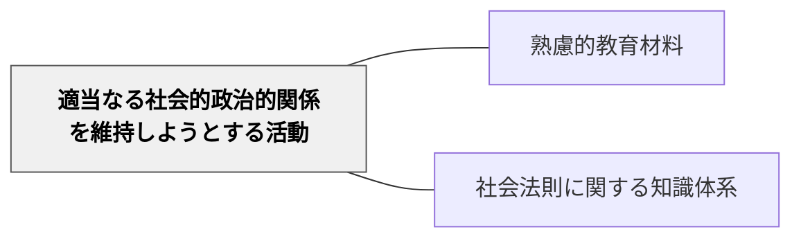

# 適当なる社会的政治的関係を維持しようとする活動

> 社会・歴史・政治を理解し、健全な市民として生きる知識。

## 背景（Context）

ハーバート・スペンサーの活動分類の第四項目。社会科学・歴史学・政治学・経済学など、社会的・政治的な関係を維持・改善するための知識・活動。社会科・公民・歴史の教科内容がここに含まれる。

## 問題（Problem）

社会科・歴史が「暗記科目」として扱われると、市民としての参加意識や批判的思考が育ちにくい。

## 力のかたち（Forces）

- 社会参加・民主主義の基盤となる教育内容
- 現代社会の複雑さが学習者の理解を困難にする

## 解決（Solution）

**社会・政治・歴史の内容を「市民として社会に参加するための知識」として位置づけ、現代社会の実際の問題と結びついた教材設計をする。**

## 結果（Consequences）

- 市民リテラシー・批判的思考が育つ
- 社会への当事者意識が高まる

## 関連パタン

- [[パタン/熟慮的教材教具]] — 親パタン
- [[パタン/社会法則に関する知識体系]] — 関連する知識体系

## クラスター図

## Actionable Insight

- 社会科・歴史の授業に「この問題は今の社会でどう現れているか？」を必ず結びつける——暗記科目から市民として参加するための知識へと学習の意味が変わる
- 時事ニュースや地域の問題と授業の内容を結びつけた教材を作る——現実の問題との接続が学習者の当事者意識と批判的思考を育てる
- 「市民として自分がこの問題にどう関われるか？」を考えさせる活動を単元に1回設ける——市民リテラシーは知識だけでなく参加の感覚から育つ

## 出典

- ハーバート・スペンサー（知識の分類）
- [[文献/熟慮的教育材料のパターンリスト（動画記録）]]
