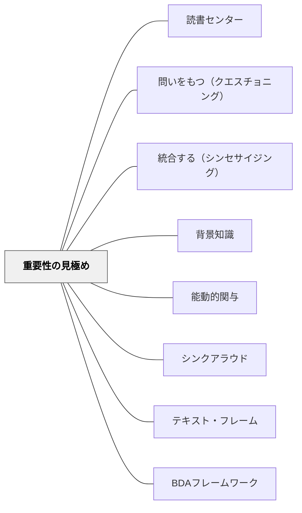

# 重要性の見極め

> 「面白い情報」と「重要な情報」は違う——テーマ・目的・問いに照らして「何が最も重要か」を選び取る力が、ノンフィクション読解の核心である。

---

## Pattern Connection

**Harvey & Goudvis（2007）統合（2026-05-17）：**

*Strategies That Work* 第10章は Determining Importance をノンフィクション読解の中核ストラテジーとして扱う。フィクション読解が「つながり・推論・問い」を重視するのに対し、ノンフィクション読解では「大量の情報の中から目的に照らして何が重要かを選ぶ」という判断が特に求められる。

- **既存パタンとの関連**：[[パタン/能動的関与]] の「目的を持って読む」という核と直接対応する。重要性は「何のために読むか」という目的によって変わるため、目的のない読書では重要性の判断が起きない
- **補強された点**：[[パタン/背景知識]] が読解力の最も強力な変数であることと対応し、背景知識が豊かなほど「何が重要か」の判断の精度が上がる——テーマを知っている読者は、テーマに関係する情報が「重要」と分かる
- **他のパタンへの波及**：[[パタン/統合する（シンセサイジング）]] — 重要な情報を選ぶことが統合の材料になる。[[パタン/問いをもつ（クエスチョニング）]] — 問いを持つことで「この問いに答えるために何が重要か」の判断ができる

---

## 背景（Context）

教室の蔵書の約80%はフィクションである。しかし、私たちが実生活で読むテキスト——新聞・雑誌・ノンフィクション・インターネット——の約80%はノンフィクションである（Harvey & Goudvis, 2007）。この不均衡は、学校の読書指導がノンフィクション読解を充分に扱ってこなかったことを意味する。

ノンフィクション読解には、フィクション読解と異なるスキルが必要だ。特に重要なのは「重要性の判断」——大量の情報の中から、自分の目的・テーマ・問いに照らして何を選び取るかを決める力である。

## 問題（Problem）

ノンフィクションを読んでいる子どもたちは、しばしば「すべての情報が大事」「面白い情報が重要」という判断をする。しかし「面白い情報」と「重要な情報」は違う——「ライオンは1日20時間眠る」は面白いが、「生態系の頂点捕食者としてのライオンの役割」が重要かどうかは目的次第だ。

目的なく読むと、重要性の判断は起きない。また、テキスト特徴（見出し・太字・グラフ）を活用しないと、ノンフィクションの「ナビゲーション・システム」を使いこなせない。

## 力のかたち（Forces）

- 「面白い」と「重要」は違う——子どもたちは「面白い」を重要と判断しやすい
- 重要性は目的次第——同じテキストでも「なぜ読むか」によって何が重要かは変わる
- ノンフィクションのテキスト特徴（見出し・太字・キャプション）は著者が「ここが重要」と読者に示すサイン
- 背景知識が豊かなほど、重要な情報とそうでない情報の区別がしやすい
- 情報が多すぎると「重要性の感覚麻痺」が起きる——選ぶ基準がないとすべてが同じに見える

## 解決（Solution）

**読む目的・問い・テーマを明確にし、テキスト特徴を活用しながら「面白い情報」と「重要な情報」を意識的に区別する。**

---

### 80%問題：教室の蔵書を点検する

Harvey & Goudvis の指摘：

> 「教室の蔵書の80%はフィクションだが、実生活で読むテキストの80%はノンフィクションだ」

**実践への示唆**：
- 教室の蔵書を棚卸しし、ノンフィクション比率を確認する
- 新聞・雑誌・パンフレット・図鑑・説明書をテキストとして読書指導に使う
- ノンフィクション読み聞かせを年間計画に組み込む

---

### ノンフィクション・テキスト特徴のナビゲーション

著者がテキスト特徴を「ここが重要」というサインとして使っていることを教える：

| テキスト特徴 | 著者のサイン | 読者の使い方 |
|---|---|---|
| **見出し・小見出し** | 「このセクションのテーマ」 | 読む前に「I Wonder」を立てる |
| **太字・イタリック** | 「この語は重要・専門用語」 | 止まって意味を確認する |
| **キャプション（説明文）** | 「この図表の要点」 | 図表と本文をつなぐ |
| **グラフ・図・年表** | 「数字・関係・変化の概観」 | 本文を読む前に見てから読む |
| **索引・用語集** | 「この本で特に重要な語」 | 分からない語の確認 |
| **目次** | 「本全体の構造と重要テーマ」 | 読む前に全体を把握する |

---

### Interesting vs Important：2列ノート

読書中に「面白い（Interesting）」と「重要（Important）」を分けて記録する：

| Interesting（面白い） | Important（重要） |
|----------------------|-----------------|
| 「南極の氷の下に湖がある！」 | 「温暖化で氷が溶けると海面が上昇する」 |

**指導のポイント**：
1. 最初は「重要と思う理由」を書かせる——「なぜそれが重要？何の目的で読んでいる？」
2. テーマや問いを事前に設定することで、重要性の基準が生まれる
3. 重要な情報には「なぜ重要か」を一言添える

---

### Overviewing（オーバービューイング）

読む前にテキスト全体を「概観」する戦略：

1. **目次を見る**——「何が書いてあるか」の地図を得る
2. **見出しと小見出しを読む**——セクションの構造を把握する
3. **図・グラフ・写真を見る**——視覚情報から内容を予測する
4. **最初の段落と最後の段落を読む**——著者の主張の入口と出口を知る

Overviewing を習慣にすることで、読む前から「何が重要か」の仮説ができ、読書が効率化する。

---

## 結果（Consequences）

- ノンフィクション読解で「すべての情報が等しく重要」という感覚から脱する
- テキスト特徴を積極的に使い、著者のナビゲーション・システムを理解して読めるようになる
- 「重要性は目的次第」という認識が育ち、読む前に目的を設定する習慣がつく
- 理科・社会・算数の説明テキストへのストラテジーの転移が起きる
- 「面白い情報の整理」ではなく「目的に沿った情報の選択」という情報処理能力が育つ

## 関連パタン
- [[パタン/読書センター]]

- [[パタン/問いをもつ（クエスチョニング）]] — 問いが重要性判断の基準を与える
- [[パタン/統合する（シンセサイジング）]] — 重要な情報を選んだ後に統合が起きる
- [[パタン/背景知識]] — 背景知識が重要性判断の精度を高める
- [[パタン/能動的関与]] — 目的を持って読むことが重要性判断を可能にする
- [[パタン/シンクアラウド]] — 重要性判断のプロセスをモデリングする
- [[パタン/テキスト・フレーム]] — テキストの構造（原因/結果・比較対比など）が重要性判断の枠組みになる
- [[パタン/BDAフレームワーク]] — Overviewing は Before フェーズの中核方略
- [[実践/テキストコーディング]] — 「*」（重要）・「I」（面白い）コーディングで区別を可視化する

## クラスター図

## Actionable Insight

- 理科・社会のテキストを使って「見出し・太字・グラフを先に見て、I Wonder を書く」を1回試す——ノンフィクション読書の入口が変わる
- 「面白い」と「重要」の2列ノートを1回やってみる——「これは面白い情報かな？重要な情報かな？」という問いを子どもたちが自分で立てるようになる
- 教室の本棚を一度点検する——ノンフィクションの割合が低ければ、図書室から借りるか、雑誌・パンフレットを読書の素材に加える

---

## 出典

Harvey, S., & Goudvis, A. (2007). *Strategies That Work: Teaching Comprehension for Understanding and Engagement* (2nd ed.). Stenhouse Publishers.

> "About 80 percent of the books in most classrooms are fiction, yet about 80 percent of reading done in the real world—newspapers, magazines, nonfiction books, Internet—is nonfiction."

[[文献/Strategies That Work（Harvey & Goudvis）]]
