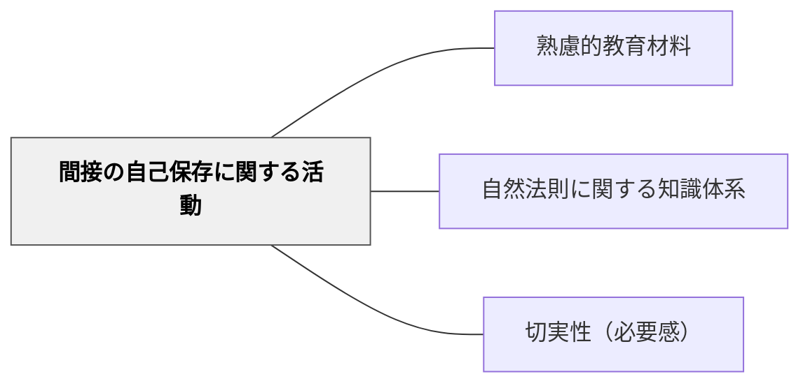

# 間接の自己保存に関する活動

> 数学・物理学・化学・生物学——自然を理解することで生活を支える知識。

## 背景（Context）

ハーバート・スペンサーの活動分類の第二項目。数学・物理学・化学・生物学・社会学など、自然法則や社会の仕組みを理解することで間接的に生活を豊かにし自己を守る知識・活動。現代学校教育の主要教科の多くがここに含まれる。

## 問題（Problem）

これらの教科が「試験のための知識」として扱われ、なぜそれを学ぶかという生活との関連が見えにくくなりがちである。

## 力のかたち（Forces）

- 科学的な知識が生活・社会の問題解決に役立つ
- 抽象度が高く学習者が意義を感じにくいことがある

## 解決（Solution）

**数学・理科などの教科を「生活・社会の問題を解決するための知識」として位置づけ、実生活との接続を意識した教材設計をする。**

## 結果（Consequences）

- 教科の意義が学習者に伝わりやすくなる
- 学習の切実性が高まる

## 関連パタン

- [[パタン/熟慮的教材教具]] — 親パタン
- [[パタン/自然法則に関する知識体系]] — 関連する知識体系
- [[パタン/切実性（必要感）]] — 意義を実感させる

## クラスター図

## Actionable Insight

- 単元の導入で「この知識がなければ解決が難しかった現実の問題」を1つ紹介する——学問が実際の生活・社会問題に役立っているという実感が学習の意義を生む
- 「もしこの法則を知らなかったら、日常生活で何が困るか」を学習者に考えさせる——知識の不在を想像することが知識の価値を浮き彫りにする
- 教科書の抽象的な内容を1つ選んで、現代の社会課題（環境問題・医療・テクノロジーなど）への応用を示す——切実性のある文脈が学習の必要感を高める

## 出典

- ハーバート・スペンサー（知識の分類）
- [[文献/熟慮的教育材料のパターンリスト（動画記録）]]
