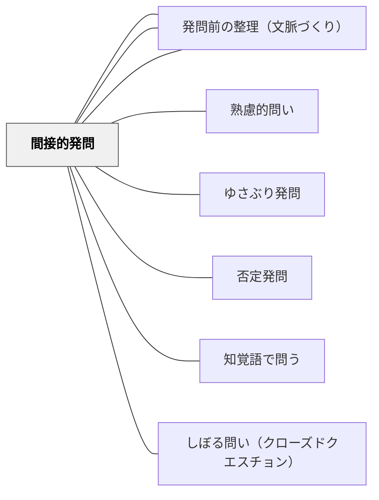

# 間接的発問

> 「よく言われる良い発問」はほぼ全て間接的である——授業のねらいをそのまま問わず、具体・場面・表現を迂回して問うことで、どんな子も「考えたい」「話したい」という気持ちが湧く。

## [Pattern Connection]

- **既存パタンとの関連**：[[パタン/熟慮的問い]] の「発問技術」カテゴリおよび [[パタン/知覚語で問う]] と連動する。本パタンはそれらの実践的基礎として「間接性」という原則を独立させたものである。
- **補強された点**：「間接性は良い発問の第一条件」という実践知が、宇佐美寛（1985）の「知覚語」研究と土居の事例研究によって補強される。間接的発問は「子どもの考えたい気持ち」と「参加しやすさ」を同時に実現する。
- **他のパタンへの波及**：[[パタン/発問のグラデーション]] において、間接性の工夫を「削ぎ落とす」ことが「自然な問い」への移行に直結する。

## 背景（Context）

授業のねらいを達成するための発問は、ねらいをそのまま言葉にした「直接的な問い」で問われることが多い。「中心人物の心情はどうか」「情景描写とは何か」——これらは間違いではないが、多くの子が「考えたい」「話したい」という気持ちにはなりにくい。

## 問題（Problem）

直接的な発問では、すでに答えを知っている子だけが活躍し、多くの子は参加できない状況になりやすい。また「答えなくてはいけない」という圧力がかかり、試されている感じが強く出る。

## 力のかたち（Forces）

- 直接的に問われると「言葉で説明しなければ」という難しさが先に立つ
- 間接的に問われると「具体的な場面・表現について考える」ため参加しやすい
- 知覚語（見える・聞こえる・感じるなど感覚的な語）で問うと子どもの経験が多く引き出される（宇佐美寛（1985））
- 間接性が高い発問ほど「不自然」になり、子どもが自分でもてる問いからは遠ざかる

## 解決（Solution）

**授業のねらいの「内容」は変えずに、文言を間接的にする——具体的な叙述・場面・表現を起点とし、ねらいを迂回して問う。**

### 直接的な問いを間接的に変換する

| 直接的な発問 | 間接的な発問 |
|---|---|
| 「ごんはどんな気持ちだったか」 | 「なぜごんはわざわざ兵十のかげぼうしをふみふみ付いていったのか」 |
| 「バスの運転手の仕事はどんなものか」 | 「バスの運転手は運転中、どこを見ているか」（有田和正） |
| 「中心人物の心情が変化したところはどこか」 | 「一番心情が大きく変化した場所（○ページ○行目）を見つけてください」 |
| 「この段落の役割は何か」 | 「この段落は、いらないよね」（ゆさぶり型の間接的発問） |
| 「主張と例との関係はどうなっているか」 | 「この説明文の例はあやとりでなくてはいけませんか。他の例でもいいですか」 |

### 知覚語で問う

宇佐美寛（1985）が「知覚語」と呼ぶ直接的な感覚を示す語——「見る」「見える」「聞こえる」「感じる」——を使うと、子どもの経験が豊かに引き出される。「バスの運転手の仕事は？」より「バスの運転手はどこを見ているか？」が間接的であり知覚語的でもある。

### 「かさこじぞう」の実践（長崎伸仁）

「どんな気持ち？」を繰り返していたら子ども達がうんざりし始めた。「なぜとんぼりとんぼりなの？」と問い方を変えたとたん、子どもが前のめりになった。発問の「間接性」が授業を変えた事例。

## 結果（Consequences）

- どんな子も「自分が考えていいんだ」と感じて参加しやすくなる
- 授業のねらいを達成しつつ、思考の活性化と参加の広がりを同時に生む
- 間接的発問を意識化することで、工夫を「削ぐ」方向（グラデーション）も設計できる

## 関連パタン
- [[パタン/発問セット指示]]

- [[パタン/熟慮的問い]] — 発問設計の上位パタン
- [[パタン/ゆさぶり発問]] — 間接的発問の典型的応用形
- [[パタン/否定発問]] — 否定・誤りを使う間接的発問の一形態
- [[パタン/知覚語で問う]] — 知覚語による間接性
- [[パタン/発問のグラデーション]] — 間接性を削ぐことで自然な問いへ
- [[パタン/しぼる問い（クローズドクエスチョン）]] — 具体的に限定する間接的発問と重なる
- [[パタン/発問前の整理（文脈づくり）]] — 間接的発問も文脈があってこそ機能する

## クラスター図

## Actionable Insight

- 明日の授業の発問を1つ選び「より間接的に言い換えると？」を試みる——叙述の一言・場面の一場面を起点に問い直すだけで変わる
- 「知覚語」で問えているかチェックする——「どんな気持ち？」を「どんな顔をしていたか？」「どんなふうに歩いていたか？」に変えるだけで子どもの反応が変わる
- 名人の発問（有田、長崎など）を一つ模倣してみる——模倣から間接性のパターンが体に入る

## 出典

- 土居正博（2026）『自分で考え、学べる子を育てる！ 発問の技術』学陽書房
- 宇佐美寛（1985）「再び『定石化』を疑う」『現代教育科学』1985年4月号
- [[文献/自分で考え、学べる子を育てる！ 発問の技術]]

> 「これまでの実践の中で『良い発問』とされているものほぼ全てが、『間接的』という条件を満たしている」——土居正博（2026）
