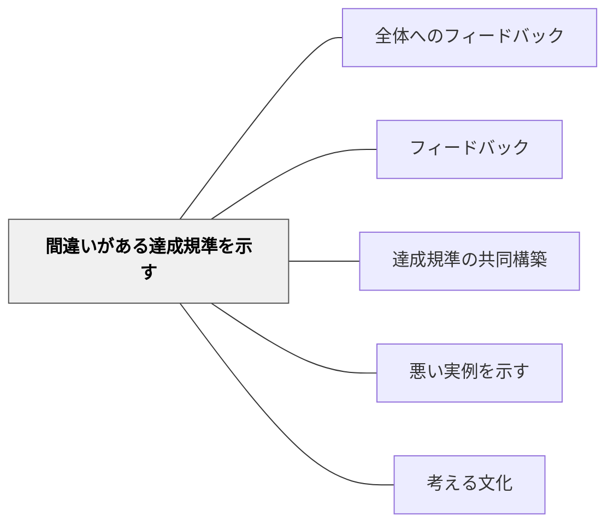

# 間違いがある達成規準を示す

> 誤りを含む規準を批評することで、批評的思考力と規準の理解が深まる。

## 背景（Context）

通常、達成規準は「正しいもの」として示されるが、あえて「誤り・不完全さ・矛盾」を含む達成規準を提示し、「何が問題か」を学習者に問うことで、規準について深く考える機会が生まれる。

## 問題（Problem）

達成規準を受動的に受け取るだけでは、それが「なぜ重要か」の理解が浅い。誤りを発見・批評する経験が、規準への深い関わりを生む。

## 力のかたち（Forces）

- 「誤りを探す」という活動は知的興奮を伴う
- 誤りに気づくためには正しい規準への理解が必要
- 発見した誤りを「なぜ間違いか」と言語化することで理解が深まる

## 解決（Solution）

**意図的に誤りや矛盾を含む達成規準（チェックリスト・ルーブリックなど）を提示し、「どこが問題か・どう直すか」を学習者と検討する。**

例：
- 「文字を丁寧に書く」という規準が「速く書く」と同じチェックリストに入っている→ 矛盾を見つける
- 曖昧すぎる表現（「良い感じに書く」）を含む規準 → 改善する
- 達成不可能な規準を含むリスト → 現実的な規準を再構築する

## 結果（Consequences）

- 学習者が達成規準を主体的に検討・評価する力を育てる
- 規準設計への参加意識が高まる

## クラスター図

## Actionable Insight

- 意図的に曖昧な表現（「良い感じに書く」）を含むルーブリックを提示し「何が問題か・どう直すか」を問う——批評の対象が規準そのものになることで規準への深い理解が生まれる
- 矛盾する規準（「丁寧に書く」と「速く書く」が同一基準に含まれるなど）を学習者に発見させる——矛盾の発見が批判的思考の実践になる
- 発見した問題を「では正しい規準はどう書けばよいか」と再構築させる——批評から構築へのプロセスが学習者の規準への主体的な関与を育てる

## 出典

- 一つの教育のパタン・ランゲージ（岩井輝久）

## 関連パタン
- [[パタン/全体へのフィードバック]]

- [[パタン/フィードバック]] — 親パタン
- [[パタン/達成規準の共同構築]] — 批評から規準を再構築する
- [[パタン/悪い実例を示す]] — 作品への悪例と対比
- [[パタン/考える文化]] — 批評的に考える文化
