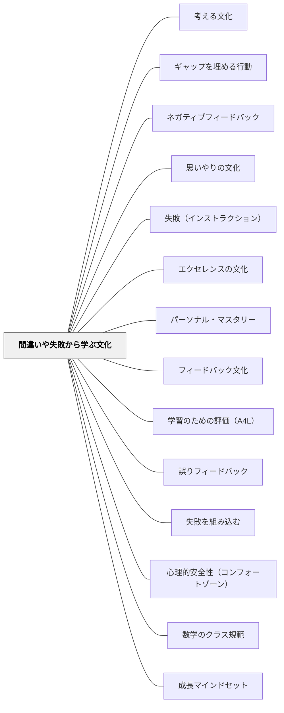

# 間違いや失敗から学ぶ文化

> 間違いは問題ではない。間違いを恥じる文化が問題である。

## [Pattern Connection]

Boaler（2016）の **Mathematical Mindsets** は「間違いにも必ずロジックがある」という視点を加える。子どもの間違いをただ「誤り」として扱わず、「その考え方がどこから来たか」を見ることで、誤りは学習の材料になる。

- **補強点**：「間違いは脳を成長させる」という神経科学的根拠（Moser et al., 2011）を、教師が子どもに伝えられる言葉で提供。ERN（Error-Related Negativity）とPe（Error Positivity）という2つの神経反応が間違い時に発生し、成長マインドセット者はこの反応が有意に大きい——つまり間違いから実際により多くを学ぶ
- **拡張点**：「完全に間違っていても、子どもの思考の中には必ず何らかのロジックがある」——そのロジックを探して承認することで、心理的安全性が深まる。また「全問正解で帰ってきたら、今日は何も学ばなかったんだね」という Carol Dweck の親へのメッセージ——難しさのないところに学習はない
- **他のパタンへの波及**：[[パタン/成長マインドセット]]・[[パタン/失敗を組み込む]]・[[パタン/数学のクラス規範]]

**Boaler の言葉**：
> 「子どもが間違えたとき、「それは違います」と言う代わりに、「ああ、あなたが何をしているか分かります。〜のところまでは合っています。でも、分数については…」と返す。子どもの思考には常に何らかのロジックがある。そのロジックを見つけることが、教師の仕事である。」

---

## 背景（Context）

間違いは学習の必然的副産物である。間違いのないところに学習はない。しかし多くの教室では、間違いは「できないこと」の証拠として扱われ、学習者は間違いを隠そうとする。

## 問題（Problem）

間違いを恐れる文化では、学習者は確実に正解できることしかやろうとしない。チャレンジを避け、難しい問いに向かわず、フィードバックを受け取れない。

## 力のかたち（Forces）

- 脳科学的研究：間違えたとき（特に正しい答えを直後に知ったとき）が最も記憶に定着しやすい
- 間違いの原因は様々（知識不足・理解の誤り・注意ミス・新しい挑戦）；原因によって対応が異なる
- 「失敗を称える」文化も形式化すると意味を失う

## 解決（Solution）

**間違いを「学習データ」として扱い、分析・共有・感謝する文化をつくる。**

実践例：
- 「今日の素晴らしい間違い」を毎授業取り上げる
- 教師自身の失敗・試行錯誤を率直に共有する
- 「間違えてくれてありがとう、おかげでみんなが学べた」を習慣にする
- 間違いの種類を分類する（ケアレスミスと概念的誤解は異なる）
- リトライ・再挑戦を当然のこととする
- クシャクシャにした紙を脳に見立てて線が増えるほど成長と色付ける（Boaler の実践）
- 上海の授業観察：教師が意図的に間違えた生徒を選んで発表させる——間違いを誇りとする文化

**ERN/Pe神経反応（Moser et al., 2011）**：
間違いを犯したとき、たとえ自分で気づいていなくても、脳は2段階の神経反応を起こす：
- ERN（Error-Related Negativity）：間違い直後の反応——脳がエラーを検知
- Pe（Error Positivity）：ERN後の反応——間違いに注意を向け、次の行動を調整

成長マインドセットを持つ人はPe反応が有意に大きく、間違いに注意を向けて実際により多くを学ぶ。固定マインドセットの人はPe反応が小さく、間違いから目を背ける。

## 結果（Consequences）

- 学習者がより難しい問いに向かうようになる
- 間違いが共有されることでクラス全体の学習が加速する
- 失敗への恐れが減り、冒険的な学習行動が増える

## 関連パタン
- [[パタン/考える文化]]
- [[教科/算数・数学で使うパタン]]
- [[パタン/ギャップを埋める行動]]
- [[パタン/ネガティブフィードバック]]
- [[パタン/思いやりの文化]]
- [[パタン/失敗（インストラクション）]]
- [[パタン/エクセレンスの文化]]
- [[パタン/パーソナル・マスタリー]]
- [[パタン/フィードバック文化]]
- [[パタン/学習のための評価（A4L）]]
- [[パタン/誤りフィードバック]]
- [[パタン/失敗を組み込む]]
- [[パタン/心理的安全性（コンフォートゾーン）]]
- [[パタン/数学のクラス規範]]
- [[パタン/成長マインドセット]]
- [[パタン/非確証フィードバック]]
- [[パタン/副次的学習]]

- [[パタン/文化をつくる]] — 親パタン
- [[パタン/安心基地]] — 間違えても安全な環境
## このパタンが働く実践

| 実践パタン | どのように間違いを学びに変えるか |
|------------|----------------------------------|
| [[パタン/ナンバートーク]] | 不正解や途中の考えも板書し、どこまで合っているかをみんなで考える |
| [[パタン/誤りフィードバック]] | 誤りの種類を診断し、次の修正につながる情報として返す |
| [[パタン/エクセレンスの文化]] | 最初の作品を最終版にせず、複数ドラフトで改善を重ねる |

## クラスター図

## Actionable Insight

- 「今日の素晴らしい間違い」を授業で1つ取り上げる——間違いを称えることが文化をつくる最小の一手
- 教師自身が「先生も間違えた・迷った」を授業中1回声に出す——モデリングが「失敗は恥ずかしくない」という文化を育てる
- リトライ・再提出を「当然のこと」として設計する——最初の作品が最終版でないことを前提にすることで改善のサイクルが文化になる

## 出典

- 動画記録：[[文献/コミュニティオブプラクティスと文化をつくるパタン（動画記録）]]
- ピーター・ジョンストン（2012）"Opening Minds"
