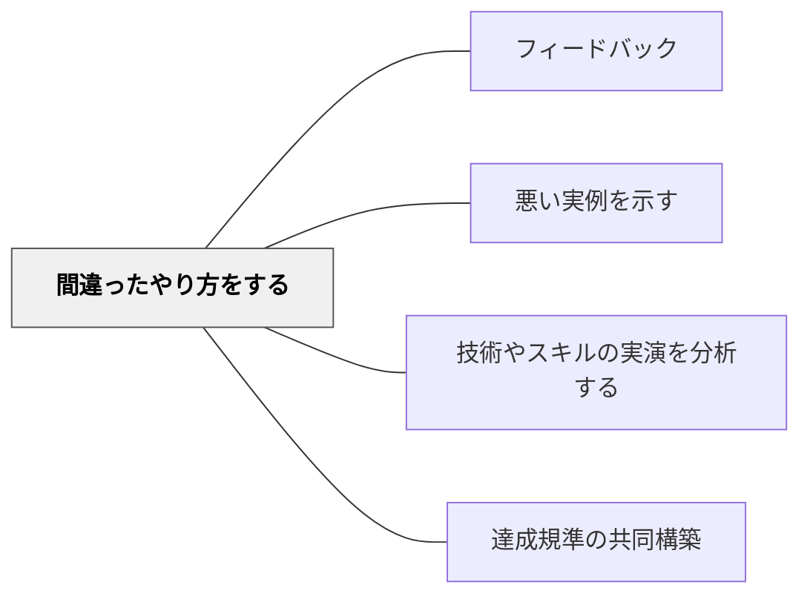

# 間違ったやり方をする

> わざと間違えることで、正しいやり方との違いが際立つ。

## 背景（Context）

「間違ったやり方」を意図的に実演することで、「何がいけないのか」が視覚的・体験的にわかりやすくなる。対比によって正しいやり方の価値が浮かび上がり、達成規準が明確になる。

## 問題（Problem）

正しいやり方だけを見せても、何が大切かは伝わりにくい。間違いとの対比があることで、「これが重要だ」という要素が際立つ。

## 力のかたち（Forces）

- 教師が間違えてみせることは、笑いを通じた学習にもなり、安心感を生む
- 間違いを笑いものにする文化ではなく、「分析の材料」として扱う文化が前提
- 誇張した間違いほど、違いが明確になる

## 解決（Solution）

**教師が意図的に「間違ったやり方」を実演し、学習者に「何が間違っているか・なぜいけないか」を問いかけながら、正しいやり方との対比で達成規準を構築する。**

例：
- 音読で声が小さく、つかえながら読んでみせる
- 筆算で位をずらして書いてみせる
- 作文で「昨日遊んだ。楽しかった。終わり。」という最低限の文を書いてみせる

## 結果（Consequences）

- 「何が重要か」が対比によって明確になる
- 学習者が批評的な目を養う
- 間違えることへの心理的ハードルが下がる

- [[パタン/主要概念で評価する]] — 間違いから主要概念の重要性を際立たせる
- [[パタン/豊かな課題]] — 意図的な誤りが豊かな課題のコントラストになる
- [[パタン/比較による精緻化]] — 正と誤の比較が達成規準の精緻化を生む
## クラスター図

## Actionable Insight

- 教師が意図的に誇張した間違い（声が小さすぎる音読・位ずれの筆算など）を実演し「何が間違っているか」を問う——誇張することで違いが際立ち学習者が「間違いを分析する」という批評的な視点を持てる
- 間違った実演の後に「なぜそれがいけないのか、1文で言えますか？」と理由を言語化させる——理由の説明が達成規準の深い理解につながる
- 教師自身が笑いを交えながら間違えてみせる——教師が間違えることへの心理的ハードルを下げることで、学習者も間違いを恐れない文化が育つ

## 出典

- 一つの教育のパタン・ランゲージ（岩井輝久）

## 関連パタン

- [[パタン/フィードバック]] — 親パタン
- [[パタン/悪い実例を示す]] — 実例としての悪例
- [[パタン/技術やスキルの実演を分析する]] — 実演の分析
- [[パタン/達成規準の共同構築]] — 対比から規準を構築する
