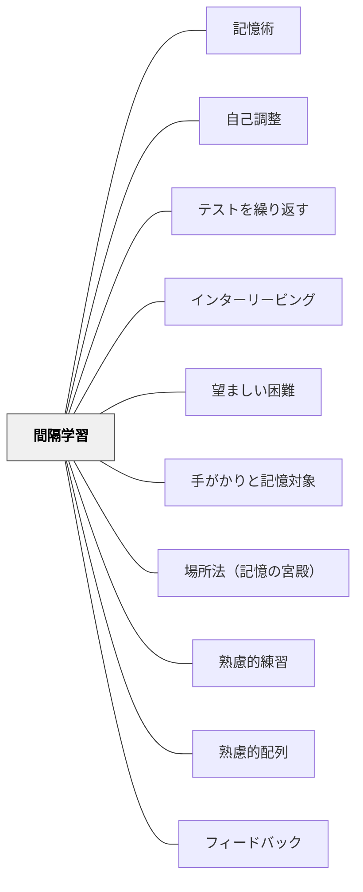

# 間隔学習

> 学ぶ量より「いつ学ぶか」の設計が長期記憶を決める——同じ時間を使うなら、詰め込むより分散させる方が6ヶ月後の記憶量が格段に多い。

---

## Pattern Connection

**Jo Rokuhara（年不詳）統合（2026-05-21）：**

『一流の記憶法』は試験勉強に特化した具体的な復習スケジュールを提示している。エビングハウスの忘却曲線（1時間後56%・1日後74%・1週間後77%忘却）を出発点に、「最小回数で最大定着」を実現するスケジュールが導出されている。

- **既存パタンとの関連**：本パタンの間隔学習設計原則「忘れかけた頃に想起する」と完全に一致する。本書の復習スケジュールは Weinstein の理論を試験勉強という実践文脈で具体化した実装例として読める。
- **補強された点**：より詳細な復習タイミングとして「**当日3回（数秒後・数分後・1時間後）→翌日1回→1か月後1回**」が示された。「1日後に覚えていれば、1か月後の復習1回でほぼ永続的に記憶される」という実用的な基準は、生徒への指導に直接使える。
- **他のパタンへの波及**：[[パタン/手がかりと記憶対象]] ——時間を空けた想起練習は、手がかり→記憶対象の経路の耐久性を高める操作として理解できる。[[パタン/場所法（記憶の宮殿）]] ——場所法で覚えた後にも間隔を空けてルートを歩く想起練習が必要。

### 復習スケジュールの具体例（一流の記憶法より）

| タイミング | 回数 | 目的 |
|----------|------|------|
| 当日（数秒後） | 1回 | 直後確認（記銘の確認） |
| 当日（数分後） | 1回 | 短期保持の確認 |
| 当日（1時間後） | 1回 | ワーキングメモリからの転送確認 |
| 翌日 | 1回 | 睡眠後の定着確認 |
| 1か月後 | 1回 | 長期記憶への定着（以後ほぼ永続） |

「1日後に覚えていれば、1か月後の復習1回で以後ほぼ忘れない」——生徒に渡せる実用的な基準。

---

**出典**: Weinstein, Y. & Sumeracki, M.（2018）*Understanding How We Learn*. Routledge.（統合：2026-05-14）

- **既存パタンとの関連**: [[パタン/テストを繰り返す]] で「間隔を空けた想起練習」として言及されていたが、独立したパタンとして設計されていなかった。本パタンは間隔学習（Spaced Practice）を教育設計の独立した原則として位置づける。
- **補強された点**: [[パタン/熟慮的練習]] の「意図的な反復」に「いつ反復するか」の時間設計が加わった。練習の量よりも分散配置が長期記憶への定着を決定的に左右する。
- **新しい知見**: 「忘れかけた頃に思い出す」という困難感そのものが記憶を強化する（望ましい困難 / Desirable Difficulties）。やりやすい再読より、難しく感じる間隔学習の方が効果的。
- **他のパタンへの波及**: [[パタン/インターリービング]] と組み合わせると、異なる内容を混ぜることで自然に間隔が生まれる。[[パタン/熟慮的配列]] が単元内の復習設計として機能する。

---

## 背景（Context）

エビングハウス（1885）の忘却曲線は、学習した内容は時間とともに急激に忘れられることを示した。しかし忘却は不可避ではない。**学習セッションを分散させること**で、記憶の減衰を大幅に抑えることができる。

多くの学習者は直前の詰め込み（Massed Practice）を好む。テスト前日に長時間勉強する方が、毎日少しずつ学ぶより効率的に感じられる。しかし認知心理学の研究が一貫して示すのは逆の事実だ——詰め込みはテスト直後の点数には効果があるが、数週間後には急激に忘れる。間隔を空けた学習（Spaced Practice）は直後の点数は低くても、長期保持が圧倒的に優れている。

この現象は「間隔効果（Spacing Effect）」と呼ばれ、認知心理学で最も頑健な知見の一つだ。

## 問題（Problem）

教育設計の多くは「教えたら終わり」「単元が終わったら次へ」という構造になっている。一度扱った内容は試験前の復習まで触れられず、忘却が進んだ状態でテストを迎える。「やったはずなのに覚えていない」という学習者の経験は、内容の難しさよりも「間隔のない設計」に原因がある場合が多い。

## 力のかたち（Forces）

- 詰め込みは直後の記憶には効果的だが、急速に忘れる
- 間隔学習は練習中に「思い出しにくい」という困難感を生む——これが逆に記憶を強化する
- 「忘れかけた頃に思い出す」という努力が記憶の痕跡を強くする（想起強度が高まる）
- カリキュラムは線形に進むように設計されており、螺旋的な復習を組み込みにくい
- 学習者は効果的でなくても「わかった感」のある勉強法（再読・ノートまとめ）を好む傾向がある

## 解決（Solution）

**学習セッションを意図的に分散させ、「忘れかけた頃」に想起する機会を繰り返し設計する。**

---

### 間隔学習の設計原則

**「忘れる前ではなく、忘れかけた頃に」**

完全に忘れてしまってからでは効率が下がる。完全に覚えている間に繰り返しても効果が薄い。最適なのは「うっすら覚えている・少し思い出しにくい」タイミングだ。

---

### 授業に組み込む間隔設計

| 間隔 | 実装の例 |
|------|---------|
| **翌授業** | 前回の学習を3問の検索練習（ウォームアップ）で思い出す |
| **1週間後** | 週末の宿題に「今週学んだ内容×先週の内容」を混ぜる |
| **1ヶ月後** | 単元テスト前に「1ヶ月前の単元」の問題を5問入れる |
| **学期末** | 学期末テストの半分を「過去の単元」からの問いにする |

---

### 教師が間隔を作る3つの方法

**1. 想起ウォームアップ（授業冒頭3分）**

「前回の授業で学んだことを3つ書こう」——書かせてから確認する。書く（検索）が再読より効果的。毎回同じ形式にすることで定着する。

**2. 混合宿題・ドリルの設計**

「今日の単元の問題」だけでなく、「2週間前の単元」「1ヶ月前の単元」の問題を混ぜる。→ [[パタン/インターリービング]] と相乗効果を持つ。

**3. スパイラル復習**

学期の終わりや次の単元の導入で、前の単元の核心概念を問い直す場面を設計する。「前に学んだ○○は、今日の△△とどうつながる？」

---

### 学習者への説明

「間隔学習をやると、勉強中に『思い出しにくい』と感じます。それは効いている証拠です。難しく感じる練習の方が、かんたんに感じる再読より長く覚えられます」

→ 望ましい困難（Desirable Difficulties）の概念を学習者と共有することで、困難感への耐性が生まれる。

---

## 結果（Consequences）

- 長期記憶への定着が、詰め込みに比べて大幅に向上する
- 「覚えた」が「使える知識」に変わる（転移可能な記憶）
- テスト直前に詰め込む必要がなくなり、学習者のストレスが減る
- ただし、実装には「いつ何を復習するか」の事前設計が必要——教師の計画性が問われる
- 学習者は「効いていない感じ」に不満を持つことがある——メカニズムの説明が必要

## 関連パタン
- [[パタン/記憶術]]
- [[パタン/自己調整]]

- [[パタン/テストを繰り返す]] — 間隔学習の各セッションに使う検索練習の手法
- [[パタン/インターリービング]] — 異なる内容を混ぜることで間隔が自然に生まれる
- [[パタン/望ましい困難]] — 「忘れかけた頃に思い出す」困難感が記憶を強化するメカニズム
- [[パタン/手がかりと記憶対象]] — 時間を空けた想起は手がかり→記憶対象の経路の耐久性を高める
- [[パタン/場所法（記憶の宮殿）]] — 場所法で覚えた後にも間隔を空けた想起が必要
- [[パタン/熟慮的練習]] — 意図的な練習設計の上位パタン
- [[パタン/熟慮的配列]] — 単元内・学期内の学習経験の順序設計
- [[パタン/フィードバック]] — 想起の後に正確なフィードバックを与えることで定着が加速する
- [[実践/学習科学の6方略]] — 間隔学習を含む6方略の授業実装ガイド
- [[文献/認知心理学者が教える最適の学習法（Weinstein & Sumeracki）]] — 一次資料
- [[文献/一流の記憶法（Jo Rokuhara）]] — 復習スケジュールの実用実装（当日3回・翌日・1か月）

---

## クラスター図

## Actionable Insight

- **授業の冒頭3分を「前回の想起」に使う**——「前回習ったことを3つ書こう」をルーティンにする。これだけで間隔学習の最小実装になる
- **宿題に「先週・先月の問題」を1問追加する**——今日の練習問題に過去の単元から1問混ぜる。増やす準備時間はほぼゼロ
- **「忘れかけた頃に思い出す」を学習者に説明する**——「難しく感じるのは効いている証拠」というメタ情報が、困難感への耐性を育てる

---

## 出典

Weinstein, Y., Sumeracki, M., & Caviglioli, O.（2018）. *Understanding How We Learn: A Visual Guide*. Routledge.

Ebbinghaus, H.（1885）. *Memory: A Contribution to Experimental Psychology*.

> "Spacing out study sessions across time leads to better long-term memory than cramming—even when the total study time is the same."
