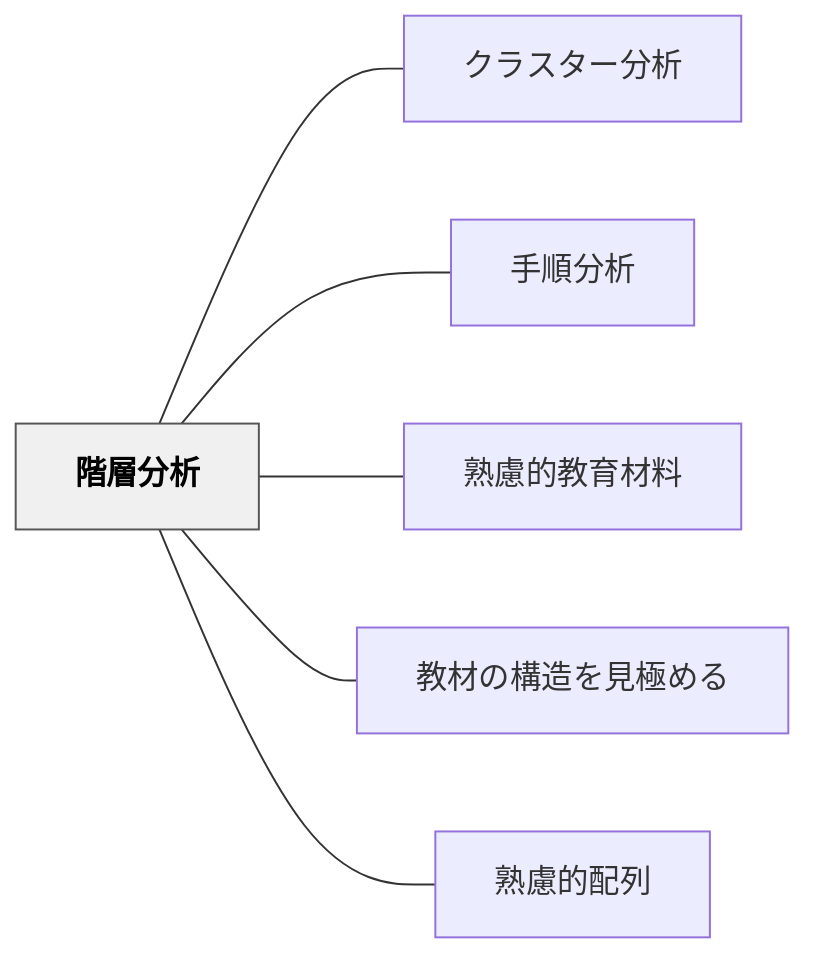

# 階層分析

> 知識・スキルの前提関係（何を先に学ぶべきか）を階層的に分析する。

## 背景（Context）

鈴木克明「教材設計マニュアル」の教材分析手法の一つ。概念・スキル間の「上位概念・下位概念」「前提・応用」の関係を階層構造として分析する（ガニェの学習条件論に基づく）。何を先に学べば次のステップに進めるかを明確にする。

## 問題（Problem）

前提となる知識・スキルを習得していない状態で応用的な内容を教えると、学習者がつまずく。

## 力のかたち（Forces）

- 適切な配列は階層分析から導かれる
- 前提スキルの欠如が最も頻繁なつまずきの原因

## 解決（Solution）

**教材内容の前提関係を階層図として可視化し、「これを学ぶには何が前提か」を整理した上で教材の配列を設計する。**

## 結果（Consequences）

- 適切な配列・前提チェックが可能になる
- 学習者のつまずきを予防できる

## 関連パタン
- [[パタン/クラスター分析]]
- [[パタン/手順分析]]

- [[パタン/熟慮的教材教具]] — 親パタン
- [[パタン/教材の構造を見極める]] — 上位パタン
- [[パタン/熟慮的配列]] — 配列の設計

## クラスター図

## Actionable Insight

- 新しい単元を始める前に「この学習には何の前提知識が必要か」を3つ書き出してみる——前提スキルの把握がつまずきの予防に直結する
- 学習内容の概念図を「土台→中間→応用」の3層で描き、どの層から始めるかを確認する——階層が見えることで教材配列の根拠が明確になる
- 学習者がつまずいたとき「前提となるどの知識が欠けているか」を階層図で確認する——根本原因の特定が的確な補充指導につながる

## 出典

- 鈴木克明（2002）『教材設計マニュアル――独学を支援するために』北大路書房
