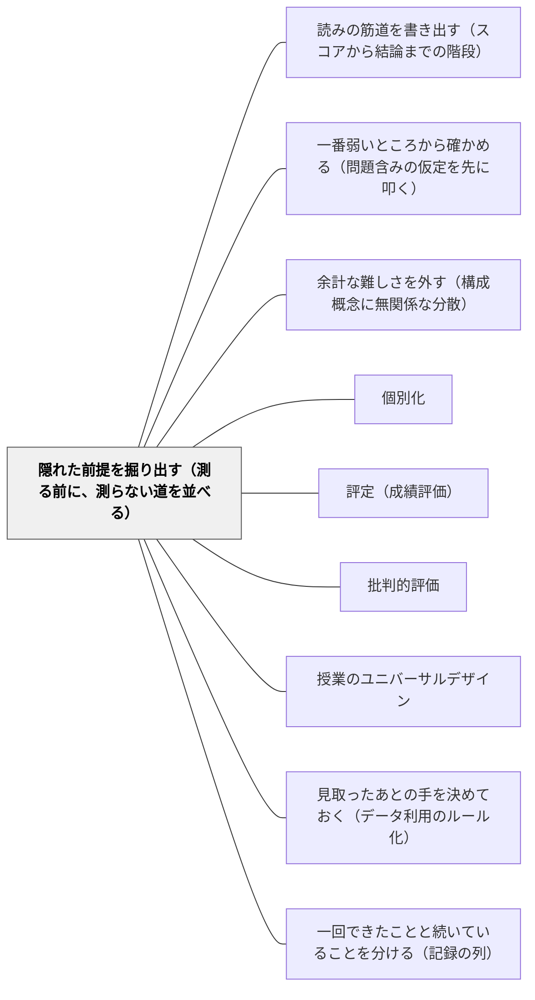

# 隠れた前提を掘り出す（測る前に、測らない道を並べる）

> 測って分けるという判断は、書かれていない仮定の上に立っている。いちばん危ないのは、「分けない道」が一度も比較されていない、という仮定である。

## [Pattern Connection]

本パタンは Kane（1990）の妥当化論から起こしたものである。Kane の枠組みでは、スコアから結論までの道筋を書き出したものが**解釈的論証**であり、その論証を受け入れてよい理由を集めたものが**妥当性論証**である（→ [[概念/解釈的論証と妥当性論証（何を確かめればよいかを決める）]]）。本パタンは、その道筋を書き出す作業の**副産物**を扱う。書き出してみると、書かれていなかった仮定が浮かび上がる。Kane によれば、論証の欠陥は論理の誤りよりも、この書かれていない仮定に宿る。

順序としては、[[パタン/読みの筋道を書き出す（スコアから結論までの階段）]] が先にあり、本パタンがその次に来て、[[パタン/一番弱いところから確かめる（問題含みの仮定を先に叩く）]] が最後に来る。**書き出す → 隠れていたものを掘る → 弱いところを叩く**。三本で一組であり、本パタンだけを単独で使うと、掘っただけで終わる。

この Wiki の評価パタン群との関係でいえば、[[パタン/余計な難しさを外す（構成概念に無関係な分散）]] は「測っているものに何が混ざっているか」を問うた。本パタンはその一段外側にある——**そもそも、測って分けるという段取り自体が、何を前提にして選ばれたのか**。前者はテストの内側の問い、後者はテストを使うという決定そのものへの問いである。

[[概念/帰結的妥当性（評価がもたらす結果まで問う）]] とは、同じ場所で出会う。Messick は副作用を吟味する具体的な方法として**代案・対抗提案との突き合わせ（counterproposals）**を挙げた。本パタンの中心にある「対抗案を一つ並べてから決める」は、その手続きと重なる。ただし本パタンの出所は Kane であり、Kane の場合は倫理的な要請としてではなく、**解釈的論証を書き出せば自動的に出てくる仮定**として現れる。「配置システムを使うほうがよい」は、価値判断である前に、論証の中の**未検証の一項**である。

## 背景（Context）

学校では、測って分ける判断が絶えず起きている。単元前のレディネステストで、取り出し指導の対象を決める。標準検査の結果と授業の様子を持ち寄って、通級の入級を検討する。学年で習熟度別のコースを分ける。学習の遅れを理由に、放課後の補充へ呼ぶ。どれも「その子の状態を測り、行き先を分ける」という同じ形をしている。

このとき、教師の頭の中で立っている理屈は、たいてい三つで足りている。

1. その先の学習には、ある程度の前提となる力が要る
2. このテスト（または観察）は、その前提の力を測っている
3. この線引きは、だいたい妥当である

この三つが揃えば、判断は成立したように見える。実際、Kane が挙げた大学の配置テストの例でも、明示された解釈的論証はこの三つだけだった。微積分の授業と、準備の足りない学生のための補習代数の授業があり、代数のテストでどちらかへ配置する。書き出された仮定は「微積分の成功には代数の技能が要る」「テストはその技能を測っており、そこそこ信頼できて系統誤差にひどくは影響されない」「カットオフ点は適切である」——それだけである。

そしてこの三つは、いずれも**測ることについての仮定**である。測る道具の質と、線を引く場所の話に終始している。

## 問題（Problem）

**書き出された三つの仮定の下に、書き出されなかった仮定が眠っている。そして眠っているほうが、決定の当否をより強く左右する。**

Kane はこの例を、その三つで終わらせなかった。書き出したあとに続けてこう言う——「解釈的論証を素描するにあたって、我々はもちろん、論証の実質の多くを、いくつもの重要な仮定を含めて、書き落としている」。落ちていたものは四つある。

**第一に、効果の仮定。** 補習コースが実際に前提となる知識と技能を育てること。そして補習を通った学生が、微積分で成功する見込みを実際に上げていること。これが成り立たなければ、配置は正しく行われたうえで無意味になる。テストがどれほど精密でも、行き先が効かなければ、判断の全体が空回りする。

**第二に、交互作用の仮定。** テストに合格して微積分へ配置された学生は、補習コースを取ってもたいして得をしないこと。これは Cronbach & Snow（1977）の言う適性処遇交互作用の特殊例である。Kane はここに一行付け加えている——**しばしば暗黙のままだが、論証の論理にとって本質的である**。もし補習コースが全員にとって有益なら、「分ける」根拠は消える。全員に受けさせればよいからである。分ける理屈は、「上の子には効かない」という主張に依存している。そしてその主張は、ほとんどの場合、確かめられていない。

**第三に、もっと根本的な仮定。** Kane はここで、測定の話から一気に外へ出る。

> we are tacitly assuming that the use of a placement system is preferable to a redesign of the regular course so that the pace and/or sequence of instruction is flexible enough to accommodate all students.
> （我々は暗黙のうちに、配置システムを使うほうが、通常コースのほうを作り直して、指導の進度や順序をすべての学生を受け入れられるくらい柔軟にすることよりも望ましい、と仮定している。）

これは測定の仮定ではない。**比較されていない選択肢**についての仮定である。子どもの側を測って動かす道と、授業の側を作り直す道。二つは並んでいるはずなのに、片方だけが検討され、もう片方は検討されないまま「望ましくない」と扱われている。しかも、そう扱ったという意識すらない。

**第四に、資源についての仮定。** 通常コースで落ちる学生の数を最小にすることは、二つ目のコースと、配置テストに要する時間と金という相当な資源を投じるに値するほど重要な目標である——これも仮定である。目標そのものは正しく見える。しかし「その目標が、この投資に見合うほど重要か」は別の問いであり、ふつう問われない。

そして Kane は、なぜこの種の仮定が厄介なのかを、妥当化の観点から言い切る。

> From the point of view of validation, the assumptions are generally the key elements in the interpretive argument. Flaws in the interpretive argument are likely to involve faulty or doubtful assumptions, rather than flaws in logic; errors in logic are generally easier to detect and easier to fix than weaknesses in the assumptions, especially if the argument is not stated clearly.
> （妥当化の観点からは、仮定こそが解釈的論証の鍵となる要素である。解釈的論証の欠陥は、論理の誤りよりも、誤ったあるいは疑わしい仮定に関わるものになりやすい。論理の誤りは一般に見つけやすく直しやすいが、仮定の弱さはそうではない——とくに論証がはっきり述べられていない場合には。）

> Particularly troublesome are assumptions that are implicit, or "hidden," in the sense of not being explicitly recognized as part of the argument. Hidden assumptions are, of course, a major concern in evaluating any argument, but they are most likely to cause problems in interpretive arguments that are not stated clearly.
> （とくに厄介なのは、論証の一部として明示的に認識されていないという意味で、暗黙の、あるいは「隠れた」仮定である。隠れた仮定はもちろんどんな論証を評価するうえでも大きな懸念だが、それが最も問題を起こしやすいのは、論証がはっきり述べられていないときである。）

最後の一文が、教室にとってはいちばん重い。**教室の判断は、たいてい、はっきり述べられていない。** 学年会の議題は「A児をどうするか」であって、「A児について我々が立てている論証は何か」ではない。論証が述べられていない場所では、隠れた仮定は隠れたまま働き続ける。

## 力のかたち（Forces）

- **決定の速さ vs 前提の掘り起こし**——取り出しの判断は、たいてい単元が始まる前の数日で決めなければならない。前提を掘る作業は時間を食う。掘りきってから決めようとすると、決める時期を逃す。しかし掘らずに決めると、翌年も同じ形の決定が繰り返される
- **子どもを動かすほうが、授業を動かすより簡単に見える**——一人を取り出す手配は担任の裁量で回るが、通常授業の進度と順序を組み替えるのは学年全体の合意が要る。**実行可能性の差が、そのまま望ましさの差として読まれてしまう**。Kane が言う「暗黙の仮定」は、多くの場合この読み替えのことである
- **効果の証拠がないことと、効果がないことは違う**——取り出し指導が効いている証拠を持っている学校は少ない。しかし証拠がないことは効いていないことの証明ではない（→ [[概念/証拠不足と不成立の区別]]）。この二つを混同すると、掘る作業が「取り出しをやめろ」という結論に短絡する
- **分けられなかった側は不可視になる**——通常のまま残った子が、分けた先の指導を受けたらどうだったかは観察されない。交互作用の仮定は、原理的に片側しか見えない構造の中で立てられている
- **善意が検証を止める**——「その子のためを思って」始まった仕組みほど、効いているかを問うことが冷たく感じられる。動機の純度が、証拠の点検を先送りさせる
- **資源の話をすると、教育の話でなくなった気がする**——人・時間・その子が教室から離れる時間は、有限である。しかし「見合っているか」を口に出すと、子どもを勘定に入れているように聞こえる。だから資源の仮定は、いちばん口にされにくい
- **一般の判断と、この子の判断がずれる**——学年で決めた基準は、ある集団に当てはまるように作られている。目の前の子に特別な事情があるとき、基準はそのままでは当たらない。しかし基準を個別に曲げると、公平性への疑いが生じる

## 解決（Solution）

**「測って分ける」と決める前に、その判断が立っている仮定を口に出して並べる。とくに、測ることについての仮定（道具・線引き）ではなく、その外側にある三つ——効果・交互作用・価値——を掘り出す。そして、分けない道を最低一つ、対抗案として同じ卓の上に載せてから決める。**

掘り出すための問いは、三種類でよい。

### 効果の問い——分けた先は、狙った力を育てるか

- 分けた先の指導は、そこで育てるはずの力を**実際に**育てているか
- 育てた証拠を、こちらは持っているか。持っていないなら、次はどうやって取るか
- 分けた先を通った子は、戻ったあとの学習で伸びているか。それとも、戻ったところで同じ場所につまずくか

この問いが空振りするなら、配置の精度をどれだけ上げても意味がない。**行き先が効かないなら、正しく振り分けることは、正しく無駄にすることである。**

### 交互作用の問い——分けなかった側は、損をしていないか

- 分けた先の指導を、分けなかった子が受けても得しない、と本当に言えるか
- 言えないなら、なぜ全員に開かないのか
- 逆に、分けた子が通常の場に残っていたら得られたはずのもの（仲間の考え方に触れる、全体の議論の流れ、その場にいるという事実そのもの）を、勘定に入れたか

Kane が「しばしば暗黙のままだが、論証の論理にとって本質的である」と言ったのがここである。**分ける理屈は、「上の子には効かない」という言えていない主張に、まるごと寄りかかっている。**

### 価値の問い——その道を選ぶことは、何と比べて選ばれたか

- **(a)** その子の側を動かす代わりに、**授業のほうを、全員が入れるくらい柔軟に作り直す道**は検討されたか。進度を変える、順序を変える、入口を複数用意する、課題の水準を一つの時間の中で分ける——これらは検討されたうえで退けられたのか、それとも最初から卓に載っていなかったのか
- **(b)** この目標のために、この資源——人、時間、そしてその子が教室から離れる時間——を投じることは、本当に見合っているか
- (b) の資源には、目に見えないものが含まれる。**その子が教室にいなかった時間に、教室で起きていたこと**は、支出の側に立つ

---

### ⚠️ このパタンの急所：対抗案を一つ並べてから決める

掘る作業は、問いを立てるだけでは回らない。**手続きにする。**

分ける判断をする会議・打ち合わせで、決める前に一度だけ、次の形を通す。

1. いま提案されている道を、一文で言う。「A児を、わり算の単元のあいだ、算数の時間に取り出して個別に指導する」
2. **分けない道を、一つだけ、同じ具体さで言う。**「わり算の単元の導入を三時間、全員が入れる形に組み替える。図と操作から入り、式は四時間目から出す」
3. 二つを並べて、三つの問いを両方に当てる。効果は。交互作用は。資源は
4. そのうえで、どちらかを選ぶ。**選んだ理由を一行残す**

肝心なのは、対抗案を**採用するため**に並べるのではないことである。並べる目的は、**比較されていない選択を、比較の上に載せる**ことにある。Kane の指摘は「配置システムは望ましくない」ではなく、「配置システムのほうが望ましいと**暗黙に仮定している**」である。仮定を仮定として認めれば、それは検討の対象になる。認めなければ、対象にすらならない。

だから、**「分けない道」を並べることは、分ける判断を否定することではない。** 三つの問いを通したうえで「やはり取り出す」と決めることは、まったく正当である。むしろそのとき、その決定は前より強い。何と比べて選ばれたかが言えるからである。

安易に「分けるのは悪」と読むと、本パタンは使えなくなる。分けることで初めて届く指導は現にある。本パタンが変えるのは、**分けるかどうか**ではなく、**決めた理由を自分たちが持っているかどうか**である。

---

### ⚠️ もう一つの急所：一般形の論証は、この子には当たらないことがある

Kane は、解釈的論証の性質として、もう一つ重要なことを書いている。

> The general version of the interpretive argument, which is used in developing the validity argument, is intended to apply to some population of examinees and cannot take explicit account of all of the special circumstances that might affect an examinee's performance. In applying the general version of the argument to an examinee, we assume that the examinee is drawn from an appropriate population and that there are no circumstances that might alter the interpretation.
> （妥当性論証を組み立てるときに使われる一般版の解釈的論証は、ある受検者集団に当てはまるように意図されており、受検者の成績に影響しうる特別な事情のすべてを明示的に勘定に入れることはできない。一般版の論証をある受検者に当てはめるとき、我々は、その受検者が適切な集団から来ており、解釈を変えるような事情は存在しない、と仮定している。）

つまり、学年で決めた基準や、標準化された検査の解釈は、**「この子はその集団から来ている」「解釈を変えるような事情は無い」という二つの仮定つきで**使われている。この仮定がもっともらしくない場合には、解釈的論証か妥当性論証か、その両方を調整しなければならない。

Kane は具体例として、障害のある受検者を挙げる（Willingham, 1988 を参照している。1990 年当時の原語は "handicapped"）。障害の影響を反映するように解釈的論証を調整する必要がありうる。そして、ここが実務上いちばん効く一点である。

> If testing procedures are adjusted to accommodate the needs of a handicapped student, it may be necessary to add evidence supporting the comparability of scores obtained under special testing procedures to the validity argument.
> （テストの手続きが、障害のある学生の必要に応じるように調整された場合、特別な手続きのもとで得られたスコアの比較可能性を支える証拠を、妥当性論証に付け加える必要がありうる。）

**手続きを配慮つきに変えたなら、そのスコアと通常のスコアが比べられるという主張は、別に支えを要する。** 配慮そのものは妥当性の回復である（→ [[パタン/余計な難しさを外す（構成概念に無関係な分散）]]）。しかし「配慮つきの点数を、配慮なしの点数と同じ列に並べてよい」は、配慮の正当性からは自動では出てこない。ここに一段、証拠が要る。

個人についても同じである。病気、動機の欠如といった事情は、一般版の論証をその子に当てはめる前提を崩す。そして Kane はいちばん分かりやすい例を出す。

> Interpretive arguments make many assumptions that are unproblematic under ordinary circumstances (e.g., that examinees can hear instructions that are read to them), but that may be problematic for specific examinees (e.g., hearing impaired examinees) or under special circumstances (a noisy environment).
> （解釈的論証は、通常の状況では問題含みでない仮定を多く置いている——たとえば、受検者は読み上げられた指示を聞き取れる、といった仮定である。しかしそれは、特定の受検者にとって（たとえば聴覚に困難のある受検者）、あるいは特別な状況のもとで（騒がしい環境）、問題含みになりうる。）

「指示が読み上げられれば聞き取れる」——これは仮定である。ふだんは誰も仮定だと思わない。**仮定が仮定として見えるのは、それが崩れる子か、崩れる場面に出会ったときだけである。** だから、隠れた仮定を掘る作業は、通常の子と通常の場面を眺めていても進まない。**うまくいかなかった一件を、道具の不備ではなく、仮定の露出として読む**ところから進む。

---

### 具体例1：取り出し指導を決める前の十五分（算数・第3学年）

わり算の単元が始まる前、レディネステストの結果を見て、A児を単元のあいだ取り出して個別に指導する案が出た。かけ算九九の想起に時間がかかり、このままでは単元に乗れない、という見立てである。

ここで、決める前に三つを通す。

**効果の問い。** 取り出しでかけ算の習熟をやり直すことが、わり算の理解につながる証拠を、こちらは持っているか。去年、同じ形で取り出した子はどうだったか。思い出すと、去年の子は取り出し中は正答率が上がったが、教室に戻ったあとのわり算では同じところで止まっていた。**九九の速さは上がったが、わり算の意味は別のところでつまずいていた。** これは効果の仮定が、少なくとも自動では成り立たないことを示している。

**交互作用の問い。** 取り出しで行うつもりの指導——おはじきを等分に配って、何回配れるかを数える——は、A児だけに効くものか。教室の他の子が同じことをやっても得しないと言えるか。**言えない。** むしろ、わり算の導入は全員が操作から入るべき内容である。ここで交互作用の仮定が崩れる。崩れたなら、分ける根拠が一本抜ける。

**価値の問い。** (a) 授業のほうを組み替える道は検討されたか。導入の三時間を、式ではなく操作から始める形にすれば、A児は九九の想起を迂回して等分の意味に入れる。この道は、卓に載っていなかった。載っていなかった理由は「望ましくないから」ではなく、**学年の進度を揃える約束があるから**である。つまり、望ましさではなく実行しやすさで、片方が消えていた。(b) A児が算数の時間に教室から離れることは、単元の四時間分の議論に参加しないことを意味する。この支出は、勘定に入っていなかった。

三つを通した結果、判断はこう変わった。導入の三時間は全員を操作から入れる形に組み替える。そのうえで、四時間目以降、式の処理でA児が詰まるようなら、そこで十分間だけ個別に付く。**取り出しを否定したのではない。取り出す時期と幅が、根拠を持って決まった。**

この十五分がなければ、A児は四時間、教室にいなかった。そして翌年も、同じ見立てで同じ判断がなされていた。

---

### 具体例2：通級の入級判断で、効果の仮定を口に出す

通級の入級を検討する会議は、たいてい「その子にどれだけ困難があるか」を確かめる方向に進む。実態、検査結果、授業での様子。判断の重心は、**測ることの側**に置かれている。

Kane の分解を当てると、そこに三つの問いが足りていないことが分かる。

**効果。** その通級指導は、狙っている力を育てた実績を持っているか。これは通級担当者への疑いではない。**学校として、その証拠を持っているかどうかの確認**である。持っていないなら、入級と同時に「何が育ったら、どこで確かめるか」を決めておく（→ [[パタン/見取ったあとの手を決めておく（データ利用のルール化）]]）。決めておかないと、一年後にも同じ会議が同じ材料で開かれる。

**交互作用。** 通級で行う指導——たとえば、感情の言語化、順序立てて話す練習、注意の切り替えの手立て——は、通級に来ない子には効かないものか。多くの場合、そうではない。**教室で全員に開いてよい内容が、通級の中だけで行われていることがある。** ここに気づくと、判断は「入級させるかどうか」から「この手立てのうち、どこまでを教室に開けるか」へ広がる。教室に開いた部分が効けば、通級に持ち込む内容はより焦点化される。

**価値。** (a) 在籍学級の授業のほうを変える道は、どこまで試されたか。座席、指示の出し方、課題の量、終わりの見通しの示し方。これらを一つも変えずに入級を検討しているなら、対抗案が卓に載っていない。(b) 通級のために教室を離れる時間は、週に何時間で、その時間に教室で何が行われているか。国語の時間に抜けるのか、自分で選べる時間に抜けるのかで、支出の大きさは変わる。

この三つを口に出すことは、通級を否定することではない。**通級が必要な子には必要である。** 変わるのは、決めた理由が言葉になるかどうか、そして入級後に何を確かめるかが決まるかどうかである。

---

### 具体例3：習熟度別のコース分けと、「上の子には効かない」という言えていない主張

学年で算数を習熟度別に分ける案が出た。三クラスを、進度の速い群・標準の群・じっくり進む群に分ける。

分ける理屈は、次のように語られる。「速い子は待たされて退屈している。ゆっくりの子は置いていかれている。分ければ、両方に合った指導ができる」。

この理屈の中に、Kane の言う交互作用の仮定がそのまま埋まっている。**「じっくり群でやる指導は、速い群の子が受けても得しない」**——これが成り立たなければ、分ける根拠は崩れる。全員にやればよいからである。

そして実際に、じっくり群でやる予定の内容を並べてみると、その多くは「図で表す」「操作で確かめる」「言葉で説明する」である。**これらが速い群の子に効かない、とは言えない。** むしろ、速く正答する子ほど、意味を飛ばしていることがある（→ [[パタン/理解のしるしを読む（fit と match）]]）。

逆向きも同じである。速い群でやる予定の「発展問題」「一般化して考える」は、じっくり群の子には効かないのか。これも言えない。難易度と、思考の質は別の軸である。

ここまで来ると、判断の形が変わる。分けるか分けないかではなく、**「一つの教室の中で、同じ内容に複数の入口と複数の出口を作れるか」**が問いになる。これが Kane の言う「通常コースのほうを作り直す」道の、教室版である。

そのうえで分けると決めるなら、それでよい。ただし、そのときは「上の子には効かない」を主張として引き受けることになる。引き受けたなら、確かめる責任も生じる——学期の途中で、じっくり群でやった操作を速い群でも一度だけやってみて、何が起きるかを見る。それが交互作用の仮定に対する、いちばん安上がりな証拠になる。

---

### 具体例4：うまくいかなかった一件を、仮定の露出として読む

B児が、算数のテストで指示の意味を取り違えた解答をしていた。「答えだけ書きなさい」の問題に、式と筆算を全部書いていた。時間が足りなくなり、後半が白紙になった。

ここで「指示が聞けていない」と読むと、手立ては「指示をよく聞くよう促す」になる。

Kane の枠を当てると、別の読み方が出る。このテストの解釈的論証には、**「受検者は読み上げられた指示を聞き取れる」という、ふだん誰も仮定だと思っていない仮定**が置かれていた。B児の一件は、その仮定がこの子については（あるいはこの場面については）成り立たなかった、という報告である。

確かめるのは簡単である。指示を口頭だけでなく、問題用紙の上に一行書いておく。あるいは、教室が騒がしい時間帯にテストをしていなかったかを思い出す。**Kane が並べているのは、「特定の受検者」と「特別な状況」の両方である。** 聞き取りの困難と、騒がしい環境は、同じ仮定を別の側から崩す。

そして、もし手続きを変えたなら——指示を書いて渡す、別室で受ける、読み上げる——**そのときの点数を、他の子の点数と同じ列に並べてよいという主張には、別の支えが要る**。並べてはいけない、という話ではない。並べる根拠を一行持て、という話である。「指示を書面でも渡した（聞き取りの負荷を外すため）。測っている内容は同じ」。この一行があれば、翌年の担任もその点数を読める。

**一件のつまずきは、道具の不備であると同時に、隠れていた仮定の露出である。** 後者として読むと、その一件は他の子にも波及する。指示を書いて渡すことは、B児のためだけの措置ではなくなる。

---

### 具体例5：学年会に「対抗案の欄」を一つ作る

掘る作業を個人の心がけにすると、忙しい週に消える。**書式にする。**

分ける判断を扱う打ち合わせの記録用紙に、欄を二つ足す。

- **対抗案（分けない道）**——同じ具体さで一文
- **選んだ理由**——効果・交互作用・資源のどれで決まったか、一行

二欄で足りる。埋めるのに要する時間は、慣れれば五分である。

この二欄が効くのは、その場よりも**次の年**である。同じ子について次の会議を開くとき、去年の対抗案と選んだ理由が残っている。すると議論は「もう一度ゼロから」ではなく、「去年こう考えて、こう決めた。その後どうだったか」から始まる。効果の仮定が、記録を通して検証にかかる。

書式にするときの注意が一つある。**対抗案の欄を、形だけ埋める運用にしない。** 「特になし」「通常指導の継続」とだけ書かれた欄は、無いのと同じである。対抗案は、提案されている道と同じ粒度でなければ、比較にならない。「通常指導の継続」ではなく、「導入三時間を操作から入る形に組み替える」まで書く。

---

### 自己教育での適用例：「この章はまだ早い」と自分を配置するとき

独学では、配置する人も配置される人も自分である。だから隠れた仮定は、二重に隠れる。

数学の本を読んでいて、ある章で止まる。「ここはまだ早い」「前の章に戻ってやり直そう」——この判断は、教室で取り出しを決めるのと同じ形をしている。測って（自分の理解を見て）、分ける（戻る道へ配置する）。

三つの問いは、そのまま当たる。

**効果の問い。** 戻ってやり直すことは、実際にこの章を読めるようにするか。前にも同じ理由で戻ったことがあるなら、そのとき戻ったあとどうだったかを思い出す。戻って基礎を固め直したのに、同じ章でまた止まったのなら、**効果の仮定は少なくとも自動では成り立っていない。** 止まっている理由が、前提知識の不足ではないところにあるからである。

**交互作用の問い。** 戻ってやる内容は、この章を読むために必要なものか。それとも、単に「できることをもう一度やる」安心の作業か。**戻る作業は、たいてい気持ちがよい。** できることをやっているからである。その快さを、進歩の感触と取り違えていないか。

**価値の問い。** (a) **自分の側を戻す代わりに、いま読んでいる本の読み方を変える道**は検討されたか。証明を飛ばして例だけ先に読む。定義を自分の言葉で書き直してから戻る。同じ範囲を別の著者で読む。手を動かして具体例を三つ作る。これらは検討されたうえで退けられたのか、それとも最初から選択肢に無かったのか。**多くの場合、無かった。** 「分からないなら戻る」という一本道しか持っていないからである。(b) 戻ることに使う一週間は、他の何を犠牲にするか。学習の時間は有限であり、戻ることにも支出がある。

Kane の一文を、自分に当てて言い直すとこうなる——**私は暗黙のうちに、自分を配置し直すほうが、この本の読み方を作り直すことよりも望ましい、と仮定している。**

そして、教室と同じ但し書きが要る。**戻ることが正しい場面は現にある。** 三つを通したうえで「やはり戻る」と決めたなら、それは前より強い決定である。何と比べて選ばれたかが言えるからである。変わるのは、戻るかどうかではなく、戻ると決めた理由を持っているかどうかである。

## 結果（Consequences）

**利点**

- **決定の理由が言葉になる**——「なぜ取り出すのか」に、「困っているから」より一段深い答えが用意される。保護者にも同僚にも、同じ形で説明できる
- **効果を確かめる仕組みが、決定と同時に立つ**——効果の問いを通すと、「何が育ったら、どこで確かめるか」を決めずには終われなくなる。翌年の会議が、去年の材料の上に立つ
- **教室に開ける手立てが見つかる**——交互作用の問いは、しばしば「これは全員に開いてよい」という答えを返す。分ける仕組みの中に閉じ込められていた良い手立てが、教室に出てくる（→ [[パタン/授業のユニバーサルデザイン]]）
- **授業設計の側が選択肢に入る**——価値の問い (a) は、子どもを動かす道の隣に、授業を作り直す道を常に置く。この二本立てが習慣になると、インクルーシブな設計が「理念」ではなく「毎回の比較の一項」になる（→ [[特別支援/インクルーシブ教育]]）
- **一件のつまずきの読み方が変わる**——道具の不備としてだけでなく、隠れていた仮定の露出として読めるようになる。すると、その一件が他の子にも波及する形の改善につながる
- **配慮つきの点数の扱いが慎重になる**——手続きを変えたなら比較可能性に一段の支えが要る、という Kane の指摘が、記録の一行として残るようになる
- **自分の学習にも同じ形で使える**——独学の「戻る／進む」の判断は、教室の配置判断と同じ構造をしている。同じ三つの問いが、そのまま自己点検になる

**注意点・リスク**

- **⚠️ 掘るだけで、決定が止まる**——本パタン最大のリスク。仮定を並べると、どの仮定にも十分な証拠が無いことが分かる。そこで「証拠が無いから決められない」と止まると、**その子には何も届かない**まま時間が過ぎる。証拠が無いことは、成り立たないことの証明ではない（→ [[概念/証拠不足と不成立の区別]]）。**掘る作業は、決めるためにやる。** 決めたうえで、いちばん弱い仮定を一つだけ次に確かめる（→ [[パタン/一番弱いところから確かめる（問題含みの仮定を先に叩く）]]）
- **「分けるのは悪」という読みに短絡する**——本パタンは、分ける判断を否定しない。Kane が指摘したのは「配置システムは望ましくない」ではなく「望ましいと暗黙に仮定している」である。三つの問いを通したうえで分けると決めることは、まったく正当であり、むしろ根拠が強い
- **対抗案の欄が形骸化する**——「通常指導の継続」とだけ書かれた対抗案は、比較の相手にならない。対抗案は、提案と同じ粒度で書けたときにだけ機能する
- **効果を問うことが、担当者への疑いに聞こえる**——通級担当者や少人数担当者に対して効果の問いを向けると、力量への疑義と受け取られうる。問うているのは**学校がその証拠を持っているか**であり、個人の指導の質ではない。この区別を先に言葉にしておく
- **資源の話が、子どもを勘定に入れる話に聞こえる**——価値の問い (b) は、口に出し方を誤ると冷たく響く。ただし、資源を問わないことは資源が無限にあるふりをすることであり、そのふりの下でいちばん割を食うのは、声の小さい子である
- **交互作用を確かめる観察は、片側しか取れない**——分けなかった子が分けた先の指導を受けたらどうだったかは、原理的に見えない。だから交互作用の仮定は、完全には検証できない。できるのは、**分けた先の手立てを一度だけ全体に開いてみる**といった、部分的な確かめだけである
- **一般の基準を個別に曲げると、公平性への疑いが生じる**——「この子には一般版の論証が当たらない」という判断は正当だが、外からは特別扱いに見える。判断の理由（どの仮定が、なぜ成り立たないか）を残しておかないと、次の年に説明できない
- **掘る作業を毎回やると回らない**——すべての判断で三つの問いを通すのは現実的でない。**その子を教室から離す判断**と**年をまたいで引き継がれる判断**の二つに限って通す、という運用が現実的である

## 関連パタン

- [[概念/解釈的論証と妥当性論証（何を確かめればよいかを決める）]] — 親概念。本パタンは、解釈的論証を書き出したときに浮かび上がる「書かれていなかった仮定」を扱う部分にあたる
- [[パタン/読みの筋道を書き出す（スコアから結論までの階段）]] — 本パタンの前段。まず筋道を書き出さなければ、何が書かれていないかも見えない
- [[パタン/一番弱いところから確かめる（問題含みの仮定を先に叩く）]] — 本パタンの後段。掘り出した仮定を全部確かめることはできないので、いちばん弱い一つを選んで叩く。掘っただけで止まらないための出口
- [[文献/An Argument-Based Approach to Validation（Kane, 1990）]] — 本パタンの原典。配置テストの例、隠れた仮定、一般形と特定の受検者の関係が書かれている
- [[概念/帰結的妥当性（評価がもたらす結果まで問う）]] — Messick の counterproposals（代案との突き合わせ）と同じ手続きに、別の入口から到達する。あちらは価値と副作用の吟味として、本パタンは論証の未検証項として
- [[概念/妥当性（スコアの意味についての評価判断）]] — 上位概念。妥当性はテストの性質ではなく、スコアの解釈と使用の性質である
- [[パタン/余計な難しさを外す（構成概念に無関係な分散）]] — 一段内側の点検。あちらは測っているものへの混入、本パタンは測って分けるという段取りそのものの前提。配慮つきの点数の比較可能性については、両者が接続する
- [[概念/証拠不足と不成立の区別]] — 掘った仮定に証拠が無いことと、その仮定が成り立たないことは別である。この区別がないと、掘る作業が決定の停止に短絡する
- [[特別支援/インクルーシブ教育]] — 価値の問い (a)「授業のほうを全員が入れるくらい柔軟に作り直す」は、インクルーシブ設計そのもの。Kane はそれを理念ではなく、比較されていない選択肢として名指した
- [[パタン/個別化]] — 個別化は、子どもの側を動かす道と授業の側を作り直す道の両方を含む。本パタンは、その二本を必ず並べて比較させる
- [[パタン/評定（成績評価）]] — 測って分ける判断の、もう一つの現れ方。評定もまた書かれていない仮定の上に立っている
- [[パタン/批判的評価]] — 与えられた枠組みそのものを吟味する構え。本パタンは、その構えを「分ける判断」という具体的な場面に落としたもの
- [[パタン/授業のユニバーサルデザイン]] — 交互作用の問いが「全員に開いてよい」と答えたとき、行き先になる設計
- [[パタン/見取ったあとの手を決めておく（データ利用のルール化）]] — 効果の問いを通したあと、「何が育ったら、どこで確かめるか」を決めておく仕組み
- [[パタン/一回できたことと続いていることを分ける（記録の列）]] — 分けた先の効果を記録から読むときに、記録の列が何を支え何を支えないかを言う

## クラスター図

## Actionable Insight

- **取り出し・通級・コース分けを決める打ち合わせで、決める前に「分けない道」を一つだけ、同じ具体さで言ってみる**——「通常指導の継続」ではなく「導入三時間を操作から入る形に組み替える」まで書く。五分でできる
- **その打ち合わせの記録用紙に、欄を二つ足す**——「対抗案（分けない道）」と「選んだ理由（効果・交互作用・資源のどれで決まったか）」。次の年の会議が、去年の上に立つ
- **分けた先でやる予定の手立てを三つ書き出し、「これは他の子がやっても得しないか」を一つずつ問う**——得すると答えたものは、教室に開く候補になる。交互作用の仮定を、いちばん安く点検する方法
- **去年同じ形で分けた子について、戻ったあとどうだったかを一件だけ思い出す**——効果の仮定に対する、手元にあるいちばん近い証拠。思い出せないなら、それ自体が「効果を見ていない」という発見である
- **その子が教室を離れる時間に、教室で何が行われているかを書き出す**——支出の側にある、見えにくい項目。国語の時間か、自分で選べる時間かで、判断は変わりうる
- **うまくいかなかった一件を、「道具の不備」ではなく「仮定の露出」として読み直す**——指示が伝わらなかった一件は、「読み上げれば聞き取れる」という仮定が崩れた報告である。崩れた仮定は、他の子にも当たっている可能性がある
- **手続きを配慮つきに変えたら、記録に一行足す**——「指示を書面でも渡した（聞き取りの負荷を外すため）。測っている内容は同じ」。配慮の正当性と、点数を並べてよいという主張は、別の支えを要する
- **掘ったあと、必ず決める**——仮定が全部あやしく見えても、そこで止まらない。決めたうえで、いちばん弱い仮定を一つだけ選び、今学期中に確かめる方法を一つ書く
- **自分の学習で「この章はまだ早い」と思ったら、戻る前に読み方を変える道を三つ書き出す**——例だけ先に読む／定義を自分の言葉で書き直す／別の著者で同じ範囲を読む。三つ書いたうえで戻ると決めるなら、それでよい

## 出典

Kane, M. T. (1990). *An argument-based approach to validation* (ACT Research Report Series 90-13). Iowa City, IA: American College Testing. (ERIC No. ED 336 429)

配置テストの例（大学の数学における微積分コースと補習代数コース）で、明示された解釈的論証の三つの仮定を示したあと、Kane は書き落とされていた仮定を掘り出す。

> In sketching the interpretive argument, we have, of course, left out much of the substance of the argument, including a number of important assumptions. For this placement system to be effective, for example, would require that the remedial course be effective in developing the prerequisite knowledge and skill, and that students who have passed the remedial course have an improved chance of succeeding in the calculus course.
> — 解釈的論証を素描するにあたって、我々はもちろん、論証の実質の多くを、いくつもの重要な仮定を含めて、書き落としている。たとえば、この配置システムが効果を持つためには、補習コースが前提となる知識と技能を育てるうえで効果的であること、そして補習コースを通った学生が微積分コースで成功する見込みを高めていることが必要になる。

> We would also generally assume that the students who passed the test and were assigned to the calculus course would not benefit substantially from taking the remedial course. These two assumptions represent a special case of what Cronbach and Snow (1977) have called an aptitude treatment interaction. They are often implicit, but they are essential to the logic of the argument.
> — 我々はまた一般に、テストに合格して微積分コースへ配置された学生は、補習コースを取ってもたいして得をしないだろう、と仮定している。この二つの仮定は、Cronbach と Snow（1977）が適性処遇交互作用と呼んだものの特殊例である。これらはしばしば暗黙のままだが、論証の論理にとって本質的である。

> The appropriateness of the placement system also rests on more fundamental assumptions. For example, we are tacitly assuming that the use of a placement system is preferable to a redesign of the regular course so that the pace and/or sequence of instruction is flexible enough to accommodate all students. We are also assuming that minimizing the number of students who fail the regular course is a sufficiently important goal that it merits the commitment of substantial resources (i.e., a second course and the time and money required for placement testing).
> — 配置システムの適切さは、さらに根本的な仮定の上にも立っている。たとえば我々は暗黙のうちに、配置システムを使うほうが、通常コースのほうを作り直して、指導の進度や順序をすべての学生を受け入れられるくらい柔軟にすることよりも望ましい、と仮定している。また、通常コースで落ちる学生の数を最小にすることは、相当な資源——すなわち二つ目のコースと、配置テストに要する時間と金——を投じるに値するほど重要な目標である、とも仮定している。

> From the point of view of validation, the assumptions are generally the key elements in the interpretive argument. Flaws in the interpretive argument are likely to involve faulty or doubtful assumptions, rather than flaws in logic; errors in logic are generally easier to detect and easier to fix than weaknesses in the assumptions, especially if the argument is not stated clearly.
> — 妥当化の観点からは、仮定こそが解釈的論証の鍵となる要素である。解釈的論証の欠陥は、論理の誤りよりも、誤ったあるいは疑わしい仮定に関わるものになりやすい。論理の誤りは一般に見つけやすく直しやすいが、仮定の弱さはそうではない——とくに論証がはっきり述べられていない場合には。

> Particularly troublesome are assumptions that are implicit, or "hidden," in the sense of not being explicitly recognized as part of the argument. Hidden assumptions are, of course, a major concern in evaluating any argument, but they are most likely to cause problems in interpretive arguments that are not stated clearly.
> — とくに厄介なのは、論証の一部として明示的に認識されていないという意味で、暗黙の、あるいは「隠れた」仮定である。隠れた仮定はもちろんどんな論証を評価するうえでも大きな懸念だが、それが最も問題を起こしやすいのは、論証がはっきり述べられていないときである。

> The general version of the interpretive argument, which is used in developing the validity argument, is intended to apply to some population of examinees and cannot take explicit account of all of the special circumstances that might affect an examinee's performance. In applying the general version of the argument to an examinee, we assume that the examinee is drawn from an appropriate population and that there are no circumstances that might alter the interpretation.
> — 妥当性論証を組み立てるときに使われる一般版の解釈的論証は、ある受検者集団に当てはまるように意図されており、受検者の成績に影響しうる特別な事情のすべてを明示的に勘定に入れることはできない。一般版の論証をある受検者に当てはめるとき、我々は、その受検者が適切な集団から来ており、解釈を変えるような事情は存在しない、と仮定している。

> If testing procedures are adjusted to accommodate the needs of a handicapped student, it may be necessary to add evidence supporting the comparability of scores obtained under special testing procedures to the validity argument (Willingham, 1988, p. 98).
> — テストの手続きが、障害のある学生の必要に応じるように調整された場合、特別な手続きのもとで得られたスコアの比較可能性を支える証拠を、妥当性論証に付け加える必要がありうる（Willingham, 1988, p. 98）。

> Interpretive arguments make many assumptions that are unproblematic under ordinary circumstances (e.g., that examinees can hear instructions that are read to them), but that may be problematic for specific examinees (e.g., hearing impaired examinees) or under special circumstances (a noisy environment).
> — 解釈的論証は、通常の状況では問題含みでない仮定を多く置いている（たとえば、受検者は読み上げられた指示を聞き取れる、という仮定）。しかしそれは、特定の受検者にとって（たとえば聴覚に困難のある受検者）、あるいは特別な状況のもとで（騒がしい環境）、問題含みになりうる。

— 引用は OCR 由来の誤字を正して転記した。原語 "handicapped" は 1990 年当時の用語であり、訳では「障害のある」とした。

Cronbach, L. J., & Snow, R. E. (1977). *Aptitudes and instructional methods: A handbook for research on interactions*. New York: Irvington.——適性処遇交互作用の出典。Kane が「分けた先の指導は、分けなかった子には効かない」という仮定を、この枠組みの特殊例として位置づけている

Willingham, W. W. (1988). Testing handicapped people: The validity issue. In H. Wainer & H. I. Braun (Eds.), *Test validity* (pp. 89–103). Hillsdale, NJ: Erlbaum.——配慮つきの手続きで得られたスコアの比較可能性について、Kane が参照している文献

[[文献/An Argument-Based Approach to Validation（Kane, 1990）]]
