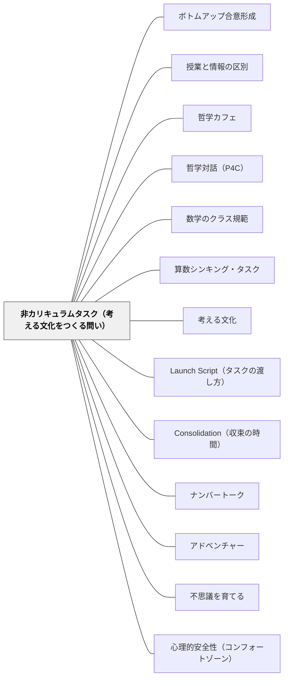

# 非カリキュラムタスク（考える文化をつくる問い）

> 「算数は答えを出す教科」という文化が固まる前に、「算数は考え続ける教科」という文化を作る問いを最初に使う。

---

## Pattern Connection

**出典**: Liljedahl, P. & Giroux, M.（2024）*Mathematics Tasks for the Thinking Classroom, Grades K-5.* Corwin.（統合：2026-05-17）

- **既存パタンとの関連**: [[パタン/考える文化]] と最も直接的に対応する。「文化をつくる」は一回の授業でなく、最初の1〜2週間で定着させる必要があり、非カリキュラムタスクはその期間のメイン素材になる。[[パタン/ナンバートーク]] も非カリキュラムタスクの一種として本書に位置づけられている。
- **補強された点**: 「年度初め1〜2週間は非カリキュラムタスクだけ使う」というBTC実践の根拠が、本書Part 2の20タスクによって具体化された。どのタスクから始めるか・どう順番を組むかの設計図が与えられた。
- **修正・拡張された点**: 非カリキュラムタスクは年度初めだけでなく「週1回使い続けることで文化が維持される」ことが本書で明確化された。
- **他のパタンへの波及**: [[パタン/アドベンチャー]] と接続——非カリキュラムタスクの「どこまでも続けられる」感覚がアドベンチャー的探究の感覚を育てる。

---

## 背景（Context）

「考える教室（Thinking Classroom）」を作る最大の障壁は、子どもが「算数の授業では、手順を覚えて答えを出すものだ」という信念をすでに持っていることである。この信念は、小学校に入学した最初の1〜2週間の経験から形成され始める——教科書の問題、教師の解説、答え合わせというサイクルが、「算数のルール」として学ばれる。

Liljedahl & Giroux（2024）のPart 2に収録された非カリキュラムタスク（Task 1〜20）は、このサイクルを作る前に、別のサイクルを作るための問いである——「問いを見て試してみる」「行き詰まっても続ける」「別の方法を探す」「なぜ？を問う」というサイクル。

非カリキュラムとは「特定の学習指導要領の内容に対応しない」という意味であり、「算数の役に立たない」という意味ではない。むしろ、算数の核心にある「考え続けること・パターンを見つけること・理由を問うこと」を直接扱う。

## 問題（Problem）

年度初めに教科書のカリキュラムタスク（計算・図形・分数等）から授業を始めると、「この問題はこう解く」という正解・手順への志向が先に定着する。その後でシンキング・タスクを入れても、子どもは「正解を探す」モードで取り組み、「探究を続ける」文化にならない。

一方、非カリキュラムタスクだけを使い続けると、学習指導要領の内容が進まないというジレンマも生まれる。

## 力のかたち（Forces）

- 文化は最初の経験から作られる——年度初めの2週間が「算数とは何か」を定義する
- 非カリキュラムタスクは学習内容に縛られないため、「考えることそのもの」に集中できる
- 特定の計算・公式の既知・未知に関わらず全員が参加できる
- 週1回使い続けることで「考える文化」が維持されるが、毎回だとカリキュラムが進まない
- 非カリキュラムタスクから始めると「今日は何を学ぶの？」という子どもの問いが生まれ、カリキュラムタスクへの移行がスムーズになる

## 解決（Solution）

**年度初め1〜2週間は非カリキュラムタスクだけで「算数は考え続ける教科だ」という文化を作り、その後も週1回は使い続ける。**

---

### Liljedahl & Giroux（2024）の非カリキュラムタスク20本

| Task | 原題 | 数学的探究の核心 | 学年目安 |
|------|------|-----------------|----------|
| 1 | Hexagon Havoc | 六角形の分割・再構成・空間的思考 | K-2 |
| 2 | Next Door Numbers | 隣り合う数・数のパターン | K-2 |
| 3 | Letters in a Name | 名前の文字数・グラフ化・統計的思考 | K-2 |
| 4 | Shape Race | 図形の分類・特徴の体系化 | K-2 |
| 5 | Ice Cream Scoops | 組み合わせ・体系的な列挙の入口 | 1-3 |
| 6 | At the Fair | 組み合わせ・順列の入口 | 1-3 |
| 7 | Katha the Caterpillar | パターンの発見と延長 | 1-3 |
| 8 | Carnival Conundrum | 戦略・論理的思考 | 2-4 |
| 9 | Colored Boxes | 空間認識・論理・塗り分け | 2-4 |
| 10 | There's How Many Legs? | 数え方の工夫・倍数的思考 | 1-3 |
| 11 | Ways to Make 10 | 数の合成・分解・ボンドの全探索 | K-2 |
| 12 | Tables at a Party | 数のパターン・規則の発見・代数的思考の入口 | 2-5 |
| 13 | Squares on a Checkerboard | 体系的な数え方・二乗数の出現 | 3-5 |
| 14 | Prisms Prisms Prisms | 立体の特徴・体系的な分類 | 2-4 |
| 15 | Brianna the Birdy | パターンの一般化 | 2-4 |
| 16 | When is a Triangle a Square? | 図形の変換・概念の境界探索 | 3-5 |
| 17 | Outfit Choices | 順列・組み合わせの本格的探究 | 3-5 |
| 18 | How Many High Fives? | 組み合わせ・三角数との接続 | 3-5 |
| 19 | Folding Paper | 指数的成長・2の累乗の驚き | 3-5 |
| 20 | Twin Test | 論理・真偽の判定・演繹的思考 | 3-5 |

---

### 各タスクの実際の問題文（OCRから確認）

**Task 1「Hexagon Havoc（六角形の大騒ぎ）」（K-2年）：**
> 「この黄色い六角形を、他のパターンブロックを使って小さな形に分けてください。何通りの分け方ができますか？」
- Launch: パターンブロック一式を配るだけ。「分け方は何通り？」の問いのみ
- Mild: 「2つの形に分けよう」、Medium: 「全部の分け方を見つけよう」、Spicy: 「一般化できる？」
- Consolidation: 「異なる分け方はいくつ見つかった？どうやって全部見つけたと分かる？」

**Task 2「Next Door Numbers（隣の数）」（K-2年）：**
> 「隣り合った2つの数を選んで足してみてください。何か気づくことがありますか？」
- 数系列や整数の列で「隣り合う」を定義し、足し算の結果のパターン（常に奇数）を発見させる
- Spicy: 「3つの連続した数を足したら？」「なぜいつもそうなるの？」

**Task 7「Katha the Caterpillar（毛虫のカタ）」（1-3年）：**
> 「毛虫のカタは1日目に1個、2日目に2個、3日目に3個の葉っぱを食べます。10日間では全部で何枚食べる？」
- Task 12（Tables at a Party）の前段として機能する：パターンを表に書く→一般化
- Consolidation: 「1日目から10日目の合計はどうやって求めた？」（三角数との接続）

**Task 8「Carnival Conundrum（カーニバルの謎）」（2-4年）：**
> 「ゲームのペグボードの上からボールを落とします。各ペグで左か右に進みます。一番下のどのカップに入るか、入れ方を決められますか？」
- V字型の段々のペグボード図を渡す（3段なら4カップ）
- 核心：一番下のカップの番号は、ボールの経路中の「右」の回数で決まる
- Spicy: 「奇数カップ（1番・3番）にしか入れられないのはなぜ？」→偶奇性の発見

**Task 15「Brianna the Birdy（小鳥のブリアナ）」（3-5年）：**
> 「ブリアナという小鳥が木の上の枝に留まっています。1日目に1段、2日目に2段、3日目に3段ジャンプします。50日目は何段目にいる？」
- 三角数（1+2+3+...+n = n(n+1)/2）の発見タスク
- 3種類の解法：①足し算で計算、②表で予測、③ガウスの公式を再発見
- Consolidation: 「なぜn×(n+1)÷2になるの？　図で説明できる？」

**Task 18「How Many High Fives?（ハイタッチは何回？）」（3-5年）：**
> 「クラス全員（10人）が一人残らずお互いにハイタッチをすると、全部で何回ハイタッチがある？」
- まず実際に小グループで試させる（3人→4人→5人と増やす）
- Task 7（Katha）・Task 12（Tables）との構造的接続：三角数が再び現れる
- Consolidation: 「ハイタッチの数と三角数のつながりをグループに説明できる？」

---

### 年度初めの設計例（1〜2週間）

Liljedahl & Giroux（2024）が示す典型的な導入期の設計：

| 日 | タスク | ねらい |
|----|--------|--------|
| 1日目 | Task 11（Ways to Make 10） | 全員が入れる・「全部見つける」という目標の体験 |
| 2日目 | Task 5（Ice Cream Scoops） | 体系的に考えるとは何か・「もれなく全部」の体験 |
| 3日目 | Task 12（Tables at a Party） | パターンを発見して延長する・「なぜ？」を問う |
| 4日目 | Task 18（How Many High Fives?） | 実際に動いて数える・パターンから公式への橋 |
| 5日目 | Task 19（Folding Paper） | 「信じられない」驚き・探究が止まらない感覚 |

日本版として使いやすいのは特に Task 11（おはじきで10の分け方）・Task 12（テーブルの問題）・Task 5（アイスの組み合わせ）。

---

### 日本の学校での非カリキュラムタスクの使い方

**年度初めに使う（4月最初の1〜2週間）：**
- 算数の授業開きとして、教科書に入る前に「算数ってこういうことをする教科だよ」を体験させる
- 特別支援学級と通常学級を問わない——Mildが操作から始まるため全員が入れる

**週1回使い続ける（通常の単元授業の中で）：**
- 水曜日の算数を「シンキング・タスクの日」と決める
- その日は単元のカリキュラムを進めず、非カリキュラムタスクを1問扱う
- 「算数を楽しむ・考え続ける」という文化が週1回リセット・維持される

**日本版の非カリキュラムタスクの例（[[教材/算数シンキング・タスク集]] より）：**
- タスク1「おはじきの分け方」（Task 11の日本版）
- タスク4「奇数の和のパターン」
- タスク7「階段の形を続けよう」
- タスク10「とびいし何通り？」（フィボナッチの発見）
- タスク41「3つ連続した数の和のひみつ」

---

### 特別支援学級での非カリキュラムタスクの使い方

非カリキュラムタスクは特別支援学級でこそ価値が高い。

- **学習指導要領の「進度」に縛られない**——「どの学年の内容か」でなく「今この子が考えられるか」で選べる
- **Mildが具体物・操作から始まる**——おはじき・積み木・紙折りなど、言語より先に手が動く
- **正解が1つでない**——「全部見つけた！」という経験が、「自分も算数ができる」という自己効力感につながる
- **教師も「答えを知らない」状態で入れる**——支援学級では教師と子どもが「一緒に探す」関係が作りやすく、非カリキュラムタスクはその場を自然に作る

---

## 結果（Consequences）

- 「算数は考え続けるもの」という文化が年度初めに定着しやすくなる
- カリキュラムタスクを入れたときも「まず自分で試す」文化が続く
- 「正解を探す前に試す」という習慣が育つ
- ただし、非カリキュラムタスクだけでは学習指導要領の内容が進まない——週1回の活用が現実的な落としどころ
- 教師が「答えを持っていない」ことへの不安が最初は生まれるが、それ自体が探究の文化を作る

## 関連パタン
- [[パタン/ボトムアップ合意形成]]
- [[パタン/授業と情報の区別]]
- [[パタン/哲学カフェ]]
- [[パタン/哲学対話（P4C）]]
- [[教科/LowFloorHighCeilingタスク集]]
- [[教科/算数]]
- [[教科/算数・数学で使うパタン]]
- [[パタン/数学のクラス規範]]

- [[パタン/算数シンキング・タスク]] — 非カリキュラムタスクが機能するタスク設計の全体像
- [[パタン/考える文化]] — 非カリキュラムタスクが育てる文化の本体
- [[パタン/Launch Script（タスクの渡し方）]] — 非カリキュラムタスクをどう渡すか
- [[パタン/Consolidation（収束の時間）]] — 探究後の数学的まとめ
- [[パタン/ナンバートーク]] — 非カリキュラムタスクの一種として機能するウォームアップ
- [[パタン/アドベンチャー]] — 「もう少し先へ」という探究の続く感覚
- [[パタン/不思議を育てる]] — 「なぜ？」「いつも？」という問いを持ち続ける文化
- [[パタン/心理的安全性（コンフォートゾーン）]] — 全員が「入れる」ための安心の基盤
- [[教材/算数シンキング・タスク集]] — 日本語版の非カリキュラムタスク（タスク1・2・4・7・8・10〜12・40〜42等）
- [[文献/Mathematics Tasks for the Thinking Classroom（Liljedahl & Giroux）]] — 一次資料

---

- [[概念/認知加速とダイナミック・アセスメント（学習する力そのものを狙う）]] — 「進度に使わない時間」をどう確保するか。CASE は2週に1コマを2年間充てる

## クラスター図

## Actionable Insight

- **4月最初の算数の時間に「おはじきを10個に分けよう」から始める**——「今年の算数は、正解を出すだけでなく、全部見つけるまで考え続けるものです」と言って始める。教科書は2週間後でいい
- **水曜の算数を「シンキング・タスクの日」にする**——1週間に1回だけでも非カリキュラムタスクを入れると、「考える文化」が単元の間も続く。30〜45分で1問だけ扱う
- **特別支援学級では「紙を折る問題」から始める**——Task 19（Folding Paper）は言葉より手が先に動く。「紙を8回折ったら何枚になる？」——一緒に折りながら数えるだけで「驚き・考える・続けたい」が生まれる

---

## 出典

Liljedahl, P., & Giroux, M.（2024）. *Mathematics Tasks for the Thinking Classroom, Grades K-5*. Corwin（Corwin Mathematics Series）. ISBN 978-1-0719-1329-1.

Liljedahl, P.（2021）. *Building Thinking Classrooms in Mathematics*. Corwin.

> "Non-curricular tasks are not tasks that lack mathematics. They are tasks that are rich in mathematics but not tied to specific curriculum outcomes. They allow students to experience mathematics as a thinking activity before they experience it as a performance activity."
> — Liljedahl & Giroux（2024）
