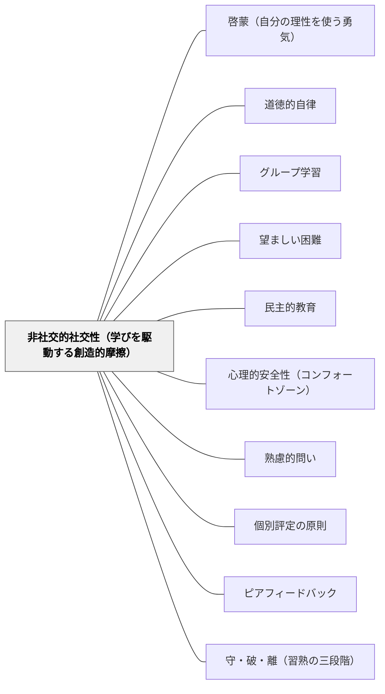

# 非社交的社交性（学びを駆動する創造的摩擦）

> 「野に孤立する樹は大きく曲がりくねって成長し、その枝を広げる。ところが森の真ん中に立つ樹は、そばの樹がこれに逆らうので、まっすぐに成長し、空気と日光を上に求める」——カント『教育学』

---

## [Pattern Connection]

**カント（1784）『世界市民という視点からみた普遍史の理念』統合：**

カントは人類の歴史を動かす根本原理として「**非社交的社交性（Ungesellige Geselligkeit）**」を提示した。人間は社会を求めながら（社交性）、同時に孤立・独立・自分の意志を貫こうとする（非社交性）——この二重性がもたらす摩擦こそが、文化・技術・道徳の進歩を駆動してきた。

- **補強する既存パタン**：[[パタン/グループ学習]] はグループのサイズと継続時間の設計を論じるが、「なぜ他者との摩擦が学びを深めるか」の哲学的根拠は提供していない。本パタンはその問いに答える
- **深化する既存パタン**：[[パタン/望ましい困難]] は認知的困難（記憶・検索）の価値を論じるが、非社交的社交性が提供するのは**社会的摩擦**の価値——他者の視点・反論・競争という外部からの抵抗が思考を鍛える
- **接続する概念**：[[パタン/啓蒙（自分の理性を使う勇気）]] — 自分の理性を鍛えるためには他者との「公的な対話」が必要。孤独な思考では自分の思考の限界に気づけない
- **他のパタンへの波及**：[[パタン/道徳的自律]] — 規範を問い直す力は他者との道徳的摩擦の中で育つ。[[パタン/民主的教育]] — 民主的な「対話と対立」が市民性の訓練場になる

---

## 背景（Context）

カントは1784年の「普遍史の理念」で、自然が人間に与えた最大の逆説を描いた——**非社交的社交性（Ungesellige Geselligkeit）**。人間は他者と共に生きることを求める（社交性）。しかし同時に、他者に抵抗し、自分の意志を通そうとする（非社交性）。

この二つの衝動がぶつかり合うとき、競争が生まれ、努力が生まれ、文化が生まれる。もしも人間が完全に社交的なら——つまり誰もが調和し、誰も反論しなければ——人類は進歩しなかったとカントは言う。

教室も同じ構造を持っている。学習者は学びの共同体を求めながら（社交性）、同時に自分の考えを持ち、他者と違うことを感じる（非社交性）。この二重性をうまく設計した教室では、互いの違いが学びの燃料になる。

## 問題（Problem）

教育は往々にして、社交性と非社交性の一方を排除しようとする。

- **過度な協調設計**：「みんなで仲良く」「グループで合意」を重視しすぎると、個人の独自な思考が同調圧力によって消滅し、グループ全体の考え方が均質化する
- **過度な競争設計**：「個人の成績だけが重要」「他者は競争相手」とすると、学習者は孤立して深い思考に達しにくく、他者から学ぶ機会を失う

どちらも「非社交的社交性」の二重性のどちらかを消してしまう——そして、その緊張がなくなった場に、成長はない。

## 力のかたち（Forces）

- 孤独な思考は独自性を生むが、外部からの批判・反論を受けないまま誤りを抱え続ける危険がある
- 他者と共に考えることは新しい視点をもたらすが、社会的圧力によって思考が集団に同質化する危険がある
- 競争は努力を引き出すが、強すぎると協力を破壊し、弱い学習者の関与を損なう
- 協力は安心感をもたらすが、弱すぎると各自の思考の深さが浅いままグループが「できた」で終わる
- 「森の木」の比喩：隣の木が抵抗を与えるから、木はまっすぐ上へ伸びる——抵抗がなければ曲がって広がるだけ

## 解決（Solution）

**個人の思考が他者の思考と「摩擦」する場を意図的に設計する。純粋な協調でも純粋な競争でもなく、「互いに抵抗し合いながら共に進む」構造をつくる。**

---

### 設計パターン①：個人→摩擦→統合のサイクル

**Think（個人思考）→ Pair/Group（他者との摩擦）→ Individual synthesis（個人の統合）**

最初に個人で考えさせる——これが「非社交的」段階。次に他者と対話させる——これが「社交的」段階の摩擦。最後に再び個人に戻り、摩擦を通じて更新された考えを統合する。このサイクルを一授業に1〜2回組み込む。

---

### 設計パターン②：構造的論争（Structured Academic Controversy）

グループを2チームに分け、それぞれが対立する立場を「弁護」させる。その後、立場を入れ替え、最後に統合的な結論を出す。人工的に対立を作ることで、摩擦が学習の燃料になる。

---

### 設計パターン③：個人課題 ＋ 互いの反論

各自が自分の考えを文章・図・口頭で表現した後、ペアで「この考えの弱点は何か」を問い合う。「どうして？」「本当に？」「反例は？」という問いかけが、相互の抵抗（非社交性）を安全に実現する。

---

### 設計パターン④：個別評定の原則との組み合わせ

グループで協力するが、評定は個人に対して行う（[[パタン/個別評定の原則]]）。これにより「グループの結果」への同調圧力を減らし、各自が独自の思考を持ち続けるインセンティブを保つ——協力と独立性の両立。

---

### 何が「摩擦」を生産的にするか

カントの森の木の比喩が示すように、抵抗が生産的であるためには**方向性**が必要だ。阻害（横から押しつぶす）ではなく、抵抗（正面から向き合う）。教室においては：

- **心理的安全性（[[パタン/心理的安全性（コンフォートゾーン）]]）**：失敗・間違いを責めない文化が「安全な摩擦」を可能にする
- **内容への焦点**：「あなたが間違っている」ではなく「この考えに弱い点がある」——人でなくアイデアへの反論
- **対等な立場**：評価・序列による圧力ではなく、知識・根拠による説得

## 結果（Consequences）

- 他者との摩擦を経た思考は、孤独な思考より深く、かつ自分の言葉になる
- 異なる視点の衝突から、どちらか一方では辿り着けなかった解が生まれる
- 「他者は学びのリソース」という学習文化が育ち、多様性が強みになる
- ただし、摩擦が強すぎると（優劣関係・嘲笑・承認欲求のぶつかり合い）、非社交性の側が勝り、協力が崩壊する——心理的安全性と組み合わせることが条件

## 関連パタン

- [[パタン/啓蒙（自分の理性を使う勇気）]] — 自己の理性を鍛えるには他者との公的対話が必要。啓蒙の社会的条件
- [[パタン/道徳的自律]] — 規範を問い直す力は、他者からの道徳的抵抗（「なぜ？」「それは正しいのか？」）の中で育つ
- [[パタン/グループ学習]] — グループ設計の具体的実践。非社交的社交性の哲学的根拠を持ったグループ活動
- [[パタン/望ましい困難]] — 認知的困難と社会的摩擦は相補的。外部からの抵抗（社会的）と内部の認知的苦労（認知的）が重なるとき学びが最も深まる
- [[パタン/民主的教育]] — 民主的な対話は安全な「非社交的社交性」の制度化。対立する立場の公的な議論が民主的市民を育てる
- [[パタン/心理的安全性（コンフォートゾーン）]] — 摩擦が生産的になるための土台。安全なければ摩擦は成長でなく防衛を生む
- [[パタン/熟慮的問い]] — 「なぜそう思う？」「反例は？」という問い返しが摩擦を構造化する
- [[パタン/個別評定の原則]] — 協力と個人の独自性を両立させる評価設計。非社交的な側（独自の思考）を制度的に保護する
- [[パタン/ピアフィードバック]] — 相互の思考への反応が「社交的な摩擦」の実践形態
- [[パタン/守・破・離（習熟の三段階）]] — 「守」から「破」への移行は、既成規範への個人の「非社交的な抵抗」として読める
- [[概念/世界市民教育とパタン・ランゲージ]] — 非社交的社交性は世界市民として「異なる他者」と生きることの哲学的根拠

---

## クラスター図

## Actionable Insight

- **今週すぐ試す**：「考えて→ペアで話して→自分の言葉でまとめる」の3段階を1回の授業に組み込む——「野の孤立した木」から「森の中の木」へ。他者の抵抗が思考をまっすぐにする
- 「みんな同じ意見になってしまった」とき「誰か反対意見を言ってみて」と促す——同質化はグループの非社交性が消えたサイン。あえて意見の対立を招く
- 個人の解をグループで発表し合う際、「良いところを言う前に、気になる点を1つ言う」というルールを設ける——批判を後押しする構造が社会的摩擦を安全に作る
- グループ課題でも最後に「あなた個人はどう思うか」を必ず個別に書かせる——グループへの同調で個人の思考が溶けていないか確認する
- 学習者に「あの話し合いで考えが変わったか、変わっていないか」を問い返す——摩擦が統合されたかどうかを内省させることで、非社交的社交性のサイクルを意識化する

---

## 出典

Kant, I. (1784). *Idee zu einer allgemeinen Geschichte in weltbürgerlicher Absicht* [世界市民という視点からみた普遍史の理念].
Kant, I. (未発表). *Pädagogik* [教育学].（「森の木」の比喩の出典）
邦訳: カント著, 中山元訳（2006）「世界市民という視点からみた普遍史の理念」『永遠平和のために／啓蒙とは何か 他３編』光文社古典新訳文庫.

→ 文脈全体は [[文献/永遠平和のために・啓蒙とは何か 他３編（カント、中山元訳）]] を参照。

> 「人間の本性から、美しいものを生み出すことを期待することはできない。人間は曲がった木材から作られており、それから真っすぐなものを削り出すことはできない。ただし自然はそのような素材から、まっすぐに成長しようとする傾向を引き出すことはできる——他の木が抵抗するからこそ、まっすぐに上へ向かうのである」——カント（趣旨）
