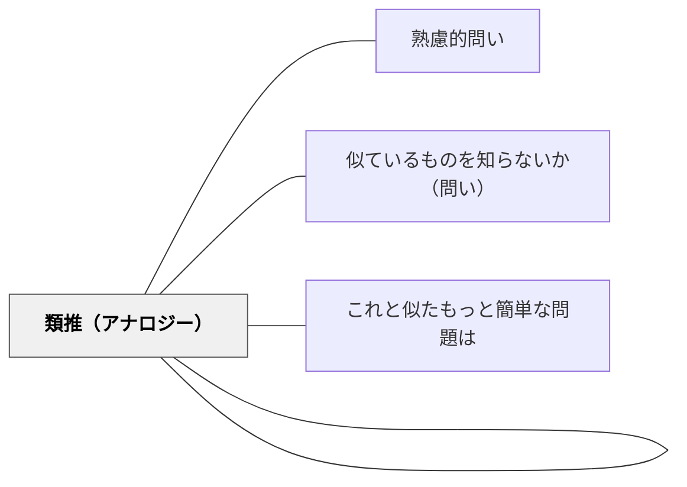

# 類推的な問題は（問い）

> 似た構造の問題を探すことで、解法の手がかりが見えてくる。

## 背景（Context）

[[パタン/熟慮的問い]] のメタ認知の問い（ポリア）グループ。問題解決において、全く未知の問題でもどこかに「似た問題」が存在することが多い。そのアナロジーを意識的に探す問いがここに属する。類推的思考は数学・科学・言語など、あらゆる教科の深い学習を支える。

## 問題（Problem）

目の前の問題に行き詰まったとき、学習者は「この問題は初めて見る」「方法がわからない」と感じて思考が止まってしまう。過去に学んだ知識や解法を転用する発想が生まれにくい。

## 力のかたち（Forces）

- 問題の「構造」の類似に気づくには、ある程度の経験と抽象化能力が必要
- 「似ている問題」を見つけたとしても、そのまま適用できないこともある
- 類推的思考は強力だが、誤ったアナロジーに引きずられる危険もある
- 類推の探索プロセス自体が、問題の本質的な理解を深める効果がある

## 解決（Solution）

**「これに似た問題を以前に解いたことはないか？同じ種類の問題かもしれない」と問いかけ、既知の問題や状況との類似性を積極的に探させる。**

問いかけの例：
- 「この問題、どこかで似たようなものを見たことがある？」
- 「構造が似ている問題はないか？同じ種類だと思う？」
- 「別の場面でこれと同じパターンを使ったことはあるか？」

[[パタン/類推（アナロジー）]] と組み合わせて類推的推論全体を活性化させる。

## 結果（Consequences）

- 過去の学習経験が新しい問題解決に活かされるようになる
- 問題を「種類」や「構造」で見る抽象的な視点が育つ
- 既存の知識の転用・再利用への意識が高まる

## 関連パタン

- [[パタン/熟慮的問い]] — 親パタン
- [[パタン/似ているものを知らないか（問い）]] — 近接パタン（既知からのアナロジー探索）
- [[パタン/類推（アナロジー）]] — 類推的推論のパタン
- [[パタン/これと似たもっと簡単な問題は]] — 問題を単純化するパタン

## クラスター図

## Actionable Insight

- 行き詰まった学習者に「この問題、どこかで似たようなものを見たことがある？」と声かけする——類推探索の問いかけが思考停止を打破する最初の一手
- 単元終了時に「今日の学習と同じ構造の問題・場面」を1つ考えさせる——類推的な眼が知識の転移を促す
- 類似する問題を2問並べて「この二つはどこが似ているか」を先に分析させる——構造の観察が解法の発見を促す

## 出典

- [[文献/熟慮的問いのパターンリスト（動画記録）]]
- ジョージ・ポリア（1954）『いかにして問題をとくか』丸善出版
