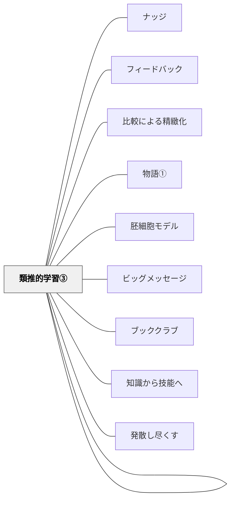

# 類推的学習①

> 複数の作品を読み比べ、構造的類似（型）を発見し、その型を使って自分で書く——アトウェルのジャンル学習が体現する比較・アナロジーによる学習。

## 背景（Context）

子どもたちに「書き方」を教えようとして、ルールを説明したり模範文を見せたりしても、実際に書けるようにはなりにくい。何を書くか（内容）と、どう書くか（型）の両方を教師が指定すると、学習者の自律性が育たない。

## 問題（Problem）

「書きなさい」という指示だけでは型がわからない。「このように書きなさい」という指示では主体性が育たない。学習者が自分で型を発見し、自分の内容でその型を使うようになるにはどうすればよいか。

## 力のかたち（Forces）

- 型（構造）は教えることができる——しかし教えすぎると学習者が自分で考えなくなる
- 複数の良い作品を読み比べると、学習者は自然にパターンを発見する
- 自分で発見した型は、受け取った型より深く理解され、応用される
- 認知科学のメタ分析（57実験・336テスト）が示す：比較による類推的学習は単一事例より一貫して高い学習成果を生む（Alfieri et al., 2013）

## 解決（Solution）

### 類推的学習の定義

「類推的学習」は「アナロジカルラーニング（analogical learning）」の直訳である。アナロジーとは：
1. 複数の対象を比較し類似点（類似点そのもの）を見出すこと
2. 類似点や知っていることを元にして、未知の事柄の解決や推論をすること

この類推的思考を用いた学習が類推的学習である（岩井輝久「教科科学国語教育」2016年6月号）。

---

### アトウェルのジャンル学習（4ステップ）

1. **読み比べ**：同じジャンルの作品を複数読む（教師の作品・先輩の作品・プロの作品）
2. **気づきを書く**：「書き手は何を・どのように書いているか」を宿題等で記録する
3. **共有・クラスで整理**：気づきをグループで共有し、そのジャンルの評価基準リストをクラスで作る
4. **制作**：評価基準を手がかりに自分でそのジャンルの作品を書く

**ブックレビューの実践（小学4年生）**：
- 複数のブックレビューを読み比べ、「優れたブックレビューの特徴」をクラスで発見
- 子どもたちが出したリスト例：本のタイトルと著者がある、おすすめ度と理由がある、あらすじはあるが結末を書かない、引用を使っている、自分のメッセージがある
- 完成作品を製本 → 次年度の選書ガイドブックとして機能

---

### ノート検定の実践（類推的学習の応用）

**明治図書「教科科学国語教育」2016年6月号**（特集：子どもの思考を活性化するノート指導、中学年担当）に掲載した実践より。

ノート検定の評価基準を**子どもたちが自分で作る**実践：
- 優れたノートの実例をいくつか観察・比較する
- 類似点（例：見出しをつける、色を使う、ページを区切るなど）を見出す
- その類似点から評価基準（1級・2級・3級など）を子どもたちが自作する

これが類推的学習である：「優れたノートに似ているところ（類似点）を見つけて、自分のノートを書くことに生かしていく」。Shirley Clarkeの形成的評価実践（評価基準を学習者が共同作成する）とほぼ重なる。

---

### 3人の実践者に共通する類推的学習

立場は異なるが、共通して類推的学習を体現している：

| 実践者 | 立場 | 実践 |
|--------|------|------|
| 牧口常三郎（約100年前）| 系統学習寄り・プロジェクト学習批判 | 文系応用主義（同種のものを比較して応用） |
| Nancy Atwell | 子ども中心・自己選択・リーディング/ライティングワークショップ | ジャンル学習 |
| Shirley Clarke | 形成的評価の研究実践者 | 評価基準の共同作成、くじ引きによるランダム取り上げ |

牧口とアトウェルは教育観が真逆に近い（系統学習 vs 子ども中心）にもかかわらず、「複数の類似した例を比較して型を見出し、それを自分の問題解決に使う」という学習法において一致している。これは類推的学習が教育的立場を超えた普遍性を持つことを示す。

## 結果（Consequences）

- 型を「教わった」のではなく「発見した」という感覚が、制作への動機を高める
- 評価基準をクラスで共同作成することで、評価の観点を学習者が所有する
- 書けない子の足場になる（クラスでの共作段階が特に効果的）
- 単一ジャンルの型を超えて、「型を発見する方法」自体を学ぶ

## このパタンが働く実践

| 実践 | どのように類推的学習①が働くか |
|------|--------------------------------|
| [[実践/俳句と短歌を楽しもう]] | 複数の俳句・短歌に触れ、よい作品の特徴を確認してから自分の表現へ生かす |
| [[実践/言葉をよりすぐって俳句を作ろう]] | 俳句の実例を読み比べ、よい俳句の特徴を推敲ポイントとして構成する |
| [[実践/個別支援級の複式算数：重さと面積をわたり・ずらしで学ぶ]] | 長さ・かさ・重さ・面積の単位を比較し、既習の単位関係から新しい単位を類推する |

## 関連パタン
- [[パタン/ナッジ]]
- [[パタン/フィードバック]]
- [[パタン/比較による精緻化]]
- [[パタン/物語①]]
- [[パタン/類推（アナロジー）]]
- [[パタン/胚細胞モデル]]

- [[パタン/類推的学習②]] — 物語の書き換え（パロディ作文）による類推的学習
- [[パタン/類推的学習③]] — 文型応用主義と推理式指導算術
- [[パタン/ビッグメッセージ]] — ミニレッスンで型のエッセンスを届ける
- [[パタン/ブッククラブ]] — 読み比べから対話的読みへ
- [[パタン/知識から技能へ]] — 型の知識（概念）→ 制作（技能）の構造
- [[パタン/発散し尽くす]] — 気づきを出し切ってから整理する
- [[概念/パタン・ランゲージ概論]]

## クラスター図

## Actionable Insight

- 次の作文・制作の前に、同じジャンルの良い作品を2〜3点読み比べる時間を設ける——型を教えるより先に、型を発見させる
- 「優れた○○の特徴は何か」をクラスで話し合ってリストにする——子どもたちが作ったリストが評価基準となり、フィードバックの共通言語になる
- 類推的学習の4ステップ（読み比べ→気づきを書く→共有→制作）を1つの単元で1回試してみる

## 出典
- [[文献/一つの教育のパタン・ランゲージ]]
- [[文献/読み書き教育における類推的学習の研究（第二版）]]

岩井輝久「岩井輝久『一つの教育のパタン・ランゲージ』」（2026-04-29 vault収録）  
岩井輝久「読み書き教育における類推的学習の研究第二版」2017年（2026-04-30 vault収録）  
岩井輝久「普遍的な学習理論につながるノート指導」教科科学国語教育 2016年6月号（明治図書）  
岩井輝久「教育のパタン・ランゲージ図解バージョン変遷記録（動画記録）V5（2024/12/01）」
