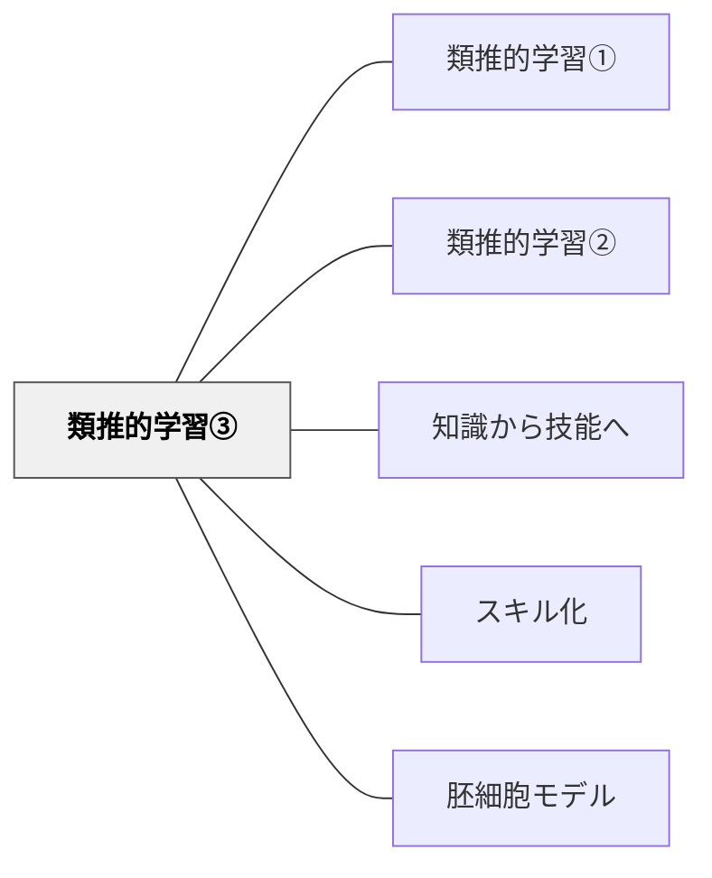

# 類推的学習③

> 文章の「型（構造）」を比較・観察し、その型を自分の作文に応用する——牧口常三郎の文型応用主義が体現する類推的学習。

## 背景（Context）

作文指導において、子どもが「何を書くか」は浮かぶが「どのように書くか」がわからない状態が続く。また教師の技能に依存する指導では、教師が変わると質が落ちてしまう。ペスタロッチは「教授法を行う個人の技能がすぐれているためというより、その方法の様式の本性そのもののために成果が挙がるような方法」を求めていた。

## 問題（Problem）

文章の型（構造）を教えようとすると、教師が「こう書きなさい」と指定し、学習者が受動的に従う形になりやすい。しかし型を強制されると、創造性が失われ、内容も形骸化する。

## 力のかたち（Forces）

- 型（構造）は学習を経済的にする——無駄な試行錯誤を省く
- しかし型を受け取るのではなく「発見する」過程が主体性を生む
- 文章の構造的類似（序論・本論・結論、段落の組み立て）は高次の関係——属性（内容）より構造が写像される（ゲントナーの構造写像理論）
- 「観念を先にし表出を後にすべし」（ペスタロッチ）——型の理解が先、制作が後

## 解決（Solution）

**牧口の文型応用主義**（4段階）：

1. **共読**：教師がメンターテキスト（模範文）を示し、全員で読む
2. **分析**：文章の型（序論・本論・結論、段落構造、接続詞の使い方）を観察・分析する
3. **共作**：全体で一つの文章を共同作成する（足場）
4. **個人制作**：型を手がかりに、自分の内容で書く

**構造写像理論との接続**（ゲントナー）：
- 「文型」とは文章の高次の関係（論理構造）のシステム
- 属性（何について書いているか）は写像しない——型（どのように組み立てているか）を写像する
- これが「文型応用」の認知科学的説明

**推理式指導算術**（戸田城聖、1930年）との接続：
- 牧口の文型応用主義を算数に適用した実践
- 算数の文章問題の「型」（問いの構造・解き方のパターン）を類推的に学ぶ
- 教科書教材を修正し、自然に類推を働かせる問題配列にデザインする

**牧口の「観念類化作用」**（1896年、最初の公刊論文）：
- 既知の観念をもとに未知の観念を理解する
- ヘルバルト教授学の「観念類化」を教育実践に適用
- 「已知より未知に進め」（ペスタロッチ）と同型の原理

## 結果（Consequences）

- 足場としての共作段階が、苦手な子の支援になる（「ここまで丁寧にやれると全体での共作が足場となり、実際に子どもたちが一人で書く段階のパフォーマンスは、だいぶ違ってくる」）
- 型を知ることで「どう書くか」の見通しが立ち、「何を書くか」に集中できる
- 教師の個人的技能に頼らず、方法の構造自体から成果が上がる

## 関連パタン
- [[教科/国語]]
- [[実践/ノート指導（読み書きハンドブック・ノート検定）]]

- [[パタン/類推的学習①]] — 比較・アナロジーによる学習（アトウェルのジャンル学習）
- [[パタン/類推的学習②]] — 物語の書き換え（パロディ作文）
- [[パタン/知識から技能へ]] — 型の知識→制作技能の構造
- [[パタン/スキル化]] — 複雑な文章技能をスキルに分解
- [[パタン/胚細胞モデル]] — 型（文型）が活動の背景にある原理
- [[概念/概念型の目標と胚細胞モデル]] — 文型はBig Idea

## クラスター図

## Actionable Insight

- メンターテキスト（模範文）を1つ選んで「この文章の骨格（序論・本論・結論）」をクラスで分析する——型を「発見」するプロセスが学習者の主体性と理解を同時に育てる
- 型の分析後、全体で1つのサンプル文章を共同で作成する——共作の足場が苦手な学習者の参加を保証する
- 個人作文の前に「自分のテーマで型をどう使うか」を一文でメモさせる——型を自分の文章に当てはめる意識的な一手が転移を促す

## 出典
- [[文献/一つの教育のパタン・ランゲージ]]
- [[文献/読み書き教育における類推的学習の研究（第二版）]]

岩井輝久「岩井輝久『一つの教育のパタン・ランゲージ』」（2026-04-29 vault収録）
岩井輝久「読み書き教育における類推的学習の研究第二版」2017年（2026-04-30 vault収録）
