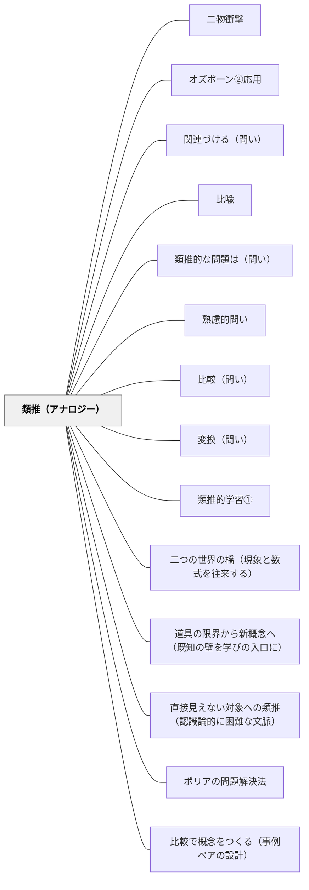

# 類推（アナロジー）

> 「これは何に似ているか？」と問い、構造的な類似からなじみのある知識で未知を理解する。

## Pattern Connection

### Nappo & Valente（2026）Analogical Reasoning in Science — 類推の構造と教室での設計原理

科学哲学の最新の議論が、このパタンに三つの重要な次元を付け加える。

**① 表面的類似 vs 構造的類似（Gentner, 1983, 1989）**

類推のパワーは「見た目が似ている」ことではなく、**関係の構造**が共通していることから生まれる。Gentnerの「構造マッピング理論（SMT）」の核心は：

> "No difference without similarity." — Gentner (1993: 683)

関係の等値写像（isomorphism）が先に特定されなければ、差異さえ見えない。「電気は水みたい」という類推が有効なのは外見ではなく「電圧：電流＝水圧：流量」という関係構造の対応があるからだ。教室で子どもが表面的類似で満足していたら「どんな*関係*が共通しているか」を問い返すことでこの水準に引き上げられる。

SMTから生まれる **4つの学習モード**（Gentner 2010: 754）は授業設計の枠組みとして使える：

| 学習モード | 問い |
|---|---|
| **Abstraction（抽象化）** | 「この二つに共通する構造は何か？」 |
| **Contrast（対比）** | 「共通構造の中でどこが違うか？」 |
| **Re-representation（再表現）** | 「別の言葉・図で言い換えると？」 |
| **Inference projection（推論投影）** | 「源が〇〇なら、対象は…？」 |

- **補強された点**：「構造的な類似を活用して」という既存の記述が、具体的なメカニズム（関係マッピング）と4つの学習操作として精緻化される。

**② 発見的役割 vs 正当化的役割（heuristic vs inductive view）**

類推には認識論的に異なる2つの役割がある（Nappo & Valente, 2026, pp.16–17）：

- **発見的役割**：類推は仮説・問い・アプローチを*生み出す*ための道具——仮説の正しさを保証しない。「もしかしてこれに似ているかも」という直観が探索を始める
- **正当化的役割**：よく構成された類推は仮説への*暫定的根拠*を与える——類似性が独立して確認され、本質的差異がない場合

教室では、この区別が問いのデザインを変える：
- 「〇〇に例えると何が見えてくる？」→ 発見的使用（アイデアの生成）
- 「この類推のどこが成り立ち、どこで崩れるか？」→ 正当化的使用（批判的吟味）

- **修正された点**：「類推は理解の足場」という既存の記述は発見的役割のみを捉えている。正当化的役割の意識的な設計が教育に加わる。

**③ 認識論的に困難な文脈（epistemically impoverished contexts）**

学習者が対象に直接アクセスできないとき——分子・歴史的場面・感情・宇宙・大きすぎる数・死など——類推は「単なる比喩」ではなく**唯一の認識的橋**になる（pp.13–15）。

この文脈には6種類がある：道具的（計測不可）、時間的（過去・未来）、倫理的（実験不可）、費用的、理論的（理論の空白）、計算論的（複雑すぎる）。特別支援の文脈では、抽象概念への認知的アクセスが限られている学習者にとって、この「橋」の設計が最重要課題になる。

- **波及するパタン**：[[パタン/道具の限界から新概念へ（既知の壁を学びの入口に）]]（認識的障壁を設計する）・[[パタン/二つの世界の橋（現象と数式を往来する）]]（構造マッピングの実践）・[[メタパタン/アブダクション（仮説形成）]]（発見的類推とアブダクションの重なり）

→ [[文献/Analogical Reasoning in Science（Nappo & Valente）]]

---

## 背景（Context）
人間の理解の多くは、知らないものを知っているものに結びつけることで進む。
類推（アナロジー）とは、異なる領域の事柄の間に構造的な類似を見出す推論だ。
科学史における多くの発見（電気と水流、原子と太陽系など）はアナロジーから生まれた。
教育においても、なじみのある概念から新しい概念へと橋を架けるとき、類推は強力なツールになる。

## 問題（Problem）
学習者が新しく難解な概念や仕組みに直面したとき、既有知識との構造的類似を活用して理解を深めるにはどうすればよいか。

## 力のかたち（Forces）
- 類推は理解の足場として機能するが、類推はあくまでも「似ている」だけで「同じ」ではない。
- 類推の限界を意識しないと誤解が生まれる（類推崩壊）。
- 複数の領域にわたる類推的思考は、創造的発想の源泉になる。
- 類推を自分で生み出すことと、与えられた類推を評価することは、どちらも重要な思考活動だ。

## 解決（Solution）
「これは何かに似ていますか？」「どんな構造が共通していますか？」「〇〇に例えると？」と問いかける。
学習者自身が類推を生み出すよう促し、どの点が似ていてどの点が異なるかを明確にさせる。
教師が提示する類推については「この類推がうまくいかない点は何か？」を問い返すことで批判的な使い方を教える。
異なるドメインから類推を探させることで、思考の横断性を育てる。

## 結果（Consequences）
既有知識のネットワークが新しい概念と統合され、深い理解が生まれる。
類推的思考の習慣が、創造的問題解決にも生かされるようになる。
類推の限界を意識することで、批判的思考とセットで機能する理解力が育つ。
ドメインを超えた知識の転用力が高まる。

## 関連パタン
- [[パタン/二物衝撃]]
- [[パタン/オズボーン②応用]]
- [[教科/算数・数学で使うパタン]]
- [[教科/国語]]
- [[パタン/関連づける（問い）]]
- [[パタン/比喩]]
- [[パタン/類推的な問題は（問い）]]
- [[パタン/熟慮的問い]] — 親パタン
- [[パタン/比較（問い）]] — 類似と差異を並べて考える問い（Contrast学習モード）
- [[パタン/変換（問い）]] — 異なる形式・表現への変換を問う（Re-representation学習モード）
- [[パタン/類推的学習①]] — 類推を活用した学習のパタン
- [[パタン/二つの世界の橋（現象と数式を往来する）]] — 構造マッピングの実践
- [[パタン/道具の限界から新概念へ（既知の壁を学びの入口に）]] — 認識論的に困難な文脈での類推
- [[パタン/直接見えない対象への類推（認識論的に困難な文脈）]] — 6種類の困難文脈の体系的設計（本パタンの実装）
- [[パタン/ポリアの問題解決法]] — 「より簡単な問題を探す」＝類推の発見的使用
- [[メタパタン/アブダクション（仮説形成）]] — 類推による仮説生成
- [[パタン/比較で概念をつくる（事例ペアの設計）]] — Gentnerの構造アラインメントを共通の認知メカニズムとする姉妹パタン。類推は既知→未知の構造写像、本パタンは2事例→概念の構造抽出

## クラスター図

## Actionable Insight

- 「これに似ているものを知っていますか？」→ 学習者が自分の言葉で類推を生み出す（発見的使用）
- 「どんな*関係*が共通しているか？」→ 表面的類似から構造的類似へ引き上げる問い（Gentnerの関係マッピング）
- 「この類推がうまくいかない点はどこか？」→ Contrast（対比）学習モードが批判的思考と概念精密化を同時に育てる
- 「〇〇を直接見たり触れたりできないとき、何を手がかりにできそうか？」→ 認識論的に困難な文脈で類推への入口を開く
- 授業で使っている類推（電気・分数・社会的ルール）が表面的類似か構造的類似かを自己点検する——「なぜこの類推は働くのか」を言語化できると指導の精度が上がる

## 出典
- [[文献/熟慮的問いのパターンリスト（動画記録）]]
- [[文献/Analogical Reasoning in Science（Nappo & Valente）]]
