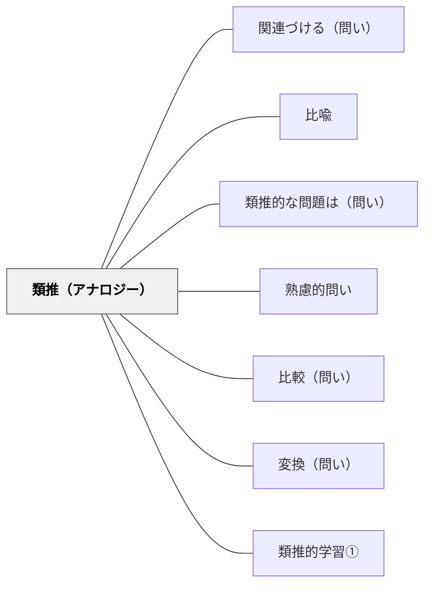

# 類推（アナロジー）

> 「これは何に似ているか？」と問い、構造的な類似からなじみのある知識で未知を理解する。

## 背景（Context）
人間の理解の多くは、知らないものを知っているものに結びつけることで進む。
類推（アナロジー）とは、異なる領域の事柄の間に構造的な類似を見出す推論だ。
科学史における多くの発見（電気と水流、原子と太陽系など）はアナロジーから生まれた。
教育においても、なじみのある概念から新しい概念へと橋を架けるとき、類推は強力なツールになる。

## 問題（Problem）
学習者が新しく難解な概念や仕組みに直面したとき、既有知識との構造的類似を活用して理解を深めるにはどうすればよいか。

## 力のかたち（Forces）
- 類推は理解の足場として機能するが、類推はあくまでも「似ている」だけで「同じ」ではない。
- 類推の限界を意識しないと誤解が生まれる（類推崩壊）。
- 複数の領域にわたる類推的思考は、創造的発想の源泉になる。
- 類推を自分で生み出すことと、与えられた類推を評価することは、どちらも重要な思考活動だ。

## 解決（Solution）
「これは何かに似ていますか？」「どんな構造が共通していますか？」「〇〇に例えると？」と問いかける。
学習者自身が類推を生み出すよう促し、どの点が似ていてどの点が異なるかを明確にさせる。
教師が提示する類推については「この類推がうまくいかない点は何か？」を問い返すことで批判的な使い方を教える。
異なるドメインから類推を探させることで、思考の横断性を育てる。

## 結果（Consequences）
既有知識のネットワークが新しい概念と統合され、深い理解が生まれる。
類推的思考の習慣が、創造的問題解決にも生かされるようになる。
類推の限界を意識することで、批判的思考とセットで機能する理解力が育つ。
ドメインを超えた知識の転用力が高まる。

## 関連パタン
- [[教科/国語]]
- [[パタン/関連づける（問い）]]
- [[パタン/比喩]]
- [[パタン/類推的な問題は（問い）]]
- [[パタン/熟慮的問い]] — 親パタン
- [[パタン/比較（問い）]] — 類似と差異を並べて考える問い
- [[パタン/変換（問い）]] — 異なる形式・表現への変換を問う
- [[パタン/類推的学習①]] — 類推を活用した学習のパタン

## クラスター図

## Actionable Insight

- 新しい概念を説明する前に「これに似ているものを知っていますか？」と問う——学習者が自分の言葉で類推を生み出すことで理解の足場が生まれる
- 教師が提示した類推に対して「この例えがうまくいかない点は何か？」と問い返す——類推の限界を考えることが概念の正確な理解を深める
- 「科学と日常」「算数と料理」など異なる領域間で類推を探させる——領域横断的な類推が創造的思考と知識の転用力を育てる

## 出典
- [[文献/熟慮的問いのパターンリスト（動画記録）]]
