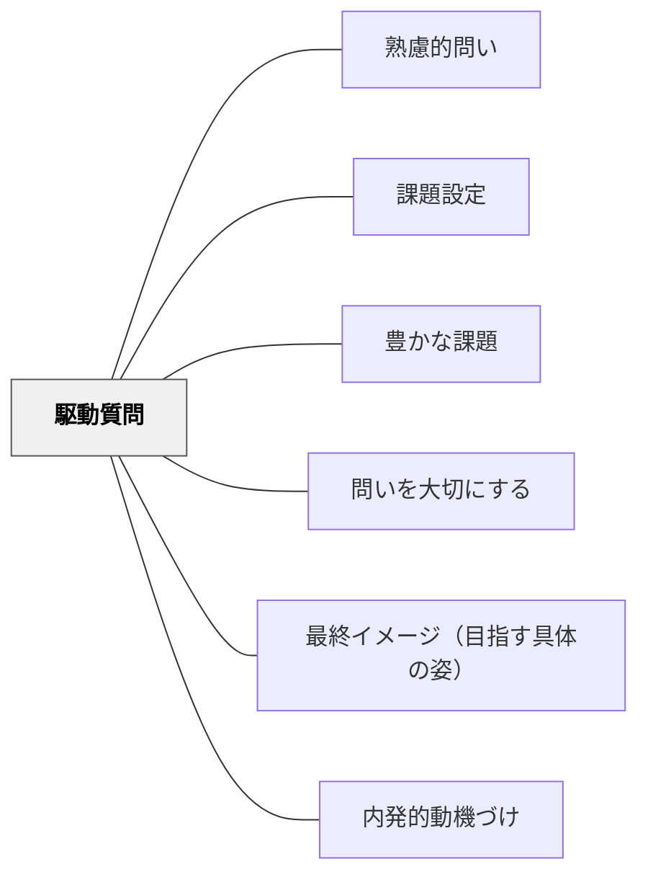

# 駆動質問

> 探究プロジェクト全体を動かし続ける中心的な問い（Driving Question）

## 背景（Context）
プロジェクト型学習（PBL）において、「駆動質問（Driving Question）」はプロジェクト全体の方向性を定め、学習者の探究意欲を持続させる核心的な問いである。Buck Institute for Educationをはじめ多くのPBL研究者が、良質な駆動質問の存在をプロジェクトの成否を左右する要因として指摘してきた。駆動質問は単元の最初に立てられ、最後まで問い続けられるべき問いである。

## 問題（Problem）
プロジェクト学習が活動の羅列に終わってしまう原因の一つは、問いの核心が不在であることである。「〇〇を作ろう」という活動目標はあっても、「なぜそれをするのか」「その活動を通じて何を問い続けるのか」という問いがなければ、学習は表面的な作業に留まる。また、問いが答えやすすぎると探究が早期に終結してしまい、学習者の思考が深まらない。

## 力のかたち（Forces）
- 問いの挑戦性 vs 学習者の現実との接続
- 問いの開放性 vs プロジェクトの方向性の明確さ
- 学習者の当事者性 vs 教師・ファシリテーターのデザイン
- 探究の持続 vs 答えへの収束

## 解決（Solution）
良い駆動質問は、挑戦的で・開放的で・学習者の現実と結びついている。例えば「私たちの町に観光客を呼ぶには、どんなガイドブックが必要か？」「未来の学校はどんな場所であるべきか、そのためにわたしたちは今何ができる？」のように、現実の文脈に根ざし、唯一の正解がなく、深い調査と議論を必要とする問いが良い駆動質問となる。プロジェクトを通じて問いは更新されてもよいが、常に問いに立ち返る習慣をデザインすることが重要である。

## 結果（Consequences）
- 学習者がプロジェクト全体を通じて探究の動機を維持できる
- 活動の意味と目的が問いによって常に可視化される
- 問いへの答えを求める過程で、深い知識・スキル・態度が統合的に育まれる

## 関連パタン
- [[パタン/熟慮的問い]] — 親パタン
- [[パタン/課題設定]]
- [[パタン/豊かな課題]]
- [[パタン/問いを大切にする]]
- [[パタン/最終イメージ（目指す具体の姿）]]
- [[パタン/内発的動機づけ]]

- [[概念/形成的評価の5つの戦略（3×3の枠組み）]] — 戦略②に位置づく。単元全体で証拠を引き出し続ける問い

## クラスター図

## Actionable Insight

- 単元・プロジェクトの最初に「挑戦的で開放的で学習者の現実と結びついた」駆動質問を一つ立てる——学習者がプロジェクト全体を通じて探究の動機を維持できる
- 「私たちの町に観光客を呼ぶには、どんなガイドブックが必要か？」のような唯一の正解のない問いのモデルを学習者と共有する——良い駆動質問の形を体験として理解させる
- 活動の節目に「最初の問いに照らすと、今どこにいるか？」を問う——問いへの立ち返り習慣がプロジェクトに一貫性と方向感を与える

## 出典
- [[文献/熟慮的問いのパターンリスト（動画記録）]]
