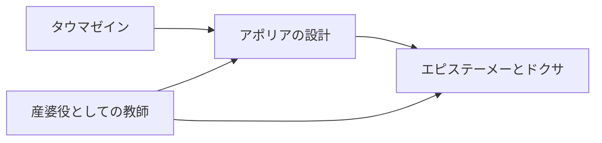

# 古典思想系ミニ系譜

古典思想系パタンを、単発リンクではなく「探究がどのように深まるか」の小さな流れとして読むためのページ。

## 探究が深まる流れ

## 読み方

| 順番 | パタン | 役割 |
|---|---|---|
| 1 | [[パタン/タウマゼイン（驚きから始まる探究）]] | 「なぜだろう」という驚きが、探究の入口を開く |
| 2 | [[パタン/アポリアの設計]] | 驚きを、分からなさに耐えて考える状態へ深める |
| 3 | [[パタン/エピステーメーとドクサ（知識と正しい考え）]] | 正しい考えを、理由によって縛られた知識へ進める |
| 4 | [[パタン/産婆役としての教師]] | 教師が答えを与えるのでなく、問いによって知が生まれる過程を助ける |

## 反映済みのつながり

- [[パタン/タウマゼイン（驚きから始まる探究）]] ↔ [[パタン/エピステーメーとドクサ（知識と正しい考え）]] — 発展: 驚きから始まった探究が、思い込みと知識を区別する知の吟味へ進む
- [[パタン/タウマゼイン（驚きから始まる探究）]] ↔ [[パタン/アポリアの設計]] — 発展: 驚きが、知っているつもりを揺さぶる「分からなさ」へ深まる
- [[パタン/アポリアの設計]] ↔ [[パタン/エピステーメーとドクサ（知識と正しい考え）]] — 発展: アポリア後の問い返しが、正しい考えを理由で縛りつける知の吟味へ進む

## 次に強める導線

- [[パタン/産婆役としての教師]] ↔ [[パタン/エピステーメーとドクサ（知識と正しい考え）]]: 教師の問答が、答えを引き出すだけでなく理由を産ませる関係を確認する

## 使い方

- ここは古典思想系の導線メモなので、自動生成ページではない。
- 新しいリンクを反映したら、[[メンテナンス/つながり反映ログ]] とこのページの両方に残す。
- 実際の関連パタン欄へ書く前に、このページで「流れ」と「ラベル」を確認する。

関連: [[メンテナンス/上位候補の短い読み解き]]、[[メンテナンス/次に反映するつながり]]、[[メンテナンス/関連パタンの関係ラベル]]
