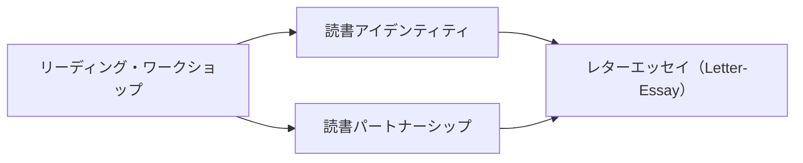

# 読書系ミニ系譜

読書系パタンを、単発リンクではなく「どのように読者が育つか」の小さな流れとして読むためのページ。

## 読者として育つ流れ

## 読み方

| 順番 | パタン | 役割 |
|---|---|---|
| 1 | [[パタン/リーディング・ワークショップ]] | 読む時間・選書・カンファランス・共有を組み合わせ、読者として育つ場をつくる |
| 2 | [[パタン/読書アイデンティティ]] | その場で「自分は読む人間だ」という自己像が育つ |
| 3 | [[パタン/読書パートナーシップ]] | 読書を一人の営みから、相手に話したくなる社会的実践へ広げる |
| 4 | [[パタン/レターエッセイ（Letter-Essay）]] | 読んだことを手紙として書き、読者としての履歴と対話を残す |

## 反映済みのつながり

- [[パタン/リーディング・ワークショップ]] ↔ [[パタン/読書アイデンティティ]] — 補完: ワークショップは読書アイデンティティを育てる環境であり、読書アイデンティティはワークショップの成果や目標を説明する
- [[パタン/レターエッセイ（Letter-Essay）]] ↔ [[パタン/読書アイデンティティ]] — 既存リンク: 書くことで読者としての自己像が言語化される
- [[パタン/読書パートナーシップ]] ↔ [[パタン/リーディング・ワークショップ]] — 既存リンク: 読書パートナーシップが組み込まれる親構造

## 次に強める導線

- [[パタン/読書パートナーシップ]] ↔ [[パタン/読書アイデンティティ]]: パートナーとの継続的な読書対話が、読者としての自己像をどう育てるか確認する
- [[パタン/読書パートナーシップ]] ↔ [[パタン/レターエッセイ（Letter-Essay）]]: 口頭の読書対話と、手紙による読書対話の違いを確認する
- [[パタン/リーディング・ワークショップ]] ↔ [[パタン/レターエッセイ（Letter-Essay）]]: ワークショップの中で、読むことと書くことをどう往復させるか確認する

## 使い方

- ここは読書系の導線メモなので、自動生成ページではない。
- 新しいリンクを反映したら、[[メンテナンス/つながり反映ログ]] とこのページの両方に残す。
- 実際の関連パタン欄へ書く前に、このページで「流れ」と「ラベル」を確認する。

関連: [[メンテナンス/上位候補の短い読み解き]]、[[メンテナンス/次に反映するつながり]]、[[メンテナンス/関連パタンの関係ラベル]]
