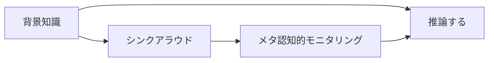

# 読解方略系ミニ系譜

読解方略系パタンを、単発の技法ではなく「読みの内側で何が起きているか」を見えるようにする小さな流れとして読むためのページ。

## 読みが深まる流れ

## 読み方

| 順番 | パタン | 役割 |
|---|---|---|
| 1 | [[パタン/背景知識]] | 読む前から持っている知識や経験が、本文理解の素材になる |
| 2 | [[パタン/シンクアラウド]] | 読者が背景知識や推論をどう使っているかを声に出して可視化する |
| 3 | [[パタン/メタ認知的モニタリング]] | 自分の読みが分かっているか、どこで止まったかを観察する |
| 4 | [[パタン/推論する（インファリング）]] | 背景知識・本文根拠・気づきをつなぎ、書かれていない意味を補う |

## 反映済みのつながり

- [[パタン/シンクアラウド]] ↔ [[パタン/背景知識]] — 補完: 背景知識が読解で使われる過程をシンクアラウドで可視化する

## 次に強める導線

- [[パタン/シンクアラウド]] ↔ [[パタン/メタ認知的モニタリング]]: 声に出した読みの過程が、自己観察へつながる関係を確認する
- [[パタン/背景知識]] ↔ [[パタン/推論する（インファリング）]]: 背景知識が、本文にない意味を補う推論を支える関係を確認する
- [[パタン/メタ認知的モニタリング]] ↔ [[パタン/推論する（インファリング）]]: 分からなさの観察が、根拠ある推論へ進む関係を確認する

## 使い方

- ここは読解方略系の導線メモなので、自動生成ページではない。
- 新しいリンクを反映したら、[[メンテナンス/つながり反映ログ]] とこのページの両方に残す。
- 実際の関連パタン欄へ書く前に、このページで「流れ」と「ラベル」を確認する。

関連: [[メンテナンス/上位候補の短い読み解き]]、[[メンテナンス/次に反映するつながり]]、[[メンテナンス/関連パタンの関係ラベル]]
