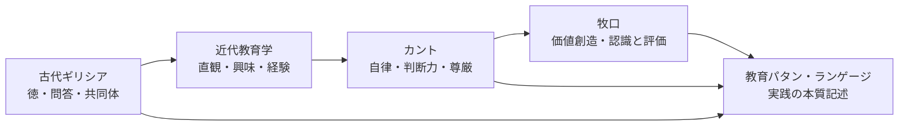

# 教育思想の系譜

教育パタン・ランゲージを、文献の時系列ではなく「問いの継承」として読むための地図。

## 全体像

## 古代ギリシアの教育観

| 文献 | 中心の問い | Wikiでの接続 |
|---|---|---|
| [[文献/ソクラテスの弁明（プラトン）]] | 吟味される生とは何か | [[パタン/無知の知]]、[[パタン/問いをもつ（クエスチョニング）]] |
| [[文献/メノン（プラトン）]] | 徳は教えられるか | [[パタン/アナムネーシス（想起としての学び）]]、[[パタン/アポリアの設計]] |
| [[文献/テアイテトス（プラトン）]] | 知識とは何か | [[パタン/産婆役としての教師]]、[[パタン/タウマゼイン（驚きから始まる探究）]] |
| [[文献/プロタゴラス（プラトン）]] | 徳・計量術・社会教育はどうつながるか | [[パタン/計量術（メトレーティケー）]]、[[パタン/複数の教育源]] |
| [[文献/政治学（上）（アリストテレス）]] | 人間はどのような共同体的存在か | [[パタン/ゾーン・ポリティコン（言葉による共同体形成）]]、[[パタン/フィリア（共同体の友愛）]] |

## 近代教育学の形成

| 文献 | 中心の問い | Wikiでの接続 |
|---|---|---|
| [[文献/ゲルトルート児童教育法（ペスタロッチ）]] | 直観・段階・生活からどう教えるか | [[パタン/具体から抽象へ]]、[[パタン/既知から未知へ]] |
| [[文献/教育学綱要（ヘルバルト）]] | 興味・観念連合・徳をどう組織するか | [[パタン/多方興味]]、[[パタン/先行オーガナイザー]] |
| [[文献/Democracy and Education（Dewey）]] | 民主主義と成長はどう関係するか | [[パタン/教育＝成長]]、[[パタン/民主的教育]] |
| [[文献/Experience and Education（Dewey）]] | 経験はどう教育的になるか | [[パタン/経験の質を問う]]、[[パタン/副次的学習]] |

## カントから教育目的へ

| 文献 | 中心の問い | Wikiでの接続 |
|---|---|---|
| [[文献/純粋理性批判 1（カント、中山元訳）]] | 認識はどの枠組みで成立するか | [[パタン/コペルニクス的転回（認識論）]]、[[パタン/ア・プリオリな枠組み]] |
| [[文献/判断力批判（上）（カント、中山元訳）]] | 判断力・美・崇高は学びとどう関わるか | [[パタン/崇高なもの（感性を超える教育体験）]]、[[パタン/学習の美学]] |
| [[文献/道徳形而上学の基礎づけ（カント、中山元訳）]] | 人を目的として扱うとは何か | [[パタン/目的の国（互いを目的として扱う学びの共同体）]]、[[パタン/子どもの尊厳]] |
| [[文献/永遠平和のために・啓蒙とは何か 他３編（カント、中山元訳）]] | 啓蒙・世界市民性・公的理性とは何か | [[パタン/啓蒙（自分の理性を使う勇気）]]、[[概念/世界市民教育とパタン・ランゲージ]] |

## 牧口から教育パタンへ

| 文献 | 中心の問い | Wikiでの接続 |
|---|---|---|
| [[文献/創価教育学体系 1（牧口常三郎）]] | 教育目的としての幸福とは何か | [[パタン/幸福（教育目的としての幸福）]]、[[パタン/教育目的]] |
| [[文献/創価教育学体系 2（牧口常三郎）]] | 認識と評価、真理と価値はどう違うか | [[パタン/認識と評価の区別]]、[[パタン/価値のインストラクション]] |
| [[文献/創価教育学体系 3（牧口常三郎）]] | 教師は知識を伝達するのか、発見を助けるのか | [[パタン/産婆役としての教師]]、[[パタン/非可視の教師]] |
| [[文献/創価教育学体系 4（牧口常三郎）]] | 教育技術をどう依法化するか | [[パタン/学習指導の三方面]]、[[パタン/教師の三方面修養]] |
| [[文献/一つの教育のパタン・ランゲージ]] | 実践の本質をどうパタンとして記述するか | [[パタン名インデックス]]、[[全パタン一覧]] |

## 文脈を読む教育哲学

| 文献 | 中心の問い | Wikiでの接続 |
|---|---|---|
| [[文献/法の精神（モンテスキュー）]] | 法・教育・政体はどの文脈で関係するか | [[パタン/政体の原理と教育目標]]、[[パタン/複数の教育源]] |
| [[文献/教育の哲学 人間形成の基礎理論（細谷恒夫）]] | 人間形成の様式をどう区別するか | [[パタン/人間形成の様式]]、[[パタン/教育目的]] |
| [[文献/質的研究法としてのパターン・ランゲージ（井庭崇）]] | 実践の本質をどう言語化するか | [[概念/パタン・ランゲージ概論]]、[[パタン・ランゲージの作り方]] |

## このページの使い方

- 文献を読む順番に迷ったら、まず系譜ごとの「中心の問い」を選ぶ。
- パタンを作るときは、ひとつの文献だけでなく、同じ問いを共有する複数文献を横断して読む。
- 文献ページを更新したら、このページの接続先も必要に応じて見直す。

関連: [[文献/index]]、[[メンテナンス/文献からパタンを作る]]
