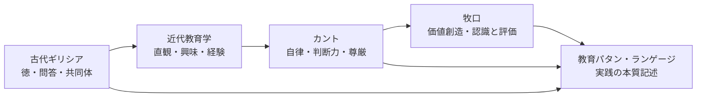

# 教育思想の系譜

教育パタン・ランゲージを、文献の時系列ではなく「問いの継承」として読むための地図。

## 全体像

## 古代ギリシアの教育観

| 文献 | 中心の問い | Wikiでの接続 |
|---|---|---|
| [[文献/ソクラテスの弁明（プラトン）]] | 吟味される生とは何か | [[パタン/無知の知]]、[[パタン/問いをもつ（クエスチョニング）]] |
| [[文献/メノン（プラトン）]] | 徳は教えられるか | [[パタン/アナムネーシス（想起としての学び）]]、[[パタン/アポリアの設計]] |
| [[文献/テアイテトス（プラトン）]] | 知識とは何か | [[パタン/産婆役としての教師]]、[[パタン/タウマゼイン（驚きから始まる探究）]] |
| [[文献/プロタゴラス（プラトン）]] | 徳・計量術・社会教育はどうつながるか | [[パタン/計量術（メトレーティケー）]]、[[パタン/複数の教育源]] |
| [[文献/国家（プラトン）]] | 正義・魂の教育・哲学者の本性とは何か | [[パタン/道徳的自律]]（ギュゲスの指輪）、[[パタン/審美的交渉]]（守護者の前教育）、[[パタン/ミメーシス（模倣による学び）]]（習慣化）、[[概念/魂の三区分]] |
| [[文献/政治学（上）（アリストテレス）]] | 人間はどのような共同体的存在か | [[パタン/ゾーン・ポリティコン（言葉による共同体形成）]]、[[パタン/フィリア（共同体の友愛）]] |

## 近代教育学の形成

| 文献 | 中心の問い | Wikiでの接続 |
|---|---|---|
| [[文献/ゲルトルート児童教育法（ペスタロッチ）]] | 直観・段階・生活からどう教えるか | [[パタン/具体から抽象へ]]、[[パタン/既知から未知へ]] |
| [[文献/教育学綱要（ヘルバルト）]] | 興味・観念連合・徳をどう組織するか | [[パタン/多方興味]]、[[パタン/先行オーガナイザー]] |
| [[文献/大学教育について（J.S.ミル）]] | 大学は何のためにあるか——人間形成か職業訓練か | [[パタン/専門以前の人間形成]]、[[概念/教養と人格形成]] |
| [[文献/Democracy and Education（Dewey）]] | 民主主義と成長はどう関係するか | [[パタン/教育＝成長]]、[[パタン/民主的教育]] |
| [[文献/Experience and Education（Dewey）]] | 経験はどう教育的になるか | [[パタン/経験の質を問う]]、[[パタン/副次的学習]] |

## カントから教育目的へ

| 文献 | 中心の問い | Wikiでの接続 |
|---|---|---|
| [[文献/純粋理性批判 1（カント、中山元訳）]] | 認識はどの枠組みで成立するか | [[パタン/コペルニクス的転回（認識論）]]、[[パタン/ア・プリオリな枠組み]] |
| [[文献/判断力批判（上）（カント、中山元訳）]] | 判断力・美・崇高は学びとどう関わるか | [[パタン/崇高なもの（感性を超える教育体験）]]、[[パタン/学習の美学]] |
| [[文献/道徳形而上学の基礎づけ（カント、中山元訳）]] | 人を目的として扱うとは何か | [[パタン/目的の国（互いを目的として扱う学びの共同体）]]、[[パタン/子どもの尊厳]] |
| [[文献/永遠平和のために・啓蒙とは何か 他３編（カント、中山元訳）]] | 啓蒙・世界市民性・公的理性とは何か | [[パタン/啓蒙（自分の理性を使う勇気）]]、[[概念/世界市民教育とパタン・ランゲージ]] |

## 牧口から教育パタンへ

| 文献 | 中心の問い | Wikiでの接続 |
|---|---|---|
| [[文献/創価教育学体系 1（牧口常三郎）]] | 教育目的としての幸福とは何か | [[パタン/幸福（教育目的としての幸福）]]、[[パタン/教育目的]] |
| [[文献/創価教育学体系 2（牧口常三郎）]] | 認識と評価、真理と価値はどう違うか | [[パタン/認識と評価の区別]]、[[パタン/価値のインストラクション]] |
| [[文献/創価教育学体系 3（牧口常三郎）]] | 教師は知識を伝達するのか、発見を助けるのか | [[パタン/産婆役としての教師]]、[[パタン/非可視の教師]] |
| [[文献/創価教育学体系 4（牧口常三郎）]] | 教育技術をどう依法化するか | [[パタン/学習指導の三方面]]、[[パタン/教師の三方面修養]] |
| [[文献/一つの教育のパタン・ランゲージ]] | 実践の本質をどうパタンとして記述するか | [[パタン名インデックス]]、[[全パタン一覧]] |

## 現代の哲学対話教育（P4C）

| 文献 | 中心の問い | Wikiでの接続 |
|---|---|---|
| [[文献/僕らの世界を作りかえる哲学の授業（土屋）]] | 子どもと一緒に「哲学する」ことは何を変えるか——探究の共同体・知的安全な空間・アジール機能 | [[パタン/哲学対話（P4C）]]、[[パタン/タウマゼイン（驚きから始まる探究）]]、[[パタン/心理的安全性（コンフォートゾーン）]] |

## 啓蒙・政治哲学と教育

| 文献 | 中心の問い | Wikiでの接続 |
|---|---|---|
| [[文献/法の精神（モンテスキュー）]] | 法・教育・政体はどの文脈で関係するか | [[パタン/政体の原理と教育目標]]、[[パタン/複数の教育源]] |
| [[文献/社会契約論／ジュネーヴ草稿（ルソー）]] | 正当な権威の根拠は何か——力でなく合意、自然的自由から道徳的自由へ | [[パタン/社会契約（合意による共同体）]]、[[パタン/一般意志（共通善への問い）]]、[[パタン/道徳的自律]]、[[パタン/民主的教育]] |
| [[文献/人間不平等起源論（ルソー）]] | 社会的不平等はどこから来るか——amour de soi vs amour propre・憐れみの情・可完成性・être vs paraître | [[パタン/利己愛の罠（比較が内発的動機を壊す）]]（新規）、[[パタン/内発的動機付け]]（amour de soi 哲学的補強）、[[パタン/省察的評価]]（être vs paraître）、[[パタン/発見を委ねる（自分で見つけたものこそ燃え上がる）]]（子どもの善性） |
| [[文献/方法叙説（デカルト）]] | 理性（良識）はすべての人に平等に分配されているか——方法論・明証性・暫定的道徳は教育設計をどう変えるか | [[パタン/方法的懐疑（疑いながら問う）]]（新規）、[[パタン/暫定的道徳（行動しながら考える）]]（新規）、[[パタン/明証性と判明性（自分で確かめる知の習慣）]]（新規）、[[パタン/省察]]（枚挙・見直し）、[[パタン/啓蒙（自分の理性を使う勇気）]]（良識の平等性）、[[パタン/タウマゼイン（驚きから始まる探究）]]（方法的懐疑との接続） |
| [[文献/Spinoza on Free Will（Kisner）]] | 因果決定論と自由意志は両立するか——自由＝自己決定・コナトゥス・前向き責任は教育設計をどう変えるか | [[パタン/コナトゥス（自己保存と自己拡張の力）]]（新規）、[[パタン/自己決定としての学び（外からではなく内から）]]（新規）、[[パタン/前向き責任（罰でなく未来のために）]]（新規）、[[パタン/内発的動機付け]]（コナトゥスと能動的感情）、[[パタン/道徳的自律]]（カント vs スピノザ）、[[パタン/熟慮的動機付け]]（コナトゥスによる診断軸） |

## 言語哲学と教育

| 文献 | 中心の問い | Wikiでの接続 |
|---|---|---|
| [[文献/論理哲学論考（ウィトゲンシュタイン）]] | 語ることと示すことはどう違うか——言語の限界が世界の限界である | [[パタン/語ることと示すこと（言語の限界）]]、[[パタン/産婆役としての教師]]（示す役割）、[[パタン/タウマゼイン（驚きから始まる探究）]]（Das Mystische）、[[パタン/語彙指導]]（5.6）、[[パタン/道徳的自律]]（倫理の超越論性） |
| [[文献/Wittgenstein and Skepticism（Kern）]] | 懐疑論はなぜ「否定できないものの否定」なのか——能力としての知識・instructionの場・アスペクト知覚と修復的教師論 | [[パタン/能力としての知識（知ることはできることだ）]]、[[パタン/アスペクトの気づき（もう見えていたのに見えていなかった）]]、[[パタン/語ることと示すこと（言語の限界）]]（OC/PIへの拡張）、[[パタン/産婆役としての教師]]（instructionの場）、[[パタン/タウマゼイン（驚きから始まる探究）]]（懐疑論的驚きとの区別）、[[パタン/無知の知]]（否定の不能との対比） |

## 批評・経験・歴史哲学と教育

| 文献 | 中心の問い | Wikiでの接続 |
|---|---|---|
| [[文献/闇を歩く批評（ベンヤミン・柿木伸之）]] | 語り得る経験（Erfahrung）と語り得ない体験（Erlebnis）はどう違うか——批評・沈黙・微視的まなざしはどう教育と交わるか | [[パタン/経験と語りの質（ErfahrungとErlebnis）]]（新規）、[[パタン/ナラティブ（物語）]]（物語作家）、[[パタン/ミメーシス（模倣による学び）]]（身体的ミメーシス）、[[パタン/沈黙の間の設計]]（言葉は沈黙から産まれる）、[[パタン/注意を向ける]]（Aufmerksamkeit）、[[パタン/タウマゼイン（驚きから始まる探究）]]（弁証法的像）、[[パタン/経験の質を問う]]（Erfahrung/Erlebnis） |

## 統計的因果推論と教育評価

| 文献 | 中心の問い | Wikiでの接続 |
|---|---|---|
| [[文献/はじめての統計的因果推論（林岳彦）]] | 「介入した子が伸びた」は因果か相関か——教育実践評価における選択バイアス・反事実・法則性と固有性の往復 | [[パタン/相関と因果の区別（教育評価の落とし穴）]]（新規）、[[メタパタン/反事実（因果推論）]]（Rubin潜在結果モデル追補）、[[パタン/省察的評価]]（因果的省察の視点）、[[パタン/形成的評価]] |

## 数学教育と概念理解

| 文献 | 中心の問い | Wikiでの接続 |
|---|---|---|
| [[文献/地力をつける微分と積分（小林俊行）]] | 公式暗記でなく「概念の芯」をつかむとはどういうことか——感覚→論理の順序・複数の入口・わからないことを育てる | [[パタン/概念の芯をつかむ（地力の学び方）]]（新規）、[[パタン/具体から抽象へ]]（4つの入口から芯へ）、[[パタン/Thin-Slicing設計（薄切り問題の作り方）]]（複数アプローチとの対比） |
| [[文献/難しい数式はまったくわかりませんが微分積分を教えてください（堀江真文）]] | 数学が苦手な人への60分授業——「道具の限界」で必要性を体感させ・記号を日常語に翻訳して「数学脳を開花させる」 | [[パタン/道具の限界から新概念へ（既知の壁を学びの入口に）]]（新規）、[[パタン/記号接地（Symbol Grounding）]]（記号翻訳技法）、[[パタン/概念の芯をつかむ（地力の学び方）]]（小林との対比） |
| [[文献/数学ガールの秘密ノート式とグラフ（結城浩）]] | 複数人の対話で式とグラフを学ぶ——「言葉にしないのはずるい」という定義の厳密化・恒等式→暗算の往復・グラフのシルエットを読む | [[パタン/定義から始める（言葉を厳密にする）]]（新規）、[[パタン/具体から抽象へ]]（恒等式↔暗算の往復）、[[パタン/産婆役としての教師]]（複数人対話による分散型産婆役） |
| [[文献/美しい数学入門（伊藤由佳理）]] | 数学は混沌を秩序に変える「メガネ」——同値関係が分類の基礎・「好きな人で班分け」の数学的失敗・「問題をたくさん解くよりじっくり考える」・数覚 | [[パタン/分類の設計（「同じ」を決める力）]]（新規）、[[パタン/概念の芯をつかむ（地力の学び方）]]（数覚・深く考える）、[[パタン/具体から抽象へ]]（幾何学の「同じ」基準の連続的抽象化）、[[パタン/定義から始める（言葉を厳密にする）]]（同値関係の三条件） |
| [[文献/数学ガールの誕生（結城浩）]] | 「自分が見つけたものこそ燃え上がる」——創作の舞台裏から教育の本質を語る。橋渡し（interpreter）・水を向ける・最大の報酬は『なるほど』・内在律・嘘はつかないが飛ばす | [[パタン/発見を委ねる（自分で見つけたものこそ燃え上がる）]]（新規）、[[パタン/産婆役としての教師]]（水を向ける・3点セット）、[[パタン/ナラティブ（物語）]]（橋渡し・たったひとりへの手紙）、[[パタン/書くように生きる]]（内在律） |
| [[文献/数学ガールの物理ノート・ニュートン力学（結城浩）]] | 「数式は考える道具でもあり伝える道具でもある」——テトラの「証明より発見」・ミルカの「知らないふりゲーム」・「二つの世界の橋」を物語として実践する。あとがきでポリア・ニュートンの「驚異の年」を参照 | [[パタン/数式は言葉（式を読む・式で語る）]]（新規）、[[パタン/知らないふりゲーム（既知を問い直す）]]（新規）、[[パタン/二つの世界の橋（現象と数式を往来する）]]（新規）、[[パタン/発見を委ねる（自分で見つけたものこそ燃え上がる）]]（「証明より発見」補強）、[[パタン/ポリアの問題解決法]]（ミルカの問い方）、[[パタン/記号接地（Symbol Grounding）]]（「収入と貯金」比喩） |
| [[文献/数学ガールの秘密ノート・丸い三角関数（結城浩）]] | 「できあがった数学」から「おもちゃとしての数学」へ——テトラが「空白のノートで再現する」という自己生成的学習法を知り・単位円定義からsinの性質を自発的に発見し・ポリアの問いを自問自答へ内面化するまでの成長軌跡 | [[パタン/空白のノートで再現する（知識をおもちゃにする）]]（新規）、[[パタン/発見を委ねる（自分で見つけたものこそ燃え上がる）]]（テトラのsin発見・ユーリのリサージュ探索）、[[パタン/定義から始める（言葉を厳密にする）]]（「三角関数は円関数」・円周率の定義と値）、[[パタン/ポリアの問題解決法]]（ポリアの問いを「自問自答の習慣」として内面化）、[[パタン/二つの世界の橋（現象と数式を往来する）]]（ミルカの単位円＋サインカーブ並置） |
| [[文献/新装版 数学読本 1（松坂和夫）]] | 「流れのある数学のストーリー」vs「技術や要領」——受験数学との決別・自分の力で解く実践・わからなければ先に進む迂回戦略・命題の「取りきめとして受け入れる」形式論理 | [[パタン/わからなければ先に進む（迂回と再訪）]]（新規）、[[パタン/概念の芯をつかむ（地力の学び方）]]（ストーリーvs技術補強）、[[パタン/空白のノートで再現する（知識をおもちゃにする）]]（自分の力で解く）、[[パタン/定義から始める（言葉を厳密にする）]]（取りきめとして受け入れる）|
| [[文献/数学ガールの秘密ノート・整数で遊ぼう（結城浩）]] | 「例示は理解の試金石」——具体例を作れることが抽象理解の証明・「バシッとわかる」vs「リクツがわかる」の区別・「こうだったらいいのになあ」という理想化の思考・「考えをシバらない」・メタ戦略キーワード群の明示化 | [[パタン/例示は理解の試金石（具体例で理解を確かめる）]]（新規）、[[パタン/明証性と判明性（自分で確かめる知の習慣）]]（「バシッとわかる」補強）、[[パタン/ポリアの問題解決法]]（「こうだったらいいのになあ」・メタ戦略キーワード）、[[パタン/発見を委ねる（自分で見つけたものこそ燃え上がる）]]（「考えをシバらない」）、[[パタン/具体から抽象へ]]（「文字の導入による一般化」）|

## 文脈を読む教育哲学

| 文献 | 中心の問い | Wikiでの接続 |
|---|---|---|
| [[文献/教育の哲学 人間形成の基礎理論（細谷恒夫）]] | 人間形成の様式をどう区別するか | [[パタン/人間形成の様式]]、[[パタン/教育目的]] |
| [[文献/質的研究法としてのパターン・ランゲージ（井庭崇）]] | 実践の本質をどう言語化するか | [[概念/パタン・ランゲージ概論]]、[[パタン・ランゲージの作り方]] |

## 日本の思想と教育批評

| 文献 | 中心の問い | Wikiでの接続 |
|---|---|---|
| [[文献/思い出袋（鶴見俊輔）]] | 「念写する優等生＝転向の常習犯」——自分で問題をつくる訓練がない学校・「定義のふちをあふれ出る」体験が思考を育てる・「落とした問題だけが心に残る」 | [[パタン/念写しない（自分の問いを守る）]]（新規）、[[パタン/タウマゼイン（驚きから始まる探究）]]（「定義のふちをあふれ出る」・「黒い丸の中の白い丸」）、[[パタン/産婆役としての教師]]（「黒い丸の中の白い丸」を感心する先生）、[[パタン/書くように生きる]]（「混同を消し去らなかった」文体） |

## このページの使い方

- 文献を読む順番に迷ったら、まず系譜ごとの「中心の問い」を選ぶ。
- パタンを作るときは、ひとつの文献だけでなく、同じ問いを共有する複数文献を横断して読む。
- 文献ページを更新したら、このページの接続先も必要に応じて見直す。

関連: [[文献/index]]、[[メンテナンス/文献からパタンを作る]]
